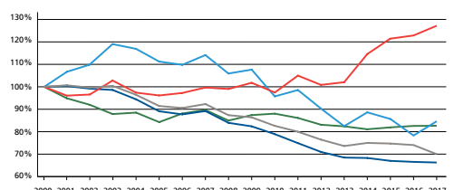

Im Detail 

# Bundesbeschluss Über Die Velowege Sowie Die Fuss- Und Wanderwege

(direkter Gegenentwurf zur zurückgezogenen Volks initiative «Zur Förderung der Velo-, Fuss- und Wanderwege [Velo-Initiative]») 
-

| Wachsende  Bedeutung des  Veloverkehrs                                                                                                                                                                                                                                                                                                                                                                                                                                                                                                                                                                                                                                                                                                                                                                                                           | Velofahren erfreut sich in der Schweiz wachsender   |
|--------------------------------------------------------------------------------------------------------------------------------------------------------------------------------------------------------------------------------------------------------------------------------------------------------------------------------------------------------------------------------------------------------------------------------------------------------------------------------------------------------------------------------------------------------------------------------------------------------------------------------------------------------------------------------------------------------------------------------------------------------------------------------------------------------------------------------------------------|-----------------------------------------------------|
| Beliebtheit. Rund zwei Drittel der Haushalte besitzen mindes  tens ein Velo. Viele nutzen das Velo in der Freizeit, immer  häufiger aber auch im Alltag, zum Beispiel um zur Arbeit zu  fahren. Mit dem Aufkommen der Elektrovelos (E-Bikes) hat sich  dieser Trend verstärkt. Da zu Spitzenzeiten die Bahnen, Busse  und Trams oft voll sind und es dann auch für Autos häufig eng  ist auf den Strassen, gewinnt das Velo an Bedeutung.  -                                                                                                                                                                                                                                                                                                                                                                                                     |                                                     |
| Velowege wie  Fuss- und  Wanderwege                                                                                                                                                                                                                                                                                                                                                                                                                                                                                                                                                                                                                                                                                                                                                                                                              | Um den Veloverkehr aufzuwerten, lancierten mehrere  |
| Parteien und Verbände 2015 die Velo-Initiative. Diese zielte  darauf ab, in der Verfassung eine Förderpflicht für den Bund zu  verankern. Diese zwingende Vorgabe ging Bundesrat und  Parlament zu weit. Sie befürworteten stattdessen einen  direkten Gegenentwurf. Dieser gibt dem Bund die Möglichkeit, Velowege zu unterstützen. Velowege sollen damit künftig  rechtlich gleich behandelt werden wie Fuss- und Wanderwege.  Der seit rund 40 Jahren dazu bestehende Verfassungsartikel  soll entsprechend ergänzt werden. Der Bund erhält damit die  Aufgabe, Grund sätze für Velowegnetze festzulegen. Er kann zudem Mass nahmen der Kantone und weiterer Akteure unter  stützen und koordinieren sowie über Velowegnetze informie  ren. Aufgrund des direkten Gegenentwurfs zog das Initiativ  komitee die Velo-Initiative zurück.  - - - |                                                     |

| Debatte im Parlament   | 14   |
|------------------------|------|
| Argumente Bundesrat    | 16   |
| Abstimmungstext        | 18   |

Änderungen in der Verfassung 

| Aktuelle Bundesverfassung                                                                                                                                                                                      | Ergänzte Bundesverfassung * +                                                                                       |
|----------------------------------------------------------------------------------------------------------------------------------------------------------------------------------------------------------------|---------------------------------------------------------------------------------------------------------------------|
| Art. 88 BV                                                                                                                                                                                                     | Art. 88 BV                                                                                                          |
| Fuss- und Wanderwege                                                                                                                                                                                           | Fuss-, Wander- und Velowege                                                                                         |
| 1 Der Bund legt Grundsätze über                                                                                                                                                                                | 1 Der Bund legt Grundsätze über                                                                                     |
| Fuss- und Wanderwegnetze fest.                                                                                                                                                                                 | Fuss-, Wander- und Veloweg  netze fest.  -                                                                          |
| 2 Er kann Massnahmen der Kan  tone zur Anlage und Erhaltung  solcher Netze unterstützen und  koordinieren.  -                                                                                                  | -                                                                                                                   |
| 2 Er kann Massnahmen der Kan  tone und Dritter zur Anlage und  Erhaltung solcher Netze sowie  zur Information über diese  unterstützen und koordinieren.  Dabei wahrt er die Zuständig  keiten der Kantone.  - |                                                                                                                     |
| 3 Er nimmt bei der Erfüllung  seiner Aufgaben Rücksicht auf  Fuss- und Wanderwegnetze und  ersetzt Wege, die er aufheben  muss.                                                                                | 3  Er nimmt bei der Erfüllung  seiner Aufgaben Rücksicht auf  solche Netze. Er ersetzt Wege,  die er aufheben muss. |

*gemäss Bundesbeschluss über die Velowege Bund wird nur subsidiär tätig Mit der vom Parlament beschlossenen Lösung bleiben Planung, Bau und Unterhalt der Velowege weiterhin Aufgaben der Kantone und Gemeinden. Der Bund wird sie subsidiär unterstützen. Bei einem Ja zum Bundesbeschluss wird das Parlament auf Gesetzesstufe regeln, wie dies konkret erfolgen soll. Es ist davon auszugehen, dass dem Bund für die Velowege künftig die gleichen Aufgaben übertragen werden wie bisher für die Fuss- und Wanderwege. Somit wird er auch für die Velowege beispielsweise gesamtschweizerische Daten und Statistiken erarbeiten, Standards zu Qualität und Sicherheit entwickeln sowie Geodaten für Karten und Apps bereitstellen.

Verkehrssicherheit Der Bundesbeschluss über die Velowege stärkt die Bestrebungen des Bundes, die Verkehrssicherheit zu erhöhen. Der Veloverkehr ist der einzige Bereich, in dem die Zahlen der bei Unfällen verletzten und getöteten Menschen seit dem Jahr 2000 gestiegen sind (vgl. Grafik). Der Anstieg hat unter anderem mit dem Boom bei den E-Bikes zu tun, mit denen man schneller unterwegs ist. Mit einer Entflechtung des Verkehrs - beispielsweise mit gut markierten Radstreifen oder baulich abgetrennten Radwegen - kann die Sicherheit erhöht werden. 

Verkehrssicherheit Bei Verkehrsunfällen verletzte und getötete Personen 

2000 2001 2002 2003 2004 2005 2006 2007 2008 2009 2010 2011 2012 2013 2014 2015 2016 2017 
Velofahrerinnen Velofahrer Fussgängerinnen Fussgänger Insassen von Personenwagen Motorradfahrerinnen Motorradfahrer Total Lesebeispiel: Seit dem Jahr 2000 stieg die Anzahl der bei einem Verkehrsunfall verletzten oder getöteten Velofahrer/innen (inkl. E-Bike) um über 27 Prozent, während die Anzahl der bei einem Verkehrsunfall verletzten oder getöteten Insassen von Personenwagen um 34 Prozent zurückging. 

Quelle: Bundesamt für Strassen (ASTRA)
Finanzielle Auswirkungen Dem Bund entstehen durch die Aufwertung des Velo verkehrs und seine damit verbundenen Aufgaben Kosten von voraussichtlich rund 1,8 Millionen Franken pro Jahr.1 Dieser Aufwand wird innerhalb des Budgets des Bundesamts für Strassen aufgefangen. 

-

## Rolle Des Bundes Bei Den Fuss- Und Wanderwegen

Bei den Fuss- und Wanderwegen unterstützt der Bund die Kantone und Gemeinden seit rund 40 Jahren mit Analysen, Planungstools, Standards sowie Beratungs- und Ausbildungsangeboten. Damit trägt er dazu bei, dass in der ganzen Schweiz über 60 000 Kilometer Wanderwege fachgerecht unterhalten werden und einheitlich signalisiert sind. 

Für die Fuss- und Wanderwege setzt der Bund rund 1,8 Millionen Franken pro Jahr ein. Dieser Betrag bleibt seit Jahren konstant. Bund und Kantone arbeiten mit verschiedenen Verbänden und Stiftungen zusammen, die sich um Fuss- und Wanderwege kümmern. Dazu gehören zum Beispiel der «Dachverband Schweizer Wanderwege», der «Fachverband Fuss verkehr Schweiz» und die Stiftung «SchweizMobil».

-
1 Botschaft des Bundesrates vom 23. Aug. 2017 zur Volksinitiative 
«Zur Förderung der Velo-, Fuss- und Wanderwege (Velo-Initiative)» und zum direkten Gegenentwurf (Bundesbeschluss über die Velo wege sowie die Fuss- und Wanderwege); BBl 2017 5901, hier 5917 ( admin.ch > Bundesrecht > Bundesblatt).

 -

Debatte Parlament 

| Das Parlament lehnte die Velo-Initiative ab, befürwortete aber  den direkten Gegenentwurf. Die Mehrheit befand, es sei  sinnvoll, dass der Bund bei den Velowegen künftig wie bei den  Fuss- und Wanderwegen unterstützend tätig werden könne.  Dies helfe, die Verkehrssicherheit zu erhöhen und den Verkehr  zu entlasten. Eine Minderheit entgegnete, der Veloverkehr  funktioniere schon heute gut. Es gebe keinen Grund, in die  Hoheit der Kantone einzugreifen. Sie lehnte deshalb auch den  direkten Gegenentwurf ab.                                                                                                                                              |                                                        |
|----------------------------------------------------------------------------------------------------------------------------------------------------------------------------------------------------------------------------------------------------------------------------------------------------------------------------------------------------------------------------------------------------------------------------------------------------------------------------------------------------------------------------------------------------------------------------------------------------------------------------------------------------------------------------|--------------------------------------------------------|
| Nein zur Initiative,  Ja zum Gegenentwurf                                                                                                                                                                                                                                                                                                                                                                                                                                                                                                                                                                                                                                                                            | Im Parlament bestand breiter Konsens darüber, dass das |
| Velo neben Auto, Bus, Tram und Bahn für den Personenverkehr  wichtig sei. Beiden Räten ging die Velo-Initiative jedoch zu  weit, da sie zu stark in die Kompetenz der Kantone eingreifen  und den Bund zur Förderung des Veloverkehrs verpflichten  wollte. Sowohl der Ständerat als auch der Nationalrat sprachen  sich für den direkten Gegenentwurf des Bundesrates aus.                                                                                                                                                                                                                                                                                                |                                                        |
| Föderalistische  und finanzielle  Bedenken                                                                                                                                                                                                                                                                                                                                                                                                                                                                                                                                                                                                                                 | Eine Minderheit des Nationalrats lehnte sowohl die     |
| Volksinitiative als auch den Gegenentwurf ab. Den Ausschlag  dafür gaben insbesondere finanzielle und föderalistische  Gründe. Es sei absehbar, dass dem Bund durch die Aufwertung  des Veloverkehrs hohe zusätzliche finanzielle Verpflichtungen  entstünden. Die heutige Aufgabenteilung zwischen Bund,  Kantonen und Gemeinden funktioniere zudem gut: Die Schweiz  sei schon ein Veloland. Die Minderheit gab ausserdem zu  bedenken, dass Autofahrten oft nicht durch Velofahrten ersetzt  würden. Gerade bei Regen und Kälte würden nur wenige  Menschen das Velo nutzen. Es sei darum nicht zu erwarten, dass  es durch bessere Velowege mehr Platz für Autos gebe. |                                                        |

Abstimmung im Nationalrat 

| Die Mehrheit argumentierte hingegen, ein stärkeres                                                                                                                                                                                                                                                                                                                                                                                                                                                                                                                  |
|---------------------------------------------------------------------------------------------------------------------------------------------------------------------------------------------------------------------------------------------------------------------------------------------------------------------------------------------------------------------------------------------------------------------------------------------------------------------------------------------------------------------------------------------------------------------|
| Engagement des Bundes für den Veloverkehr sei sinnvoll. Die  Aufwertung des Veloverkehrs trage dazu bei, Verkehrsspitzen  zu brechen und die Verkehrssicherheit zu erhöhen. Mit der  Beschränkung auf das Wesentliche und dem Respekt für den  Föderalismus sei der direkte Gegenentwurf die richtige Antwort  auf die Velo-Initiative. Der Bund werde sich nur subsidiär  einbringen und wahre damit die Zuständigkeit der Kantone.  Nach der Verabschiedung des direkten Gegenentwurfs  durch das Parlament zog das Initiativkomitee die Velo-Initiative  zurück. |

| Rückzug nach  Debatte   |
|-------------------------|

 115 Ja 70 Nein 

| Beschränkung auf  das Wesentliche   |
|-------------------------------------|

| Abstimmung im  Ständerat   |
|----------------------------|

| 37 Ja                   |
|-------------------------|
| 1 Nein   2 Enthaltungen |

Argumente Bundesrat 

| Angesichts des wachsenden Verkehrs ist es sinnvoll, dass der  Bund die Kantone und Gemeinden bei den Velowegen unter  stützt. Dies dient der Verkehrssicherheit und trägt dazu bei,  Bahn, Bus und Tram zu entlasten und auch für den Autoverkehr  wieder mehr Platz zu schaffen. Davon profitiert die ganze  Bevölkerung. Velofahren schont zudem die Umwelt und ist gut  für die Gesundheit. Der Bundesrat befürwortet die Vorlage  insbesondere aus folgenden Gründen:  -   |                                                        |
|--------------------------------------------------------------------------------------------------------------------------------------------------------------------------------------------------------------------------------------------------------------------------------------------------------------------------------------------------------------------------------------------------------------------------------------------------------------------------------|--------------------------------------------------------|
| Velowege helfen,  Mobilität zu  bewältigen                                                                                                                                                                                                                                                                                                                                                                                                                                     | Zu Spitzenzeiten wird es in Bahn, Bus und Tram sowie   |
| für den Autoverkehr oft eng. Da die Mobilität in der Schweiz  weiter wachsen wird, lohnt es sich, das Potenzial des Veloverkehrs besser zu nutzen. Dieses ist noch nicht ausgeschöpft:  Fast 80 Prozent aller Fahrten in Bus und Tram und jede zweite  Autofahrt sind kürzer als fünf Kilometer. Je besser das Veloweg  netz ist, desto attraktiver ist es, für kürzere Fahrten das Velo  zu nehmen.  -                                                                                                                                                                                                                                                                                                                                                                                                                                                                                |                                                        |
| Unfälle vermeiden                                                                                                                                                                                                                                                                                                                                                                                                                                                              | Ein gutes Velowegnetz hilft, die Verkehrssicherheit zu |
| erhöhen. Das ist wichtig, da die Zahlen der bei Unfällen  verletzten und getöteten Velofahrerinnen und Velofahrer in  den letzten Jahren gestiegen sind. Wo es durchgehende  Velowege hat und der Verkehr entflochten wird, kommen  sich Auto-, Velo- und Fussverkehr weniger ins Gehege.                                                                                                                                                                                      |                                                        |
| Technische und  gesellschaftliche  Entwicklung                                                                                                                                                                                                                                                                                                                                                                                                                                 | Die technische Entwicklung begünstigt das Velofahren.  |
| Das zeigt sich unter anderem am Boom der E-Bikes. Diese  erlauben es, grössere Distanzen zu bewältigen - und rasch und  mühelos ans Ziel zu kommen. Neue Veloverleihsysteme, die  dank Apps einfach zugänglich sind, sorgen zudem dafür, dass  Velos schnell und unkompliziert genutzt werden können. In  vielen Städten und Agglomerationen gewinnt das Velofahren  dadurch an Bedeutung. Daher lohnt sich ein verstärktes  Engagement für Velowege.                          |                                                        |

| Weder Lärm noch  Abgase                                                                                                                                                                                                                                                       | Velofahren schont die Umwelt: Wer mit dem Velo statt      |
|-------------------------------------------------------------------------------------------------------------------------------------------------------------------------------------------------------------------------------------------------------------------------------|-----------------------------------------------------------|
| mit dem Auto oder dem öffentlichen Verkehr fährt, senkt den  Energieverbrauch und die CO2 -Emissionen. Veloverkehr ver  ursacht zudem weder Lärm noch Abgase. Und wer Velo fährt,  bewegt sich. Das ist gut für die Gesundheit.  -                                            |                                                           |
| Tourismus fördert  Velofahren                                                                                                                                                                                                                                                 | Velofahren ist eine beliebte Sport- und Freizeitaktivität |
| und wird auch für den Schweizer Tourismus immer wichtiger.  Viele Städte und Ferienregionen fördern daher Angebote  für Velo-Ausflüge und Mountainbike-Touren. Dafür braucht es  gute Velowege.                                                                               |                                                           |
| Für sichere  und attraktive  Velowege                                                                                                                                                                                                                                         | Aufgrund der wachsenden Mobilität ist es sinnvoll,        |
| dass sich der Bund für Velowege engagiert. Mit dem Bundes  beschluss über die Velowege kann er die Arbeiten der Kantone  und Gemeinden auf bewährte Weise unterstützen - und so zu  sicheren und attraktiven Velowegen beitragen. Davon profitiert  die ganze Bevölkerung.  - |                                                           |
| Empfehlung  von Bundesrat  und Parlament                                                                                                                                                                                                                                      | Aus all diesen Gründen empfehlen Bundesrat und            |
| Parlament, den Bundesbeschluss über die Velowege sowie  die Fuss- und Wanderwege anzunehmen.                                                                                                                                                                                  |                                                           |

## Ja

admin.ch/gegenentwurf-velo-initiative Im Detail Volksinitiative «Für gesunde sowie umweltfreundlich und fair hergestellte Lebensmittel (Fair-Food-Initiative)» 

| Argumente Initiativkomitee   | 24   |
|------------------------------|------|
| Argumente Bundesrat          | 26   |
| Abstimmungstext              | 28   |

| Ausgangslage                                                                                                                                                                                                                                                                                                                                                                                                                                                                                                                                                                                                                                | Die Schweiz produziert rund die Hälfte ihres Bedarfs an   |
|---------------------------------------------------------------------------------------------------------------------------------------------------------------------------------------------------------------------------------------------------------------------------------------------------------------------------------------------------------------------------------------------------------------------------------------------------------------------------------------------------------------------------------------------------------------------------------------------------------------------------------------------|-----------------------------------------------------------|
| Lebensmitteln selber.1  Diese Lebensmittel müssen strenge  Anforderungen erfüllen, etwa bei der Sicherheit, der Qualität  und der Nachhaltigkeit.2  Den Import von Lebensmitteln hat  die Schweiz in verschiedenen Gesetzen und in internationalen  Abkommen geregelt. Die Fair-Food-Initiative betrifft die  Produktion von Lebensmitteln im Inland und im Ausland. Mit  der Initiative soll der Lebensmittelbereich in der Bundesver  - fassung umfassend geregelt werden.                                                                                                                                                                |                                                           |
| Ziel der Initiative                                                                                                                                                                                                                                                                                                                                                                                                                                                                                                                                                                                                                         | Die Fair-Food-Initiative beauftragt den Bund, das Angebot |
| an Lebensmitteln zu stärken, die von guter Qualität und sicher  sind. Die Herstellung muss umwelt- und ressourcenschonend  sowie tierfreundlich sein und unter fairen Arbeitsbedingungen  stattfinden. Die nötigen Bestimmungen zur Umsetzung der  Initiative erlassen das Parlament und der Bundesrat. Nach der  Annahme der Initiative hätten sie dafür drei Jahre Zeit.                                                                                                                                                                                                                                                                  |                                                           |
| Verschiedene  Massnahmen                                                                                                                                                                                                                                                                                                                                                                                                                                                                                                                                                                                                                    | Die Initiative nennt eine Reihe von Massnahmen, um die    |
| Ziele zu erreichen. Dazu gehören eine genauere Deklaration  der Lebensmittel, das Senken von Zöllen für gewisse Lebensmittel  und die Verpflichtung der Lebensmittelbranche, bestimmte  ökologische und soziale Ziele zu verfolgen. Dazu gehören auch  die Bekämpfung von Lebensmittelverschwendung (Food Waste)  und die Förderung saisonaler Produkte aus der Region. Über  dies sollen die negativen Auswirkungen von Transport und  Lagerung von Lebens- und Futtermitteln reduziert sowie die  Umwelt geschont werden.  -                                                                                                              |                                                           |
| Schweizer  Vorgaben für  Importe                                                                                                                                                                                                                                                                                                                                                                                                                                                                                                                                                                                                            | Für den Import stellt die Initiative eine grundsätzliche  |
| Regel auf: Nicht oder nur leicht verarbeitete landwirtschaftliche  Lebensmittel, die im Ausland hergestellt werden, sollen  1 2015 betrug der Selbstversorgungsgrad der Schweiz netto 51 %.  Quelle: Agristat-Nahrungsmittelbilanz, zitiert in: Bundesamt für  Statistik, Nahrungsmittelproduktion ( bfs.admin.ch >  Statistiken finden > Querschnittsthemen > Monitoring der  Legislaturplanung > Nahrungsmittelproduktion).  2 Faktenblatt zu den Schweizer Standards und Tätigkeiten im Bereich  der Fair-Food-Initiative unter: blv.admin.ch > Lebensmittel und   Ernährung > Fair-Food-Initiative > Weitere Informationen «Im Detail». |                                                           |

| Schweizer Vorschriften entsprechen. So dürften etwa Eier und  Fleisch aus industrieller Massentierhaltung nicht mehr einge  führt werden. Für stärker verarbeitete oder zusammengesetzte  Lebensmittel, wie Tiefkühlpizza oder Teigwaren, sowie für  Futtermittel sollen längerfristig die gleichen Vorschriften gelten.  Für gewisse Produkte wie Koscher- oder Halalfleisch wären  Ausnahmen möglich.  -                                                                        |                                                           |
|-----------------------------------------------------------------------------------------------------------------------------------------------------------------------------------------------------------------------------------------------------------------------------------------------------------------------------------------------------------------------------------------------------------------------------------------------------------------------------------|-----------------------------------------------------------|
| Kontrolle  der Schweizer  Vorgaben                                                                                                                                                                                                                                                                                                                                                                                                                                                | Der Bund müsste garantieren, dass die importierten Lebens |
| und Futtermittel den schweizerischen Vorschriften entsprechen,  etwa durch Kontrollen. Diese müssten im jeweiligen Herkunfts  land zugelassen und auch dort durchgeführt werden. Der damit  verbundene Aufwand könnte in der Schweiz zu höheren Lebens  mittelpreisen führen.  - - -                                                                                                                                                                                              |                                                           |
| Verhältnis zu  internationalen  Abkommen                                                                                                                                                                                                                                                                                                                                                                                                                                          | Wegen der strengeren Vorgaben auch für importierte        |
| Lebensmittel könnten Konflikte entstehen mit Verpflichtungen  der Schweiz gegenüber der Europäischen Union (EU), der  Welthandelsorganisation (WTO) und Staaten, mit denen die  Schweiz Freihandelsabkommen abgeschlossen hat. Zentrales  Element dieser Abkommen ist das Verbot, Importprodukte  anders zu behandeln als einheimische Produkte, wenn sie sich  physisch voneinander nicht unterscheiden. Will ein Staat von  diesem Verbot abrücken, gelten hohe Anforderungen.3 |                                                           |

3 Faktenblatt zu den internationalen Verpflichtungen der Schweiz im Bereich der Fair-Food-Initiative unter: blv.admin.ch > Lebensmittel und Ernährung > Fair-Food-Initiative > Weitere Informationen «Im Detail».

## Argumente Initiativkomitee

| Ja zu gesunden und nachhaltig produzierten Lebensmitteln.  Lebensmittel sollen im Einklang mit dem Tierwohl und der  Umwelt und unter fairen Arbeitsbedingungen produziert  werden. So wollen es die Konsumentinnen und Konsumenten.  Die Fair-Food-Initiative fördert die nachhaltige Landwirtschaft  in der Schweiz. Sie gibt dem Bundesrat aber auch Instrumente  in die Hand, um die Qualität von Lebensmittelimporten zu  verbessern. Produkte aus fairem Handel und bäuerlichen  Familienbetrieben sollen begünstigt werden.            |                                                             |
|-----------------------------------------------------------------------------------------------------------------------------------------------------------------------------------------------------------------------------------------------------------------------------------------------------------------------------------------------------------------------------------------------------------------------------------------------------------------------------------------------------------------------------------------------|-------------------------------------------------------------|
| Mehr gute  Lebensmittel  im Angebot                                                                                                                                                                                                                                                                                                                                                                                                                                                                                                           | Dank der Fair-Food-Initiative gibt es ein grösseres Angebot |
| an Lebensmitteln, die von guter Qualität sind und die umwelt  schonend, tierfreundlich und unter fairen Arbeitsbedingungen  hergestellt werden. Davon profitieren alle: Tiere, Umwelt und  Klima, Konsumentinnen und Konsumenten, Bäuerinnen und  Bauern.  -                                                                                                                                                                                                                                                                                  |                                                             |
| Fairer Handel statt  Freihandel                                                                                                                                                                                                                                                                                                                                                                                                                                                                                                               | Nur mit einer umweltgerechten Landwirtschaft können         |
| wir die natürlichen Lebensgrundlagen erhalten. Fast die Hälfte  der Lebens- und Futtermittel in der Schweiz wird heute impor  tiert. Statt schrankenlosem Freihandel braucht es auch bei  Importen eine Qualitätsstrategie. Der weltweite Handel mit  Lebensmitteln darf nicht auf Kosten des Tierwohls, der Umwelt  oder der bäuerlichen Landwirtschaft erfolgen. Konsumentinnen  und Konsumenten wollen mit gutem Gewissen essen und  geniessen. Und zwar unabhängig davon, ob die Lebensmittel  aus der Schweiz oder dem Ausland kommen. - |                                                             |

| Artgerechte  Tierhaltung                                                                                                                                                                                                                                                                                                                                                                                                                    | Die Unterstützung für eine artgerechte Tierhaltung in der   |
|---------------------------------------------------------------------------------------------------------------------------------------------------------------------------------------------------------------------------------------------------------------------------------------------------------------------------------------------------------------------------------------------------------------------------------------------|-------------------------------------------------------------|
| Schweiz ist gross. Trotzdem landen immer mehr importierte Eier  und Fleisch aus industrieller Massentierhaltung in den Regalen  - und dies ohne transparente Information! Die Fair-Food-Initiative verbessert die Deklaration, damit die Konsumentinnen und  Konsumenten die Wahlfreiheit haben. Und sie stoppt Lebensmittel aus tierquälerischer Produktion.                                                                                                                                                                                                                                                                                                                                                                                                                                             |                                                             |
| Gute Lebensmittel  zu fairen Preisen                                                                                                                                                                                                                                                                                                                                                                                                        | Bäuerinnen und Bauern sollen mit ihren Produkten einen      |
| anständigen Preis erzielen. Die Initiative fördert die Vermark  - tung von regional produzierten Lebensmitteln. Das macht  sie nicht teurer, sondern frischer und gesünder. Die Initiative  bekämpft zudem die Lebensmittelverschwendung. Heute  wird ein Drittel der Lebensmittel weggeworfen, weil etwa die  Ablauffrist zu kurz ist oder absurde Normen gelten (Standard  grössen). Wer Food Waste vermeidet, spart am richtigen Ort.  - |                                                             |
| Nicht mehr,  sondern bessere  Regeln                                                                                                                                                                                                                                                                                                                                                                                                        | Die Fair-Food-Initiative baut auf bewährten Massnahmen      |
| und Instrumenten auf und führt nicht zu mehr, sondern zu  besseren Regeln. Sie kann umgesetzt werden, ohne internatio  - nale Verpflichtungen zu verletzen.                                                                                                                                                                                                                                                                                 |                                                             |
| Empfehlung des  Initiativkomitees                                                                                                                                                                                                                                                                                                                                                                                                           | Gesund und fair essen: Stimmen Sie Ja zur Fair-Food                                                             |
| Initiative!                                                                                                                                                                                                                                                                                                                                                                                                                                 |                                                             |

Ja fair-food.ch

## Argumente Bundesrat

| national für sichere Lebensmittel von hoher Qualität ein. Der  Bundesrat erachtet deshalb eine neue Verfassungsbestimmung  als unnötig, auch wenn er die Anliegen der Initiative grund  sätzlich teilt. Zudem steht die Initiative mit internationalen  Vereinbarungen in Konflikt, und sie wäre kaum umsetzbar. Der  Bundesrat lehnt die Fair-Food-Initiative insbesondere aus  folgenden Gründen ab:  - Für die einheimische Produktion von Lebensmitteln gelten  hohe Anforderungen. So verlangen die Bundesverfassung und  das Landwirtschaftsgesetz eine sozialverträgliche und ökologische Entwicklung der Landwirtschaft. Zudem verpflichtet  ein neuer Verfassungsartikel den Bund, in den internationalen  Handelsbeziehungen die Nachhaltigkeit zu beachten und gegen Lebensmittelverschwendung vorzugehen; Volk und Stände  haben diesen neuen Bestimmungen im Herbst 2017 mit grossem Mehr zugestimmt.4  Auch mit dem Aktionsplan «Grüne Wirtschaft» und im Rahmen der Agenda 2030 der UNO für eine  nachhaltige Entwicklung engagiert sich die Schweiz für eine  respektvolle Nutzung der natürlichen Ressourcen in der Schweiz  und im Ausland.5  Die Initiative verlangt, dass grundsätzlich auch für  importierte Lebensmittel die Schweizer Standards gelten. Das  würde neue Probleme schaffen, denn diese Vorgaben könnten  mit Handelsabkommen in Konflikt geraten. Wenn die Schweiz  einseitig Handelshemmnisse schafft, gefährdet sie die Vorteile  dieser Abkommen, etwa den vereinfachten Zugang zu inter  - nationalen Märkten.   |
|---|

-
4 Volk und Stände haben den Gegenentwurf zur Initiative «Für Ernährungssicherheit» am 24. Sept. 2017 mit 78,7 % Ja-Stimmen angenommen; BBl 2017 7829 ( admin.ch > Bundesrecht > Bundes blatt
-
). 

5 Informationen zum Aktionsplan «Grüne Wirtschaft» unter: 
uvek.admin.ch > Umwelt > Grüne Wirtschaft; Informationen zur Agenda 2030 unter: eda.admin.ch/agenda2030.

Bereits heute hohe Anforderungen Konflikt mit internationalen Abkommen 

| Kontrolle im  Ausland schwierig                                                                                                                                                                                                                                                                                                                                                                                                     | Die Mindestvorgaben für importierte Lebensmittel          |
|-------------------------------------------------------------------------------------------------------------------------------------------------------------------------------------------------------------------------------------------------------------------------------------------------------------------------------------------------------------------------------------------------------------------------------------|-----------------------------------------------------------|
| umzusetzen, wäre äusserst schwierig. Es müsste im Herkunfts  land überprüft werden, unter welchen Bedingungen die  Lebensmittel hergestellt werden. Die Kosten für diese Kontrol  len könnten die Lebensmittel verteuern. Dies würde die Konsu  mentinnen und Konsumenten wie auch die Wirtschaft treffen.  Ausserdem könnten die strengeren Vorgaben für Importe die  Auswahl an Lebensmitteln in der Schweiz einschränken.  - - - |                                                           |
| Verfassung genügt                                                                                                                                                                                                                                                                                                                                                                                                                   | Der Bundesrat will wie die Initiative nachhaltig und fair |
| produzierte Lebensmittel im In- und Ausland fördern. Dazu  reichen die geltenden Bestimmungen aus. Ein neuer Verfas  - sungsartikel ist nicht nötig.                                                                                                                                                                                                                                                                                |                                                           |
| Empfehlung  von Bundesrat  und Parlament                                                                                                                                                                                                                                                                                                                                                                                            | Aus all diesen Gründen empfehlen Bundesrat und            |
| Parlament, die Volksinitiative «Für gesunde sowie umwelt  freundlich und fair hergestellte Lebensmittel (Fair-Food  Initiative)» abzulehnen.  - -                                                                                                                                                                                                                                                                                   |                                                           |

Nein admin.ch/fair-food-initiative Im Detail Volksinitiative «Für Ernährungs souveränität. Die Landwirt schaft betrifft uns alle» 
-
-

| Argumente Initiativkomitee   | 34   |
|------------------------------|------|
| Argumente Bundesrat          | 36   |
| Abstimmungstext              | 38   |

| Ausgangslage                                                                                                                                                                                                                                                                                                                                                                                    | Der Begriff «Ernährungssouveränität» wurde an der        |
|-------------------------------------------------------------------------------------------------------------------------------------------------------------------------------------------------------------------------------------------------------------------------------------------------------------------------------------------------------------------------------------------------|----------------------------------------------------------|
| UNO-Welternährungskonferenz von 1996 von einer internatio  nalen Bauern- und Bäuerinnenbewegung geprägt. Gemeint  ist damit das Recht aller Völker, Länder und Ländergruppen,  ihre Landwirtschafts- und Ernährungspolitik selbst zu bestimmen, ohne anderen Regionen damit zu schaden. Die von Uniterre  initiierte und 2016 eingereichte Volksinitiative «Für Ernährungs  souveränität. Die Landwirtschaft betrifft uns alle» bezieht sich  auf diese Definition. Für die Initiantinnen und Initianten geht  die Agrarpolitik des Bundes in die falsche Richtung; sie verbinden das Recht auf Selbstbestimmung mit der Forderung nach  einem stärkeren Eingriff des Staates in die Landwirtschaft und  die Agrarmärkte.  - -                                                                                                                                                                                                                                                                                                                                                                                                 |                                                          |
| Erhöhung  der Anzahl  Beschäftigter                                                                                                                                                                                                                                                                                                                                                             | Das Initiativkomitee fordert eine Erhöhung der Anzahl    |
| der in der Landwirtschaft tätigen Personen. 2017 waren in der  Schweiz rund 150 000 Personen in der Landwirtschaft tätig  (Betriebsleitende, familieneigene und familienfremde Arbeitskräfte)1 , in der Industrie und im Dienstleistungssektor waren es  insgesamt fast 5 Millionen Personen.2  Zur Erhöhung der Anzahl  Beschäftigter in der Landwirtschaft bräuchte es staatliche  Interventionen. Die damit entstehenden Kosten müssten vom  Staat getragen werden.                                                                                                                                                                                                                                                                                                                                                                                                 |                                                          |
| Landesweit  gleiche Arbeits  -bedingungen                                                                                                                                                                                                                                                                                                                                                       | Die Initiative verlangt, dass die Arbeitsbedingungen der |
| Angestellten in der Landwirtschaft schweizweit einheitlich  geregelt werden. Diese Bedingungen unterscheiden sich heute  vor allem, weil die Lebenskosten in den Kantonen stark variieren. Die Arbeitsbedingungen und Arbeitszeiten für Angestellte in  der Landwirtschaft sind heute kantonal geregelt. Bei An nahme  der Initiative würden gesamtschweizerisch einheitliche Normen  erlassen. |                                                          |

1 Bundesamt für Statistik, Landwirtschaftliche Strukturerhebung 2017 
( bfs.admin.ch > Statistiken finden > Land- und Forstwirtschaft > Landwirtschaft > Strukturen). 

| 2   | Bundesamt für Statistik, Beschäftigte (   | bfs.admin.ch > Statistiken   |
|-----|-------------------------------------------|------------------------------|
| finden > Industrie, Dienstleistungen > Unternehmen und Beschäftigte > Beschäftigungsstatistik > Beschäftigte).     |                                           |                              |

| Schweizer Normen  auch für Import  - produkte                                                                                                                                                                                                                                                                                                                                                                                     | Vom Bund verlangt die Initiative, dafür zu sorgen, dass die   |
|-----------------------------------------------------------------------------------------------------------------------------------------------------------------------------------------------------------------------------------------------------------------------------------------------------------------------------------------------------------------------------------------------------------------------------------|---------------------------------------------------------------|
| in der Schweiz geltenden sozialen und ökologischen Normen  auch für die importierten Produkte gelten. Diese Vorgabe  könnte mit der Erhebung von Zöllen oder mit Einfuhrverboten  umgesetzt werden, was geltenden internationalen Abkommen  widersprechen würde.                                                                                                                                                                  |                                                               |
| Gerechte Preise                                                                                                                                                                                                                                                                                                                                                                                                                   | Der Bund soll gemäss der Initiative die Markttransparenz      |
| gewährleisten und darauf hinwirken, dass gerechte Preise  festgelegt werden. Heute gelten zum Schutz der inländischen  Produzentenpreise Zölle und Einfuhrkontingente. Zudem er  hebt und publiziert der Bund die Preise verschiedener Waren  bei Produzenten, Verarbeitern und im Detailhandel, damit  mehr Kostentransparenz entsteht. Die Initiative verlangt vom  Bund noch weiter gehende Regulierungen.  -                  |                                                               |
| Generelles  Gentech-Verbot                                                                                                                                                                                                                                                                                                                                                                                                        | Die Initiative will den Einsatz von gentechnisch veränderten  |
| Organismen (GVO) in der schweizerischen Landwirtschaft  generell verbieten. Der Anbau von GVO ist heute nur für  Forschungszwecke erlaubt. Sonst gilt das sogenannte Gentech  Moratorium, das vom Parlament bereits dreimal verlängert  wurde. Die Verlängerung des Moratoriums bis 2021 soll eine  gründliche und sachliche Diskussion über einen allfälligen  Einsatz von GVO in der schweizerischen Landwirtschaft erlauben. - |                                                               |

## Argumente Initiativkomitee

| Unsere Initiative fördert eine einheimische bäuerliche Land  wirtschaft, die einträglich und vielfältig ist, die gesunde  Lebensmittel für die Bevölkerung produziert und die gleich  zeitig den gesellschaftlichen und ökologischen Erwartungen  gerecht wird. Die Bevölkerung wird transparent über Ernäh  rungsfragen informiert und dafür sensibilisiert. Unsere Initia  tive geht bestehende Herausforderungen an: Lebensmittel von  guter Qualität produzieren, einträgliche Arbeitsplätze schaffen,  den Klimawandel mindern und die natürlichen Ressourcen  schützen.  - - - - Innert 30 Jahren sind 35 000 Bauernhöfe verschwunden  und 100 000 Arbeitsplätze in der Landwirtschaft gingen verloren.  Ein resilientes System braucht zahlreiche Landwirtschaftsbetriebe unterschiedlicher Grösse, die jungen Menschen eine Zukunfts  perspektive bieten. Wir müssen unterschiedliche Produktions  methoden (Bio, integrierte Produktion) und verschiedene  Produkte (Milch, Getreide, Obst, Gemüse, Fleisch usw.) fördern  und so der Bevölkerung die Wahlfreiheit geben. Die Tiere sollen  in erster Linie mit Gras und mit einheimischen Futterpflanzen  gefüttert werden; die Abhängigkeit von Soja und Mais aus  Übersee muss verringert werden. Von grosser Bedeutung ist der  Zugang zu genügend Land von hoher Qualität; deshalb muss  der Schutz der Fruchtfolgeflächen verstärkt werden. Saatgut,  die Grundlage des Lebens, muss für die Bäuerinnen und Bauern  zugänglich sein; die grossen Saatgutunternehmen dürfen es  sich nicht unter den Nagel reissen. Und es ist an der Zeit  festzuhalten, dass die Schweizer Landwirtschaft ohne GVO  auskommt. - -   |
|-------------------------------------------------------------------------------------------------------------------------------------------------------------------------------------------------------------------------------------------------------------------------------------------------------------------------------------------------------------------------------------------------------------------------------------------------------------------------------------------------------------------------------------------------------------------------------------------------------------------------------------------------------------------------------------------------------------------------------------------------------------------------------------------------------------------------------------------------------------------------------------------------------------------------------------------------------------------------------------------------------------------------------------------------------------------------------------------------------------------------------------------------------------------------------------------------------------------------------------------------------------------------------------------------------------------------------------------------------------------------------------------------------------------------------------------------------------------------------------------------------------------------------------------------------------------------------------------------------------------------------------------------------------------------------------|

Vielfältige Produktions grundlagen 
-

| Ausgewogener  und einträglicher  Markt                                                                                                                                                                                                                                                                                                                                                                                                                                                                                                                                                                                                                                                      | Das Kräfteverhältnis gegenüber Verarbeitern und Verteilern   |
|---------------------------------------------------------------------------------------------------------------------------------------------------------------------------------------------------------------------------------------------------------------------------------------------------------------------------------------------------------------------------------------------------------------------------------------------------------------------------------------------------------------------------------------------------------------------------------------------------------------------------------------------------------------------------------------------|--------------------------------------------------------------|
| ist unausgewogen. Die Stellung der Bäuerinnen und Bauern  in Verhandlungen muss gestärkt werden; dies ist insbesondere  wichtig, damit die produzierten Mengen den Bedürfnissen  der Bevölkerung entsprechen und strukturelle Überschüsse  vermieden werden. Auf dem Markt und bei der Preisbildung  muss Transparenz gewährleistet sein, damit alle Akteure  entlang der Wertschöpfungskette gerecht entlöhnt werden,  ohne dass sich die Konsumentenpreise erhöhen. Die regionale  Vermarktung erlaubt es, die Herkunft der Produkte besser  zurückverfolgen zu können und die Transporte zu verringern;  dies schafft auch Arbeitsplätze in ländlichen Gebieten  (Gewerbebetriebe, KMU). |                                                              |
| Gerechter  Welthandel                                                                                                                                                                                                                                                                                                                                                                                                                                                                                                                                                                                                                                                                       | Die Initiative will keineswegs die Grenzen schliessen.       |
| Sie will vielmehr das Recht bewahren, diese als Instrument  zur Regulierung des Welthandels auf der Grundlage sozialer  und ökologischer Standards einzusetzen. In dieselbe Richtung  zielt das Verbot von staatlichen Subventionen für die Ausfuhr,  da dies der Landwirtschaft in anderen Ländern schadet.                                                                                                                                                                                                                                                                                                                                                                                |                                                              |

Empfehlung des Initiativkomitees Darum empfiehlt das Initiativkomitee: 
Ja ernährungssouveränität.ch uniterre.ch

## Argumente Bundesrat

| Die Volksinitiative «Für Ernährungssouveränität. Die Landwirt  schaft betrifft uns alle» verlangt eine Agrarpolitik, die stärker  in Märkte und Strukturen eingreift. Eine Annahme der Initia  tive würde internationale Handelsbeziehungen erschweren  sowie hohe Kosten für die Bevölkerung verursachen. Sie würde  zudem die Wettbewerbsfähigkeit der Schweizer Land- und  Ernährungswirtschaft schwächen. Der Bundesrat lehnt die  Volksinitiative insbesondere aus folgenden Gründen ab:  - -   |                                                              |
|------------------------------------------------------------------------------------------------------------------------------------------------------------------------------------------------------------------------------------------------------------------------------------------------------------------------------------------------------------------------------------------------------------------------------------------------------------------------------------------------------|--------------------------------------------------------------|
| Rückschritt statt  Fortschritt                                                                                                                                                                                                                                                                                                                                                                                                                                                                       | Die Volksinitiative zielt in Richtung einer Politik, wie sie |
| bis Anfang der 1990er-Jahre betrieben wurde. Sie würde  Errungenschaften der Agrarpolitik der vergangenen 25 Jahre  zunichtemachen - in dieser Zeit wurde die Landwirtschaft stärker  auf den Markt ausgerichtet. Zentrale Anliegen der Gesellschaft  bezüglich Ökologie und Tierwohl sind bereits umgesetzt. Diese  Ausrichtung der Politik wurde vor einem Jahr mit der Annahme  des Gegenentwurfs zur Volksinitiative «Für Ernährungssicher  - heit» deutlich bestätigt.3                         |                                                              |
| Höhere Kosten  für alle                                                                                                                                                                                                                                                                                                                                                                                                                                                                              | Die Initiative für Ernährungssouveränität hätte Mehr         |
| kosten für die öffentliche Hand zur Folge. Dazu kommt eine  Verteuerung der Landwirtschaftsprodukte für die Haushalte,  in erster Linie verursacht durch höhere Zölle. Folglich würde  der Einkaufstourismus zu-, die Nachfrage nach inländischen  Lebensmitteln abnehmen.  -                                                                                                                                                                                                                        |                                                              |
| Handels  beschränkungen  für Landwirtschaft  -                                                                                                                                                                                                                                                                                                                                                                                                                                                       | Die Forderung, dass sämtliche eingeführten landwirt          |
| schaftlichen Erzeugnisse und Lebensmittel den in der Schweiz  geltenden sozialen und ökologischen Vorschriften genügen  müssen, widerspricht der internationalen Handelspolitik. Dies  würde den Handel mit Landwirtschaftsgütern und damit die  Wahlfreiheit der Konsumentinnen und Konsumenten stark  einschränken.  -                                                                                                                                                                             |                                                              |

3 Volk und Stände haben den Gegenentwurf zur Initiative «Für Ernährungssicherheit» am 24. Sept. 2017 mit 78,7 % Ja-Stimmen angenommen; BBl 2017 7829 ( admin.ch > Bundesrecht > Bundesblatt).

| Nachteile für  ganze Wirtschaft                                                                                                                                                                                                                                                                                                                       | Mögliche Folgen der Initiative wären Gegenmassnahmen     |
|-------------------------------------------------------------------------------------------------------------------------------------------------------------------------------------------------------------------------------------------------------------------------------------------------------------------------------------------------------|----------------------------------------------------------|
| unserer ausländischen Handelspartner. Das brächte Nachteile  für alle Wirtschaftszweige, insbesondere die exportorientierten  Branchen. Damit wären Arbeitsplätze und Wohlstand in der  Schweiz gefährdet.                                                                                                                                            |                                                          |
| Bereits erfüllte  Anliegen                                                                                                                                                                                                                                                                                                                            | Einige Forderungen der Initiative sind bereits überholt: |
| Die Welthandelsorganisation (WTO) hat 2015 beschlossen,  Exportsubventionen für landwirtschaftliche Produkte zu  verbieten; die Schweiz setzt dieses Verbot ab 2019 um. Auch für  Kulturland ist mit der aktuellen Verfassungsgrundlage bereits  ein wirksamer Schutz möglich. Zur Verbesserung des Tierwohls  wurden ebenfalls Massnahmen umgesetzt. |                                                          |
| Teure  Konsequenzen                                                                                                                                                                                                                                                                                                                                   | Die Forderungen sind auch unrealistisch - zum Beispiel,  |
| wenn es um die Kontrolle von Produktionsbedingungen im  Ausland geht. Die Initiative widerspricht zudem den Bemühun  gen von Bundesrat und Parlament, die Landwirtschaft für die  Zukunft zu rüsten. Die Annahme der Initiative ginge auf Kosten  aller - Bauern und Bäuerinnen eingeschlossen.  -                                                    |                                                          |
| Empfehlung  von Bundesrat  und Parlament                                                                                                                                                                                                                                                                                                              | Aus all diesen Gründen empfehlen Bundesrat und           |
| Parlament, die Volksinitiative «Für Ernährungssouveränität.  Die Landwirtschaft betrifft uns alle» abzulehnen.                                                                                                                                                                                                                                        |                                                          |

Nein admin.ch/ernaehrungssouveraenitaet