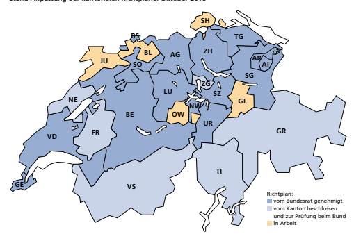

Im Detail Volksinitiative «Zersiedelung stoppen - für eine nachhaltige Siedlungsentwicklung (Zersiedelungsinitiative)»

| Wichtige Begriffe          | 11   |
|----------------------------|------|
| Argumente Initiativkomitee | 12   |
| Argumente Bundesrat        | 14   |
| Abstimmungstext            | 16   |

| Ausgangslage                                                                                                                                                                                                                                                                                                                                                                                                                                                                                                                                                                                                                                                                                                 | In den letzten Jahrzehnten wuchsen Bevölkerung und       |
|--------------------------------------------------------------------------------------------------------------------------------------------------------------------------------------------------------------------------------------------------------------------------------------------------------------------------------------------------------------------------------------------------------------------------------------------------------------------------------------------------------------------------------------------------------------------------------------------------------------------------------------------------------------------------------------------------------------|----------------------------------------------------------|
| Wirtschaft. Und die Lebensgewohnheiten veränderten sich.  Dadurch stieg der Bedarf an Flächen für Wohnen, Arbeiten und  für Infrastrukturen wie Strasse und Schiene. Dies führte zu einer  regen Bautätigkeit. Gebaut werden darf grundsätzlich dort, wo  es Bauzonen gibt. Fast die Hälfte der gesamten Bauzonenfläche  entfällt auf reine Wohnzonen.                                                                                                                                                                                                                                                                                                                                                       |                                                          |
| Trendwende                                                                                                                                                                                                                                                                                                                                                                                                                                                                                                                                                                                                                                                                                                   | Die Bauzonenfläche stieg in der Schweiz bis 2012 stetig  |
| an. Seither setzte aber eine Trendwende ein: Die Gesamtfläche  der Bauzonen blieb konstant, obwohl die dort lebende Bevöl kerung von 7,4 auf 8 Millionen Einwohnerinnen und Einwohner  wuchs. Die Bauzonenfläche pro Person sank dadurch um rund  6 Prozent von 309 m2  auf 291 m2 . 1 -                                                                                                                                                                                                                                                                                                                                                                                                                     |                                                          |
| Revidiertes Raum -planungsgesetz                                                                                                                                                                                                                                                                                                                                                                                                                                                                                                                                                                                                                                                                             | Boden ist nicht unbeschränkt verfügbar. Es braucht einen |
| sorgsamen Umgang damit. Das Volk hat daher 2013 mit der  Revision des Raumplanungsgesetzes beschlossen, dass Bau zonen nur noch dem voraussichtlichen Bedarf für 15 Jahre  entsprechen dürfen. Zu grosse Bauzonen müssen verkleinert  werden. So lässt sich Landwirtschaftsland zurückgewinnen.  Zudem müssen brachliegende oder ungenügend genutzte  Flächen in den Bauzonen besser genutzt werden. Die Kantone  sind daran, die strengeren Vorgaben umzusetzen. Dazu müssen  sie die Richtpläne anpassen und vom Bundesrat bis spätestens  am 30. April 2019 genehmigen lassen. Nach diesem Datum  dürfen sie keine neuen Bauzonen schaffen, solange ihr Richt plan vom Bundesrat nicht genehmigt ist. - - |                                                          |

Revidiertes Raumplanungsgesetz: Umsetzung läuft Stand Anpassung der kantonalen Richtpläne: Oktober 2018

Die Kantone müssen ihre Richtpläne anpassen und mit den strengeren Massnahmen gegen die Zersie delung bis Ende April 2019 vom Bundesrat genehmigen lassen. Nach diesem Datum dürfen sie keine neuen Bauzonen schaffen, solange ihr Richtplan vom Bundesrat nicht genehmigt ist.

-
Über den folgenden Link kann der aktuellste Stand der Richtpläne abgerufen werden: are.admin.ch/richtplan

| Forderungen der  Initiative                                                                                                                                                                                                                                                                                                                                                                                                                                                                                                                                                                                                                                                                                                                                                                                                                                                                                                                                                                                            | Die Volksinitiative «Zersiedelung stoppen - für eine   |                                                         |
|------------------------------------------------------------------------------------------------------------------------------------------------------------------------------------------------------------------------------------------------------------------------------------------------------------------------------------------------------------------------------------------------------------------------------------------------------------------------------------------------------------------------------------------------------------------------------------------------------------------------------------------------------------------------------------------------------------------------------------------------------------------------------------------------------------------------------------------------------------------------------------------------------------------------------------------------------------------------------------------------------------------------|--------------------------------------------------------|---------------------------------------------------------|
| nachhaltige Siedlungsentwicklung (Zersiedelungsinitiative)»  wurde von den Jungen Grünen kurz nach der Revision des  Raumplanungsgesetzes lanciert und 2016 eingereicht. Sie will  die Gesamtfläche der Bauzonen in der Schweiz auf unbefristete  Zeit auf dem heutigen Stand einfrieren. Konkret verlangt sie,  dass neue Bauzonen nur noch geschaffen werden dürfen, wenn  anderswo eine mindestens gleich grosse Fläche von vergleich barem landwirtschaftlichem Ertragswert wieder aus der Bau zone ausgeschieden wird. Der landwirtschaftliche Ertragswert  wird anhand der Bodenqualität und weiterer Kriterien wie  Klima oder Hangneigung berechnet.                                                                                                                                                                                                                                                                                                                                                           |                                                        |                                                         |
| -                                                                                                                                                                                                                                                                                                                                                                                                                                                                                                                                                                                                                                                                                                                                                                                                                                                                                                                                                                                                                      | Bauzonen  einfrieren                                   | -                                                       |
| -                                                                                                                                                                                                                                                                                                                                                                                                                                                                                                                                                                                                                                                                                                                                                                                                                                                                                                                                                                                                                      |                                                        |                                                         |
| -                                                                                                                                                                                                                                                                                                                                                                                                                                                                                                                                                                                                                                                                                                                                                                                                                                                                                                                                                                                                                      | Bauen ausser halb der  Bauzone -                       | Ausserhalb der Bauzonen dürfen heute nur die nötigsten, |
| an den Standort gebundenen Bauten und Anlagen erstellt  werden. Dazu gehören Strassen, Stromleitungen, Seilbahnen  oder Antennen, aber auch Bauten für die Landwirtschaft. Die  Initiative will den Kreis der Bauten und Anlagen, die ausserhalb  der Bauzonen erstellt werden dürfen, noch enger fassen:  Landwirtschaftsbauten sollen nur noch bewilligt werden, wenn  sie einen direkten Bezug zur Bewirtschaftung des Bodens  haben, also z. B. der Produktion von Freilandgemüse dienen  oder der Haltung von Tieren, die mit eigenem Futter aufgezo gen werden. Heute sind unter gewissen Voraussetzungen z. B.  auch Gewächshäuser zulässig oder Ställe, in denen die Tiere mit  zugekauftem Futter ernährt werden. Standortgebundene  Bauten, die nicht der Landwirtschaft dienen, dürften ausserhalb  der Bauzonen nur noch bewilligt werden, wenn sie im öffentli chen Interesse sind. Dazu gehören etwa Wasserreservoire.2 Heute dürfen auch andere Vorhaben, etwa Bergrestaurants,  bewilligt werden.  - - |                                                        |                                                         |

2 Das Gesetz kann Ausnahmen vorsehen. Bestehende Bauten ausser halb der Bauzonen sollen gemäss Initiative zudem von einer Bestandesgarantie profitieren und sie können geringfügig erweitert bzw. umgenutzt werden.

-

| -                                                                                                                                                                                                                                                                                                                                                                                                                                                   | Siedlungs - entwicklung  nach innen                       | Zu den weiteren Forderungen der Initiative gehört, dass   |
|-----------------------------------------------------------------------------------------------------------------------------------------------------------------------------------------------------------------------------------------------------------------------------------------------------------------------------------------------------------------------------------------------------------------------------------------------------|-----------------------------------------------------------|-----------------------------------------------------------|
| eine Siedlungsentwicklung nach innen angestrebt werden soll,  die mit hoher Lebensqualität im Einklang steht. Dieser Grund satz gilt schon heute. Mit der Initiative würde er statt im Gesetz  in der Verfassung verankert. Viele Gemeinden setzen dieses  Anliegen bereits um. So werden bestehende Häuser aufge stockt oder brachliegende Industrieflächen umgenutzt. - -                                                                         |                                                           |                                                           |
| -                                                                                                                                                                                                                                                                                                                                                                                                                                                   | «Nachhaltige Quartiere»                                   | Die Initiative will zudem, dass Bund, Kantone und Ge      |
| meinden für nachhaltige Formen des Wohnens und Arbeitens in  kleinräumigen Strukturen sorgen, unter anderem mit kurzen  Verkehrswegen. -                                                                                                                                                                                                                                                                                                            |                                                           |                                                           |
| Umsetzung  und Folgen  der Initiative                                                                                                                                                                                                                                                                                                                                                                                                               | Bei Annahme der Initiative ist es Aufgabe des Parlaments, |                                                           |
| die neuen Bestimmungen im Gesetz zu konkretisieren. Darum  ist heute vieles noch offen. Dazu gehört insbesondere die  Frage, wie genau Bauzonen umverteilt würden, falls in einem  Kanton neues Bauland geschaffen werden müsste - ob nur  innerhalb des betreffenden Kantons oder auch über kantonale  Grenzen hinaus in der ganzen Schweiz. Ungewiss sind auch  die Kosten, die mit der Aufhebung und Umverteilung von  Bauzonen verbunden wären. |                                                           |                                                           |

| Wichtige Begriffe Zersiedelung   | Von Zersiedelung spricht man, wenn sich Dörfer und Städte ungeordnet  ausdehnen und verstreut gebaut wird. Wohnsiedlungen, Gewerbeareale  und Strassen verbrauchen so übermässig viel Fläche. Die Zersiedelung  verursacht auch hohe Kosten, weil die betreffenden Gebiete mit Strassen  sowie mit Wasser-, Strom- und Abwasserleitungen erschlossen werden  müssen.                            |
|----------------------------------|-------------------------------------------------------------------------------------------------------------------------------------------------------------------------------------------------------------------------------------------------------------------------------------------------------------------------------------------------------------------------------------------------|
| Siedlungsflächen                 | Die Siedlungsflächen umfassen das Land, das für Wohnen, Arbeiten, Ver kehr, Freizeit sowie zum Beispiel auch für Entsorgungsanlagen genutzt  wird. Diese Flächen können sowohl inner- als auch ausserhalb der Bau zonen liegen. - -                                                                                                                                                             |
| Siedlungsentwick -               | Von Siedlungsentwicklung nach innen spricht man, wenn vorhandene                                                                                                                                                                                                                                                                                                                                |
| lung nach innen                  | Siedlungsflächen besser genutzt werden, indem z. B. bestehende Häuser aufgestockt, auf Grundstücken mehr Wohnfläche zugelassen oder brach liegende Industrie- und Gewerbeflächen überbaut werden. Zum Ausgleich werden gleichzeitig oft Plätze und Grünräume zum Spielen oder  zur Erholung geschaffen.  -                                                                                                                                                                                                                                                                                                                                                                                                 |
| Richtplan                        | Der kantonale Richtplan enthält verbindliche Vorgaben für die Entwick lung von Siedlungen und Verkehrsinfrastrukturen sowie für den Schutz  der Landschaft. Er regelt auch die Planung von grösseren Bauvorhaben  wie Freizeit- oder Einkaufszentren. Die kantonalen Richtpläne bestehen  aus Text und Karte und werden von den Bundesbehörden geprüft und  vom Bundesrat genehmigt. -          |
| Nutzungsplan                     | Jede Gemeinde muss einen Nutzungsplan, auch Zonenplan genannt,  erstellen und dem Kanton zur Genehmigung unterbreiten. Im Nutzungs plan sind unter anderem die Bauzonen festgelegt, die für Wohnen,  Arbeiten und weitere Nutzungen wie Schulen oder Sportplätze vorgese hen sind. Für die Grundeigentümerinnen und Grundeigentümer ist der  Nutzungsplan verbindlich. - -                      |
| Bauzonen                         | Als Bauzonen werden Flächen bezeichnet, auf denen gebaut werden  darf. Bauzonen sollen dafür sorgen, dass nicht verstreut gebaut wird,  sondern möglichst kompakt an einem Ort.                                                                                                                                                                                                                 |
| Einzonung und                    | Land, das nicht für eine Überbauung vorgesehen ist, gehört in der Regel                                                                                                                                                                                                                                                                                                                         |
| Auszonung                        | entweder zur Landwirtschaftszone oder zu einer Schutzzone. Ist solches  Land neu für eine Überbauung vorgesehen, so wird es der Bauzone  zugeteilt. Diese Zuteilung wird Einzonung genannt. Um eine Auszonung  handelt es sich umgekehrt, wenn Land, das für eine Überbauung vor gesehen ist, aus der Bauzone herausgelöst und beispielsweise wieder der  Landwirtschaftszone zugeteilt wird. - |

## Argumente Initiativkomitee

| Unseren Boden schützen. Täglich wird in der Schweiz eine Grünfläche in der Grösse von  acht Fussballfeldern überbaut. Die ungebremste Zersiedelung  zerstört Natur und Landschaft. Die Landwirtschaft hat immer  weniger Kulturland, um Lebensmittel zu produzieren. Die  Zersiedelungsinitiative sorgt dafür, dass unsere Landschaften  und die Lebensqualität erhalten bleiben. Sie holt die Versäum nisse der Revision des Raumplanungsgesetzes nach und  ermöglicht einen haushälterischen Umgang mit dem Boden. -   |                                                            |
|--------------------------------------------------------------------------------------------------------------------------------------------------------------------------------------------------------------------------------------------------------------------------------------------------------------------------------------------------------------------------------------------------------------------------------------------------------------------------------------------------------------------------|------------------------------------------------------------|
| Zersiedelung  schadet Mensch  und Natur                                                                                                                                                                                                                                                                                                                                                                                                                                                                                  | Jede Sekunde wird in der Schweiz nahezu ein Quadrat        |
| meter Land überbaut. Unser Boden wächst aber nicht nach.  Landschaften, wie wir sie kennen, gehen verloren. Natur,  Naherholungsgebiete und Artenvielfalt verschwinden. Weil  die Gebäude wegen der Zersiedelung immer weiter zerstreut  stehen, nimmt auch der Verkehr zu. -                                                                                                                                                                                                                                            |                                                            |
| Boden für die  Landwirtschaft                                                                                                                                                                                                                                                                                                                                                                                                                                                                                            | Boden, der einmal zubetoniert ist, ist für die Landwirt    |
| schaft nicht mehr nutzbar und damit verloren. Für eine regio nale Nahrungsmittelproduktion muss das Kulturland erhalten  und vor der weiteren Zersiedelung geschützt werden.  - -                                                                                                                                                                                                                                                                                                                                        |                                                            |
| Landschaften  erhalten                                                                                                                                                                                                                                                                                                                                                                                                                                                                                                   | Die Zersiedelungsinitiative sorgt dafür, dass die Bauzonen |
| insgesamt nicht weiterwachsen. Künftig soll im Siedlungsgebiet  statt auf der grünen Wiese gebaut werden. So bleiben die  Grünflächen für die zukünftigen Generationen erhalten.  Ausserhalb der Bauzonen sollen standortgebundene Bauten  erstellt werden dürfen, die im öffentlichen Interesse sind oder  für die bodenabhängige Landwirtschaft benötigt werden.  Diese massvolle Regelung verhindert, dass die Zersiedelung  ausserhalb der Bauzonen weitergeht.                                                      |                                                            |

| Bauen am  richtigen Ort                                                                                                                                                                                                                                                                                                                                                              | Mit der Initiative ist Bauen weiterhin möglich. Die vorhan -   |
|--------------------------------------------------------------------------------------------------------------------------------------------------------------------------------------------------------------------------------------------------------------------------------------------------------------------------------------------------------------------------------------|----------------------------------------------------------------|
| denen Baulandreserven sind so gross, dass es auch in Zukunft  genug Wohnraum für alle geben wird. Mit moderaten Mass nahmen sorgt die Initiative dafür, dass am richtigen Ort gebaut  wird und die Baulandreserven besser genutzt werden. Durch  die Förderung nachhaltiger Quartiere in den Städten wird nicht  nur Bauland eingespart, sondern auch die Lebensqualität erhöht. -   |                                                                |
| Ergänzung des  aktuellen Gesetzes                                                                                                                                                                                                                                                                                                                                                    | Das aktuelle Raumplanungsgesetz führt weiterhin zu             |
| einem stetigen Wachstum des Siedlungsgebiets auf Kosten der  Grünflächen. Je schneller der Boden überbaut wird, desto  schneller wird neues Bauland eingezont. Damit ist die Zersiede lung keineswegs gestoppt. Die Zersiedelungsinitiative schliesst  die Lücken des Raumplanungsgesetzes, indem es die bestehen den Massnahmen mit einem wirksamen Landschaftsschutz  ergänzt. - - |                                                                |
| Empfehlung des  Initiativkomitees                                                                                                                                                                                                                                                                                                                                                    | Klug bauen, Zersiedelung stoppen: Stimmen Sie JA zur           |
| Zersiedelungsinitiative.                                                                                                                                                                                                                                                                                                                                                             |                                                                |

Ja zersiedelung-stoppen.ch

## Argumente Bundesrat

| Natur und Landschaft zu erhalten, ist wichtig. Mit der Initiative  ist der Schweiz jedoch nicht gedient: Ein starrer Bauzonen Stopp lässt die Bedürfnisse von Bevölkerung und Wirtschaft  ausser Acht, ebenso kantonale und regionale Unterschiede.  Wo Bauland knapp wird, wächst zudem die Gefahr, dass die  Wohnungspreise steigen. Der Bundesrat lehnt die Vorlage  insbesondere aus folgenden Gründen ab: -                                                                                                               |                                                       |
|--------------------------------------------------------------------------------------------------------------------------------------------------------------------------------------------------------------------------------------------------------------------------------------------------------------------------------------------------------------------------------------------------------------------------------------------------------------------------------------------------------------------------------|-------------------------------------------------------|
| Zersiedelung wird  bereits wirksam  bekämpft                                                                                                                                                                                                                                                                                                                                                                                                                                                                                   | Das Volk hat 2013 griffigen Massnahmen gegen die      |
| Zersiedelung zugestimmt. Die Kantone und Gemeinden sind  mit Hochdruck daran, diese Massnahmen umzusetzen. Zu  grosse Bauzonen müssen verkleinert werden. Kantone, deren  Richtplan nicht bis Ende April 2019 vom Bundesrat genehmigt  ist, dürfen keine neuen Bauzonen mehr schaffen, bis ihr  Richtplan genehmigt ist. So werden die Landschaft geschont  und die Zersiedelung gebremst.                                                                                                                                     |                                                       |
| Initiative ver - hindert sinnvolle Entwicklung                                                                                                                                                                                                                                                                                                                                                                                                                                                                                 | Die Initiative ist zu starr: Die Bauzonenfläche würde |
| unbefristet auf dem heutigen Stand eingefroren. Dies geht  an den Bedürfnissen von Bevölkerung und Wirtschaft vorbei  und verhindert eine sinnvolle Entwicklung des Landes. Neu an siedlungen von Unternehmen würden erschwert und die  Wett bewerbsfähigkeit der Schweiz beeinträchtigt.   -                                                                                                                                                                                                                                  |                                                       |
| Initiative ist  ungerecht und  kontraproduktiv                                                                                                                                                                                                                                                                                                                                                                                                                                                                                 | Der Bauzonen-Stopp bestraft Kantone und Gemeinden,    |
| die sorgsam mit ihrem Boden umgegangen sind und zurück haltend Bauzonen geschaffen haben. Das ist ungerecht. Wo  Bauland verknappt wird, wächst auch die Gefahr, dass die  Grundstücks- und Wohnungspreise steigen. Ein unbefristeter  Bauzonen-Stopp, wie ihn die Initiative verlangt, verschärft dies.  Zudem steigt das Risiko, dass sich die Bautätigkeit dorthin  verlagert, wo es noch Bauland gibt, selbst wenn dieses Land an  einem abgelegenen, schlecht erschlossenen Ort ist. Das ver stärkt die Zersiedelung. - - |                                                       |

| Initiative ist zu  zentralistisch                                                                                                                                                                                                                                                        | Die Initiative widerspricht dem Föderalismus: Der Bau   |
|------------------------------------------------------------------------------------------------------------------------------------------------------------------------------------------------------------------------------------------------------------------------------------------|---------------------------------------------------------|
| zonen-Stopp unterläuft den Gestaltungsspielraum der Kantone  und Gemeinden. In Aarau ist die Situation anders als in Arosa,  Agno oder Aigle. Die Initiative erschwert massgeschneiderte  Lösungen.  -                                                                                   |                                                         |
| Initiative schadet  der Landwirtschaft                                                                                                                                                                                                                                                   | Die Initiative schadet der Landwirtschaft. Bauten wie   |
| Gewächshäuser oder Geflügelhallen dürften grösstenteils nicht  mehr auf Landwirtschaftsland erstellt werden. Die Bäuerinnen  und Bauern müssten dafür in Bauzonen ausweichen, wo der  Boden viel teurer ist.                                                                             |                                                         |
| Schweiz attraktiv  halten                                                                                                                                                                                                                                                                | Zum Schutz von Natur und Landschaft ist es wichtig, die |
| vorhandenen Siedlungsflächen besser zu nutzen und Bauzonen  massvoll festzulegen. Bund, Kantone und Gemeinden sind längst  auf diesem Weg. Die Initiative verkennt dies - und erschwert es  mit ihrem starren Bauzonen-Stopp, die Schweiz als Wohn- und  Arbeitsort attraktiv zu halten. |                                                         |
| Empfehlung  von Bundesrat  und Parlament                                                                                                                                                                                                                                                 | Aus all diesen Gründen empfehlen Bundesrat und          |
| Parlament, die Volksinitiative «Zersiedelung stoppen - für eine nachhaltige Siedlungsentwicklung (Zersiedelungsinitiative)»  abzulehnen.                                                                                                                                                 |                                                         |

## Nein

admin.ch/zersiedelungsinitiative Bundesrat und Parlament empfehlen, am 10. Februar 2019 wie folgt zu stimmen: 
Nein **Volksinitiative «Zersiedelung stoppen –** 
für eine nachhaltige Siedlungsentwicklung (Zersiedelungsinitiative)»
admin.ch/
abstimmung Erläuterungen des Bundesrates Herausgegeben von der Bundeskanzlei Redaktionsschluss: 24. Oktober 2018