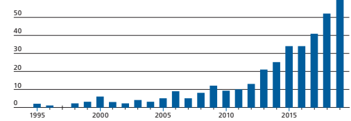
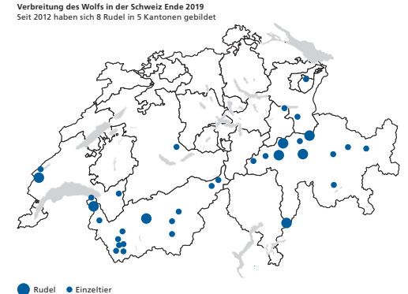
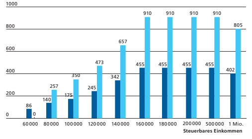
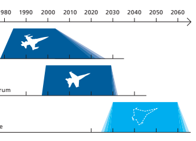
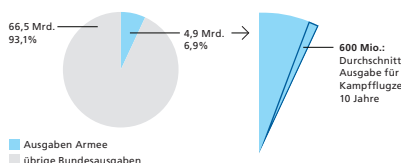
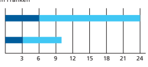

Im Detail Volksinitiative «Für eine massvolle Zuwanderung (Begrenzungsinitiative)»
 

| Argumente Initiativkomitee        | 20   |
|-----------------------------------|------|
| Argumente Bundesrat und Parlament | 22   |
| Abstimmungstext                   | 24   |

| Zuwanderungs - politik der Schweiz                                                                                                                                                                                                                                                                                                                                                                                                                                                                                                                                                                                                                                                                                                                                                                                                                                                                                                                                                                                               | Die Zuwanderungspolitik der Schweiz unterscheidet zwei   |
|----------------------------------------------------------------------------------------------------------------------------------------------------------------------------------------------------------------------------------------------------------------------------------------------------------------------------------------------------------------------------------------------------------------------------------------------------------------------------------------------------------------------------------------------------------------------------------------------------------------------------------------------------------------------------------------------------------------------------------------------------------------------------------------------------------------------------------------------------------------------------------------------------------------------------------------------------------------------------------------------------------------------------------|----------------------------------------------------------|
| Gruppen: Für Personen aus den Mitgliedstaaten der Europäi schen Union (EU) und der Europäischen Freihandelsassoziation  (EFTA)1  gilt die Personenfreizügigkeit. Für Personen aus allen  anderen Staaten gelten strengere Zulassungsbedingungen;  für den Zugang zum Arbeitsmarkt legt der Bundesrat zudem  jährlich Höchstzahlen fest. -                                                                                                                                                                                                                                                                                                                                                                                                                                                                                                                                                                                                                                                                                        |                                                          |
| Personen - freizügigkeit  mit der EU                                                                                                                                                                                                                                                                                                                                                                                                                                                                                                                                                                                                                                                                                                                                                                                                                                                                                                                                                                                             | Das Personenfreizügigkeitsabkommen mit der EU (FZA)2     |
| trat am 1. Juni 2002 in Kraft. Das FZA erlaubt es Schweizerin nen und Schweizern, in jedem Mitgliedstaat der EU zu leben,  zu arbeiten und zu studieren; für EU-Bürgerinnen und -Bürger  gilt dasselbe in Bezug auf die Schweiz. Die Personenfreizügig keit ist aber nicht bedingungslos: Wer sich in der Schweiz  aufhalten will, muss einen gültigen Arbeitsvertrag haben oder  selbstständigerwerbend sein; Nichterwerbstätige müssen über  ausreichende finanzielle Mittel verfügen und umfassend gegen Krankheit und Unfall versichert sein. - - Coronakrise: Personenfreizügigkeit vorübergehend eingeschränkt Am 13. März 2020 beschloss der Bundesrat, die Personenfreizügigkeit  vorübergehend einzuschränken, um die Bevölkerung in der Schweiz  vor der Ausbreitung des Coronavirus zu schützen. Laut dem Personen freizügigkeitsabkommen mit der EU (FZA) kann die Schweiz solche  Einschränkungen eigenständig beschliessen, wenn sie zum Schutz der  öffentlichen Ordnung, Sicherheit und Gesundheit nötig sind. - |                                                          |
| Zu- und  Auswanderung                                                                                                                                                                                                                                                                                                                                                                                                                                                                                                                                                                                                                                                                                                                                                                                                                                                                                                                                                                                                            | Die Zuwanderung aus der EU ist stark von den wirtschaft  |
| lichen Entwicklungen im In- und Ausland abhängig. Die Netto zuwanderung hat sich seit 2013 halbiert: 2019 wanderten noch  rund 32000 Personen mehr ein als aus.3  Auch Schweizerinnen  und Schweizer nutzen die Personenfreizügigkeit: Laut Anga ben des Bundesamtes für Statistik lebte Ende 2019 rund eine  halbe Million in der EU. -  -  - 1 Zur EFTA gehören neben der Schweiz noch Norwegen, Island und  Liechtenstein. 2 Abkommen vom 21. Juni 1999 zwischen der Schweizerischen  Eidgenossenschaft einerseits und der Europäischen Gemeinschaft  und ihren Mitgliedstaaten andererseits über die Freizügigkeit  ( admin.ch > Bundesrecht > Systematische Rechtssammlung). 3 Ausländerstatistik 2019 des Staatssekretariats für Migration SEM  ( sem.admin.ch > Publikationen & Service > Statistiken >   Ausländerstatistik > Statistik Zuwanderung).                                                                                                                                                                    |                                                          |

Was will die Initiative?

Die Initiative will die Personenfreizügigkeit mit der EU 
beenden.4 Der Bundesrat soll durch Verhandlungen mit der EU erreichen, dass das FZA innerhalb von 12 Monaten einver nehmlich ausser Kraft gesetzt wird. Gelingt dies nicht, muss der Bundesrat das Abkommen innerhalb von weiteren 30 Tagen kündigen. Zudem darf er keine neuen Abkommen abschlies sen, die ausländischen Staatsangehörigen eine Personenfrei zügigkeit gewähren. Im Asylbereich und bei der Zuwanderung aus Staaten, die ausserhalb der EU liegen, verlangt die Initia tive keine Änderungen.

-
-
-
-

## Bilaterale I: Sieben Miteinander Verknüpfte Abkommen Mit Der Eu

Das Personenfreizügigkeitsabkommen gehört zu sieben bilateralen Abkommen, die als Paket zwischen der Schweiz und der EU aus gehandelt wurden (Bilaterale I). Die Schweizer Stimmbevölkerung hat den Bilateralen I im Mai 2000 mit 67,2 Prozent zugestimmt und die Personenfreizügigkeit später mehrmals bestätigt. Fünf Abkommen der Bilateralen I sichern der Schweiz und der EU den gegenseitigen Markt zugang: die Abkommen über technische Handelshemmnisse, das öffentliche Beschaffungswesen, die Landwirtschaft sowie den Landund den Luftverkehr. Das Forschungsabkommen regelt die Teilnahme der Schweiz an den EU-Forschungsprogrammen. Das FZA ist rechtlich mit den übrigen sechs Abkommen der Bilateralen I verknüpft: Wird es gekündigt, treten sechs Monate später automatisch auch die anderen Abkommen ausser Kraft (Guillotine-Klausel). In diesem Fall steigt das Risiko, dass weitere Verträge mit der EU beendet werden - etwa die Schengen- und Dublin-Assoziierungsabkommen und damit die enge Zusammenarbeit mit der EU im Sicherheits- und im Asylbereich. Die Personenfreizügigkeit ist aus Sicht der EU eine Grundlage für die Teilnahme der Schweiz an Schengen/Dublin.5
- 
- 
4 Im Gegensatz zur Personenfreizügigkeit mit der EU verlangt die Initiative nicht explizit das Ende der Personenfreizügigkeit mit der EFTA. Weil die EFTA-Konvention auf den bilateralen Verträgen zwischen der Schweiz und der EU aufbaut, kann sie jedoch ohne das FZA nicht unverändert weitergeführt werden.

5 Abkommen vom 26. Okt. 2004 zwischen der Schweizerischen Eidgenossenschaft, der Europäischen Union und der Europäischen Gemeinschaft über die Assoziierung dieses Staates bei der Um setzung, Anwendung und Entwicklung des Schengen-Besitzstands bzw. Abkommen vom 26. Okt. 2004 zwischen der Schweizerischen Eidgenossenschaft und der Europäischen Gemeinschaft über die Kriterien und Verfahren zur Bestimmung des zuständigen Staates für die Prüfung eines in einem Mitgliedstaat oder in der Schweiz gestellten Asylantrags ( admin.ch > Bundesrecht > Systematische Rechtssammlung).

-

| Folgen für die  Schweizer   Wirtschaft                                                                                                                                                                                                                                                                                                                                                                                                                                                                                                                                                                                                                                                           | Mit dem Wegfall der Bilateralen I würde die Schweizer      |
|--------------------------------------------------------------------------------------------------------------------------------------------------------------------------------------------------------------------------------------------------------------------------------------------------------------------------------------------------------------------------------------------------------------------------------------------------------------------------------------------------------------------------------------------------------------------------------------------------------------------------------------------------------------------------------------------------|------------------------------------------------------------|
| Wirtschaft den direkten Zugang zum EU-Markt verlieren. Die  EU ist die mit Abstand wichtigste Handelspartnerin der Schweiz:  2019 gingen knapp die Hälfte aller Warenexporte aus der  Schweiz in den EU-Raum, und rund zwei Drittel aller Warenim porte kamen aus der EU.6  Das Staatssekretariat für Wirtschaft  (SECO) hat 2015 die Folgen eines Wegfalls der Bilateralen I für  die Schweiz untersuchen lassen: Gemäss diesem Bericht würde  die wirtschaftliche Leistung der Schweiz (Bruttoinlandprodukt)  in weniger als 20 Jahren 5–7 Prozent tiefer liegen als bei einem  Fortbestehen der Bilateralen I. Kumuliert über diesen Zeitraum  entspricht dies 460–630 Milliarden Franken.7 - |                                                            |
| Arbeitskräfte aus  der EU und FZA                                                                                                                                                                                                                                                                                                                                                                                                                                                                                                                                                                                                                                                                | Weil die Schweizer Bevölkerung altert und der Anteil der   |
| Personen im Pensionsalter stetig steigt, sind die Schweizer  Unternehmen auch künftig auf Arbeitskräfte aus der EU  ange wiesen. Mit dem Wegfall des FZA würde es für Unterneh men in der Schweiz schwieriger und administrativ aufwändig,  Arbeitskräfte aus der EU zu rekrutieren. -                                                                                                                                                                                                                                                                                                                                                                                                           |                                                            |
| Schutz der   inländischen  Arbeitskräfte                                                                                                                                                                                                                                                                                                                                                                                                                                                                                                                                                                                                                                                         | Bislang gibt es laut einem Bericht des SECO kaum Hinweise, |
| dass einheimische Arbeitskräfte wegen des FZA aus dem Arbeitsmarkt gedrängt werden.8  Die Schweiz hat dem FZA von  Beginn an flankierende Massnahmen zur Seite gestellt, damit  insbesondere die Löhne in der Schweiz nicht unter Druck gera -  ten. Zusätzlich wurde die Konkurrenzfähigkeit der inländischen  Arbeitskräfte in den letzten Jahren gezielt gestärkt. So können  sich Stellensuchende dank der Stellenmelde pflicht in Berufen  mit überdurchschnittlicher Arbeitslosigkeit mit einem zeitlichen  Vorsprung auf freie Stellen bewerben. Im Mai 2019 hat der  Bundesrat in Zusammenarbeit mit den Sozialpartnern weitere  Massnahmen beschlossen, mit denen die Chancen insbesondere 6 Aussenhandelsstatistik, Eidgenössische Zollverwaltung EZV  ( ezv.admin.ch > Themen > Aussenhandelsstatistik > Datenbank  Swiss-Impex). 7 Bericht im Auftrag des Staatssekretariats für Wirtschaft SECO,  2015: «Gesamtwirtschaftliche Auswirkungen eines Wegfalls der  Bilateralen I», S. 33 ( seco.admin.ch > Publikationen & Dienstleis - tungen > Publikationen > Aussenwirtschaft > Verhältnis zur EU). 8 15. Bericht des Observatoriums zum Freizügigkeitsabkommen  Schweiz–EU (2019), S. 5 ( seco.admin.ch > Publikationen &  Dienstleistungen > Publikationen > Arbeit > Personenfreizügigkeit  und Arbeitsbeziehungen > Observatoriumsberichte).                                                                                                                                                                                                                                                                                                                                                                                                                                                                                                                                                                                                                                                                                                  |                                                            |

-

von älteren Personen auf dem Arbeitsmarkt erhöht werden, zum Beispiel mit Job-Coaching oder gezielter Aus- und Weiter bildung. Zudem haben Bundesrat und Parlament entschieden, ausgesteuerten Arbeitslosen über 60 Jahre, die lange gearbei tet und wenig Vermögen haben, bis zur Pensionierung eine existenzsichernde Überbrückungsleistung zu gewähren. 

| bildung. Zudem haben Bundesrat und Parlament entschieden,  ausgesteuerten Arbeitslosen über 60 Jahre, die lange gearbei tet und wenig Vermögen haben, bis zur Pensionierung eine  existenzsichernde Überbrückungsleistung zu gewähren.  - Das FZA ist laut einem Bericht des SECO keine Belastung  für die Schweizer Sozialversicherungen.9  Die Angehörigen von  EU- und EFTA-Staaten tragen massgeblich zur Finanzierung und  zur Sicherung der AHV und der IV bei, wobei diese Beitrags zahlungen langfristig auch Rentenansprüche begründen. Das  FZA hat nicht zu einer Zunahme der Rentenbezügerinnen und  -bezüger in der IV geführt.  -   |
|---------------------------------------------------------------------------------------------------------------------------------------------------------------------------------------------------------------------------------------------------------------------------------------------------------------------------------------------------------------------------------------------------------------------------------------------------------------------------------------------------------------------------------------------------------------------------------------------------------------------------------------------------|

| Auswirkungen  auf Sozial -versicherungen   |
|--------------------------------------------|

9 15. Bericht des Observatoriums zum Freizügigkeitsabkommen Schweiz–EU (2019), S. 31–32 ( seco.admin.ch > Publikationen & Dienstleistungen > Publikationen > Arbeit > Personenfreizügigkeit und Arbeitsbeziehungen > Observatoriumsberichte).

19

## Argumente Initiativkomitee

| Die Schweiz ist ein kleines Land, in das sich nicht immer  mehr Menschen hineinzwängen können! Genau das pas siert seit der Einführung der vollen Personenfreizügigkeit  mit der EU 2007: Es findet eine Massen-Zuwanderung statt.  In den letzten 13 Jahren sind zusätzlich über eine Million  Menschen in die Schweiz zugewandert. Viele Menschen in  der Schweiz bangen um ihren Arbeitsplatz. Geht die unbe grenzte Zuwanderung so weiter, steigt die Arbeitslosigkeit,  und unser Wohlstand, unsere Freiheit sind gefährdet. - -   |                                                        |
|-----------------------------------------------------------------------------------------------------------------------------------------------------------------------------------------------------------------------------------------------------------------------------------------------------------------------------------------------------------------------------------------------------------------------------------------------------------------------------------------------------------------------------------------|--------------------------------------------------------|
| Arbeitsplätze  und Wohlstand  erhalten                                                                                                                                                                                                                                                                                                                                                                                                                                                                                                  | Die Folgen dieser masslosen Entwicklung sind täglich   |
| spürbar: die Sozialkosten und die Kriminalität nehmen zu, die  Mieten und Bodenpreise steigen, wertvolles Kulturland wird  zubetoniert. Schweizer Arbeitnehmende - vor allem ältere -  werden durch junge, billigere Ausländer ersetzt. Der Lohnund Arbeitsdruck steigt. Die Verkehrsinfrastruktur ist überlas tet. Die durch die Corona-Pandemie ausgelöste Wirtschafts krise und die steigende Arbeitslosigkeit verschärfen die Lage.  Jetzt müssen wir zuerst Arbeitsplätze für unsere Bürger  sichern. Auch in all unseren Nachbarstaaten herrscht hohe  Arbeitslosigkeit. Wenn wir nicht wollen, dass sich ein Grossteil  der Menschen dort aufmacht, um in der Schweiz um jeden  Preis und zu jedem Lohn Arbeit oder einen Platz in unserem  Sozialsystem zu finden, dann müssen wir sofort die Zuwande rung in unser Land wieder selber kontrollieren. - -  -                                                                                                                                                                                                                                                                                                                                                                                                                                                                                                                                         |                                                        |
| Notwendige Fach - kräfte können  weiterhin kommen                                                                                                                                                                                                                                                                                                                                                                                                                                                                                       | Die Schweiz war immer ein offenes Land. Arbeitskräfte, |
| die wir in unserem Land brauchen, wie Ärzte, Pflegende oder  Erntehelfer, können auch weiterhin und entsprechend den  Bedürfnissen unseres Landes in die Schweiz kommen, um hier  ihr Geld zu verdienen. Das war schon vor der Einführung der  Personenfreizügigkeit kein Problem, und das wird auch nach  Annahme der Begrenzungsinitiative kein Problem sein.                                                                                                                                                                         |                                                        |

| JA zum  bilateralen Weg -  Masslosigkeit  stoppen                                                                                                                                                                                                                                                                                                                                                                                                                                                                                                                                                                                                                                                                                                                                                                        | Die heute unbegrenzte Zuwanderung (jährlich mehr   |
|--------------------------------------------------------------------------------------------------------------------------------------------------------------------------------------------------------------------------------------------------------------------------------------------------------------------------------------------------------------------------------------------------------------------------------------------------------------------------------------------------------------------------------------------------------------------------------------------------------------------------------------------------------------------------------------------------------------------------------------------------------------------------------------------------------------------------|----------------------------------------------------|
| Personen als die Stadt St. Gallen oder der Kanton Jura Einwoh ner hat) schadet unserer Wirtschaft, der Sicherheit und der  Umwelt. Sie gefährdet auch Arbeitsplätze, die Freiheit und  unseren über Generationen hart erarbeiteten Wohlstand. Die  Initiative will keinen generellen Stopp der Zuwanderung und  verlangt keine Kündigung der bilateralen Abkommen mit der  EU. Der Bundesrat wird beauftragt, auf dem Verhandlungsweg  das Personenfreizügigkeitsabkommen mit der EU spätestens  12 Monate nach Annahme der Begrenzungsinitiative ausser  Kraft zu setzen. Eine vernünftige und massvolle Initiative.  - Setzen Sie sich ein für die Erhaltung des bewährten,  eigenständigen Weges der Schweiz und sagen Sie deshalb  JA zur Volksinitiative «Für eine massvolle Zuwanderung  (Begrenzungsinitiative)». |                                                    |

Empfehlung des Initiativkomitees Deshalb empfiehlt das Initiativkomitee:
Ja begrenzungsinitiative.ch Der Text auf dieser Doppelseite stammt vom Initiativkomitee. Es ist für den Inhalt und die Wortwahl verantwortlich.

Argumente Bundesrat und Parlament

| Die Initiative verlangt das Ende der Personen freizügigkeit  mit der EU. Sie gefährdet den bilateralen Weg der Schweiz.  Ohne das Freizügigkeitsabkommen (FZA) und die damit  verknüpften Verträge verlieren die Schweizer Unternehmen den direkten Zugang zu ihrem wichtigsten Markt. Gerade  auch für die Bewältigung der Coronakrise ist ein möglichst  freier Marktzugang wichtig. Eine Annahme der Initiative  hätte schwerwiegende Folgen für die Arbeitsplätze und  unseren Wohlstand. Bundesrat und Parlament lehnen die  Vorlage insbesondere aus folgenden Gründen ab:   |                                                        |
|------------------------------------------------------------------------------------------------------------------------------------------------------------------------------------------------------------------------------------------------------------------------------------------------------------------------------------------------------------------------------------------------------------------------------------------------------------------------------------------------------------------------------------------------------------------------------------|--------------------------------------------------------|
| Erfolgreicher Weg der Schweiz                                                                                                                                                                                                                                                                                                                                                                                                                                                                                                                                                      | Die Schweiz geht in Europa einen eigenständigen Weg.   |
| Es ist ihr gelungen, Verträge mit der EU abzuschliessen, die auf  sie zugeschnitten sind. Diese Verträge sichern die guten und  ausgewogenen Beziehungen zu ihrer wichtigsten Handelspart nerin. Die Schweizer Wirtschaft ist auf diese guten Beziehun gen angewiesen, gerade auch, um sich nach der Coronakrise zu  erholen.  - -                                                                                                                                                                                                                                                 |                                                        |
| Stabile Beziehun - gen erhalten                                                                                                                                                                                                                                                                                                                                                                                                                                                                                                                                                    | Eine Kündigung des FZA gefährdet den bilateralen Weg   |
| der Schweiz; wegen der rechtlichen Verknüpfung durch die  Guillotine-Klausel fallen alle Verträge der Bilateralen I weg.  Zwar sieht die Initiative eine kurze Frist für Verhandlungen mit  der EU vor. Ein Erfolg ist jedoch unrealistisch, weil die Perso nenfreizügigkeit ein Grundprinzip der EU ist. Die Umsetzung  der Masseneinwanderungsinitiative hat gezeigt, dass die EU  nicht bereit ist, davon abzurücken. -                                                                                                                                                         |                                                        |
| Grosse Nachteile für die Schweiz                                                                                                                                                                                                                                                                                                                                                                                                                                                                                                                                                   | Ohne bilaterale Verträge verlieren die Schweizer Unter |
| nehmen, insbesondere die kleinen und mittleren Unternehmen  (KMU), den direkten Zugang zu ihrem wichtigsten Markt und  wären weniger konkurrenzfähig. Die Produktion würde  vermehrt ins Ausland verlagert. Der Handel mit der EU wäre  erschwert und die Preise würden steigen. -                                                                                                                                                                                                                                                                                                 |                                                        |

| Bund schützt  Schweizer   Arbeitsmarkt                                                                                                                                                                                                                                                                                                                                                                                                                                                    | Der Bundesrat will nur so viel Zuwanderung wie nötig. Er   |
|-------------------------------------------------------------------------------------------------------------------------------------------------------------------------------------------------------------------------------------------------------------------------------------------------------------------------------------------------------------------------------------------------------------------------------------------------------------------------------------------|------------------------------------------------------------|
| investiert deshalb gezielt in die inländischen Arbeitskräfte,  etwa mit der Stellenmeldepflicht, die die Chancen von Stellen suchenden in der Schweiz erhöht, oder indem er ältere Arbeits kräfte unterstützt. Für ausgesteuerte Arbeitslose kurz vor der  Pensionierung haben Bundesrat und Parlament eine Über brückungsleistung beschlossen. Ausserdem werden die Löhne  und die Wettbewerbsbedingungen für das inländische Gewerbe mit den flankierenden Massnahmen geschützt. - -  - |                                                            |
| Bedarf an Arbeits - kräften                                                                                                                                                                                                                                                                                                                                                                                                                                                               | Seit mehreren Jahren finden hiesige Unternehmen nicht      |
| genügend Arbeitskräfte in der Schweiz. Da der Anteil der  Pensionierten in den nächsten Jahren steigt, bleibt das FZA  wichtig: Es ermöglicht den Unternehmen, bei Bedarf weiterhin  Fachkräfte aus der EU zu rekrutieren.                                                                                                                                                                                                                                                                |                                                            |
| Wohlstand steht  auf dem Spiel                                                                                                                                                                                                                                                                                                                                                                                                                                                            | Die Initiative setzt die guten Beziehungen zu unseren      |
| Nachbarn aufs Spiel und gefährdet damit Arbeitsplätze und  unseren Wohlstand. Die Schweiz ist durch die Coronakrise hart  getroffen worden. Was wir jetzt brauchen ist Rechtssicherheit  und eine wirtschaftliche Perspektive.                                                                                                                                                                                                                                                            |                                                            |
| Empfehlung  von Bundesrat und Parlament                                                                                                                                                                                                                                                                                                                                                                                                                                                   | Aus all diesen Gründen empfehlen Bundesrat und             |
| Parlament, die Volksinitiative «Für eine massvolle Zuwande - rung (Begrenzungsinitiative)» abzulehnen.                                                                                                                                                                                                                                                                                                                                                                                    |                                                            |

## Nein

admin.ch/begrenzungsinitiative

# Im Detail Änderung Des Jagdgesetzes

| Argumente Referendumskomitee      | 34   |    |
|-----------------------------------|------|----|
| Argumente Bundesrat und Parlament |      | 36 |
| Abstimmungstext                   | 38   |    |

Ausgangslage Mitte des 19. Jahrhunderts verschwanden wegen unkon trollierter Jagd in der Schweiz viele Wildtiere. Deshalb erliess der Bund 1875 erstmals ein Gesetz, das gegenüber den Kanto nen regelte, in welchen Gebieten Tiere geschützt sind, welche Arten gejagt werden dürfen und wann Schonzeiten gelten. Dank diesem Gesetz gibt es heute in der Schweiz wieder Wildtierarten wie Rothirsche, Gämsen und Steinböcke. Das geltende Gesetz stammt von 1986. Damals gab es bei uns keine Wölfe mehr. 1995 kehrte der Wolf zurück. Zunächst streiften nur einzelne Wölfe in der Schweiz umher. 2012 bildete sich das erste Rudel. Die Wölfe wurden damit wieder sesshaft. Ende 2019 gab es acht Rudel, in denen rund 30 Jungwölfe geboren wurden. Insgesamt wurden im letzten Jahr rund 80 Wölfe nachgewiesen.1
-
-
Entwicklung des Wolfsbestandes in der Schweiz Seit 1995 gibt es wieder Wölfe in der Schweiz 70 80 60

Quelle: Stiftung KORA, Raubtierökologie und Wildtiermanagement Anzahl beobachtete Wölfe 1 Stiftung KORA, Raubtierökologie und Wildtiermanagement, 2019. 

KORA sammelt alle gemeldeten Wolfsnachweise und hält so den Bestand und die Ausbreitung des Wolfes fest ( kora.ch > Monitoring > Wolf > Status).

Quellen: Kantone (Daten), LBC (genetische Analysen), Stiftung KORA, Raubtierökologie und Wildtiermanagement (Daten und Karte)

Wolf breitet sich aus

Der Wolfsbestand in der Schweiz wächst. Ende 2019 leb ten rund 80 Tiere in einem Dutzend Kantone. Sie haben sich im Wallis, in den Bündner Tälern, im Hinterland von Bellinzona, in den Tälern der Nordalpen vom Pays d'Enhaut bis ins St. Galler Oberland, rund um den Säntis und in den Wäldern des Waadt länder Juras niedergelassen.

 - 
-

| Konflikte  mit Wölfen                                                                                                                                                                                                                                                                                                                                                                                                                                                                                                                                                                                                              | Seit 2009 haben Wölfe jährlich zwischen 300 und 500     |
|------------------------------------------------------------------------------------------------------------------------------------------------------------------------------------------------------------------------------------------------------------------------------------------------------------------------------------------------------------------------------------------------------------------------------------------------------------------------------------------------------------------------------------------------------------------------------------------------------------------------------------|---------------------------------------------------------|
| Schafe und Ziegen gerissen.2  Betroffen sind auch Herden, die  von Zäunen oder Hunden beschützt werden, denn Wölfe  können lernen, diese Schutzmassnahmen zu umgehen. Das  Auftauchen von Wölfen in Dorfnähe beschäftigt zudem die  örtliche Bevölkerung und die zuständigen Behörden.                                                                                                                                                                                                                                                                                                                                             |                                                         |
| Das revidierte  Jagdgesetz: Erlegen von Wölfen  aus Rudeln                                                                                                                                                                                                                                                                                                                                                                                                                                                                                                                                                                         | Das revidierte Jagdgesetz trägt der steigenden Zahl von |
| Wölfen Rechnung. Es erlaubt den Kantonen, den Wolfsbestand  vorausschauend zu regulieren, um Schäden an Schafen und  Ziegen zu verhindern. Auch sollen so die Wölfe die Scheu vor  Menschen behalten. Abschüsse zur Regulierung des Bestandes  sind zum Beispiel dann nötig, wenn Wölfe gelernt haben, den  Herdenschutz zu umgehen, oder wenn sie in Siedlungen  auftauchen. Die Kantone erhalten mit den neuen Bestimmun gen ein Instrument, um das Wachstum und die Ausbreitung  der Wolfsbestände zu steuern. Sie dürfen aber nicht in ein  Wolfsrudel eingreifen, das sich fernab von Schafherden oder  Siedlungen aufhält. - |                                                         |
| Wolf bleibt  geschützt                                                                                                                                                                                                                                                                                                                                                                                                                                                                                                                                                                                                             | Der Wolf bleibt auch mit dem revidierten Gesetz eine    |
| geschützte Tierart, die Rudel bleiben erhalten. Die Kantone  dürfen einzig unter bestimmten Bedingungen Abschüsse  anordnen. Zuständig sind die kantonalen Wildhüterinnen und  Wildhüter.                                                                                                                                                                                                                                                                                                                                                                                                                                          |                                                         |
| Jagdbare und geschützte Tierarten Jagdbare Tierarten Die jagdbaren Tierarten dürfen von Jägerinnen und Jägern gejagt  werden. Dazu gehören etwa Rehe, Gämsen oder Füchse. Während der  Fortpflanzungs- und Jungenaufzuchtzeit gilt für alle diese Tiere eine  gesetzlich vorgeschriebene Schonzeit, während der sie nicht gejagt  werden dürfen. Geschützte Tierarten Geschützte Tierarten wie Wolf, Biber oder Graureiher hingegen dürfen  von Jägerinnen und Jägern nicht gejagt werden. Die Kantone können  unter bestimmten Voraussetzungen Abschüsse von Tieren anordnen.                                                     |                                                         |

2 Stiftung KORA, Raubtierökologie und Wildtiermanagement, 2019.

( kora.ch > Monitoring > Wolf > Übergriffe auf Nutztiere).

 

| Kantone müssen verhältnismässig  handeln                                                                                                                                                                                                                                                                                                                 | Eine Verfügung über das Erlegen von Wölfen ist an meh      |
|----------------------------------------------------------------------------------------------------------------------------------------------------------------------------------------------------------------------------------------------------------------------------------------------------------------------------------------------------------|------------------------------------------------------------|
| rere Voraussetzungen geknüpft. Zum Beispiel müssen die  Kantone in Gebieten mit Wolfsrudeln die Bäuerinnen und  Bauern über Massnahmen zum Schutz von Herden informieren. Die Kantone müssen gegenüber dem Bund zudem vorgängig  begründen, weshalb Abschüsse erforderlich sind. Dabei müssen sie die Verhältnismässigkeit wahren. -                     |                                                            |
| Erlegen von  Einzelwölfen                                                                                                                                                                                                                                                                                                                                | Richtet ein einzelnes Tier trotz Massnahmen für den Schutz |
| von Herden Schaden an, so kann der Kanton für dieses Tier  den Abschuss anordnen. Das ist bereits heute so. Neu können  die Kantone den Abschuss von Einzelwölfen auch anordnen,  wenn sich diese auffällig verhalten oder gefährlich werden,  zum Beispiel, wenn sie in Schafställe eindringen oder ohne  Scheu durch Dörfer streifen.                  |                                                            |
| Regulierung von  anderen Tieren                                                                                                                                                                                                                                                                                                                          | Gemäss Gesetz sind Eingriffe in den Bestand nur bei        |
| Wolfsrudeln und Steinböcken zulässig. Der Bundesrat kann  weitere Arten als regulierbar bezeichnen, sofern sachliche  Gründe vorliegen. Für den Luchs, den Biber, den Graureiher  und den Gänsesäger hat das Parlament dies bereits ausdrück lich abgelehnt. Dagegen soll gemäss Parlament der Höcker schwanbestand künftig reguliert werden können. - - |                                                            |
| Beschwerderecht                                                                                                                                                                                                                                                                                                                                          | Zwar entscheiden die Kantone über Abschüsse in Wolfs       |
| rudeln oder von Einzeltieren, aber vorab müssen sie das  Bundesamt für Umwelt anhören. Und sowohl der Bund als  auch Naturschutzorganisationen wie WWF oder Pro Natura  können weiterhin Beschwerde gegen einen von einem Kanton  verfügten Abschuss einreichen und die Rechtmässigkeit  überprüfen lassen. -                                            |                                                            |

| Strengere Kriterien  für Entschädigungen                                                                                                                                                                                                                                                                                                                                                                                                                       | Bäuerinnen und Bauern erhalten mit dem revidierten    |
|----------------------------------------------------------------------------------------------------------------------------------------------------------------------------------------------------------------------------------------------------------------------------------------------------------------------------------------------------------------------------------------------------------------------------------------------------------------|-------------------------------------------------------|
| Jagdgesetz für gerissene Schafe und Ziegen nur noch eine  Entschädigung, wenn sie zuvor Massnahmen zum Schutz ihrer  Herden ergriffen haben. Heute können sie für Wolfsrisse auch  dann eine Entschädigung beantragen, wenn sie ihre Tiere  zuvor nicht mit Zäunen oder Hunden geschützt haben. Der  Bund hat von 1995 bis 2019 insgesamt rund 1,8 Millionen  Franken für Entschädigungen bezahlt.3                                                            |                                                       |
| Ausbau des Arten - schutzes                                                                                                                                                                                                                                                                                                                                                                                                                                    | Das revidierte Gesetz betrifft nicht nur den Wolf. Es |
| enthält auch Bestimmungen zu Wildtieren, die besser ge schützt werden sollen. Vom zusätzlichen Artenschutz profitie ren zum Beispiel die meisten Wildentenarten. Diese dürfen  künftig nicht mehr gejagt werden. Und für die Waldschnepfe  gilt eine längere Schonzeit. - -                                                                                                                                                                                    |                                                       |
| Vernetzung von  Lebensräumen                                                                                                                                                                                                                                                                                                                                                                                                                                   | Siedlungen, Gewerbe- und Industriebauten sowie        |
| Strassen und Schienen zerschneiden die Lebensräume der  Wildtiere. Nur in offenen Landschaften können die Tiere  zwischen den Lebensräumen hin- und herwandern. Mit dem  revidierten Gesetz werden rund 300 Verbindungswege für  Wildtiere vor Verbauung geschützt. Zudem werden bei  Strassen und Bahnlinien wo nötig Brücken und Unterführun gen für Wildtiere erstellt. Auf diese Weise werden die Lebens räume der Tiere besser miteinander vernetzt.  - - |                                                       |
| Finanzielle   Unterstützung  für Kantone                                                                                                                                                                                                                                                                                                                                                                                                                       | Neu unterstützt der Bund die Kantone bei der Aufwer   |
| tung der Lebensräume finanziell. Mit diesem Geld können die  Kantone die Lebensräume von Wildtieren und Vögeln in den  fast 80 eidgenössischen Schutzgebieten aufwerten. Zudem  stellt der Bund zusätzliche Mittel zur Verfügung, damit die  Kantone den Einsatz von Wildhüterinnen und Wildhütern  verstärken können. -                                                                                                                                       |                                                       |

## 3 Bundesamt Für Umwelt, 2020 ( Bafu.Admin.Ch/Wolf).

| Tierwohl                                                                                                                                                                                                                                                                                                                                                                                                                       | Das revidierte Gesetz sieht Massnahmen für das Tierwohl   |
|--------------------------------------------------------------------------------------------------------------------------------------------------------------------------------------------------------------------------------------------------------------------------------------------------------------------------------------------------------------------------------------------------------------------------------|-----------------------------------------------------------|
| vor. Es verpflichtet beispielsweise die Kantone und die Bäuerin nen und Bauern, Zäune wildtierfreundlich zu bauen, damit Un fälle und Verletzungen von Wildtieren möglichst ausbleiben.  - -                                                                                                                                                                                                                                   |                                                           |
| Umsetzung  in Vorbereitung                                                                                                                                                                                                                                                                                                                                                                                                     | Der Bundesrat regelt die Umsetzung des revidierten        |
| Jagdgesetzes in der Jagdverordnung. Um vor der Volksabstim mung möglichst Klarheit zu schaffen, hat er dazu bereits einen  Entwurf erarbeitet und in die Vernehmlassung geschickt. Darin  schliesst er insbesondere die Regulierung der geschützten  Arten Luchs, Biber, Graureiher und Gänsesäger aus. Einzig  Wolf, Steinbock und Höckerschwan sollen reguliert werden  können. Das entspricht dem Willen des Parlaments.4 - |                                                           |
| Was passiert  bei einem «Nein»?                                                                                                                                                                                                                                                                                                                                                                                                | Bei einem «Nein» zum revidierten Jagdgesetz gilt weiter   |
| hin das heutige Gesetz. Die Kantone könnten den wachsenden  Wolfsbestand nicht vorausschauend steuern. Zudem würde bei  einer Ablehnung des Gesetzes der Artenschutz nicht ausge weitet. - -                                                                                                                                                                                                                                   |                                                           |

4 Die Vernehmlassung zur Jagdverordnung wurde am 8. Mai 2020 eröffnet mit Frist bis zum 9. Sept. 2020 ( admin.ch > Dokumenta tion > Medienmitteilungen > Medienmitteilungen des Bundesrats > 08.05.2020 > «Ausführungsbestimmungen zum revidierten Jagdgesetz: Start der Vernehmlassung»).

-

## Argumente Referendumskomitee

| Das missratene Jagdgesetz bringt wildlebende Tierarten  noch stärker in Bedrängnis. Geschützte Tiere können   abgeschossen werden, ohne dass sie je einen Schaden  ange richtet haben. Selbst in Wildtierschutzgebieten wird  geschützten Tieren nachgestellt. Statt den Umgang mit  dem Wolf pragmatisch zu regeln, gefährdet das neue   Gesetz den Artenschutz in der Schweiz. Nur ein Nein  sichert den Schutz von Biber, Höckerschwan, Luchs und  weiteren Tierarten.   |                                                        |
|-----------------------------------------------------------------------------------------------------------------------------------------------------------------------------------------------------------------------------------------------------------------------------------------------------------------------------------------------------------------------------------------------------------------------------------------------------------------------------|--------------------------------------------------------|
| Unnötig und  kompliziert                                                                                                                                                                                                                                                                                                                                                                                                                                                    | Zahlreiche neue Bestimmungen sind unnötig und kompli   |
| ziert. Schon mit dem geltenden Gesetz können die Kantone  wo nötig Einzeltiere geschützter Arten abschiessen. Die  Kantone können - mit Zustimmung des Bundes - heute schon  ganze Bestände geschützter Arten regulieren. -                                                                                                                                                                                                                                                 |                                                        |
| Abschüsse auf  Vorrat                                                                                                                                                                                                                                                                                                                                                                                                                                                       | Das revidierte Jagdgesetz macht Abschüsse «auf Vorrat» |
| möglich: So können Tiere geschützter Arten in namhafter Zahl  geschossen werden, ohne dass sie je Schäden angerichtet  hätten (Art. 7a, Abs. 2, lit. b) und ohne dass zumutbare Mass nahmen (z. B. Herdenschutz) ergriffen wurden. Sie werden  geschossen, einfach, weil sie da sind. -                                                                                                                                                                                     |                                                        |
| Biber, Luchs,  Schwan etc.  in Gefahr                                                                                                                                                                                                                                                                                                                                                                                                                                       | Geschützte Tierarten können vom Bundesrat jederzeit    |
| auf die Liste der regulierbaren Arten gesetzt werden, ohne  dass das Volk oder das Parlament etwas dazu sagen können.  Der Bundesrat kann z. B. Biber, Luchs, Fischotter, Graureiher  oder Höckerschwan als regulierbar erklären (Art. 7a, Abs. 1 lit.  c). Der Schutz dieser Tiere darf aber nicht verwässert werden.                                                                                                                                                      |                                                        |

| Feldhasen  endlich schützen                                                                                                                                                                                                                                                                                       | Bedrohte Arten wie Feldhase, Birkhahn, Schneehuhn und   |
|-------------------------------------------------------------------------------------------------------------------------------------------------------------------------------------------------------------------------------------------------------------------------------------------------------------------|---------------------------------------------------------|
| Waldschnepfe gehören unter Schutz gestellt - stattdessen  können sie weiterhin gejagt werden (Art. 5, Abs. 1). Auch die  Abschaffung der grausamen und jagdlich nicht notwendigen  Baujagd auf den Fuchs wurde verpasst. Lauter vertane Chan cen, das Jagd- und Schutzgesetz auf die Höhe der Zeit zu  bringen. - |                                                         |
| Bergwald schützen                                                                                                                                                                                                                                                                                                 | Luchs und Wolf verhindern den übermässigen Verbiss des  |
| Jungwaldes durch Hirsch und Reh. Sie sichern als Teil des  Ökosystems artenreiche und stabile Schutzwälder. Die Tiere  verfrüht zu regulieren, schadet dem Wald und ist aus forstli - cher Sicht deshalb kontraproduktiv.                                                                                         |                                                         |
| Zurück an den  Absender                                                                                                                                                                                                                                                                                           | Ein «Nein» sichert den Artenschutz und verhindert einen |
| Wildwuchs von kantonal verschiedenen Lösungen beim  Umgang mit geschützten Tierarten. Das neue Parlament kann  danach ein ausgewogenes Gesetz schaffen, das den Schutz  wildlebender Tiere und eine pragmatische Regulierung des  Wolfes beinhaltet. Ein «Nein» ist kein Votum gegen die Jagd.                    |                                                         |
| Empfehlung des  Referendums - komitees                                                                                                                                                                                                                                                                            | Darum empfiehlt das Referendumskomitee: Nein            |

 jagdgesetz-nein.ch Der Text auf dieser Doppelseite stammt vom Referendumskomitee. Es ist für den Inhalt und die Wortwahl verantwortlich.

Argumente Bundesrat und Parlament

| Das revidierte Gesetz stärkt den Schutz von Wildtieren.  Das ist wichtig für die Artenvielfalt. Zudem bietet das  Gesetz eine pragmatische Lösung für den Umgang mit dem  wachsenden Wolfsbestand in der Schweiz. Es ermöglicht  den Kantonen künftig, den Wolfsbestand vorausschauend  zu regulieren. So können Konflikte gemindert werden.  Der Wolf bleibt aber eine geschützte Tierart, und die Rudel  bleiben erhalten. Bundesrat und Parlament befürworten  das Gesetz insbesondere aus folgenden Gründen:   |                                                         |
|--------------------------------------------------------------------------------------------------------------------------------------------------------------------------------------------------------------------------------------------------------------------------------------------------------------------------------------------------------------------------------------------------------------------------------------------------------------------------------------------------------------------|---------------------------------------------------------|
| Zeitgemässe  Regeln                                                                                                                                                                                                                                                                                                                                                                                                                                                                                                | Der Bestand der Wölfe wächst rasch an, sie breiten sich |
| seit ein paar Jahren stärker aus. Damit einher gehen auch  Angriffe auf Schafe und Ziegen. Seit 2009 haben Wölfe jährlich  zwischen 300 und 500 Schafe und Ziegen gerissen. Die Regeln  im Umgang mit dem Wolf müssen an seine Ausbreitung  angepasst werden. Das revidierte Gesetz verhindert, dass  Konflikte eskalieren.                                                                                                                                                                                        |                                                         |
| Schaden   verhindern                                                                                                                                                                                                                                                                                                                                                                                                                                                                                               | Die Kantone erhalten ein sinnvolles Instrument, um die  |
| Zunahme des Wolfsbestandes zu bremsen. Heute können sie  erst dann in den Bestand eines Rudels eingreifen, wenn es  bereits zu grossen Schäden gekommen ist. Künftig können sie  einige Wölfe aus einem Rudel erlegen, um Schäden in Schafund Ziegenherden zu verhindern oder wenn Wölfe in Dörfern  auftauchen.                                                                                                                                                                                                                                                                                                                                                                                                                                                                                                                    |                                                         |
| Guter Kompromiss                                                                                                                                                                                                                                                                                                                                                                                                                                                                                                   | Die neuen Regeln für den Umgang mit dem Wolf sind ein   |
| guter Kompromiss. Auf der einen Seite gibt es die Forderung,  den Wolf zur Jagd freizugeben. Auf der anderen Seite wird  verlangt, nicht in den Bestand einzugreifen. Das revidierte  Gesetz ist ein sinnvoller Mittelweg: Der Wolf bleibt geschützt,  sein Bestand kann aber gesteuert werden.                                                                                                                                                                                                                    |                                                         |
| Herdenschutz wird gestärkt                                                                                                                                                                                                                                                                                                                                                                                                                                                                                         | Das revidierte Gesetz nimmt Bäuerinnen und Bauern       |
| stärker in die Pflicht. Sie müssen zum Schutz der Herden Zäune  errichten oder Schutzhunde zur Bewachung halten, um eine  allfällige Entschädigung für Wolfsrisse zu erhalten.                                                                                                                                                                                                                                                                                                                                     |                                                         |

| Besserer Schutz  für Wildtiere   |
|----------------------------------|

Die Schweiz will die Artenvielfalt stärken. Das revidierte Jagdgesetz leistet dazu einen wichtigen Beitrag: Es schützt mehr Wildtierarten, und es schützt sie besser als bisher. 

| Massvolles Jagdund Wildtier - schutzgesetz   |
|---|

Das revidierte Jagdgesetz bringt die verschiedenen Interessen ins Gleichgewicht. Es gibt den Kantonen ein mass volles Instrument zur Regulierung des Wolfsbestandes; damit trägt es zum Nebeneinander von Mensch und Wolf bei. Gleichzeitig schützt es die anderen Wildtiere und ihre Lebens räume besser. 

-
-
Empfehlung von Bundesrat und Parlament Aus all diesen Gründen empfehlen Bundesrat und Parla ment, die Änderung des Jagdgesetzes anzunehmen.

-
Ja admin.ch/jagdgesetz Im Detail Änderung des Bundesgesetzes über die direkte Bundessteuer

| Argumente Referendumskomitees     | 52   |
|-----------------------------------|------|
| Argumente Bundesrat und Parlament | 54   |
| Abstimmungstext                   | 56   |

Heutige Steuer abzüge für Kinderkosten
-
Wer Kinder hat, kann bei der direkten Bundessteuer Abzüge vornehmen. In dieser Vorlage geht es um folgende zwei Abzüge: - Wer seine Kinder gegen Bezahlung betreuen lässt, zum Beispiel in einer Kindertagesstätte (Kita), kann diese Kosten abziehen - heute jedoch höchstens 10100 Franken pro Kind. Die Kosten müssen in einem engen Zusammen hang mit der eigenen Erwerbstätigkeit, Ausbildung oder Erwerbsunfähigkeit stehen. Zudem muss das Kind unter 14 Jahre alt sein.

-
- Solange Kinder noch nicht 18 Jahre alt oder noch in Ausbildung sind, wird ein allgemeiner Kinderabzug vorgenommen. Er beträgt heute 6500 Franken pro Kind.

| Bund heute                              | Bund bei Annahme der                         | Kantone1    |                   |
|-----------------------------------------|----------------------------------------------|-------------|-------------------|
| Vorlage                                 |                                              |             |                   |
| Maximaler Abzug                         | 10 100                                       | 25 000      | zwischen 3000 und |
| für die Drittbetreuung                  | 25 000 Uri lässt den Abzug  unbeschränkt zu. |             |                   |
| Allgemeiner                             | 6500                                         | 10000       | 0 bis 24500       |
| Kinderabzug Maximaler                   | 700                                          | unverändert | 300 bis 4040      |
| Versicherungsabzug Entlastung auf Stufe | 251                                          | unverändert | drei Kantone      |
| Steuertarif                             |                                              |             |                   |

1 Eidgenössische Steuerverwaltung ESTV, Steuermäppchen für die Steuerperiode 2019 ( estv.admin.ch > Das Schweizer Steuersystem > 
Steuermäppchen). Zur letzten Zeile: Zwei Kantone und der Bund gewähren einen Abzug auf dem Steuerbetrag. Beim Bund verringert sich dadurch die zu bezahlende direkte Bundessteuer für Eltern um 251 Franken pro Kind. Im Kanton Basel-Landschaft sind es 750 Franken, im Wallis 300 Franken pro Kind, die Eltern bei der kantonalen Steuer weniger bezahlen müssen. Im dritten Kanton, im Kanton Waadt, hängt die Höhe der Entlastungswirkung vom steuerbaren Einkommen ab.

Kinderzulagen und weitere Beiträge Welche Eltern profitieren
- sie die direkte Bundessteuer bezahlen müssen (Das trifft auf fast 60 Prozent der Familien zu.4 )

| Drittbetreuungs - abzug:  Bund will Abzug  erhöhen   |
|------------------------------------------------------|

- und ihre Betreuungskosten 10100 Franken pro Kind übersteigen.

| Vom höheren Abzug profitieren Eltern, wenn:   |
|-----------------------------------------------|

| Familie und Beruf  vereinbaren   |
|----------------------------------|

Der höhere Abzug kommt vor allem Eltern mit Kleinkin dern zugute, da ihre Betreuungskosten besonders hoch sind. 

-

| sondern auch mit Beiträgen unterstützt. Die Kinderzulagen  sind dabei das wichtigste Instrument. Pro Kind erhalten Eltern  jährlich mindestens 2400 Franken als Kinderzulage. Diese  Zulage wird in der Regel monatlich ausbezahlt. Zu den weite ren Sozialleistungen zählen etwa die Prämienverbilligungen  bei der Krankenkasse, die Geburtszulagen oder die Finanzhil fen für Kitas.2 - - Bundesrat und Parlament möchten den maximalen Abzug  für die Kosten der Drittbetreuung bei der direkten Bundes steuer von 10100 auf 25000 Franken pro Kind erhöhen. Der  heutige Maximalabzug ist etwa so hoch wie die durchschnitt lichen Kosten eines nichtsubventionierten Platzes in einer Kita  während zweier Tage pro Woche.3  Beim neuen maximalen  Abzug sind es vier bis fünf Tage. -   - Ein höherer Abzug für die Drittbetreuung führt dazu,  dass mehr vom Einkommen bei den Eltern bleibt. Dadurch wird  für Eltern ein Anreiz geschaffen, dass beide berufstätig sind  und sie nicht aus steuerlichen Gründen darauf verzichten.   |
|------------------------------------------------------------------------------------------------------------------------------------------------------------------------------------------------------------------------------------------------------------------------------------------------------------------------------------------------------------------------------------------------------------------------------------------------------------------------------------------------------------------------------------------------------------------------------------------------------------------------------------------------------------------------------------------------------------------------------------------------------------------------------------------------------------------------------------------------------------------------------------------------------------------------------------------------------------------------------------------------------------------------------------------------|

2 Bundesamt für Statistik BFS, Familien in der Schweiz. Statistischer Bericht 2017, S. 60 ( bfs.admin.ch > Statistiken finden > Kataloge und Datenbanken > Publikationen).

3 Botschaft des Bundesrates vom 9. Mai 2018 zu einer Änderung des Bundesgesetzes über die direkte Bundessteuer (steuerliche Berücksichtigung der Kinderdrittbetreuungskosten), BBl 2018 3019, hier 3025 ( admin.ch > Bundesrecht > Bundesblatt).

4 Auswertung der ESTV auf Basis der Steuerstatistik 2016.

| Auswirkungen  auf die Schweizer  Wirtschaft                                                                                                                                                                                                                                                                                                                                                                                                                                                                                                                                                                                 | Auf dem schweizerischen Arbeitsmarkt fehlen Fachkräfte.   |
|-----------------------------------------------------------------------------------------------------------------------------------------------------------------------------------------------------------------------------------------------------------------------------------------------------------------------------------------------------------------------------------------------------------------------------------------------------------------------------------------------------------------------------------------------------------------------------------------------------------------------------|-----------------------------------------------------------|
| Kurz- bis mittelfristig könnten dank der Erhöhung des Drittbe treuungsabzugs umgerechnet grob geschätzt 2500 Vollzeitstel len besetzt werden.5  Dies würde dem Fachkräftemangel  entgegenwirken und die Schweizer Wirtschaft stärken. - -                                                                                                                                                                                                                                                                                                                                                                                   |                                                           |
| Allgemeiner  Kinderabzug: Entlastung für  Familien                                                                                                                                                                                                                                                                                                                                                                                                                                                                                                                                                                          | Das Parlament hat zudem beschlossen, den allgemeinen      |
| Kinderabzug bei der direkten Bundessteuer von 6500 auf  10000 Franken pro Kind zu erhöhen. Es will Familien stärker  entlasten, unabhängig davon, ob diese ihre Kinder selber  betreuen oder zeitweise betreuen lassen. Das Parlament  begründet die Erhöhung unter anderem mit den generell  hohen Kosten für Familien. Diese betragen gemäss einer  älteren Schätzung des Bundesamtes für Statistik für Paare mit  einem Kind im Durchschnitt rund 11300 Franken pro Jahr, für  jedes weitere Kind nehmen die Kosten pro Kind ab.6  Das  Existenzminimum für Kinder liegt deutlich tiefer als diese  Durchschnittskosten. |                                                           |
| Welche Familien  profitieren                                                                                                                                                                                                                                                                                                                                                                                                                                                                                                                                                                                                | Fast 60 Prozent der Familien in der Schweiz bezahlen      |
| direkte Bundessteuer. Sie profitieren vom allgemeinen Kinder abzug und somit auch von dessen Erhöhung. Wie hoch die  Steuerersparnis ist, hängt von der Einkommenshöhe ab (siehe  nachfolgende Abbildungen). Gut 40 Prozent der Familien  zahlen keine direkte Bundessteuer. Sie profitieren darum auch  nicht von dieser Massnahme. -                                                                                                                                                                                                                                                                                      |                                                           |

5 Botschaft des Bundesrates vom 9. Mai 2018 zu einer Änderung des Bundesgesetzes über die direkte Bundessteuer (steuerliche Berücksichtigung der Kinderdrittbetreuungskosten), BBl 2018 3019, hier 3037 ( admin.ch > Bundesrecht > Bundesblatt).

6 Bundesamt für Statistik (BFS) / HABE 2009–2011; Berechnungen durch Büro BASS ( bfs.admin.ch > Statistiken finden > Kataloge und Datenbanken > Tabellen > Modellbasierte Schätzung von durch Kinder bedingten Konsum-Mehrkosten in Franken pro Monat pro Haushalt).

Steuerentlastung 

Wie viel Steuern spart ein Ehepaar dank der Erhöhung des allgemeinen Kinderabzugs? Alle Beträge in Franken Steuerentlastung bei einem Kind Steuerentlastung bei zwei Kindern Lesehilfe: Ein Ehepaar mit einem heutigen steuerbaren Einkommen von 120 000 Franken und mit zwei Kindern zahlt durch den höheren allgemeinen Kinderabzug 473 Franken weniger Steuern pro Jahr.

Quelle: Berechnungen der ESTV
Die Erhöhung des Drittbetreuungsabzugs bewirkt jährlich wiederkehrende Steuerausfälle von grob geschätzt 10 Millionen Franken.7 Diese Steuerausfälle sind relativ gering, weil heute schon viele Eltern die Kosten für die Drittbetreuung vollständig abziehen können. Die Ausfälle dürften längerfristig ausge glichen werden, wenn dank der Erhöhung dieses Abzugs mehr Eltern erwerbstätig bleiben.8 Die zudem vom Parlament be schlossene Erhöhung des allgemeinen Kinderabzugs führt zu 
-
- 
Finanzielle Aus wirkungen auf Bund und Kantone
-
7 Schätzungen der ESTV. 8 Botschaft des Bundesrates vom 9. Mai 2018 zu einer Änderung des Bundesgesetzes über die direkte Bundessteuer (steuerliche Berücksichtigung der Kinderdrittbetreuungskosten), BBl 2018 3019, hier 3035 ( admin.ch > Bundesrecht > Bundesblatt).

zusätzlichen Steuerausfällen. Diese wurden vor der Coronakrise auf 370 Millionen Franken geschätzt.9 Von den insgesamt ge schätzten Steuerausfällen von 380 Millionen Franken entfallen rund 80 Millionen Franken auf die Kantone, weil sie einen Teil der direkten Bun des steuer erhalten. Aufgrund der Coronakrise dürften sich die Steuerausfälle vorübergehend verringern, bezogen auf das Steuerjahr 2021 um schätzungsweise 50 bis 100 Millionen Franken10, wovon 10 bis 20 Millionen Franken auf die Kantone entfallen. Die Schätzungen beruhen auf Annahmen und sind auch aufgrund der Coronakrise mit hohen Unsicher heiten verbunden; für den Drittbetreuungsabzug liegen zudem nur wenige Daten vor.

- 
-
Wie sich die beiden höheren Abzüge zusammen auswirken Alle Beträge in Franken Direkte Bundessteuer

| Das Beispiel zeigt ein Ehepaar mit zwei Kindern und  einem steuerbaren Einkommen von heute 150000 Franken.   |                |                       |                       |
|--------------------------------------------------------------------------------------------------------------|----------------|-----------------------|-----------------------|
| Drittbetreuungskosten                                                                                        | Steuerrechnung | Steuerrechnung bei    | Einsparung bei        |
| pro Kind:                                                                                                    | heute:         | einem Ja zur Vorlage: | einem Ja zur Vorlage: |
| 11 000                                                                                                       | 5560           | 4473                  | 1087                  |
| 18 000                                                                                                       | 5560           | 3219                  | 2341                  |
| 25000                                                                                                        | 5560           | 2224                  | 3336                  |
| Quelle: Berechnungen der ESTV                                                                                |                |                       |                       |

# Argumente Referendumskomitees

Komitee «Nein zum Kinderabzug-Bschiss!»
Nein zum Steuer-Bschiss Die Erhöhung der Kinderabzüge bei der direkten Bundes steuer führt zu Steuerausfällen von 370 Millionen Franken im Jahr. Was verlockend tönt und als Familienförderung ver kauft wird, ist reiner Steuer-Bschiss auf dem Rücken des Mittel standes. 

-
- 
- Vom Kinderabzug-Bschiss profitieren fast ausschliesslich Topverdiener-Familien, die nur 6% aller Haushalte in der Schweiz ausmachen. Wer bezahlt das? Der Mittelstand. Wenn aufgrund der Steuerausfälle Prämienverbilligungen gestrichen und Kita-Tarife erhöht werden, sind Mittel standsfamilien als Erste betroffen. 

-
- Familien mit tiefen und mittleren Einkommen, welche auf Entlastung angewiesen wären, haben überhaupt nichts von dieser Vorlage. Im Gegenteil: Der Kinderabzug-Bschiss kostet die Allgemeinheit jedes Jahr 370 Millionen Franken. 

Geld, das woanders gebraucht wird. Wie zahlen wir die steigenden Krankenkassenprämien? 

Wo finden wir eine bezahlbare Wohnung? Hat es noch freie Kita-Plätze? Diese Fragen beschäftigen die Familien. Wer wirk same Familienpolitik betreiben will, muss bei diesen Fragen ansetzen und nicht Geld aus dem Fenster hinauswerfen. Mit den 370 Millionen Franken, die denen zugeschanzt werden sollen, die es nicht nötig haben, könnten zum Beispiel die Prämienverbilligungen für Kinder nahezu verdoppelt werden.

- 
Beat Jans, Vizepräsident SP Schweiz: 

 «Von Abzügen bei der direkten Bundessteuer pro - fitieren fast ausschliesslich Topverdiener-Familien. Bezahlen muss diesen Bschiss der Mittelstand.»
 
kinderabzug-bschiss.ch Komitee «Nein zur 370-Millionen-Mogelpackung»
Nein zu dieser Mogelpackung Der Bundesrat hatte gute Absichten: Er wollte Familien politik für den Mittelstand betreiben. Das Parlament hat die Vorlage aber ins Gegenteil verdreht und Selbstbedienung betrieben: Von den massiven Steuersenkungen profitieren primär kinderreiche Familien mit hohem Einkommen. Und das selbst dann, wenn sie gar keine Kosten für familienergänzende Kinderbetreuung haben. Damit wird weder die Vereinbarkeit von Familie und Beruf gestärkt noch der Fachkräftemangel bekämpft.

-
Wir unterstützen höhere Steuerabzüge für die Kinder betreuung. Die Vereinbarkeit von Familie und Beruf muss unbedingt verbessert werden. Neben sinnvollen Steuerabzügen braucht es dafür eine faire Individualbesteuerung und Betreu ungsgutscheine für Kindertagesstätten oder Tageseltern. Mit der Vorlage vergibt man aber wirkungslos 370 Millionen, die dann für solche Reformen fehlen.

-
-
Kathrin Bertschy, Nationalrätin Grünliberale: 

 «Diese 370 Millionen fehlen schmerzlich dort, wo sie gebraucht würden - bei bezahlbaren Kita plätzen, beim Ermöglichen der Vereinbarkeit von Familie und Beruf.»
-
liberales-komitee.ch Darum empfehlen die Referendumskomitees:
Nein Die Texte auf dieser Doppelseite stammen von den Referendumskomitees. Diese sind für den Inhalt und die Wortwahl verantwortlich.

Empfehlung der Referendums komitees
-

# Argumente Bundesrat Und Parlament

| Eltern sollen Familie und Beruf besser vereinbaren können.  Mit der Erhöhung des Abzugs für die Drittbetreuung lohnt  es sich vermehrt, dass beide Eltern berufstätig sind. Damit  soll das inländische Potenzial an Fachkräften besser ausge schöpft werden. Das Parlament will Familien zudem stärker  entlasten, unabhängig davon, wer die Kinder betreut. Es  hat deshalb den allgemeinen Kinderabzug erhöht. Bundes rat und Parlament befürworten die Vorlage insbesondere  aus den folgenden Gründen: - -   |                                                          |
|-------------------------------------------------------------------------------------------------------------------------------------------------------------------------------------------------------------------------------------------------------------------------------------------------------------------------------------------------------------------------------------------------------------------------------------------------------------------------------------------------------------------|----------------------------------------------------------|
| Familie und Beruf  besser vereinbaren                                                                                                                                                                                                                                                                                                                                                                                                                                                                             | Eltern mit kleinen Kindern können die Kosten für deren   |
| Betreuung, etwa in Kitas, nicht immer vollständig von den  Steuern abziehen. Das kann dazu führen, dass Eltern ihre  Berufstätigkeit aus steuerlichen Überlegungen einschränken  oder zeitweise aufgeben. Ein höherer Drittbetreuungsabzug  soll dies vermeiden. Damit trägt das Steuerrecht dazu bei, dass  Eltern Familie und Beruf besser vereinbaren können.                                                                                                                                                  |                                                          |
| Inländische  Fachkräfte fördern                                                                                                                                                                                                                                                                                                                                                                                                                                                                                   | Heute fehlen vielerorts gut ausgebildete Fachkräfte. Mit |
| einem höheren Drittbetreuungsabzug steigt der Anreiz, dass  beide Eltern vermehrt berufstätig sind. So kann das Potenzial  an inländischen Fachkräften besser ausgeschöpft werden. Das  stärkt die schweizerische Wirtschaft und führt zu zusätzlichen  Steuereinnahmen für Bund, Kantone und Gemeinden.                                                                                                                                                                                                          |                                                          |
| Familien entlasten                                                                                                                                                                                                                                                                                                                                                                                                                                                                                                | Die Kosten für Kinder, etwa für Nahrung, Kleidung und    |
| Wohnen, aber auch für Spiel und Sport, fallen stark ins Ge wicht. Dies gilt unabhängig davon, ob Eltern ihre Kinder selber  betreuen oder zeitweise betreuen lassen. Deshalb hat das  Parlament den allgemeinen Kinderabzug ebenfalls erhöht.  Damit sollen Eltern entlastet und die Familienarbeit angemes sener honoriert werden. - -                                                                                                                                                                           |                                                          |

| unterstützen   |
|----------------|

In der parlamentarischen Debatte wurde betont, dass gerade mittelständische Familien teilweise hohe Steuern zahlen und gleichzeitig keine Prämienverbilligungen oder Kita-Beiträge beanspruchen können. Auch diese Familien werden mit der Erhöhung des allgemeinen Kinderabzugs unterstützt. 

Empfehlung von Bundesrat und Parlament Aus all diesen Gründen empfehlen Bundesrat und Parlament, die Änderung des Bundesgesetzes über die direkte Bundessteuer anzunehmen. 

Ja admin.ch/kinderabzuege Im Detail 

# Änderung Des Erwerbsersatzgesetzes

(indirekter Gegenvorschlag zur Volksinitiative «Für einen vernünftigen Vater schafts urlaub - zum Nutzen der ganzen Familie»)

| Argumente Referendumskomitee      | 62   |
|-----------------------------------|------|
| Argumente Bundesrat und Parlament | 64   |
| Abstimmungstext                   | 66   |

| Ausgangslage                                                                                                                                                                                                                                                                                                                                                                                                                                                                                                                                                      | Erwerbstätige Mütter haben nach der Geburt ihres       |
|-------------------------------------------------------------------------------------------------------------------------------------------------------------------------------------------------------------------------------------------------------------------------------------------------------------------------------------------------------------------------------------------------------------------------------------------------------------------------------------------------------------------------------------------------------------------|--------------------------------------------------------|
| Kindes einen gesetzlichen Anspruch auf 14 Wochen bezahlten  Mutterschaftsurlaub. Der Anspruch der Väter dagegen be schränkt sich auf einen oder zwei freie Tage, wenn sie Arbeit nehmer sind. Grundlage dafür sind die üblichen freien Tage,  die der Arbeitgeber für Ereignisse wie Heirat, Umzug oder  Geburt von Gesetzes wegen gewähren muss. Für Selbststän digerwerbende gibt es keine gesetzliche Regelung. - - -                                                                                                                                          |                                                        |
| Unterschiede  in der Praxis                                                                                                                                                                                                                                                                                                                                                                                                                                                                                                                                       | In der Praxis sehen einzelne Branchen oder Unternehmen |
| einen längeren Vaterschaftsurlaub vor. Dessen Dauer reicht  von wenigen Tagen bis zu mehreren Wochen.                                                                                                                                                                                                                                                                                                                                                                                                                                                             |                                                        |
| Zwei Wochen  Vaterschafts -  urlaub                                                                                                                                                                                                                                                                                                                                                                                                                                                                                                                               | Bei Annahme der Vorlage erhalten alle erwerbstätigen   |
| Väter das Recht auf einen zweiwöchigen Vaterschaftsurlaub,  also auf zehn freie Arbeitstage. Sie können diesen Urlaub  innerhalb von sechs Monaten nach der Geburt des Kindes  beziehen, am Stück oder verteilt auf einzelne Tage. Den  Arbeitgebern ist es verboten, im Gegenzug die Ferien zu  kürzen.                                                                                                                                                                                                                                                          |                                                        |
| Anspruch auf  Erwerbsersatz                                                                                                                                                                                                                                                                                                                                                                                                                                                                                                                                       | Der Erwerbsausfall im Vaterschaftsurlaub wird entschä  |
| digt. Dabei gelten die gleichen Grundsätze wie beim Mutter schaftsurlaub. Eine Entschädigung erhalten Väter, die zum  Zeitpunkt der Geburt des Kindes erwerbstätig waren, sei es als  Arbeitnehmer oder als Selbstständigerwerbender. Sie müssen  zudem in den neun Monaten vor der Geburt in der AHV  obligatorisch versichert und in dieser Zeit mindestens fünf  Monate lang erwerbstätig gewesen sein. Die Entschädigung  geht entweder direkt an den Arbeitnehmer oder an den  Arbeitgeber, wenn dieser den Lohn während des Urlaubs  weiterhin bezahlt. - - |                                                        |
| Höhe der  Entschädigung                                                                                                                                                                                                                                                                                                                                                                                                                                                                                                                                           | Wie beim Mutterschaftsurlaub beträgt die Entschädigung |
| 80 Prozent des durchschnittlichen Erwerbseinkommens vor der  Geburt des Kindes, höchstens aber 196 Franken pro Tag. Für  zwei Wochen Urlaub werden 14 Taggelder ausbezahlt, was  einen Höchstbetrag von 2744 Franken ergibt.                                                                                                                                                                                                                                                                                                                                      |                                                        |

| Kosten und  Finanzierung                                                                                                                                                                                                                                                                                                                                                                                                                                                                                                                                                                                                                                                                                                                                                                                                                                                                                                                                                                           | Finanziert wird der zweiwöchige Vaterschaftsurlaub über   |
|----------------------------------------------------------------------------------------------------------------------------------------------------------------------------------------------------------------------------------------------------------------------------------------------------------------------------------------------------------------------------------------------------------------------------------------------------------------------------------------------------------------------------------------------------------------------------------------------------------------------------------------------------------------------------------------------------------------------------------------------------------------------------------------------------------------------------------------------------------------------------------------------------------------------------------------------------------------------------------------------------|-----------------------------------------------------------|
| die Erwerbsersatzordnung (EO), also überwiegend mit Beiträ gen der Erwerbstätigen und der Arbeitgeber. Das Bundesamt  für Sozialversicherungen schätzt die Kosten des Urlaubs bei  Inkrafttreten der Vorlage auf rund 230 Millionen Franken pro  Jahr. Für deren Finanzierung muss der Beitrag an die EO von  heute 0,45 auf 0,50 Lohnprozente erhöht werden. Das ist eine  Erhöhung um 50 Rappen pro 1000 Franken Lohn. Bei Arbeit nehmerinnen und Arbeitnehmern übernehmen deren Arbeit geber die Hälfte davon. - - -                                                                                                                                                                                                                                                                                                                                                                                                                                                                            |                                                           |
| Gegenvorschlag  zur Volksinitiative                                                                                                                                                                                                                                                                                                                                                                                                                                                                                                                                                                                                                                                                                                                                                                                                                                                                                                                                                                | Die Vorlage ist ein indirekter Gegenvorschlag zur Volks   |
| initiative «Für einen vernünftigen Vaterschaftsurlaub - zum  Nutzen der ganzen Familie». Diese verlangt die Einführung  eines vierwöchigen bezahlten Vaterschaftsurlaubs. Der Bundes rat empfahl die Initiative den eidgenössischen Räten zur Ableh nung. Das Parlament folgte dieser Empfehlung, verabschiedete  aber gleichzeitig den vorliegenden Gegenvorschlag für einen  zweiwöchigen Vaterschaftsurlaub. Daraufhin zog das Initiativ komitee sein Begehren unter der Bedingung zurück, dass der  Gegenvorschlag in Kraft tritt. Gegen diesen ist das Referendum zustande gekommen. Deshalb wird nun über die Vorlage abge stimmt. Wird sie angenommen, so setzt sie der Bundesrat in  Kraft, und die Volksinitiative ist definitiv zurückgezogen. Wird  die Vorlage für zwei Wochen Vaterschaftsurlaub hingegen  abgelehnt, so gelangt die Initiative für einen vierwöchigen  Vaterschaftsurlaub zur Abstimmung, es sei denn, das Initiativ komitee zieht sie endgültig zurück. - - - - - - |                                                           |

| Argumente                                                                                                                                                                                                                                                                                                                                                                                                                                                                                                                                                                  | Referendumskomitee Massenarbeitslosigkeit, Pleiten, Konkurse. Unser Land be findet sich in einer der grössten Wirtschaftskrisen. Viele  Familien wissen nicht, wie sie über die Runden kommen  sollen. Und jetzt soll uns allen noch mehr vom Lohn ab gezogen werden? Es soll uns allen noch weniger Geld zum  Leben bleiben, damit sich einige wenige Männer einen  bezahlten Vaterschaftsurlaub genehmigen können? Diese  neue Sozialversicherung ist teuer, unverantwortlich und  missbräuchlich! - -   |
|----------------------------------------------------------------------------------------------------------------------------------------------------------------------------------------------------------------------------------------------------------------------------------------------------------------------------------------------------------------------------------------------------------------------------------------------------------------------------------------------------------------------------------------------------------------------------|------------------------------------------------------------------------------------------------------------------------------------------------------------------------------------------------------------------------------------------------------------------------------------------------------------------------------------------------------------------------------------------------------------------------------------------------------------------------------------------------------------|
| Teuer und  unverantwortlich                                                                                                                                                                                                                                                                                                                                                                                                                                                                                                                                                | Uns allen bleibt weniger von unserem Lohn, weil wir mit                                                                                                                                                                                                                                                                                                                                                                                                                                                    |
| höheren Lohnabzügen die zusätzlichen Ferien von einigen  wenigen bezahlen müssen. Dabei wird die Belastung von uns  allen immer höher, denn unsere Sozialwerke wie die AHV und  IV sind langfristig nicht finanziert. Die steigenden Kranken kassenprämien belasten die Bevölkerung. Die Wirtschaftskrise  mit immer mehr Arbeitslosen wird neue Schulden für die  Sozialwerke bedeuten. Eine neue Vaterschaftsversicherung ist  deshalb unverantwortlich, weil wir das verfügbare Geld für  effektive Notfälle benötigen, wie es in den letzten Monaten  der Fall war.  - |                                                                                                                                                                                                                                                                                                                                                                                                                                                                                                            |
| Für KMU  untragbar                                                                                                                                                                                                                                                                                                                                                                                                                                                                                                                                                         | Für KMU ist der zweiwöchige Vaterschaftsurlaub weder                                                                                                                                                                                                                                                                                                                                                                                                                                                       |
| finanziell noch organisatorisch tragbar. Der kurzfristige Ersatz  von Mitarbeitern ist aufwendig und teuer. Viele Grosskonzerne  haben den bezahlten Vaterschaftsurlaub freiwillig eingeführt,  weil sie sich dies mit ihren Milliardengewinnen leisten können.  Jetzt wollen sie die Kosten für ihre Luxusleistungen auf uns  alle abschieben.                                                                                                                                                                                                                            |                                                                                                                                                                                                                                                                                                                                                                                                                                                                                                            |
| Missbräuchlich  und ungerecht                                                                                                                                                                                                                                                                                                                                                                                                                                                                                                                                              | Unsere Sozialwerke AHV, IV, das KVG-Obligatorium und                                                                                                                                                                                                                                                                                                                                                                                                                                                       |
| die Arbeitslosenversicherung haben wir eingeführt, um Not  und Armut zu verhindern. Vaterschaft bedeutet dagegen  keinen Tatbestand für eine Sozialversicherung. Es ist miss bräuchlich, alle bezahlen zu lassen, damit einige wenige mehr  Zeit mit ihrem neugeborenen Kind verbringen können. Bei der  Mutterschaftsversicherung wird der körperlichen Belastung  von Schwangerschaft und Geburt Rechnung getragen. Doch  wovon müssen sich Väter erholen? -                                                                                                             |                                                                                                                                                                                                                                                                                                                                                                                                                                                                                                            |

| Richtungs - entscheid                                                                                                                                                                                                                                                                                                                                                | Die Verfechter des Vaterschaftsurlaubs haben zu verste -   |
|----------------------------------------------------------------------------------------------------------------------------------------------------------------------------------------------------------------------------------------------------------------------------------------------------------------------------------------------------------------------|------------------------------------------------------------|
| hen gegeben, dass sie mit zwei Wochen nicht zufrieden sind.  Im Gegenteil, es sollen vier oder mehr Wochen Vaterschafts urlaub sein oder gleich 30 oder 36 Wochen Elternzeit. Eine  Initiative für 30 Wochen Elternzeit auf Bundesebene ist in  Vorbereitung. Mit einem NEIN zu den zwei Wochen Vater schaftsurlaub stoppen Sie diese irrsinnigen Ausbauwünsche. - - |                                                            |
| Empfehlung des  Referendums - komitees                                                                                                                                                                                                                                                                                                                               | Darum empfiehlt das Referendumskomitee:  Nein              |

lohnabzuege-nein.ch Der Text auf dieser Doppelseite stammt vom Referendumskomitee. Es ist für den Inhalt und die Wortwahl verantwortlich.

Argumente Bundesrat und Parlament

| Der Vaterschaftsurlaub erleichtert die Beteiligung des  Vaters an der Betreuung seines Kindes und eine partner schaftliche Rollenteilung. Die Vorlage gibt allen erwerbs tätigen Vätern den gleichen Mindestanspruch. Sie ist  organisatorisch und finanziell verkraftbar. Der indirekte  Gegenvorschlag zur Initiative, die einen vierwöchigen  Urlaub verlangt, ist ein breit abgestützter Kompromiss.  Bundesrat und Parlament befürworten die Vorlage ins besondere aus folgenden Gründen: - - -   |                                                         |
|--------------------------------------------------------------------------------------------------------------------------------------------------------------------------------------------------------------------------------------------------------------------------------------------------------------------------------------------------------------------------------------------------------------------------------------------------------------------------------------------------------|---------------------------------------------------------|
| Die ganze Familie  profitiert                                                                                                                                                                                                                                                                                                                                                                                                                                                                          | Die Geburt eines Kindes ist ein wichtiges Ereignis,     |
| welches das Leben eines Paares nachhaltig verändert. Dass  viele Väter nur einen oder zwei freie Tage erhalten, also nicht  mehr als für den Umzug oder für die Hochzeit, ist nicht mehr  zeitgemäss. Dank dem Vaterschaftsurlaub kann der Vater mehr  Zeit bei seinem Kind verbringen, sich stärker im veränderten  Familienalltag engagieren und die Mutter entlasten. Von  einem Vaterschaftsurlaub profitiert die ganze Familie.                                                                   |                                                         |
| Vereinbarkeit von  Familie und Beruf                                                                                                                                                                                                                                                                                                                                                                                                                                                                   | Der Vaterschaftsurlaub trägt bei zu einer partnerschaft |
| lichen Rollenteilung, bei der beide Eltern sowohl ihren Beitrag  zum Einkommen der Familie leisten als auch Erziehungs- und  andere Aufgaben übernehmen können. Wenn Väter mehr Zeit  für die Familie haben, fällt es auch den Müttern leichter, sich  nach der Geburt des Kindes beruflich weiter zu engagieren.  Davon profitiert auch die Wirtschaft, die auf gut qualifizierte  und motivierte Fachkräfte angewiesen ist. -                                                                        |                                                         |
| Organisatorisch  und finanziell  verkraftbar                                                                                                                                                                                                                                                                                                                                                                                                                                                           | Der Gegenvorschlag zur Volksinitiative für einen vier   |
| wöchigen Vaterschaftsurlaub ist ein breit abgestützter und  massvoller Kompromiss. Betriebe können eine Abwesenheit  während zehn Tagen ohne übermässigen Aufwand über brücken. Auch die Kosten für den Vaterschaftsurlaub sind  verkraftbar. - -                                                                                                                                                                                                                                                      |                                                         |

| Attraktiv auch  für KMU                                                                                                                                                                                                                                                                                                                                 | Der zweiwöchige Vaterschaftsurlaub wird über die   |               |
|---------------------------------------------------------------------------------------------------------------------------------------------------------------------------------------------------------------------------------------------------------------------------------------------------------------------------------------------------------|----------------------------------------------------|---------------|
| Erwerbsersatzordnung (EO) finanziert. Damit ist der Vater schaftsurlaub finanziell breit abgestützt. Auf diese Weise  können sich auch kleine und mittlere Unternehmen (KMU)  einen Vaterschaftsurlaub leisten. Dies steigert ihre Attraktivi tät als Arbeitgeber. - -                                                                                  |                                                    |               |
| Gleiches Mindest - recht für alle Väter                                                                                                                                                                                                                                                                                                                 | In der Schweiz kommen jährlich rund 87             | 00 Kinder zur |
| Welt. Heute ist der Vaterschaftsurlaub von Arbeitgeber zu  Arbeitgeber und von Branche zu Branche unterschiedlich  geregelt. Die Vorlage nimmt das Anliegen der Volksinitiative  auf, dass alle erwerbstätigen Väter den gleichen gesetzlichen  Anspruch auf einen bezahlten Vaterschaftsurlaub haben: Alle  erhalten mindestens zwei Wochen Urlaub.  0 |                                                    |               |
| Empfehlung von  Bundesrat und  Parlament                                                                                                                                                                                                                                                                                                                | Aus all diesen Gründen empfehlen Bundesrat und     |               |
| Parlament, die Änderung des Erwerbsersatzgesetzes anzu - nehmen.                                                                                                                                                                                                                                                                                        |                                                    |               |

Ja admin.ch/vaterschaftsurlaub Im Detail Bundesbeschluss über die Beschaffung neuer Kampfflugzeuge

| Argumente Referendumskomitee      | 80   |    |
|-----------------------------------|------|----|
| Argumente Bundesrat und Parlament | 82   |    |
| Abstimmungstext                   |      | 84 |

| Sicherheits - politische Lage                                                                                                                                                                                                                                                                                                                                                                                                                                                                                                            | Die Welt und damit das Umfeld der Schweiz sind in den   |
|------------------------------------------------------------------------------------------------------------------------------------------------------------------------------------------------------------------------------------------------------------------------------------------------------------------------------------------------------------------------------------------------------------------------------------------------------------------------------------------------------------------------------------------|---------------------------------------------------------|
| letzten Jahren unsicherer geworden.1  Global, aber auch an den  Rändern Europas, haben die internationalen Spannungen  ebenso zugenommen wie der Einsatz militärischer Gewalt.  Ausdruck davon sind weltweit wieder steigende Rüstungsaus gaben.2  Auch die Gefahr terroristischer Angriffe ist weiterhin  vorhanden. Die langfristigen Aussichten sind ungewiss. Nach  Ansicht von Bundesrat und Parlament haben die letzten Jahre  gezeigt, dass für die Sicherheit der Schweiz der Schutz des  Luftraums weiterhin wichtig ist. -     |                                                         |
| Aufgaben von  Kampfflugzeugen: Luftpolizeidienst                                                                                                                                                                                                                                                                                                                                                                                                                                                                                         | Die Armee setzt Kampfflugzeuge tagtäglich für den       |
| Luftpolizeidienst ein. Sie sorgt dafür, dass sich alle an die  Luftverkehrsregeln halten, und hilft Flugzeugen, die in Not  geraten sind. Sie interveniert, wenn ein Flugzeug den Schwei zer Luftraum ohne Erlaubnis benutzt. Kampfflugzeuge können  ein solches Flugzeug beispielsweise zur Landung auffordern  und zu einem Flugplatz begleiten. Zudem schützen Kampfflug zeuge Grossveranstaltungen wie das Jahrestreffen des World  Economic Forum (WEF) in Davos und internationale Konferen zen - etwa am UNO-Sitz in Genf.  - - - |                                                         |
| Terrorbedrohung  und internationale  Spannungen                                                                                                                                                                                                                                                                                                                                                                                                                                                                                          | Bei einer anhaltenden Terrorbedrohung hat die Armee     |
| die Aufgabe, den Luftraum über längere Zeit intensiver zu  kontrollieren. Kampfflugzeuge können beispielsweise dann  intervenieren, wenn Terroranschläge mit entführten Linien flugzeugen oder mit Kleinflugzeugen drohen. Wenn es im  Umfeld der Schweiz zu Spannungen zwischen Staaten kommt,  müssen Kampfflugzeuge den Luftraum kontrollieren und dafür  sorgen, dass keine unbefugten ausländischen Militärflugzeuge  über die Schweiz fliegen. -                                                                                   |                                                         |

| 1   | Jährliche Beurteilung der Bedrohungslage: Bericht des Bundesrates  vom 29. April 2020 an die eidgenössischen Räte und die Öffent lichkeit; BBI 2020 4295 ( admin.ch > Bundesrecht > Bundesblatt);  Aussenpolitischer Bericht des Bundesrates 2019 vom 29. Jan. 2020;  BBI 2020 1565 ( admin.ch > Bundesrecht > Bundesblatt); Bericht  des Bundesrates über die Sicherheitspolitik der Schweiz vom  24. Aug. 2016; BBI 2016 7763 ( admin.ch > Bundesrecht > Bundesblatt). -   |
|-----|------------------------------------------------------------------------------------------------------------------------------------------------------------------------------------------------------------------------------------------------------------------------------------------------------------------------------------------------------------------------------------------------------------------------------------------------------------------------------|
| 2   | Jahrbuch 2019 des Stockholmer Instituts für internationale Friedensforschung (SIPRI).                                                                                                                                                                                                                                                                                                                                                                                        |

| Bewaffneter Konflikt                                                                                                                                                                                                                                                                                                                                                                                                                                                                                                                                                                                   | Wenn die Schweiz angegriffen wird, setzt die Armee    |
|--------------------------------------------------------------------------------------------------------------------------------------------------------------------------------------------------------------------------------------------------------------------------------------------------------------------------------------------------------------------------------------------------------------------------------------------------------------------------------------------------------------------------------------------------------------------------------------------------------|-------------------------------------------------------|
| Kampfflugzeuge ein, um den Luftraum zu verteidigen. Dies  geschieht zusammen mit der bodengestützten Luftverteidi gung (Bodluv), die koordiniert mit der Flugzeugbeschaffung  erneuert werden soll.3  Mit Kampfflugzeugen werden zudem  Aufklärungsflüge durchgeführt und Einsätze gegen feindliche  Ziele am Boden geflogen. Ohne Schutz des Luftraums kann die  Armee ihre Truppen auch am Boden nicht wirksam einsetzen. -                                                                                                                                                                          |                                                       |
| Bestehende Flotte                                                                                                                                                                                                                                                                                                                                                                                                                                                                                                                                                                                      | Die Schweizer Luftwaffe verfügt heute über zwei Typen |
| von Kampfflugzeugen: Die 26 F-5 Tiger sind rund 40-jährig. Sie  dienen nur noch Ausbildungszwecken. Die 30 F/A-18 wurden in  den 1990er-Jahren eingeführt. Sie können heute noch für alle  Aufgaben eingesetzt werden, doch ihr Unterhalt wird immer  aufwendiger. Je älter sie werden, desto weniger könnten sie  mit Aussicht auf Erfolg gegen moderne Kampfflugzeuge  eingesetzt werden. Um das Jahr 2030 herum kommen die  F/A-18 an ihr Nutzungsende;4  sie müssen dann ausser Betrieb  genommen werden. Die neuen Kampfflugzeuge sollen deshalb  die gesamte bestehende Flotte ab 2030 ersetzen. |                                                       |

3 Der Bundesbeschluss vom 20. Dez. 2019 über die Beschaffung neuer Kampfflugzeuge sieht vor, dass der Kauf neuer Kampfflug zeuge mit der parallel laufenden Beschaffung eines Systems der bodengestützten Luftverteidigung grösserer Reichweite (Bodluv) zeitlich und technisch koordiniert wird. Diese zweite Beschaffung ist aber nicht Gegenstand der Abstimmung.

-
4 Armeebotschaft 2017 vom 22. Febr. 2017; BBl 2017 2761 
( admin.ch > Bundesrecht > Bundesblatt).

| F-5 Tiger Einführung: 1978 - 1984 Ausserdienststellung:  2003 bis Mitte der 2020er-Jahre   |
|--------------------------------------------------------------------------------------------|

| F/A-18 Einführung: 1997 - 1999  Ausserdienststellung: um 2030 herum   |
|-----------------------------------------------------------------------|

| Neues Kampfflugzeug Einführung: bis um 2030 herum Ausserdienststellung: 2060er-Jahre   |
|----------------------------------------------------------------------------------------|

Lesebeispiel: Der erste F-5 Tiger wurde 1978 eingeführt, der letzte 1984. 2003 wurde der erste F-5 Tiger ausser Dienst gestellt. Mitte der 2020er-Jahre wird der letzte ausser Dienst gestellt.

Quelle: Luftverteidigung der Zukunft - Bericht der Expertengruppe Neues Kampfflugzeug (2017)
Finanzierung Der Bundesbeschluss, über den wir abstimmen, sieht vor, dass der Bund für die Beschaffung der neuen Kampfflugzeuge höchstens 6 Milliarden Franken ausgeben darf.5 Die Ausgaben für den späteren Betrieb werden sich in ähnlichem Rahmen bewegen wie für die vorhandenen Kampfflugzeuge. Die Armee finanziert den Kauf und den Betrieb der Flugzeuge mit Geld aus ihrem ordentlichen Budget. Der Bundesrat will das Armeebudget in den kommenden Jahren um jeweils rund 1,4 Prozent erhöhen. Dies entspricht in etwa dem durchschnitt lichen Wachstum der übrigen Bundesausgaben und erlaubt eine Erneuerung auch anderer Bereiche der Armee.

-
5 Dem Betrag liegt der Stand des Landesindexes der Konsumenten preise vom Jan. 2018 zu Grunde. Je nach Teuerung kann er leicht ansteigen oder sinken.

-
Geplante Nutzungsdauer bestehende Kampfflugzeuge und neues Kampfflugzeug

Künftige jährliche Ausgaben für den Kauf neuer Kampfflugzeuge im Vergleich mit den Bundes ausgaben 2019 
- 
Alle Beträge in Franken

Durchschnittliche jährliche Ausgabe für den Kauf neuer Kampfflugzeuge über rund übrige Bundesausgaben
Bundesausgaben 2019: Total 71,4 Mrd.

Künftige jährliche Armeeausgaben:
Quelle: Bericht zur Staatsrechnung 2019, Band 1, und Botschaft vom 26. Juni 2019 zu einem Planungsbeschluss über die Beschaffung neuer Kampfflugzeuge Kompensations geschäfte
-

| Der Hersteller, der die neuen Kampfflugzeuge liefern   |
|--------------------------------------------------------|
| wird, muss für 60 Prozent des Kaufpreises Aufträge in der  Schweiz vergeben - davon 65 Prozent in der Deutschschweiz,  30 Prozent in der Westschweiz und 5 Prozent in der italienischsprachigen Schweiz. Der Bundesrat stellt sicher, dass dieser  Verteilschlüssel so weit wie möglich eingehalten wird. Diese  sogenannten Kompensationsgeschäfte (auch Offsets genannt)  haben zum Ziel, die Schweizer Industrie zu stärken, beispiels - weise indem sie ihr Zugang zu Spitzentechnologien eröffnen. Das Volk stimmt über einen sogenannten Planungsbeschluss ab. Das heisst, anders als bei der Abstimmung über den Gripen  2014 gibt es nur den Rahmen vor, insbesondere die finanzielle  Obergrenze von 6 Milliarden Franken. Sagen die Stimmbürge -                                                        |

Das Volk stimmt über einen sogenannten Planungsbeschluss ab. Das heisst, anders als bei der Abstimmung über den Gripen 2014 gibt es nur den Rahmen vor, insbesondere die finanzielle Obergrenze von 6 Milliarden Franken. Sagen die Stimmbürge rinnen und Stimmbürger Ja zum Planungsbeschluss, entschei det der Bundesrat anschliessend über den Typ und die Anzahl der Flugzeuge. Er unterbreitet seinen Entscheid dem Parlament zur Genehmigung. Da eine solche Beschaffung von der Evalua tion bis zur Auslieferung der Flugzeuge rund zehn Jahre dauert, könnten die neuen Flugzeuge um 2030 herum zum Einsatz kommen (siehe Grafik zur geplanten Nutzungsdauer).

-
-
-
Grundsatz entscheid und Beschaffung
-

## Geprüfte Alternativen Zu Neuen Kampfflugzeugen

Im Bericht «Luftverteidigung der Zukunft» wurden Alternativen zu neuen Kampfflugzeugen geprüft.6 Die Ergebnisse: Bewaffnete Trainingsflugzeuge sowie Drohnen und Helikopter können zu wenig hoch fliegen oder haben nicht die erforderlichen Radare und nötige Bewaffnung. Den F/A-18 noch länger einzusetzen, birgt finanzielle und technische Risiken. Zum Beispiel fehlende Ersatzteile. Zudem werden alle Länder, die den gleichen F/A-18-Typ fliegen wie die Schweiz, diesen voraussichtlich um 2030 ausser Betrieb nehmen. Den Luftraum zusammen mit Partnerstaaten zu schützen, würde grosse neutralitätspolitische Fragen aufwerfen. Zudem schützen selbst in einer Militärallianz wie der Nato die einzelnen Staaten ihren Luftraum grundsätzlich selber.

6 Luftverteidigung der Zukunft - Bericht der Expertengruppe Neues Kampfflugzeug (2017) ( vbs.admin.ch > Verteidigung > Air2030 - 
Schutz des Luftraumes)
24-MilliardenBlankoscheck

# Argumente Referendumskomitee

Der geplante Kauf neuer Kampfjets ist ein Blankoscheck in der Höhe von 6 Milliarden Franken. Über die gesamte Lebensdauer würden uns die Luxus-Jets sogar um die 24 Milliarden Franken kosten. Dieses Geld wird im Gesund heitswesen, im Katastrophenschutz oder bei der Bekämp fung des Klimawandels fehlen. Denn: Jeder Steuerfranken kann nur einmal ausgegeben werden!

-
-
2014 hat die Bevölkerung den Kauf neuer Kampfjets für 3,1 Milliarden Franken deutlich abgelehnt. Nun geht es um doppelt so viel Geld. Die hohen Kosten sind nur ein Teil des Problems. Die Stimmbevölkerung muss die Katze im Sack kaufen, da weder Kampfjet-Typ noch Flottengrösse bekannt sind. Die Beschaffung neuer Kampfflugzeuge ist darum ein Blankoscheck in der Höhe von 6 Milliarden Franken. Die Gesamtkosten einer Kampfjet-Flotte betragen über ihre gesamte Lebensdauer gemäss Experten gut das Vierfache des Beschaffungspreises. Die neuen Kampfjets werden folglich um die 24 Milliarden Franken kosten.

Kosten Alle Beträge in Milliarden Franken Neue Kampfflugzeuge (Typ unbekannt) Gripen (abgelehnt 2014)

 Beschaffungskosten Kostenschätzung gesamte Lebensdauer

Unnötige Luxus-Kampfjets Heute gilt es, sich auf realistische Bedrohungsszenarien vorzubereiten: auf den Schutz vor Notlagen, Katastrophen und Cyberangriffen oder auf die Bekämpfung des Klimawandels. Wenn wir Milliarden für Luxus-Kampfjets ausgeben, fehlt dafür aber das Geld. Klar ist: Die Schweiz braucht eine Luftpoli zei. Schwere Kampfjets sind aber zum Schutz des Schweizer Luftraums bei vielen modernen Bedrohungen ohnehin macht
-
-
los. Wirksamere Alternativkonzepte wie beispielsweise die Beschaffung von günstigeren, umweltfreundlicheren und lärmärmeren leichten Kampfjets wurden nicht einmal ernst haft geprüft. 

-
Nick Beglinger, Ökonom, Zürich: 

«Im Kampf gegen die grossen Gefahren von heute - 
wie Pandemien oder Klimawandel - braucht es keine schweren Jets. Darum: Ja zu einer modernen Luftpolizei, NEIN zu sinnloser Aufrüstung ohne zeitgemässes Verteidigungs-Dispositiv.» Sara Muff, dipl. Pflegefachfrau, Sursee: 

 «Während 24 Milliarden für Luxus-Jets ausgegeben werden, fehlt im Gesundheitswesen das Geld. Darum stimme ich NEIN.»
Darum empfiehlt das Referendumskomitee:
Empfehlung des Referendums komitees
-
Nein kampfjets-nein.ch Der Text auf dieser Doppelseite stammt vom Referendumskomitee. Es ist für den Inhalt und die Wortwahl verantwortlich.

# Argumente Bundesrat Und Parlament

| Neue Kampfflugzeuge sind nötig, um die Menschen in der  Schweiz zu schützen. Die Beschaffung ist eine langfristige  Investition in die Sicherheit. Sie wird aus dem ordentlichen  Armeebudget bezahlt und geht nicht zulasten anderer Bun desaufgaben. Neue Kampfflugzeuge stärken die Schweizer  Neutralität und Unabhängigkeit. Bundesrat und Parla ment befürworten die Vorlage insbesondere aus folgenden  Gründen: - -   |                                                        |
|-------------------------------------------------------------------------------------------------------------------------------------------------------------------------------------------------------------------------------------------------------------------------------------------------------------------------------------------------------------------------------------------------------------------------------|--------------------------------------------------------|
| Sicherheitslage  bleibt unbe - rechenbar                                                                                                                                                                                                                                                                                                                                                                                      | Europa und die Welt sind unsicherer geworden. Wie sich |
| das Umfeld der Schweiz in den nächsten 30 bis 40 Jahren - dem  Einsatzzeitraum der neuen Kampfflugzeuge - entwickelt, kann  niemand vorhersagen. Es muss aber davon ausgegangen  werden, dass das Spektrum der Bedrohungen breit und die  Sicherheitslage instabil bleiben.                                                                                                                                                   |                                                        |
| Armee muss breit  aufgestellt sein                                                                                                                                                                                                                                                                                                                                                                                            | Die Armee muss die Menschen auch künftig vor vielfälti |
| gen Bedrohungen und Gefahren wie zum Beispiel Angriffen  aus der Luft schützen. Dazu muss sie breit aufgestellt und  modern ausgerüstet sein. Kampfflugzeuge gehören ebenso  dazu wie Sanitätstruppen bei einer Pandemie oder Mittel zur  Cyberabwehr.  -                                                                                                                                                                     |                                                        |
| Kampfflugzeuge  sind unverzichtbar                                                                                                                                                                                                                                                                                                                                                                                            | Im Alltag setzt die Armee Kampfflugzeuge für den       |
| Luftpolizeidienst ein. Sie sorgen auch für Sicherheit, wenn  Menschen in der Schweiz konkret bedroht sind, beispielsweise  durch Terrorangriffe. Und ohne Schutz aus der Luft kann die  Armee im Konfliktfall ihre Truppen am Boden nicht wirksam  einsetzen. Die Armee funktioniert nur als Ganzes.                                                                                                                          |                                                        |
| Keine geeigneten  Alternativen                                                                                                                                                                                                                                                                                                                                                                                                | Kampfflugzeuge können nicht durch andere Mittel        |
| ersetzt werden. Auch sogenannte «leichte Kampfflugzeuge»,  also bewaffnete Trainingsflugzeuge, eignen sich nicht für den  Luftpolizeidienst, geschweige denn für eine Krise. Mit ihnen  die bestehenden F/A-18 zu schonen und weiterzubetreiben,  funktioniert nicht.                                                                                                                                                         |                                                        |

| Unabhängigkeit  in Krisen                                                                                                                                                                                                                                                                                                                                                                                                                                                                                                      | Die Schweiz will - vor allem in Krisenzeiten - so wenig   |
|--------------------------------------------------------------------------------------------------------------------------------------------------------------------------------------------------------------------------------------------------------------------------------------------------------------------------------------------------------------------------------------------------------------------------------------------------------------------------------------------------------------------------------|-----------------------------------------------------------|
| wie möglich von anderen Staaten oder Organisationen abhän gig sein. Als neutrales Land muss sie in der Lage sein, die  Bevölkerung mit eigenen Mitteln zu schützen. Ein glaubwürdi ger Schutz des Luftraums kann darüber entscheiden, ob die  Schweiz in einen Konflikt hineingezogen wird. - -                                                                                                                                                                                                                                |                                                           |
| Rechtzeitige  Investition in  die Sicherheit                                                                                                                                                                                                                                                                                                                                                                                                                                                                                   | Neue Kampfflugzeuge sind eine notwendige Investition      |
| in die Sicherheit der Schweiz. Ihre Beschaffung wird über rund  10 Jahre, ihr Betrieb über 30 bis 40 Jahre aus dem ordentlichen  Armeebudget bezahlt. Die Flugzeuge bedeuten keine zusätz liche Belastung für die Staatskasse; anderen Bereichen wird  kein Geld weggenommen. Über die Kompensationsgeschäfte  führt die Beschaffung zudem zu Aufträgen in der Schweizer  Industrie. Der Ersatz der vorhandenen Kampfflugzeuge muss  heute angegangen werden. Damit kann die Schweiz ihre  Bevölkerung auch morgen schützen. - |                                                           |
| Empfehlung von  Bundesrat und  Parlament                                                                                                                                                                                                                                                                                                                                                                                                                                                                                       | Aus all diesen Gründen empfehlen Bundesrat und            |
| Parlament, den Bundesbeschluss über die Beschaffung neuer  Kampfflugzeuge anzunehmen.                                                                                                                                                                                                                                                                                                                                                                                                                                          |                                                           |

 Ja admin.ch/kampfflugzeuge