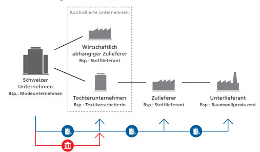
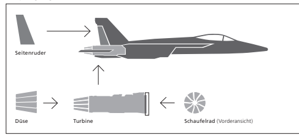
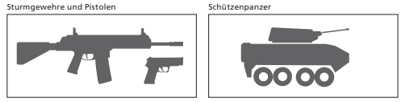
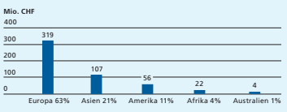

Im Detail Volksinitiative 
«Für verantwortungsvolle Unternehmen - zum Schutz von Mensch und Umwelt»

| Argumente Initiativkomitee        | 14   |
|-----------------------------------|------|
| Argumente Bundesrat und Parlament | 16   |
| Abstimmungstext                   | 18   |

| Ausgangslage   |
|----------------|

| Sachen Menschenrechte und Umweltschutz weltweit intensi viert. Die Schweiz beteiligt sich an der Diskussion, hat an der  Erarbeitung von international einheitlichen Standards mitge wirkt und erwartet, dass Schweizer Unternehmen diese  Standards auch im Ausland einhalten. Sie hat zwei nationale  Aktionspläne erarbeitet und eine Schlichtungsstelle eingerich tet. Den Initiantinnen und Initianten gehen die bisherigen  Massnahmen aber zu wenig weit. Sie fordern verbindlichere  Regeln und wollen, dass Schweizer Unternehmen neu auch für  Schäden haften, die die von ihnen kontrollierten Unternehmen  verursachen. Deshalb reichten sie im Oktober 2016 die Initia tive «Für verantwortungsvolle Unternehmen - zum Schutz  von Mensch und Umwelt», die sogenannte Konzernverantwor tungsinitiative, ein. - - - - -   |
|---------------------------------------------------------------------------------------------------------------------------------------------------------------------------------------------------------------------------------------------------------------------------------------------------------------------------------------------------------------------------------------------------------------------------------------------------------------------------------------------------------------------------------------------------------------------------------------------------------------------------------------------------------------------------------------------------------------------------------------------------------------------------------------------------------------------------------------|

| Die Initiative verlangt, dass Schweizer Unternehmen die                                                                                                                                                    |
|------------------------------------------------------------------------------------------------------------------------------------------------------------------------------------------------------------|
| international anerkannten Menschenrechte und Umweltstan dards auch im Ausland einhalten. Zu diesem Zweck müssen sie  regelmässig eine Sorgfaltsprüfung vornehmen. Diese umfasst  die folgenden Pfichten: - |

- Die Geschäftstätigkeit im Ausland muss auf die Einhal tung der international anerkannten Menschenrechte und Umweltstandards hin überprüft werden; dabei sind die tatsächlichen, aber auch die potenziellen Auswirkungen zu identifzieren. 

-
- Negative Auswirkungen müssen verhindert und beste hende Verletzungen mit entsprechenden Massnahmen beendet werden. 

-
- Es muss regelmässig über die Einhaltung der Standards und über allfällig getroffene Massnahmen Bericht erstattet werden.

| Forderungen der  Initiative: Sorgfaltsprüfung   |
|-------------------------------------------------|

| Die Sorgfaltsprüfung umfasst die gesamte Geschäftstätig                                                                                                                                                                                                                                                                                                                                                                                                                                                                                                                                                                                                                                                                                                                                                                                                                                                                                                                                                                                                                                                    |
|------------------------------------------------------------------------------------------------------------------------------------------------------------------------------------------------------------------------------------------------------------------------------------------------------------------------------------------------------------------------------------------------------------------------------------------------------------------------------------------------------------------------------------------------------------------------------------------------------------------------------------------------------------------------------------------------------------------------------------------------------------------------------------------------------------------------------------------------------------------------------------------------------------------------------------------------------------------------------------------------------------------------------------------------------------------------------------------------------------|
| keit eines Schweizer Unternehmens im Ausland - also auch die  Tätigkeit seiner Tochterunternehmen, Zulieferer und Geschäfts partner. Je grösser das Risiko von Schäden an Mensch und Um welt ist, desto umfangreicher muss die Sorgfaltsprüfung sein. - - -  Die Initiative will zudem, dass Schweizer Unternehmen  künftig nicht nur für eigenes Fehlverhalten haften, sondern  neu auch für das Fehlverhalten von kontrollierten Unterneh men (insbesondere Tochterunternehmen und wirtschaftlich   abhängige Zulieferer), obschon diese rechtlich eigenständig  sind. Schweizer Unternehmen können dabei auch für Schäden  verklagt werden, die ein von ihnen kontrolliertes Unternehmen  im Ausland verursacht. Kommt es zu einer Klage, so wird  gemäss Initiative der Schadensfall von einem Schweizer Gericht  nach Schweizer Recht beurteilt. Das Schweizer Unternehmen  haftet dann nicht, wenn es beweist, dass es alle Sorgfalts prüfungspfichten wahrgenommen hat. Heute haften Unter nehmen nur für selbst verursachte Schäden und in der Regel  nach dem Recht des betroffenen Landes. - - - |

Haftung Kern der Volksinitiative Pfichten und Haftung von Schweizer Unternehmen

 Pfichten: Sorgfaltsprüfung in Bezug auf kontrollierte Unternehmen und sämtliche weiteren Geschäftsbeziehungen Haftung: für kontrollierte Unternehmen, wenn Pfichten nicht eingehalten wurden Internationaler Vergleich Die neuen Haftungsregeln wären in dieser Form interna tional einmalig. Viele andere Staaten kennen zwar eine Berichterstattungspficht in Bezug auf Menschenrechte und Umweltschutz, einzelne gehen weiter und sehen auch beson dere Sorgfaltspfichten beispielsweise zur Bekämpfung von Kinderarbeit vor. Allerdings kennt kein anderer Staat eine explizite Haftung für ausländische Tochterunternehmen, so wie die Initiative sie fordert.

-
-
Folgen der Initiative Die Initiative betrifft grundsätzlich sämtliche Schweizer Unternehmen. Einzig auf kleinere und mittlere Unternehmen (KMU), die in den Bereichen Menschenrechte und Umwelt geringe Risiken aufweisen, soll bei der Umsetzung Rücksicht genommen werden. Wie viele das sind, lässt sich zum jetzigen Zeitpunkt nicht abschätzen; daher ist auch unklar, wie viele Schweizer Unternehmen von den Folgen der Initiative betrof fen wären. Die betroffenen Unternehmen hätten zusätzliche Kosten und Haftungsrisiken zu tragen.

-

## Indirekter Gegenvorschlag Als Alternative

| Gegenvorschlag verabschiedet, den auch der Bundesrat unterstützt.  Der Gegenvorschlag nimmt das Anliegen der Initiative auf und führt  ebenfalls neue Pfichten zur Berichterstattung und Sorgfaltsprüfung  ein. Im Gegensatz zur Initiative ist die Regulierung jedoch internatio nal abgestimmt. Grosse Schweizer Unternehmen würden gesetzlich  verpfichtet, über die Risiken ihrer ausländischen Geschäftstätigkeit  für Mensch und Umwelt, über Korruption und über die dagegen  ergriffenen Massnahmen Bericht zu erstatten und damit Transparenz  zu schaffen. In den sensiblen Bereichen der Kinderarbeit und der  Konfiktmineralien müssten grundsätzlich alle Unternehmen besonde re und weitgehende Sorgfaltsprüfungspfichten einhalten. Anders als  die Initiative verzichtet der indirekte Gegenvorschlag auf zusätzliche  Haftungsregeln. Tochterunternehmen und wirtschaftlich abhängige  Zulieferer würden für Schäden, die sie verursachen, weiterhin selber  und in der Regel vor Ort nach dem dort geltenden Recht haften.  Hingegen sieht der Gegenvorschlag eine Strafbestimmung vor: Wer  gegen die neuen Berichterstattungspfichten verstösst, wird mit einer  Busse von bis zu 100 000 Franken bestraft. Der indirekte Gegenvor schlag tritt nur in Kraft, wenn die Initiative abgelehnt wird und kein  Referendum gegen ihn zustande kommt. Sollte ein Referendum  zustande kommen, so würde der Gegenvorschlag dem Stimmvolk zur  Abstimmung vorgelegt. - - -   |
|------------------------------------------------------------------------------------------------------------------------------------------------------------------------------------------------------------------------------------------------------------------------------------------------------------------------------------------------------------------------------------------------------------------------------------------------------------------------------------------------------------------------------------------------------------------------------------------------------------------------------------------------------------------------------------------------------------------------------------------------------------------------------------------------------------------------------------------------------------------------------------------------------------------------------------------------------------------------------------------------------------------------------------------------------------------------------------------------------------------------------------------------------------------------------------------------------------------------------------------------------------------------------------------------------------------------------------------------------------------------------------------------------------------------------------------------------------------------------------------|

13

Argumente Initiativkomitee

| Die Konzernverantwortungsinitiative fordert, dass sich  Grosskonzerne mit Sitz in der Schweiz an Menschenrechte  und internationale Umweltstandards halten. Wer weltweit  Geschäfte tätigt, muss auch Verantwortung übernehmen.  Konzerne, die auf Kinderarbeit setzen oder Flüsse vergif - ten, sollen dafür geradestehen.                                                                                                                                                                                                                                                                                                  |                                                          |
|------------------------------------------------------------------------------------------------------------------------------------------------------------------------------------------------------------------------------------------------------------------------------------------------------------------------------------------------------------------------------------------------------------------------------------------------------------------------------------------------------------------------------------------------------------------------------------------------------------------------------|----------------------------------------------------------|
| Worum geht es?                                                                                                                                                                                                                                                                                                                                                                                                                                                                                                                                                                                                               | Glencore vergiftet Flüsse und vertreibt indigene Bäuerin |
| nen. Syngenta verkauft toxische Pestizide, die bei uns schon  lange verboten sind. Und Schweizer Goldraffnerien verarbei ten Rohgold aus Kinderarbeit. Gerade in armen Ländern gibt  es oft keinen funktionierenden Rechtsstaat und die Menschen  haben kaum Möglichkeiten, sich zu wehren. - -                                                                                                                                                                                                                                                                                                                              |                                                          |
| Für Schäden  geradestehen                                                                                                                                                                                                                                                                                                                                                                                                                                                                                                                                                                                                    | Konzerne sollen für Menschenrechtsverletzungen und       |
| Umweltzerstörung geradestehen. Betroffene erhalten deshalb  neu die Möglichkeit, in der Schweiz auf Schadenersatz zu  klagen. Dabei müssen sie beweisen, dass der Konzern für den  Missstand verantwortlich ist. Wenn die Schweizer Konzernzen trale angemessene Schritte ergriffen hat, um den Schaden zu  verhindern, wird die Klage abgewiesen. Die Initiative wird  nicht dazu führen, dass sich Konzerne aus heiklen Ländern  zurückziehen. Auch Rohstoffkonzerne können so geschäften,  dass sie keine Menschenrechte verletzen oder die Umwelt  zerstören. Wer anständig wirtschaftet, hat nichts zu befürch ten. - - |                                                          |
| Wirkungsloser  Gegenvorschlag                                                                                                                                                                                                                                                                                                                                                                                                                                                                                                                                                                                                | Auch der Bundesrat anerkennt den Handlungsbedarf. Der    |
| Gegenvorschlag ist jedoch eine reine Alibi-Übung. Konzerne  sollen bloss Hochglanzbroschüren veröffentlichen. Menschen rechtsverletzungen und Umweltschäden bleiben ohne Konse quenzen. - -                                                                                                                                                                                                                                                                                                                                                                                                                                  |                                                          |

| KMU nicht   betroffen                                                                                                                                                                                                                                                                                                                                                                                                                                                                                                                                   | Die Schweizer Bevölkerung hat wenig Verständnis für   |
|---------------------------------------------------------------------------------------------------------------------------------------------------------------------------------------------------------------------------------------------------------------------------------------------------------------------------------------------------------------------------------------------------------------------------------------------------------------------------------------------------------------------------------------------------------|-------------------------------------------------------|
| skrupellose Grosskonzerne. Die Gegner/innen der Initiative  setzen deshalb auf ein Ablenkungsmanöver. Sie behaupten,  dass Schweizer KMU betroffen seien. Das ist falsch. Kaum ein  KMU besitzt Tochtergesellschaften oder kontrolliert Unterneh men im Ausland. Deshalb sieht die Initiative vor, dass KMU  ausgenommen werden, wenn sie nicht in Hochrisiko-Bereichen  wie Diamanten- oder Goldhandel tätig sind. Die Initiative  richtet sich gegen die Verantwortungslosigkeit von internatio nalen Grosskonzernen wie Glencore oder Syngenta.  - - |                                                       |
| Wirtschaft und  Politik sagen JA                                                                                                                                                                                                                                                                                                                                                                                                                                                                                                                        | Für die allermeisten Schweizer Unternehmen ist die    |
| Einhaltung von Menschenrechten eine Selbstverständlichkeit.  Rücksichtslosigkeit darf kein Wettbewerbsvorteil sein. Deshalb  unterstützen zahlreiche Unternehmer/innen die Initiative.  Neben 130 Menschenrechts-, Umwelt- und Entwicklungsorga nisationen engagieren sich zudem Hunderte Politiker/innen  aus allen Parteien (SVP, FDP, CVP, BDP, GLP, EVP, SP, Grüne)  gemeinsam für ein JA.  -                                                                                                                                                       |                                                       |
| Empfehlung des  Initiativkomitees                                                                                                                                                                                                                                                                                                                                                                                                                                                                                                                       | Darum empfehlt das Initiativkomitee: Ja               |

 konzern-initiative.ch buergerliches-komitee.ch Der Text auf dieser Doppelseite stammt vom Initiativkomitee. Es ist für den Inhalt und die Wortwahl verantwortlich.

# Argumente Bundesrat Und Parlament

| International tätige Schweizer Unternehmen leisten einen  wichtigen Beitrag zur wirtschaftlichen Entwicklung im  In- und Ausland. Dabei haben sie die Menschenrechte und Umweltschutzvorschriften zu respektieren. Anders als die  Initiative wollen Bundesrat und Parlament dies mit einem  international koordinierten Vorgehen sicherstellen. Ein  Alleingang wäre schädlich, kontraproduktiv und nicht  zielführend. Bundesrat und Parlament lehnen die Initiative  insbesondere aus folgenden Gründen ab:                                                                                                                         |                                                       |
|----------------------------------------------------------------------------------------------------------------------------------------------------------------------------------------------------------------------------------------------------------------------------------------------------------------------------------------------------------------------------------------------------------------------------------------------------------------------------------------------------------------------------------------------------------------------------------------------------------------------------------------|-------------------------------------------------------|
| Schädlich für die  Wirtschaft                                                                                                                                                                                                                                                                                                                                                                                                                                                                                                                                                                                                          | Kein Land kennt derart weitgehende Haftungsregeln für |
| seine Unternehmen, wie sie die Initiative verlangt. Die Initiati ve setzt alle Schweizer Unternehmen einem Generalverdacht  und einem erhöhten Klagerisiko aus und schwächt damit den  Wirtschaftsstandort Schweiz. Unternehmen können die neue  Regulierung zudem umgehen, indem sie die Schweiz verlassen.  Damit gefährdet die Initiative Arbeitsplätze und Wohlstand in  der Schweiz. Anders der indirekte Gegenvorschlag: Auch er  führt neue Transparenz- und Sorgfaltsprüfungspfichten ein,  orientiert sich aber an internationalen Standards.  -                                                                              |                                                       |
| Kontraproduktive Auswirkungen                                                                                                                                                                                                                                                                                                                                                                                                                                                                                                                                                                                                          | Schweizer Unternehmen leisten einen wichtigen Beitrag |
| zur wirtschaftlichen Entwicklung in Schwellen- und Entwick lungsländern. Sie investieren in die Infrastruktur und schaffen  Arbeitsplätze. Die grosse Mehrheit der Unternehmen verhält  sich dabei verantwortungsvoll gegenüber Mensch und Um welt. Trotzdem sind sie in einer vernetzten Welt zunehmend  Reputationsrisiken ausgesetzt. Mit der Initiative kämen noch  neue Haftungsrisiken dazu. Reduzieren die Unternehmen in  der Folge ihre Geschäfts- und Investitionstätigkeit, so entzieht  dies den betroffenen Ländern wichtige Ressourcen, ohne dass  die dortige Menschenrechts- und Umweltsituation verbessert  wird. - - |                                                       |

| Ausländische Fälle  vor Schweizer  Gerichten                                                                                                                                                                                                                                                                                                                                                                                                                                         | Künftig müssten Schweizer Unternehmen auch für Fehl    |
|--------------------------------------------------------------------------------------------------------------------------------------------------------------------------------------------------------------------------------------------------------------------------------------------------------------------------------------------------------------------------------------------------------------------------------------------------------------------------------------|--------------------------------------------------------|
| verhalten von anderen Unternehmen haften. Schweizer  Richterinnen und Richter müssten folglich auch komplexe  Schadensfälle beurteilen, die ein ausländisches Unternehmen  im Ausland verursacht hat. Und sie müssten dabei nach  Schweizer Recht richten. Dies würde nicht nur unser Rechts system überfordern. Die Schweiz würde auch mit anerkannten  internationalen Rechtsgrundsätzen brechen, wenn sie solche  Schadensfälle explizit unter Schweizer Recht stellt. -  -       |                                                        |
| Vorzüge des  indirekten   Gegenvorschlags                                                                                                                                                                                                                                                                                                                                                                                                                                            | Wie die Initiative will auch der Gegenvorschlag Mensch |
| und Umwelt noch besser schützen. Allerdings verzichtet er auf  die schädlichen Elemente der Initiative und auf einen Allein gang der Schweiz. Er setzt auf die bestehenden Haftungsregeln, wonach jedes Unternehmen für eigene Schäden selber und  grundsätzlich nach dem Recht vor Ort haftet, sowie auf Trans parenz und neue Sorgfaltsprüfungspfichten. Für Unternehmen, die die neuen Vorschriften missachten, sieht der Gegenvor schlag zudem eine Strafbestimmung vor. -  -  - |                                                        |
| Empfehlung von  Bundesrat und  Parlament                                                                                                                                                                                                                                                                                                                                                                                                                                             | Aus all diesen Gründen empfehlen Bundesrat und Parla   |
| ment, die Volksinitiative «Für verantwortungsvolle Unterneh men - zum Schutz von Mensch und Umwelt» abzulehnen. -  -                                                                                                                                                                                                                                                                                                                                                                 |                                                        |

## Nein

admin.ch/verantwortungsvolle-unternehmen Im Detail Volksinitiative «Für ein Verbot der Finanzierung von Kriegsmaterialproduzenten»

| Argumente Initiativkomitee        | 26   |
|-----------------------------------|------|
| Argumente Bundesrat und Parlament | 28   |
| Abstimmungstext                   | 30   |

| Bestehendes  Finanzierungs - verbot                                                                                                                                                                                                                                                                                                                                                                                                                                                                                                                                                                                                                                                     | In der Schweiz ist die Herstellung von Atomwaffen,      |
|-----------------------------------------------------------------------------------------------------------------------------------------------------------------------------------------------------------------------------------------------------------------------------------------------------------------------------------------------------------------------------------------------------------------------------------------------------------------------------------------------------------------------------------------------------------------------------------------------------------------------------------------------------------------------------------------|---------------------------------------------------------|
| biologischen und chemischen Waffen sowie von Personenmi nen und Streumunition verboten. Auch der Handel mit diesen  international geächteten Waffen und die Finanzierung ihrer  Produktion sind verboten. Dieses Finanzierungsverbot hat das  Parlament aber gezielt so ausgestaltet, dass Institutionen wie  Banken, Pensionskassen oder die AHV/IV in international  etablierte Aktienfonds investieren können. In diesen Fonds  sind teilweise Aktien von Unternehmen enthalten, die neben  zivilen Gütern auch Atomwaffen oder Teile davon produzieren.  Beispiele für solche Unternehmen sind Airbus oder Boeing, die  in erster Linie für ihre Passagierfugzeuge bekannt sind.  - |                                                         |
| Initiative will  weitergehendes  Verbot                                                                                                                                                                                                                                                                                                                                                                                                                                                                                                                                                                                                                                                 | Das Initiativkomitee will in zwei Punkten weiter gehen. |
| Zum einen soll das Finanzierungsverbot nicht nur für die  Produzenten von international geächteten Waffen gelten,  sondern für die Produzenten aller Arten von Kriegsmaterial  weltweit. Damit wären beispielsweise auch Produzenten von  Panzern, Flugabwehrsystemen, Pistolen und einzelnen Be standteilen davon betroffen. Zum anderen soll auch der Besitz  von Aktien von Kriegsmaterialproduzenten sowie von Anteilen  an Fonds, die solche Aktien enthalten, verboten werden. Als  Kriegsmaterialproduzenten würden gemäss der Initiative  Unternehmen gelten, die mehr als fünf Prozent ihres Jahresumsatzes mit der Herstellung von Kriegsmaterial erwirtschaf ten. Das heisst auch Unternehmen, die neben Kriegsmaterial  zivile Produkte herstellen. Wie viele Unternehmen betroffen  wären, ist kaum abschätzbar. Das müsste nach einer Annahme  der Initiative relativ aufwendig im Einzelfall geprüft werden.  Ein Unternehmen, das betroffen sein dürfte, ist beispielsweise  Rolls-Royce. Es fertigt unter anderem Triebwerke für zivile und  militärische Flugzeuge. Seine Verteidigungssparte macht etwa  20 Prozent des Umsatzes aus.1  In Rolls-Royce selbst und in alle  Fonds, die Rolls-Royce-Aktien enthalten, dürfte nicht mehr  investiert werden. Es ist kein Land bekannt, das ein derart weit  reichendes Finanzierungsverbot hat, wie es die Initiative ein führen möchte. - - -                                                                                                                                                                                                                                                                                                                                                                                                                                                                                                                                                                                                                                                                                         |                                                         |

1 2019 Annual Report Rolls-Royce Holdings plc, S. 2 
( rolls-royce.com/ > Investors > Annual Report 2019)

| produktion gedrosselt werden. Dies soll dazu führen, dass es  zu weniger Kriegen kommt und deshalb weniger Menschen  füchten.                                                                                                                                                                                                                                                                                                                                                                                                                                                                                                                             |                                                         |
|-----------------------------------------------------------------------------------------------------------------------------------------------------------------------------------------------------------------------------------------------------------------------------------------------------------------------------------------------------------------------------------------------------------------------------------------------------------------------------------------------------------------------------------------------------------------------------------------------------------------------------------------------------------|---------------------------------------------------------|
| Wer in der Schweiz  vom Verbot  betroffen wäre Nationalbank,  Stiftungen, Alters - vorsorge                                                                                                                                                                                                                                                                                                                                                                                                                                                                                                                                                               | Von der Initiative betroffen wären die Schweizerische   |
| Nationalbank (SNB), die Schweizer Stiftungen, die AHV/IV  sowie die 15622  Schweizer Pensionskassen. Ihnen soll die  Finanzierung von Kriegsmaterialproduzenten untersagt  werden. Per Ende 2019 verwaltete die SNB Aktiven in der Höhe  von 861 Milliarden Franken3. Die Pensionskassen verwalteten  per Ende 2018 rund 876 Milliarden Franken4  und die AHV/IV  etwa 34,6 Milliarden5. Wie viel dieser Gelder zum Beispiel über  Aktienfonds in die Finanzierung von Kriegsmaterialproduzen ten fiesst, ist nicht bekannt. Bei Annahme der Initiative  müssten die betroffenen institutionellen Anleger solche  Anlagen innert vier Jahren abstossen. - |                                                         |
| Banken und   Versicherungen                                                                                                                                                                                                                                                                                                                                                                                                                                                                                                                                                                                                                               | Die Initiative schreibt dem Bund vor, sich national und |
| international dafür einzusetzen, dass ein ebenso strenges  Finanzierungsverbot für Banken und Versicherungen gilt.  Welche Auswirkungen dies für die Banken und Versicherungen  in der Schweiz hätte, hängt von der Umsetzung der Initiative  ab. Würde die Schweiz das Finanzierungsverbot im Alleingang  einführen, hätte dies für die Schweizer Banken grosse Auswir kungen. Im Gegensatz zur internationalen Konkurrenz dürften  sie ihren Kundinnen und Kunden gewisse international  etablierte Aktienfonds und ähnliche Finanzprodukte nicht  mehr anbieten. Möglich wäre aber auch eine weniger weit  reichende Umsetzung. -                      |                                                         |

-
-
2 bfs.admin.ch > Statistiken fnden > Soziale Sicherheit > Berufiche Vorsorge > Vorsorgeeinrichtungen und aktive Versicherte 3 Geschäftsbericht Schweizerische Nationalbank, S. 164 ( snb.ch > 
Publikationen > Geschäftsbericht > Geschäftsbericht 2019)
4 bfs.admin.ch > Statistiken fnden > Soziale Sicherheit > Berufiche Vorsorge > Bilanz und Betriebsrechnung 5 Compenswiss Ausgleichsfonds AHV/IV/EO Jahresbericht 2018, S. 66 
( compenswiss.ch/de/ > Portrait > Jahresberichte > Jahr 2018 > Jahresbericht AHV IV EO compenswiss 2018.pdf)
Ziel der Initiative

| KMU als Zulieferer                                                                                                                                                                                                                                                                                                                                                                                                                                                                                                                                                                                                                                                                                                                                                                                                                                                                                                                                                                      | Vom Verbot für Banken und Versicherungen wären in der    |
|-----------------------------------------------------------------------------------------------------------------------------------------------------------------------------------------------------------------------------------------------------------------------------------------------------------------------------------------------------------------------------------------------------------------------------------------------------------------------------------------------------------------------------------------------------------------------------------------------------------------------------------------------------------------------------------------------------------------------------------------------------------------------------------------------------------------------------------------------------------------------------------------------------------------------------------------------------------------------------------------|----------------------------------------------------------|
| Schweiz bekannte Rüstungsunternehmen wie die RUAG, die  Rheinmetall Air Defence AG oder die GDELS-Mowag GmbH  betroffen. Diese international ausgerichteten Unternehmen  dürften jedoch kaum Probleme haben, Gelder auf dem  internationalen Finanzmarkt aufzunehmen. Mitbetroffen  wären aber auch zahlreiche Zulieferbetriebe. Oft sind dies  KMU aus der Maschinen-, Elektro- und Metallindustrie, die  neben zivilen Gütern auch Bestandteile von Kriegsmaterial  herstellen oder weiterverarbeiten. So zählen zwei der grossen  Schweizer Rüstungsunternehmen gemäss eigenen Angaben  rund 3000 Zulieferbetriebe, die je nach Jahresumsatz als  Kriegsmaterialproduzenten gelten würden. Abhängig von  ihrem Umsatz mit Kriegsmaterial und der konkreten Umset zung der Initiative könnten diese Schweizer Rüstungsunterneh men und Zulieferbetriebe keine Kredite mehr von einer  Schweizer Bank erhalten. Es gibt keine Zahlen dazu, wie viele  Unternehmen betroffen wären. - - |                                                          |
| Auswirkung  für ausländische  Produzenten                                                                                                                                                                                                                                                                                                                                                                                                                                                                                                                                                                                                                                                                                                                                                                                                                                                                                                                                               | Wie viele Mittel aus der Schweiz in die weltweite Produk |
| tion von Kriegsmaterial fiessen, ist nicht bekannt. Investitionen der institutionellen Anleger dürften für die einzelnen auslän dischen Unternehmen aber nur eine geringe Bedeutung haben. So hält die SNB in der Regel nur 0,4 Prozent der Anteile eines  Unternehmens, unabhängig vom Sektor.  -  -                                                                                                                                                                                                                                                                                                                                                                                                                                                                                                                                                                                                                                                                                   |                                                          |

Beispiele für von der Initiative betroffenes Kriegsmaterial Kampffugzeug und Bestandteile

Heute gilt ein Finanzierungsverbot für international geächtete Waffen, beispielsweise Atomwaffen. Neu dürfte auch dann kein Geld in ein Unternehmen investiert werden, wenn dieses mehr als fünf Prozent seines Jahresumsatzes mit der Herstellung von herkömmlichen Waffen und deren Bestand teilen erzielt.

-

## Die Schweiz Als Kriegsmaterialexporteurin

Bei der vorliegenden Initiative geht es um ein Verbot von Investitionen in Kriegsmaterialproduzenten im In- und Ausland. Da Schweizer Unternehmen vom Finanzierungsverbot wohl am stärksten betroffen wären, soll an dieser Stelle ein Blick auf die Schweizer Rüstungsindust rie und die Schweizer Exporte von Kriegsmaterial geworfen werden. Der weltweite Marktanteil der Schweiz betrug von 2015 bis 2019 in diesem Bereich durchschnittlich knapp ein Prozent.6
-

Durchschnittswert der jährlichen Ausfuhren 2015 - 2019 nach Kontinent7 Grösster Abnehmer von Schweizer Kriegsmaterial ist Europa Die Bestimmungsländer müssen sich gegenüber der Schweiz verpfich ten, das erhaltene Kriegsmaterial nicht weiterzugeben. Als eines von wenigen Ländern kontrolliert die Schweiz im Ausland, ob diese Verpfichtung tatsächlich eingehalten wird.

-
6 SIPRI Arms Transfers Database ( sipri.org > databases > SIPRI Arms Transfers Database > Top list TIV tables)
7 Ausfuhren von Kriegsmaterial nach Kategorie pro Endempfängerstaat 2015 bis 2019 ( seco.admin.ch > Aussenwirtschaft & 
Wirtschaftliche Zusammenarbeit > Wirtschaftsbeziehungen > Exportkontrollen und Sanktionen > Rüstungskontrolle und Rüstungskontrollpolitik > Zahlen und Statistiken > Zahlen und Statistiken 2015/2016/2017/2018/2019 > Ausfuhren von Kriegsmate rial nach Kategorie pro Endempfängerstaat (jeweiliges Jahr))
-

## Argumente Initiativkomitee

| Der Bundesrat hat sich mit seinem Bericht «Nachhaltigkeit  im Finanzsektor Schweiz» vom Juni 2020 zum Ziel gesetzt,  die Schweiz zum führenden Standort für nachhaltige  Finanzdienstleistungen zu machen. Die Kriegsgeschäfte Initiative will, dass dabei nebst den ökologischen auch  soziale Kriterien berücksichtigt werden, und verlangt, dass  Investitionen in internationale Kriegsmaterialproduzenten,  die beispielsweise Atomwaffen, Panzer oder Kleinwaffen  herstellen, verboten werden. -                                                                                                                                                                                                                                                                                                                                                              |                                                       |
|----------------------------------------------------------------------------------------------------------------------------------------------------------------------------------------------------------------------------------------------------------------------------------------------------------------------------------------------------------------------------------------------------------------------------------------------------------------------------------------------------------------------------------------------------------------------------------------------------------------------------------------------------------------------------------------------------------------------------------------------------------------------------------------------------------------------------------------------------------------------|-------------------------------------------------------|
| Für eine  sichere Welt                                                                                                                                                                                                                                                                                                                                                                                                                                                                                                                                                                                                                                                                                                                                                                                                                                               | Kriege und bewaffnete Konfikte wüten in verschiedenen |
| Regionen der Welt. Millionen von Menschen leiden darunter,  werden getötet und vertrieben. Ganze Regionen werden  destabilisiert. Seit jeher versucht die Schweiz, zur friedlichen  Lösung dieser Konfikte beizutragen, indem sie sich beispiels weise für eine bessere Regulierung des Waffenhandels ein setzt. Mit der Finanzierung von Kriegsmaterialproduzenten  hingegen untergräbt die Schweiz ihre eigenen Anstrengungen:  Jährlich fiessen Milliarden von Franken aus Schweizer Finanz instituten wie der Schweizerischen Nationalbank oder den  Pensionskassen in die internationale Rüstungsindustrie und  fnanzieren so die Produktion von Waffen, die auf der ganzen  Welt gegen Menschen eingesetzt werden. Die Kriegsgeschäfte Initiative will dem ein Ende bereiten und den Finanzsektor in  nachhaltige und ethisch vertretbare Wege leiten. - - - - |                                                       |
| Für mehr   Transparenz                                                                                                                                                                                                                                                                                                                                                                                                                                                                                                                                                                                                                                                                                                                                                                                                                                               | Ein besonderes Problem ist, dass die Bevölkerung der  |
| Schweiz kein Mitspracherecht hat, wenn es um das Staatsver mögen oder das eigene Vorsorgevermögen geht. Mit der  Kriegsgeschäfte-Initiative kann verhindert werden, dass unser  Geld in Rüstungskonzerne im Ausland fiesst. So erhöht die  Initiative auch die Transparenz auf dem Schweizer Finanz markt. - -                                                                                                                                                                                                                                                                                                                                                                                                                                                                                                                                                       |                                                       |

| Bessere Rendite   |
|-------------------|

| Bereits heute gibt es in der Schweiz einige Finanzakteure,                                                                                                                                                                                                                                                                                                                                                                                                                                                                                                                                                                                                                                               |
|----------------------------------------------------------------------------------------------------------------------------------------------------------------------------------------------------------------------------------------------------------------------------------------------------------------------------------------------------------------------------------------------------------------------------------------------------------------------------------------------------------------------------------------------------------------------------------------------------------------------------------------------------------------------------------------------------------|
| die Investitionen in Rüstungsunternehmen ausschliessen:  Verschiedene Pensionskassen investieren ihr Geld nicht in die  Rüstungsindustrie und können trotzdem eine marktgerechte  Rendite erzielen. So beispielsweise jene der Stadt Zürich, eine  der 300 grössten Pensionskassen der Welt: Seit November 2016  werden Atomwaffen- und Streumunitionsproduzenten  konsequent aus dem Portfolio ausgeschlossen. Wer in nachhal tige Anlageprodukte investiert, kann oft sogar mit einer  besseren Rendite rechnen: Hätten die Schweizer Pensionskas sen vor einem Jahr einzig in nachhaltige Anlagen investiert,  könnte unser Pensionskassenvermögen im Durchschnitt pro  Kopf 1000 CHF höher sein. - - |

Empfehlung des Initiativkomitees Darum empfehlt das Initiativkomitee:

| Ja   |
|------|

kriegsgeschaefte.ch Der Text auf dieser Doppelseite stammt vom Initiativkomitee. Es ist für den Inhalt und die Wortwahl verantwortlich.

# Argumente Bundesrat Und Parlament

| Eine friedlichere Welt liegt im Interesse der Schweiz. Mit  der Initiative lässt sich dieses Ziel jedoch nicht erreichen.  Sie würde den Finanz- und Wirtschaftsstandort Schweiz  benachteiligen. Das hätte negative Auswirkungen auf   zahlreiche Unternehmen und auf unsere Altersvorsorge.  Bundesrat und Parlament lehnen die Initiative insbe - sondere aus den folgenden Gründen ab:     |                                                            |
|------------------------------------------------------------------------------------------------------------------------------------------------------------------------------------------------------------------------------------------------------------------------------------------------------------------------------------------------------------------------------------------------|------------------------------------------------------------|
| Gute Lösung  vorhanden                                                                                                                                                                                                                                                                                                                                                                         | Das Kriegsmaterialgesetz verbietet bereits heute die       |
| Finanzierung von Atomwaffen, biologischen und chemischen  Waffen sowie von Personenminen und Streumunition. Die  geltende Regelung gewährt unseren Vorsorgewerken und dem  Finanzplatz Schweiz aber den nötigen Handlungsspielraum,  damit die verwalteten Vermögen breit diversifziert und mit  geringem Anlagerisiko in international etablierte Finanzpro - dukte investiert werden können. |                                                            |
| Die Initiative  kann ihr Ziel  nicht erreichen                                                                                                                                                                                                                                                                                                                                                 | Die Initiative will ein weltweites Verbot der Finanzierung |
| von Kriegsmaterialproduzenten. Das ist nicht realistisch. Die  Schweiz kann andere Länder nicht zu einem solchen Verbot  zwingen. Die Initiative würde daher nur den Schweizer Finanz - platz und Teile der hiesigen Industrie treffen.                                                                                                                                                        |                                                            |
| Gefährdung der  Renten und des  Finanzplatzes                                                                                                                                                                                                                                                                                                                                                  | Eine Annahme der Initiative würde die Investitionsmög      |
| lichkeiten der Pensionskassen und der AHV/IV stark einschrän ken. Günstige Anlagen wären zum Teil verboten, und bei  einigen wäre unklar, ob in sie investiert werden dürfte. Dies  könnte sich negativ auf die Altersrenten auswirken. Die  Einschränkung der Investitionsfreiheit von Banken und Versi cherungen würde zudem den Schweizer Finanzplatz schwä chen. - - - -                   |                                                            |

| Negative   Auswirkungen auf Industrie                                                                                                                                                                                                                                                                                                                                                                                                                                                                                                                                                       | Nicht nur grosse Rüstungsunternehmen wären betroffen.   |
|---------------------------------------------------------------------------------------------------------------------------------------------------------------------------------------------------------------------------------------------------------------------------------------------------------------------------------------------------------------------------------------------------------------------------------------------------------------------------------------------------------------------------------------------------------------------------------------------|---------------------------------------------------------|
| Bei einer Umsetzung des Finanzierungsverbots für Schweizer  Banken dürften auch Schweizer KMU keine Kredite mehr von  ihrer Hausbank erhalten, wenn sie gemäss den strengen  Kriterien der Initiative als Kriegsmaterialproduzenten gelten  würden. Wird den KMU der Zugang zu Krediten erschwert, so  können sie weniger investieren. Dadurch verlieren sie an  Wettbewerbsfähigkeit. Im Extremfall gehen Knowhow und  Arbeitsplätze verloren. Eine hochtechnologische Industrie ist  wichtig für den Wohlstand der Schweiz. Zudem verringert sie  die Abhängigkeit der Armee vom Ausland. |                                                         |
| Verantwortungs bewusste Aussen und Sicherheits politik - -  -                                                                                                                                                                                                                                                                                                                                                                                                                                                                                                                               | Die Schweiz ist sich ihrer Verantwortung bewusst. Als   |
| Brückenbauerin fördert sie den Frieden zwischen Konfikt parteien. Der Bundesrat hat Verständnis für die Anliegen des  Initiativkomitees. Eine Annahme der Initiative bliebe aber  wirkungslos - weltweit würden nicht weniger Waffen produ ziert. Die Initiative würde daher nicht zu einer friedlicheren  Welt führen. Trotzdem müsste die Schweiz die wirtschaftlichen  Konsequenzen tragen, insbesondere bei der Altersvorsorge.  - -                                                                                                                                                    |                                                         |
| Empfehlung  von Bundesrat  und Parlament                                                                                                                                                                                                                                                                                                                                                                                                                                                                                                                                                    | Aus all diesen Gründen empfehlen Bundesrat und Parla    |
| ment, die Volksinitiative «Für ein Verbot der Finanzierung von  Kriegsmaterialproduzenten» abzulehnen. -                                                                                                                                                                                                                                                                                                                                                                                                                                                                                    |                                                         |

## Nein

admin.ch/fnanzierungsverbot