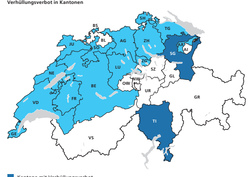
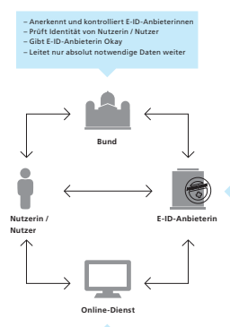
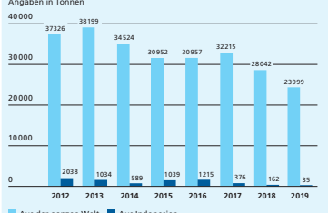

Im Detail Volksinitiative 
«Ja zum Verhüllungsverbot»

| Argumente Initiativkomitee        | 14   |
|-----------------------------------|------|
| Argumente Bundesrat und Parlament | 16   |
| Abstimmungstext                   | 18   |

Heute sind Kantone zuständig Heute gibt es kein schweizweites Gesichtsverhüllungsver bot. Der Bundesrat und das eidgenössische Parlament haben sich in den vergangenen Jahren immer gegen ein solches ausgesprochen. In der Schweiz ist es Aufgabe der Kantone, die Nutzung des öffentlichen Raums zu regeln. Sie können dabei auch das Tragen von Kleidungsstücken verbieten, die das Gesicht verhüllen (z. B. Burka, Niqab). Die Kantone Tessin und St. Gallen haben dies getan. Andere Kantone wie Zürich, Schwyz oder Glarus haben sich gegen ein Gesichtsverhüllungs verbot entschieden. In 15 Kantonen gilt bei Kundgebungen oder Sportanlässen ein Vermummungsverbot.

-
-

Kantone mit Verhüllungsverbot
Kantone mit Vermummungsverbot bei Kundgebungen und/oder Sportanlässen Kantone ohne eine spezifische Regelung

| Verhüllung kann  Folgen haben                                                                                                                                                                                                                                                                                                                                                                                        | Eine Verhüllung des Gesichts kann bereits heute Folgen    |
|----------------------------------------------------------------------------------------------------------------------------------------------------------------------------------------------------------------------------------------------------------------------------------------------------------------------------------------------------------------------------------------------------------------------|-----------------------------------------------------------|
| haben. Ist die Vollverschleierung Ausdruck mangelnder  Integration, können die Behörden die Erteilung der Aufent halts- und der Niederlassungsbewilligung wie auch die Einbür gerung verweigern. Ausserdem macht sich strafbar, wer eine  Person zwingt, ihr Gesicht zu verhüllen. Das ist nach schweize rischem Recht eine Nötigung. - - -                                                                          |                                                           |
| Initiative verlangt  schweizweites  Verbot                                                                                                                                                                                                                                                                                                                                                                           | Die Initiative verlangt ein Verbot der Gesichtsverhüllung |
| an allen Orten, die öffentlich zugänglich sind: auf der Strasse,  im öffentlichen Verkehr, in Amtsstellen, Fussballstadien,  Restaurants, Läden oder auch in der freien Natur. Zusätzlich  zum Straftatbestand der Nötigung will die Initiative in der  Verfassung verankern, dass niemand eine Person zwingen darf,  ihr Gesicht aufgrund ihres Geschlechts zu verhüllen.                                           |                                                           |
| Ausnahmen                                                                                                                                                                                                                                                                                                                                                                                                            | Die Initiative legt die Ausnahmen vom Gesichtsverhül      |
| lungsverbot abschliessend fest: Verhüllen darf man sich in  Gotteshäusern und an anderen Sakralstätten, wenn es der  Sicherheit oder der Gesundheit dient (z. B. Motorradhelm,  Hygienemaske), wegen des Wetters (z. B. Schal) oder wenn das  Verhüllen Bestandteil des einheimischen Brauchtums ist (z. B.  Fastnachtskostüm). Weitere Ausnahmen, etwa für verhüllte  Touristinnen, erlaubt die Initiative nicht. - |                                                           |

## Indirekter Gegenvorschlag

Bundesrat und Parlament haben einen indirekten Gegenvorschlag verabschiedet, weil ihnen die Initiative zu weit geht. Mit dem Gegenvorschlag wollen sie gezielt eine Lücke im Bundesrecht schliessen: Personen sollen Behörden ihr Gesicht zeigen müssen, wenn es für die Identifizierung notwendig ist. Dies gilt beispiels weise in Amtsstellen oder im öffentlichen Verkehr. Wer sich weigert, sein Gesicht zu enthüllen, wird mit Busse bestraft. Die Behörden können diesen Personen auch eine Leistung verwei gern. Mit dem Gegenvorschlag wollen Bundesrat und Parlament zudem die Rechte der Frauen stärken. Das geschieht mit punktuel len Gesetzesänderungen in den Bereichen Integration, Gleich stellung und Entwicklungszusammenarbeit. Diese Änderungen ermöglichen dem Bund, spezifische Förderprogramme zu unter stützen und dadurch zur Gleichstellung der Geschlechter beizu tragen. Der Gegenvorschlag tritt in Kraft, wenn die Initiative abgelehnt wird und er nicht mit einem Referendum erfolgreich bekämpft wird.

-
-
-
-
-
- 

## Argumente Initiativkomitee

| Unsere Initiative dreht sich um zentrale Fragen des Zusam menlebens: Wollen wir in der Schweiz Gesichtsverhüllung  zulassen, welche die Unterdrückung der Frau symbolisiert?  Lassen wir Chaoten gewähren, die ihr Gesicht verhüllen,  um andere zu attackieren? Wir sagen: Nein! Die Erfahrun gen aus dem Tessin und dem Ausland beweisen, dass sich  Verhüllungsverbote im öffentlichen Raum bestens bewährt  haben. Gerade viele arabische Touristinnen würden sich  freuen, sich bei uns ihrer «Stoffgefängnisse» entledigen zu  dürfen! - -   |                                                             |
|----------------------------------------------------------------------------------------------------------------------------------------------------------------------------------------------------------------------------------------------------------------------------------------------------------------------------------------------------------------------------------------------------------------------------------------------------------------------------------------------------------------------------------------------------|-------------------------------------------------------------|
| Freie Menschen  zeigen Gesicht                                                                                                                                                                                                                                                                                                                                                                                                                                                                                                                     | In aufgeklärten Staaten wie der Schweiz gilt: Freie         |
| Menschen - Frauen und Männer - blicken einander ins Gesicht,  wenn sie miteinander sprechen. Gesichtsverhüllung im öffentli chen Raum steht in Konflikt mit freiheitlichem Zusammenle ben: Unsere Werte werden mit Füssen getreten, wenn sich  Frauen in unserer Gesellschaft nicht mehr als Individuen zu  erkennen geben dürfen. - -                                                                                                                                                                                                             |                                                             |
| Gebot der Gleich - berechtigung                                                                                                                                                                                                                                                                                                                                                                                                                                                                                                                    | Dass Frauen ebenso wie Männer in der Öffentlichkeit         |
| jederzeit ihr ganzes Angesicht zeigen, ist ein Gebot elementa rer Gleichberechtigung. Auf der ganzen Welt kämpfen Frauen  für diese Freiheit und versuchen unter Inkaufnahme grosser  Opfer, dem Zwang zu Verhüllung und Unterwerfung zu ent fliehen. Ein Verhüllungsverbot spöttisch als «Kleidervorschrift»  abzutun, ist ein Hohn gegenüber allen Frauen, die unter den  Auswüchsen eines radikalen Islams leiden. - -                                                                                                                          |                                                             |
| Für Sicherheit  und Ordnung                                                                                                                                                                                                                                                                                                                                                                                                                                                                                                                        | Unsere Initiative richtet sich ausdrücklich auch gegen jene |
| Verhüllung, der kriminelle und zerstörerische Motive zugrunde  liegen. Ein landesweit gültiges Verhüllungsverbot schafft  Rechtssicherheit: Die Sicherheitsorgane erhalten Rückenwind  und den Auftrag, gegen vermummte Straftäter konsequent  vorzugehen.                                                                                                                                                                                                                                                                                         |                                                             |

| Kein Konflikt mit  Religions- und  Meinungsfreiheit                                                                                                                                                                                                                                                                                                                      | Der Europäische Gerichtshof für Menschenrechte (EGMR)   |
|--------------------------------------------------------------------------------------------------------------------------------------------------------------------------------------------------------------------------------------------------------------------------------------------------------------------------------------------------------------------------|---------------------------------------------------------|
| hielt in einem Urteil von 2014 fest, dass das Verbot von Burka  und Niqab in der Öffentlichkeit verhältnismässig ist und weder die Religions- noch die Meinungsfreiheit verletzt. Burka und  Niqab werden im Koran mit keinem Wort erwähnt. Kein  Wunder, lehnt ein Grossteil der Muslime die Ganzkörperverhül - lung von Frauen ebenso ab wie die meisten Nichtmuslime. |                                                         |
| Covid-19 tangiert  die Initiative nicht                                                                                                                                                                                                                                                                                                                                  | Zur Eindämmung von Covid-19 haben Bund und Kantone      |
| bekanntlich verfügt, an bestimmten Orten seien Hygienemas ken zu tragen. Diese zeitlich begrenzte Massnahme tangiert  unsere Initiative in keiner Weise. Der Initiativtext sieht nämlich  Ausnahmen aus gesundheitlichen, sicherheitsrelevanten,  klimatischen (z. B. im Wintersport) sowie aus Gründen des  einheimischen Brauchtums (Fasnacht, Volksbräuche) vor.  -   |                                                         |

Empfehlung des Initiativkomitees Darum empfiehlt das Initiativkomitee:
Ja verhuellungsverbot.ch Der Text auf dieser Doppelseite stammt vom Initiativkomitee. Es ist für den Inhalt und die Wortwahl verantwortlich.

# Argumente Bundesrat Und Parlament

| Der Bundesrat anerkennt, dass die Vollverschleierung Un behagen auslösen kann. Ein schweizweites Verbot geht  aber zu weit. Die Gesichtsverhüllung ist in der Schweiz ein  Randphänomen. Die Initiative greift zudem in die Zustän digkeit der Kantone ein. Bundesrat und Parlament stellen  der Initiative einen indirekten Gegenvorschlag gegenüber  und schliessen gezielt eine Lücke: Alle Personen müssen  den Behörden ihr Gesicht zeigen, wenn dies für die Identi fizierung notwendig ist. Bundesrat und Parlament lehnen  die Volksinitiative insbesondere aus den folgenden Grün den ab: - - - -                                           |                                                         |
|------------------------------------------------------------------------------------------------------------------------------------------------------------------------------------------------------------------------------------------------------------------------------------------------------------------------------------------------------------------------------------------------------------------------------------------------------------------------------------------------------------------------------------------------------------------------------------------------------------------------------------------------------|---------------------------------------------------------|
| Vollverschleierung  ist ein Rand - phänomen                                                                                                                                                                                                                                                                                                                                                                                                                                                                                                                                                                                                          | Frauen, die ihr Gesicht gänzlich verhüllen, können zwar |
| ein Unbehagen auslösen, sind in der Schweiz aber selten  anzutreffen. In erster Linie handelt es sich dabei um Touristin nen, die sich nur vorübergehend hier aufhalten. Ein schweiz weites Verbot wäre übertrieben.  - -                                                                                                                                                                                                                                                                                                                                                                                                                            |                                                         |
| Kantonale   Zuständigkeit  wahren                                                                                                                                                                                                                                                                                                                                                                                                                                                                                                                                                                                                                    | Dort, wo sie Handlungsbedarf sehen, können die Kanto    |
| ne eine Regelung erlassen. Bundesrat und Parlament wollen  beim bewährten Grundsatz bleiben, dass die Kantone selber  entscheiden, ob sie die Gesichtsverhüllung verbieten möchten.  Sie kennen die Anliegen ihrer Bevölkerung am besten. So kann  jeder Kanton gemäss den eigenen Bedürfnissen regeln, wie er  beispielsweise mit vollverschleierten Touristinnen umgeht.  Zugleich würde ein schweizweites Verbot aber nicht die ein heitliche Lösung bringen, welche die Initianten versprechen:  Unterschiedliche Regelungen in den Kantonen zur Durchset zung des Verbots könnten zu einem Flickenteppich führen,  etwa bei den Bussen. -  -  - |                                                         |
| Verbot ist   kontraproduktiv                                                                                                                                                                                                                                                                                                                                                                                                                                                                                                                                                                                                                         | Die Initiative verspricht, der Unterdrückung der Frau   |
| entgegenzuwirken. Allerdings stärkt ein Verhüllungsverbot die  Stellung der verschleierten Frauen nicht. Im Gegenteil: Es könn te dazu führen, dass diese Frauen nicht mehr am öffentlichen  Leben teilnehmen. -                                                                                                                                                                                                                                                                                                                                                                                                                                     |                                                         |

| Verhüllung kann  schon heute  Konsequenzen  haben                                                                                                                                                                                                                                                                                                                                         | Bereits heute kann die Vollverschleierung rechtliche     |
|-------------------------------------------------------------------------------------------------------------------------------------------------------------------------------------------------------------------------------------------------------------------------------------------------------------------------------------------------------------------------------------------|----------------------------------------------------------|
| Folgen haben. Ist sie Ausdruck mangelnder Integration,  können die Behörden die Erteilung der Aufenthalts- und der  Niederlassungsbewilligung oder auch die Einbürgerung  verweigern. Ausserdem macht sich schon gemäss geltendem  Recht strafbar, wer eine Frau zwingt, ihr Gesicht zu verhüllen.  Eine zusätzliche Bestimmung in der Bundesverfassung hätte  nur symbolische Bedeutung. |                                                          |
| Gegenvorschlag  löst Probleme  gezielt                                                                                                                                                                                                                                                                                                                                                    | Bundesrat und Parlament sind sich bewusst, dass Gesichts |
| verhüllungen vereinzelt zu konkreten Problemen führen  können. Der indirekte Gegenvorschlag ermöglicht es, gezielt  darauf zu reagieren. Die Initiative sieht eine unnötige und zu  starre Lösung für die ganze Schweiz vor. Im Gegensatz zur  Initiative respektiert der Gegenvorschlag die bewährte Zustän digkeit der Kantone. - -                                                     |                                                          |
| Empfehlung von  Bundesrat und  Parlament                                                                                                                                                                                                                                                                                                                                                  | Aus all diesen Gründen empfehlen Bundesrat und           |
| Parlament, die Volksinitiative «Ja zum Verhüllungsverbot»  abzulehnen.                                                                                                                                                                                                                                                                                                                    |                                                          |

## Nein

admin.ch/verhuellungsverbot

# Im Detail - Bundesgesetz Über Elektro Nische Identifizierungsdienste (E-Id-Gesetz)

| Ausgangslage                                                                                                                                                                                                                                                                                                                                   | Das Internet hat den Alltag und die Bedürfnisse der   |
|------------------------------------------------------------------------------------------------------------------------------------------------------------------------------------------------------------------------------------------------------------------------------------------------------------------------------------------------|-------------------------------------------------------|
| Menschen und Unternehmen auch in der Schweiz verändert.  Immer mehr Waren und Dienstleistungen werden heute online  gekauft oder genutzt, und auch Behörden setzen immer mehr  auf Online-Angebote. Dabei ist es oft notwendig, dass beide  Seiten mit Sicherheit wissen, mit wem sie es zu tun haben, und  dass die Daten gut geschützt sind. |                                                       |
| Gesetzlich geregelt  und vom Bund  anerkannt                                                                                                                                                                                                                                                                                                   | Zur Identifizierung von Personen, die Online-Angebote |
| nutzen, fehlt bisher in der Schweiz ein Verfahren, das gesetz lich geregelt und vom Bund anerkannt ist. Nutzerinnen und  Nutzer sollen sich einfach und sicher im digitalen Raum auswei sen können. Aus diesem Grund wollen Bundesrat und Parla ment eine vom Bund anerkannte elektronische Identität  schaffen: die E-ID. - - -               |                                                       |

| Argumente Referendumskomitee      | 24   |
|-----------------------------------|------|
| Argumente Bundesrat und Parlament | 26   |
| Abstimmungstext                   | 28   |

| Was bringt  die E-ID?                                                                                                                                                                                                                                                                                                                                                                                                                                                   | Mit der E-ID kann sich eine Person einfach und sicher bei   |
|-------------------------------------------------------------------------------------------------------------------------------------------------------------------------------------------------------------------------------------------------------------------------------------------------------------------------------------------------------------------------------------------------------------------------------------------------------------------------|-------------------------------------------------------------|
| verschiedenen Online-Diensten anmelden und Waren oder  Dienstleistungen beziehen. Sie kann künftig Angebote im  Internet nutzen, für die sie bisher ihre Identität umständlich  nachweisen musste, zum Beispiel durch persönliches Erschei nen. Mit der E-ID kann sie etwa direkt ein Handy-Abo ab schliessen, ein Bankkonto eröffnen oder einen Betreibungsre gisterauszug bestellen. Die sichere E-ID kann zudem helfen, die  Anzahl Passwörter zu verringern.  - - - |                                                             |
| Eindeutige  Identifizierung                                                                                                                                                                                                                                                                                                                                                                                                                                             | Die neue E-ID erlaubt es, eindeutig festzustellen, dass     |
| jemand wirklich die Person ist, als die sie sich online ausgibt.  Die E-ID besteht insbesondere aus verifiziertem Namen,  Vornamen und Geburtsdatum.                                                                                                                                                                                                                                                                                                                    |                                                             |
| Bund ist für E-ID  verantwortlich                                                                                                                                                                                                                                                                                                                                                                                                                                       | Will eine Person eine E-ID, beantragt sie diese bei einer   |
| vom Bund anerkannten E-ID-Anbieterin. Diese leitet die  Anfrage dem Bund weiter. Anhand bestehender Register prüft  der Bund, ob die Angaben der Person zu ihrer Identität  stimmen, bevor er grünes Licht für die Ausstellung der E-ID  gibt. Er leitet der E-ID-Anbieterin nur die absolut notwendigen  Daten weiter und nur, wenn die betroffene Person dieser  Weitergabe zugestimmt hat.                                                                           |                                                             |
| Technische  Umsetzung                                                                                                                                                                                                                                                                                                                                                                                                                                                   | Die E-ID-Anbieterinnen kümmern sich um die technische       |
| Umsetzung und stellen sicher, dass die E-ID zur eindeutigen  Identifizierung im Internet genutzt werden kann. Sie stellen  dazu beispielsweise eine App für das Handy zur Verfügung.                                                                                                                                                                                                                                                                                    |                                                             |

Wie funktioniert die E-ID? Zusammenspiel von vier Akteuren

E-ID-Anbieterin Daten zur Verfügung 
- Beantragt E-ID bei E-ID-Anbieterin
- Bestätigt Identität gegenüber Bund
- Setzt E-ID online ein **Nutzerin /** 
- Prüft E-ID mit E-ID-Anbieterin - Liefert Waren oder erbringt Dienstleistung E-ID ist freiwillig Es steht allen frei, eine E-ID zu beantragen. Das E-ID-Ge setz sieht nicht vor, dass wir alles nur noch online abwickeln können. Und wer im Internet einkaufen will, wird das auch ohne E-ID tun können: Wenn es für die Online-Abwicklung eines Geschäfts nicht nötig ist, die Identität eindeutig festzu stellen, dann braucht es auch keine E-ID. Die E-ID erhöht jedoch die Sicherheit und die Nutzerfreundlichkeit bei Online Geschäften.

-
-
-

| Datenschutz                                                                                                                                                                                                                                                                                                                                                                                                                                                                                                                                                                                                                                                                                                                  | Der Datenschutz im E-ID-Gesetz geht über die Vorgaben   |
|------------------------------------------------------------------------------------------------------------------------------------------------------------------------------------------------------------------------------------------------------------------------------------------------------------------------------------------------------------------------------------------------------------------------------------------------------------------------------------------------------------------------------------------------------------------------------------------------------------------------------------------------------------------------------------------------------------------------------|---------------------------------------------------------|
| des Datenschutzgesetzes hinaus. Daten dürfen immer nur mit  der ausdrücklichen Zustimmung der E-ID-Nutzerinnen und  -Nutzer weitergegeben werden. E-ID-Anbieterinnen ihrerseits  dürfen Daten nur für Identifizierungen verwenden. Sie dürfen  sie weder für andere Zwecke nutzen noch weitergeben, auch  nicht an die Online-Dienste. Und sie müssen die Daten in der  Schweiz speichern. Die E-ID-Systeme müssen zudem einen  hohen Informatik-Sicherheitsstandard aufweisen, damit der  Schutz der Daten jederzeit gewährleistet ist. Zu Daten der  Online-Dienste wie etwa zu Gesundheits- oder Bankdaten  haben E-ID-Anbieterinnen in keinem Fall Zugang.                                                               |                                                         |
| Aufgabenteilung  Staat - Private                                                                                                                                                                                                                                                                                                                                                                                                                                                                                                                                                                                                                                                                                             | Bei der neuen E-ID sind die Aufgaben aufgeteilt. Der    |
| Bund nimmt seine hoheitlichen Aufgaben wahr: Erstens prüft  er die Identität der einzelnen Personen und stimmt der  Ausstellung jeder einzelnen E-ID zu. Zweitens anerkennt und  kontrolliert er alle E-ID-Anbieterinnen. Die technische Umset zung überträgt der Bund diesen Anbieterinnen: So können  private Unternehmen, Kantone oder Gemeinden konkrete  E-ID-Lösungen anbieten. Ziel dieser Aufgabenteilung ist, den  E-ID-Anbieterinnen zu ermöglichen, flexibel auf die techni schen Entwicklungen und auf die Bedürfnisse von verschiede nen Personengruppen zu reagieren. Und die Nutzerinnen und  Nutzer können die Angebote verschiedener Anbieterinnen  vergleichen und die für sie beste Lösung wählen.  - - - |                                                         |
| Unabhängige  Anerkennung  und Kontrolle                                                                                                                                                                                                                                                                                                                                                                                                                                                                                                                                                                                                                                                                                      | Wer die E-ID anbietet, muss vom Bund anerkannt werden   |
| und untersteht dessen Kontrolle. Dazu setzt der Bundesrat  eine Eidgenössische E-ID-Kommission (EIDCOM) ein. Sie ist für  die Anerkennung der verschiedenen E-ID-Anbieterinnen und  von deren technischen Systemen zuständig. Sie kontrolliert  zudem laufend die Einhaltung der gesetzlichen Vorgaben,  etwa im Bereich des Datenschutzes. Die Kommission kann einer  E-ID-Anbieterin, die gegen das Gesetz verstösst, die Zulassung  entziehen.                                                                                                                                                                                                                                                                            |                                                         |

Argumente Referendumskomitee

| Das E-ID-Gesetz will erstmals einen amtlichen Ausweis  kommerzialisieren und durch private Anbieter herausgeben  lassen: den digitalen Schweizer Pass. An die Stelle der  Passbüros würden Unternehmen wie Banken und Versiche rungen treten und die sensiblen Daten der Bürgerinnen  und Bürger verwalten. Gegen die Privatisierung wehrt  sich eine breite Allianz von Organisationen und Parteien.  Die Herausgabe von Identitätsausweisen muss in staatlicher Verantwortung bleiben und gehört unter demokra tische Kontrolle. - -                                                                                                                                                                                                                                                                                                   |                                                            |
|---------------------------------------------------------------------------------------------------------------------------------------------------------------------------------------------------------------------------------------------------------------------------------------------------|------------------------------------------------------------|
| Digitaler   Schweizer Pass                                                                                                                                                                                                                                                                        | Die elektronische Identität (E-ID) ist ein neuer amtlicher |
| Ausweis: der digitale Schweizer Pass. Grundlage ist das Bundes gesetz über elektronische Identifizierungsdienste. Die E-ID soll  im Internet als Nachweis der eigenen Identität verwendet  werden können und ist vergleichbar mit der Identitätskarte  oder dem Schweizer Pass im realen Leben. - |                                                            |
| Bund wird zum  Datenlieferanten                                                                                                                                                                                                                                                                   | Mit der Kommerzialisierung der digitalen Identität wird    |
| der Bund zu einem Datenlieferanten degradiert. Das Bundes amt für Polizei würde dafür eigens eine neue Personendaten bank schaffen, um privaten Konzernen die persönlichen Daten  der Bürgerinnen und Bürger zur Verfügung zu stellen. - -                                                        |                                                            |
| Ungenügender  Datenschutz                                                                                                                                                                                                                                                                         | Im Gegensatz zu den bisherigen Ausweisen würde jede        |
| Nutzung der E-ID bei einem privaten Unternehmen aufge zeichnet und zentral gespeichert. Dadurch entsteht ein  Missbrauchspotenzial. Der einzige wirksame Datenschutz wäre,  auf die Erhebung von unnötigen Daten zu verzichten. -                                                                 |                                                            |
| Vertrauen der  Bevölkerung fehlt                                                                                                                                                                                                                                                                  | Gemäss repräsentativen Umfragen wollen über 80 Pro -       |
| zent der Bevölkerung den digitalen Pass nicht von Firmen,  sondern vom Staat beziehen. Das Vertrauen in private Unter nehmen fehlt. Mit dem E-ID-Gesetz haben sich Bundesrat und  Parlament über den Willen der Bevölkerung hinweggesetzt. -                                                      |                                                            |

| Seniorenverbände  sagen Nein                                                                                                                                                                                                                                                                                          | Ältere Menschen befürchten, dass ihnen die E-ID durch   |
|-----------------------------------------------------------------------------------------------------------------------------------------------------------------------------------------------------------------------------------------------------------------------------------------------------------------------|---------------------------------------------------------|
| die privaten Unternehmen aufgezwungen wird. Deshalb  lehnen der Schweizer Seniorenrat, der Schweizer Verband für  Seniorenfragen und die Vereinigung aktiver Senioren- und  Selbsthilfeorganisationen der Schweiz die Vorlage ab.                                                                                     |                                                         |
| Acht Kantone  lehnen das  Gesetz ab                                                                                                                                                                                                                                                                                   | Acht Kantone verwehren dem E-ID-Gesetz ihre Unterstüt   |
| zung, weil sie die Herausgabe von Ausweisen als staatliche  Kernaufgabe erachten. Der Kanton Schaffhausen und die Stadt  Zug geben bereits eine eigene E-ID heraus. Der Bund könnte  problemlos selbst einen digitalen Pass herausgeben. Auch  unser Nachbarland Liechtenstein schaffte dies innert Jahres frist. - - |                                                         |

Empfehlung des Referendums komitees
-
Darum empfiehlt das Referendumskomitee:
Nein e-id-referendum.ch Der Text auf dieser Doppelseite stammt vom Referendumskomitee. Es ist für den Inhalt und die Wortwahl verantwortlich.

| Argumente                                                                                                                                                                                                                                                                                                                                                                                                                                                                                                                                                                              | Bundesrat und Parlament Das Internet gehört zu unserem Alltag. Auch online kann  es nötig sein, sicher zu wissen, mit wem man es zu tun  hat. Dazu braucht es eine zweifelsfreie Identifizierung  und gleichzeitig den Schutz der persönlichen Daten. Mit  der E-ID nach Schweizer Recht, die vom Bund reguliert  und anerkannt ist, können Behördengänge einfacher und   Geschäfte effizient und sicher im Internet abgewickelt   werden. Davon profitieren alle: die Bevölkerung, die   Unternehmen und die Behörden. Bundesrat und Parlament  befürworten die Vorlage aus folgenden Gründen:   |
|----------------------------------------------------------------------------------------------------------------------------------------------------------------------------------------------------------------------------------------------------------------------------------------------------------------------------------------------------------------------------------------------------------------------------------------------------------------------------------------------------------------------------------------------------------------------------------------|---------------------------------------------------------------------------------------------------------------------------------------------------------------------------------------------------------------------------------------------------------------------------------------------------------------------------------------------------------------------------------------------------------------------------------------------------------------------------------------------------------------------------------------------------------------------------------------------------|
| Einfach und sicher                                                                                                                                                                                                                                                                                                                                                                                                                                                                                                                                                                     | Es gibt heute bereits viele Angebote zur elektronischen                                                                                                                                                                                                                                                                                                                                                                                                                                                                                                                                           |
| Identifizierung - keines davon ist aber vom Bund anerkannt.  Es ist deshalb höchste Zeit für eine schweizerische E-ID: Dank  der Überprüfung der Identität durch den Bund und dem  ausgebauten Datenschutz können Nutzerinnen und Nutzer  im Internet einfach und sicher Waren und Dienstleistungen  beziehen. Sie sind besser vor Missbrauch und Betrug geschützt.  Die unübersichtliche Vielzahl von Passwörtern verringert sich,  und umständliche Registrierungen fallen weg. Die E-ID ist kein  Ausweis und hat mit dem Schweizer Pass oder der Identitäts - karte nichts zu tun. |                                                                                                                                                                                                                                                                                                                                                                                                                                                                                                                                                                                                   |
| Handlungsbedarf                                                                                                                                                                                                                                                                                                                                                                                                                                                                                                                                                                        | Viele Staaten kennen bereits heute E-ID-Lösungen. Die                                                                                                                                                                                                                                                                                                                                                                                                                                                                                                                                             |
| Schweiz hinkt dieser Entwicklung hinterher. In Wirtschaft und  Gesellschaft gibt es ein grosses Bedürfnis nach der E-ID, weil  damit neue Angebote im Internet möglich werden. Auch die  Mehrheit der Kantone unterstützt das neue E-ID-Gesetz.                                                                                                                                                                                                                                                                                                                                        |                                                                                                                                                                                                                                                                                                                                                                                                                                                                                                                                                                                                   |
| Sinnvolle   Aufgabenteilung                                                                                                                                                                                                                                                                                                                                                                                                                                                                                                                                                            | Bundesrat und Parlament haben sich für eine zukunfts                                                                                                                                                                                                                                                                                                                                                                                                                                                                                                                                              |
| orientierte Lösung mit einer klaren Aufgabenteilung entschie den. Der Bund behält seine hoheitliche Aufgabe, er prüft die  Identität von Personen und kontrolliert die E-ID-Anbieterin nen. Er bleibt somit Garant für ein sicheres und vertrauenswür diges System. Die technische Umsetzung überlässt der Bund  hingegen Unternehmen, Kantonen und Gemeinden. Dadurch  fördert er innovative und kundenfreundliche Anwendungen.  So tut jeder, was er am besten kann. - - - -                                                                                                         |                                                                                                                                                                                                                                                                                                                                                                                                                                                                                                                                                                                                   |

| Datenschutz  wird gestärkt                                                                                                                                                                                       | Das neue Gesetz führt strenge Pflichten zum Umgang   |
|------------------------------------------------------------------------------------------------------------------------------------------------------------------------------------------------------------------|------------------------------------------------------|
| mit Daten ein. Persönliche Daten werden nur mit dem ausdrücklichen Einverständnis der betroffenen Person weiterge geben. Zudem werden nur die jeweils notwendigen Daten  übermittelt - für den Jugendschutz wird beispielsweise nur  bestätigt, dass eine Person volljährig ist, das Geburtsdatum  wird nicht angegeben. Technische und organisatorische Vor gaben garantieren zudem einen hohen Sicherheitsstandard  der Informatiksysteme. - -                                                                                                                                                                                                                  |                                                      |
| Schlüssel zur  weiteren   Digitalisierung                                                                                                                                                                        | Dank der E-ID wird vieles im Internet einfacher und  |
| sicherer. Darum ist dieses Gesetz auch ein Schlüssel für die  weitere Digitalisierung der Schweiz. Es werden neue Angebote  und Möglichkeiten entstehen. Die Schweiz bleibt am Puls der  weltweiten Entwicklung. |                                                      |
| Empfehlung  von Bundesrat  und Parlament                                                                                                                                                                         | Aus all diesen Gründen empfehlen Bundesrat und Parl  |
| ment, das Bundesgesetz über elektronische Identifizierungs dienste anzunehmen. a- -                                                                                                                              |                                                      |

Ja

admin.ch/e-id Im Detail Wirtschaftspartnerschafts abkommen zwischen den EFTAStaaten1 und Indonesien
-
1 Europäische Freihandelsassoziation (EFTA). Die Schweiz verhandelt solche Abkommen in der Regel im Rahmen der EFTA. Zur EFTA gehören neben der Schweiz noch Norwegen, Island und Liechten stein.

-

| Argumente Referendumskomitee      | 50   |
|-----------------------------------|------|
| Argumente Bundesrat und Parlament | 52   |
| Abstimmungstext                   | 54   |

| Indonesien als  wichtiger Markt                                                                                                                                                                                                                                                                                                                                                                                                                                                                        | Indonesien ist mit einer Bevölkerung von rund 271 Millio   |
|--------------------------------------------------------------------------------------------------------------------------------------------------------------------------------------------------------------------------------------------------------------------------------------------------------------------------------------------------------------------------------------------------------------------------------------------------------------------------------------------------------|------------------------------------------------------------|
| nen das viertgrösste Land der Welt. Es hat eine wachsende  und zunehmend zahlungskräftige Mittelschicht. Die indonesi sche Volkswirtschaft ist die grösste Südostasiens und wächst  seit der Jahrtausendwende konstant. Der Handel zwischen  Indonesien und der Schweiz ist verglichen mit anderen Ländern in der Region zurzeit noch bescheiden. Er könnte noch deutlich  zulegen.  - -                                                                                                               |                                                            |
| Schweiz im  Wettbewerb                                                                                                                                                                                                                                                                                                                                                                                                                                                                                 | Heute fallen beim Export von Schweizer Produkten nach      |
| Indonesien relativ hohe Zölle an. Dadurch werden die Produkte  teurer. Schweizer Unternehmen sind deshalb im Nachteil  gegenüber all jenen Konkurrenten in anderen Ländern, die  dank einem Abkommen tiefere oder gar keine Zölle zahlen  müssen. Dieser Nachteil droht in Zukunft auch gegenüber den  Konkurrenten in der Europäischen Union (EU), da auch die EU  zurzeit über ein Abkommen mit Indonesien verhandelt.                                                                               |                                                            |
| Verbesserter  Marktzugang                                                                                                                                                                                                                                                                                                                                                                                                                                                                              | Dank dem vorliegenden Abkommen werden auf allen            |
| wichtigen Schweizer Exporten nach Indonesien die Zölle  wegfallen. Im Gegenzug - und wie bei anderen vergleichbaren  Abkommen - können indonesische Unternehmen Industriepro dukte zollfrei in die Schweiz exportieren. Für landwirtschaft liche Produkte sieht das Abkommen aber keinen Freihandel  vor: Es kommt lediglich zu einem teilweisen Zollabbau für  Importe aus Indonesien, dies mit dem Ziel, die einheimische  landwirtschaftliche Produktion in der Schweiz nicht zu gefähr den.  - - - |                                                            |

| Umfassendes  Abkommen                                                                                                                                                                                                                                                                                                                                                                                                                                                                                                                                                                                                                                                | Neben dem Abbau von Zöllen enthält das Abkommen        |
|----------------------------------------------------------------------------------------------------------------------------------------------------------------------------------------------------------------------------------------------------------------------------------------------------------------------------------------------------------------------------------------------------------------------------------------------------------------------------------------------------------------------------------------------------------------------------------------------------------------------------------------------------------------------|--------------------------------------------------------|
| weitere wichtige Regeln, etwa zum Handel mit Gütern und  Dienstleistungen, zu Investitionen und zum Schutz des geisti gen Eigentums. Diese Regeln stärken die Rechtssicherheit und  schaffen verlässliche Bedingungen für Unternehmen in der  Schweiz und in Indonesien. -                                                                                                                                                                                                                                                                                                                                                                                           |                                                        |
| Förderung   nachhaltiger  Entwicklung                                                                                                                                                                                                                                                                                                                                                                                                                                                                                                                                                                                                                                | Der Handel soll nicht auf Kosten von Mensch und Umwelt |
| gehen. In einem umfassenden Kapitel zur Vereinbarkeit des  Handels mit einer nachhaltigen Entwicklung bekennen sich die  Schweiz und Indonesien zu den Menschenrechten, zu den  Rechten von Arbeitnehmerinnen und Arbeitnehmern und von  besonders schutzbedürftigen Gruppen sowie zum Umwelt schutz. Ein besonderes Gewicht wird auf die Nachhaltigkeit der  Bewirtschaftung von Wäldern und der Produktion von Palmöl  gelegt. -                                                                                                                                                                                                                                   |                                                        |
| Palmöl: Eine vielschichtige  Angelegenheit                                                                                                                                                                                                                                                                                                                                                                                                                                                                                                                                                                                                                           | Die Produktion von Palmöl in Indonesien schafft einer  |
| seits viele Arbeitsplätze und kann eine wichtige Rolle im  Kampf gegen die Armut spielen. Andererseits wird kritisiert,  dass die Produktion sich negativ auf die Umwelt und die  Gesellschaft auswirkt. Das Abkommen mit Indonesien enthält  daher spezifische Anforderungen an eine nachhaltige Palmöl produktion. So verpflichtet sich Indonesien, die Vorschriften  zum Schutz der Urwälder und anderer Ökosysteme wirksam  umzusetzen. Dazu gehören folgende Auflagen: keine Abhol zung des Regenwalds, keine Entwässerung der Torfmoore und  keine Brandrodungen sowie die Einhaltung von Arbeitnehmer rechten und Rechten der indigenen Bevölkerung.  - - - - |                                                        |

| Beschränkte  Zugeständnisse                                                                                                                                                                                                                                                                                                                                                                                                                                                                                                                                   | Die Bedingungen für den Import von Palmöl aus Indone   |
|---------------------------------------------------------------------------------------------------------------------------------------------------------------------------------------------------------------------------------------------------------------------------------------------------------------------------------------------------------------------------------------------------------------------------------------------------------------------------------------------------------------------------------------------------------------|--------------------------------------------------------|
| sien sind so ausgestaltet, dass die Schweizer Palmölimporte  insgesamt nicht zunehmen sollten.2  Deshalb sind auch keine  negativen Auswirkungen auf die heimische Produktion von  Rapsöl und anderen Ölen zu erwarten. Die Zölle werden nicht  aufgehoben, sondern nur gesenkt, und dies um rund 20 bis  40 Prozent. Diese Zollrabatte werden pro Jahr für höchstens  12 500 Tonnen3  gewährt. (Zur aktuellen Situation bezüglich  indonesischer Exporte und Schweizer Importe von Palmöl, vgl.  Kasten). -                                                  |                                                        |
| Zertifiziert nach -haltiges Palmöl                                                                                                                                                                                                                                                                                                                                                                                                                                                                                                                            | Ein Importeur darf indonesisches Palmöl nur zu den tie |
| feren Zöllen einführen, wenn es gemäss den vereinbarten  Anfor derungen an die Nachhaltigkeit produziert worden ist.  Der Importeur muss einen entsprechenden Nachweis erbrin gen. Gleichzeitig mit dem Abkommen wird eine Verordnung in  Kraft treten, die regelt, welche Zertifikate als Nachweis für eine nachhaltige Palmölproduktion gelten und welche Kontrollen  vorgesehen sind. Schliesslich enthält das Abkommen Regeln  zum Transport, die verhindern sollen, dass es zu einer Vermi schung mit nicht nachhaltig produziertem Palmöl kommt. -  - - |                                                        |

2 Botschaft des Bundesrates vom 22. Mai 2019 zur Genehmigung des Umfassenden Wirtschaftspartnerschaftsabkommens zwischen den EFTA-Staaten und Indonesien; BBI 2019 5225, hier 5245 ( admin.ch > Bundesrecht > Bundesblatt).

3 Anhang V zum Wirtschaftspartnerschaftsabkommen zwischen den EFTA-Staaten und Indonesien, Seiten 1–2 ( efta.int > Global Trade Relations > Free Trade Agreements > Indonesia).

## Der Markt Für Palmöl

Indonesien als grösster Produzent Indonesien ist der grösste Produzent von Palmöl und zusammen mit Malaysia für über 80 Prozent der weltweiten Produktion von Palmöl verantwortlich.4 2019 hat Indonesien über 30 Millionen Tonnen Palmöl in die ganze Welt exportiert.5 Nachfrage in der Schweiz sinkt In den Jahren 2012–2019 hat die Schweiz pro Jahr im Durchschnitt 32 027 Tonnen Palmöl aus der ganzen Welt importiert. Die Tendenz ist sinkend (vgl. Abbildung). Rund 2,5 Prozent des importierten Palmöls stammte aus Indonesien, im Jahr 2019 noch 0,1 Prozent.

Schweizer Palmölimporte aus Indonesien und der ganzen Welt 

 Aus der ganzen Welt Aus Indonesien
Quelle: Eidgenössische Zollverwaltung ( ezv.admin.ch > Themen > Aussenhandelsstatistik > Datenbank Swiss-Impex)
4 UN Food and Agricultural Organization (FAO), Top 10 Countries of Oil palm fruit production 2018 ( fao.org > Resources > Data > faostat > Rankings > Countries by commodity > Oil palm fruit).

5 International Trade Centre (ITC), Trade Map, Trade statistics for international business development ( trademap.org).

| Langfristige  Zusammenarbeit   |
|--------------------------------|

| Indonesien ist für die Schweiz seit Langem ein Schwer                                                                                                                                                                                                                                                                                                                                                                                                                                                                                                                                                                                                                                          |
|------------------------------------------------------------------------------------------------------------------------------------------------------------------------------------------------------------------------------------------------------------------------------------------------------------------------------------------------------------------------------------------------------------------------------------------------------------------------------------------------------------------------------------------------------------------------------------------------------------------------------------------------------------------------------------------------|
| punktland in der wirtschaftlichen Zusammenarbeit und  Entwicklung. Die Zusammenarbeit zwischen den beiden  Ländern ist auch Gegenstand des Abkommens. Ziel ist die  Förderung eines langfristigen Wachstums, das der gesamten  Bevölkerung zugutekommt und die natürlichen Ressourcen des  Landes schützt. In der Landwirtschaft und im Palmölsektor  unterstützt die Schweiz verschiedene Projekte zum Aufbau  einer ressourcenschonenden Produktion, insbesondere zur  Unterstützung von Kleinbäuerinnen und Kleinbauern. Diese  Projekte sollen dazu beitragen, dass auch indonesische Klein unternehmen das Potenzial des Abkommens auf nachhaltige  Art und Weise ausschöpfen können. - - |

## Argumente Referendumskomitee

| Palmöl wird auf Torf- oder Regenwaldböden angebaut und  führt zur Zerstörung der artenreichen Urwälder. Das Frei handelsabkommen mit Indonesien sieht den Einbezug von  Nachhaltigkeitsbestimmungen bei Umwelt- und Handelsnormen vor. Aber das Versprechen ist kaum umzusetzen,  denn es fehlen wirksame Kontroll- und Sanktionsmöglich keiten. Das billige Öl konkurrenziert zudem unsere einhei mischen Kulturen wie Sonnenblumen- und Rapsöl. - - -                                                                                                                                                                                                                                                                                                                                                                                                                                                                                                                                                                                             |                                                            |
|---------------------------------------------------------------------------------------------------------------------------------------------------------------------------------------------------------------------------------------------------------------------------------------------------------------------------------------------------------------------------------------------------------------------------------------------------------------------------------------------------------------------------------------------------------------------------------------------|------------------------------------------------------------|
| Verachtung des Lebens                                                                                                                                                                                                                                                                                                                                                                                                                                                                                                                                                                       | Die indonesische Regierung ist kein verlässlicher Partner: |
| Rechtsstaatlichkeit, Nachhaltigkeit und soziale Standards  werden missachtet, Kleinbäuerinnen, Kleinbauern, Indigene  und lokale Gemeinschaften vertrieben. Menschenverachtende  Arbeitsbedingungen bis hin zu Kinderarbeit sowie der Einsatz  von hochgiftigen Pestiziden sind weit verbreitet. Die Schweiz  muss über dieses Abkommen die tiefen sozialen und ökologi schen Standards des Partnerlands akzeptieren, obwohl diese  unserer Wertehaltung widersprechen. Abgeholzt wird für die  Profite der Energie- und Lebensmittelkonzerne, angefeuert  durch den globalen Freihandel. - |                                                            |
| Die Zerstörung  schreitet voran                                                                                                                                                                                                                                                                                                                                                                                                                                                                                                                                                             | Trotz Moratorium für die Entwicklung neuer Palmöl          |
| plantagen verschwindet stündlich Regenwald von einer Fläche  von 100 Fussballfeldern für Plantagen, Bergbau, Holzwirt schaft und Kohleindustrie. Schon heute bestehen auf fast  17 Mio. Hektaren Palmölmonokulturen - viermal die Fläche  der Schweiz - das entspricht fast 10 Prozent der Landesfläche  von Indonesien. Die Korruption ist allgegenwärtig, genauso  wie systematische Verstösse gegen das staatliche Nachhaltig keitslabel und das «nachhaltige» RSPO-Label, welches für den  Import in die Schweiz als Grundlage dienen soll. -  -  -                                     |                                                            |

| Wirtschaftlich  vernachlässigbar                                                                                                                                                                                                                                                                                                                                                                                                                                                                                       | Während die positiven Effekte auf die Wirtschaft in der   |
|------------------------------------------------------------------------------------------------------------------------------------------------------------------------------------------------------------------------------------------------------------------------------------------------------------------------------------------------------------------------------------------------------------------------------------------------------------------------------------------------------------------------|-----------------------------------------------------------|
| Schweiz bescheiden ausfallen, sind die sozialen und ökologi schen Konsequenzen des Palmöls nicht nur für Indonesien  dramatisch. Das Land gehört zu den grössten CO2-Verursachern  weltweit. Die Palmölwirtschaft verschärft die Klimakrise und  führt zu unersetzbaren Biodiversitätsverlusten. Wir unterstüt zen die Forderung der sozialen und bäuerlichen Organisatio nen in Indonesien für den Erhalt einer vielfältigen bäuerlichen  Landwirtschaft und Ernährungssouveränität zugunsten der  Bevölkerung. - - - |                                                           |
| Schutz von Mensch und Umwelt hat  Priorität                                                                                                                                                                                                                                                                                                                                                                                                                                                                            | Die Abhängigkeit von Palmöl darf nicht weiter forciert    |
| werden, denn Raps- und Sonnenblumenöle sowie Butter bieten gesunde Alternativen. Angesichts der Klima- und Umweltkrise  hat der Schutz der Böden, der Bäume, des Wassers, der Tiere,  Pflanzen und der Menschen höchste Priorität. Deshalb lehnen  wir dieses Freihandelsabkommen ab - das Nachhaltigkeit  verspricht, aber eine Politik, die Mensch und Umwelt schadet,  zementiert.                                                                                                                                  |                                                           |

Empfehlung des Referendums komitees
-
Darum empfiehlt das Referendumskomitee:

| Nein   |
|--------|

 stop-palmoel.ch Der Text auf dieser Doppelseite stammt vom Referendumskomitee. Es ist für den Inhalt und die Wortwahl verantwortlich.

Argumente Bundesrat und Parlament

| Das Abkommen mit Indonesien bietet der Schweizer Wirt schaft eine grosse Chance in einem wichtigen Wachstums markt. Es verbessert den Marktzugang und verhindert eine  Benachteiligung unserer Unternehmen. Das Abkommen  legt Regeln für einen Handel fest, der für Mensch und Um welt verträglich ist. Bundesrat und Parlament befürworten  die Vorlage insbesondere aus folgenden Gründen: - - -                                                   |                                                          |
|-------------------------------------------------------------------------------------------------------------------------------------------------------------------------------------------------------------------------------------------------------------------------------------------------------------------------------------------------------------------------------------------------------------------------------------------------------|----------------------------------------------------------|
| Wichtig für den  Standort Schweiz                                                                                                                                                                                                                                                                                                                                                                                                                     | Die Schweiz ist auf Exporte und verlässliche Wirtschafts |
| beziehungen angewiesen. Nur so kann unser Wohlstand  erhalten werden. Indonesien mit seiner wachsenden Mittel schicht ist für exportierende Schweizer Unternehmen ein  zukunftsträchtiger Markt.                                                                                                                                                                                                                                                      | -                                                        |
| -                                                                                                                                                                                                                                                                                                                                                                                                                                                     |                                                          |
| Benachteiligung  vermeiden                                                                                                                                                                                                                                                                                                                                                                                                                            | Die EU und Indonesien verhandeln derzeit über ein ver    |
| gleichbares Abkommen. Den Schweizer Exporteuren droht  daher eine Benachteiligung gegenüber ihren Konkurrenten in  der EU. Ohne ein Abkommen zwischen der Schweiz und Indo nesien wäre etwa eine Schweizer Maschinenbauerin schlechter  gestellt als ihre Konkurrentin im benachbarten Ausland. Im  schlimmsten Fall führt das zum Verlust von Aufträgen und  Arbeitsplätzen.  -  -                                                                   |                                                          |
| Keine Gefahr für  die Landwirtschaft                                                                                                                                                                                                                                                                                                                                                                                                                  | Die meisten indonesischen Agrarprodukte - zum Beispiel   |
| tropische Früchte - ergänzen das hiesige Angebot und sind  keine Konkurrenz. Zudem sind die Zugeständnisse im Agrar bereich so ausgestaltet, dass sie die Schweizer Landwirtschaft  nicht gefährden. -                                                                                                                                                                                                                                                |                                                          |
| Kein Freihandel  mit Palmöl                                                                                                                                                                                                                                                                                                                                                                                                                           | Mit der für Palmöl gefundenen Lösung kann auch die       |
| Schweiz gut leben, denn zu Freihandel kommt es nicht. Erstens  werden die Zölle nicht abgeschafft, sondern nur wenig  gesenkt. Zweitens geschieht dies nur bis zu einer begrenzten  Menge. Und drittens werden die Zollrabatte nur für nachweis lich nachhaltig produziertes Palmöl gewährt. Damit wird  umwelt- und sozialpolitischen Bedenken Rechnung getragen,  und die heimische Produktion von Raps- und Sonnenblumenöl  ist nicht gefährdet. - |                                                          |

| Wirksame   Kontrollen                                                                                                                                                                                                                                                                                                                                                                                                                   | Wirksame Kontrollen werden sicherstellen, dass Palmöl   |
|-----------------------------------------------------------------------------------------------------------------------------------------------------------------------------------------------------------------------------------------------------------------------------------------------------------------------------------------------------------------------------------------------------------------------------------------|---------------------------------------------------------|
| nur dann zum tieferen Zollansatz importiert werden kann,  wenn es nachhaltig produziert worden ist - das heisst, unter  Einhaltung der strengen Umwelt- und Sozialauflagen. Den  Nachweis dafür müssen die Importeure erbringen. Ohne diesen  Nachweis wird der Zollrabatt nicht gewährt.                                                                                                                                               |                                                         |
| Ausgewogenes Abkommen                                                                                                                                                                                                                                                                                                                                                                                                                   | Das Abkommen nützt sowohl der Schweiz als auch          |
| Indonesien. Es verbessert den Marktzugang und verstärkt die  Rechts- und Planungssicherheit. Es trägt dem Ziel einer nach haltigen Entwicklung Rechnung und leistet einen wichtigen  Beitrag zu den globalen Bemühungen um eine nachhaltigere  Palmölproduktion. Im Rahmen der Entwicklungszusammen arbeit unterstützt die Schweiz Indonesien überdies dabei, dass  breite Bevölkerungsschichten vom Abkommen profitieren  können.  - - |                                                         |
| Empfehlung  von Bundesrat  und Parlament                                                                                                                                                                                                                                                                                                                                                                                                | Aus all diesen Gründen empfehlen Bundesrat und Par      |
| lament, den Bundesbeschluss über die Genehmigung des  Um fassenden Wirtschaftspartnerschaftsabkommens zwischen  den EFTA-Staaten und Indonesien anzunehmen. -                                                                                                                                                                                                                                                                           |                                                         |

Ja admin.ch/abkommen-indonesien