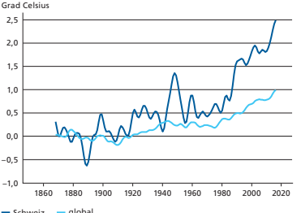
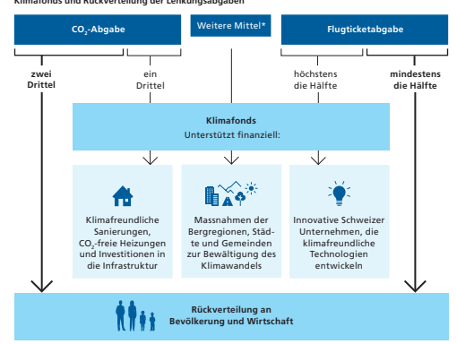
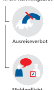
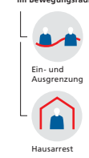

Übersicht Volksinitiative für sauberes Trinkwasser und gesunde Nahrung und Volksinitiative «Für eine Schweiz ohne synthetische Pestizide»

Volksinitiative für sauberes Trinkwasser und gesunde Nahrung 18 Volksinitiative «Für eine Schweiz ohne synthetische Pestizide» 28

Die beiden Volksinitiativen betreffen eine ähnliche Thematik. Nachfolgend eine Aufistung der wichtigsten Aspekte:

| Volksinitiative  für sauberes Trinkwasser  und gesunde Nahrung                                                                                                                       | Volksinitiative  «Für eine Schweiz ohne  synthetische Pestizide»                                                                                                                                                                                                                                                                                    |                                                                               |
|--------------------------------------------------------------------------------------------------------------------------------------------------------------------------------------|-----------------------------------------------------------------------------------------------------------------------------------------------------------------------------------------------------------------------------------------------------------------------------------------------------------------------------------------------------|-------------------------------------------------------------------------------|
| Kernanliegen                                                                                                                                                                         | Direktzahlungen sollen nur an  Landwirtschaftsbetriebe ausge -   richtet werden, die:                                                                                                                                                                                                                                                               | Synthetische Pestizide sollen  in der Schweiz grundsätzlich  verboten werden. |
| - pestizidfrei produzieren, - nicht vorbeugend oder regel -   mässig Antibiotika einsetzen, - in der Lage sind, ihre Tiere  mit dem Futter zu ernähren,  das sie selber produzieren. |                                                                                                                                                                                                                                                                                                                                                     |                                                                               |
| Geltungsbereich                                                                                                                                                                      | Betrifft die Landwirtschafts betriebe, die vom Bund Direkt zahlungen erhalten. -                                                                                                                                                                                                                                                                    | Betrifft:                                                                     |
| -                                                                                                                                                                                    | - alle Landwirtschaftsbetriebe, - die Lebensmittelproduktion  und die Verarbeitung von  Lebensmitteln, - die Boden- und Landschafts pfege (z. B. Pfege von Ver kehrswegen, Pärken, Sport anlagen und privaten Gärten), - -  -  - den Import; verboten ist die  Einfuhr von Lebensmitteln,  die mithilfe synthetischer  Pestizide produziert wurden. |                                                                               |

Gesetzesentwurf des Parlaments Das Parlament (National- und Ständerat) lehnt die Volksinitiative für sauberes Trinkwasser und gesunde Nahrung und die Volksinitiative «Für eine Schweiz ohne synthetische Pestizide» ab. Es will Bäche, Flüsse, Seen und das Trinkwasser dennoch besser vor Pestiziden schützen. Es hat deshalb Gesetzesänderungen ausgearbeitet, mit denen die Risiken reduziert werden, die mit dem Einsatz von Pestiziden verbun den sein können.

-
1 Diese Anpassungen werden auch vom Bundesrat unterstützt. Sie enthalten insbesondere folgende Massnahmen: - Die Vorschriften für die Bewilligung und die Anwendung von Pestiziden werden verschärft.

- In Gebieten, in denen der Einsatz von Pfanzenschutzmit teln die Qualität des Grundwassers beeinträchtigen könnte, werden die Aufagen erhöht.

-
- Berufich verwendete Pestizide müssen in einer zentralen Datenbank erfasst werden. Die Bestimmungen zu den Pestiziden gelten für verschie dene Bereiche wie die Landwirtschaft, die Lebensmittelpro duktion, den Schutz von Baumaterial, die Reinigung, die Hygie ne, den Unterhalt von Bahninfrastrukturen und die Pfege öffentlicher Grünanlagen. Zudem muss die Landwirtschaft künftig dafür sorgen, weniger Düngerüberschüsse zu produ zieren, sodass weniger Stickstoff und Phosphor in Böden und Gewässer gelangen.

-
-
-
-
1 Parlamentarische Initiative 19.475 «Das Risiko beim Einsatz von Pestiziden reduzieren» ( parlament.ch > 19.475)

| Begriffe Direktzahlungen   | Direktzahlungen sind Geldzahlungen des Bundes an Landwirt schaftsbetriebe. Damit werden Leistungen der Landwirtschaft  gefördert, die nicht über die Produktepreise abgegolten werden.  Voraussetzung für den Erhalt von Direktzahlungen ist die Einhal tung von Umwelt aufagen. - -                           |
|----------------------------|----------------------------------------------------------------------------------------------------------------------------------------------------------------------------------------------------------------------------------------------------------------------------------------------------------------|
| Pestizide                  | Pestizide werden eingesetzt, um Pfanzen, Tiere, Menschen und  Mate rialien vor schädlichen oder unerwünschten Organismen und  Krankheitserregern zu schützen. Damit Pestizide die Gesundheit  und die Umwelt nicht belasten, müssen sie vor ihrem Einsatz geprüft und zugelassen werden. Pestizide werden nicht nur in der Land wirtschaft eingesetzt, sondern etwa auch von der Lebensmittel industrie, von der öffentlichen Hand (z. B. Tiefbauämter, Stadtgärtnereien) und von Privatpersonen. Pestizide werden mehrheit lich künstlich hergestellt (synthetische Pestizide); es gibt auch solche, die in der Natur vorkommen. - - -                                                                                                                                                                                                                                                                                                                |
| Arten von Pestiziden       | Pestizide werden eingeteilt in Pfanzenschutzmittel und Biozide.  Derselbe Wirkstoff kann sowohl in einem Pfanzenschutzmittel als  auch in einem Biozid enthalten sein.                                                                                                                                         |
| Pfanzenschutzmittel        | Pfanzenschutzmittel schützen Pfanzen vor Krankheiten, Insektenund Schneckenfrass oder Unkräutern. Eingesetzt werden sie bei spielsweise zum Schutz von landwirtschaftlichen Nutzpfanzen,  gegen zu viel Unkraut auf Bahngeleisen oder zur Pfege von Pärken,  Sportplätzen und Gärten. -                                                                                                                                                                                                                                                                                                                |
| Biozide                    | Biozidprodukte dienen zur Desinfektion (z. B. der Hände, von  Schwimmbädern, Lebensmittel-Lagerräumen oder Anlagen zur  Milchproduktion). Sie werden auch zum Schutz von Material (z. B.  Schutz von Holz vor Pilzbefall) und zur Bekämpfung von Schäd -lingen (z. B. Insekten, Mäusen und Ratten) eingesetzt. |

Im Detail Volksinitiative 
«Für sauberes Trinkwasser und gesunde Nahrung - Keine Subventionen für den Pestizidund den prophylaktischen Antibiotika-Einsatz»

| Übersicht Volksinitiativen        | 14   |
|-----------------------------------|------|
| Argumente Initiativkomitee        | 22   |
| Argumente Bundesrat und Parlament | 24   |
| Abstimmungstext                   | 26   |

| Ausgangslage                                                                                                                                                                                                                                                                                                                                                                                                                                                                                                                                               | Damit Landwirtschaftsbetriebe vom Bund Direktzahlungen     |
|------------------------------------------------------------------------------------------------------------------------------------------------------------------------------------------------------------------------------------------------------------------------------------------------------------------------------------------------------------------------------------------------------------------------------------------------------------------------------------------------------------------------------------------------------------|------------------------------------------------------------|
| erhalten, müssen sie eine Reihe von Umweltaufagen einhalten, die im sogenannten ökologischen Leistungsnachweis zusam mengefasst sind. Dieser Nachweis wird seit 1999 verlangt und  wurde seither laufend weiterentwickelt. Heute umfasst er un ter anderem Aufagen in den Bereichen Biodiversität, Pfanzen schutz, Düngung und Tierhaltung. Dem Initiativkomitee reicht  das nicht: Umwelt und Trinkwasser werden damit zu wenig  geschützt. - -  -                                                                                                        |                                                            |
| Forderungen  der Initiative                                                                                                                                                                                                                                                                                                                                                                                                                                                                                                                                | Die Initiative verlangt, dass die ökologischen Aufagen für |
| Direktzahlungen erhöht werden, um so den Schutz der  Umwelt und des Trinkwassers zu verstärken. Direktzahlungen  sollen nur an Landwirtschaftsbetriebe ausgerichtet werden,  die die Biodiversität erhalten und pestizidfrei produzieren; sie  müssen zudem ohne vorbeugenden oder regelmässigen  Antibiotikaeinsatz in der Tierhaltung auskommen und ihren  Tierbestand mit Futter ernähren können, das sie auf ihrem  Betrieb produzieren. Auch die landwirtschaftliche Forschung,  Beratung und Ausbildung sollen auf dieses Ziel ausgerichtet  werden. |                                                            |
| Erhaltung der  Biodiversität                                                                                                                                                                                                                                                                                                                                                                                                                                                                                                                               | Biodiversität umfasst die Vielfalt von Tieren, Pfanzen und |
| ihren Lebensräumen. Betriebe mit Direktzahlungen müssen  einen Mindestanteil ihres Landes als sogenannte Biodiversitäts förderfächen pfegen. Überdies fördert der Bund Biodiversi tätsförderfächen und deren Qualität mit spezifschen Beiträ gen. Die Initiative will, dass die Erhaltung der Biodiversität als  Voraussetzung für Direktzahlungen neu in der Bundesverfas sung steht. - - - -                                                                                                                                                             |                                                            |

| Pestizidfreie   Produktion                                                                                                                                                                                                                                                                                                                                                                                                                                                                                                                                                                                                                                                                                                                             | Damit Pestizide (Pfanzenschutzmittel und Biozide)        |
|--------------------------------------------------------------------------------------------------------------------------------------------------------------------------------------------------------------------------------------------------------------------------------------------------------------------------------------------------------------------------------------------------------------------------------------------------------------------------------------------------------------------------------------------------------------------------------------------------------------------------------------------------------------------------------------------------------------------------------------------------------|----------------------------------------------------------|
| zugelassen werden, müssen sie ein strenges Bewilligungsver fahren durchlaufen. Bei der Verwendung von Pfanzenschutz mitteln gelten für Betriebe, die Direktzahlungen beziehen,  zusätzliche Einschränkungen. Der Bund fördert den reduzier ten Einsatz von Pfanzenschutzmitteln überdies mit spezif schen Direktzahlungen. Die Initiative will, dass Landwirt schaftsbetriebe, die Direktzahlungen beziehen, gänzlich auf  Pestizide verzichten. Darunter fallen auch Stoffe, die im  Biolandbau zugelassen sind, wie Verbindungen aus Kupfer zur  Bekämpfung von Pilzen. - - - - -                                                                                                                                                                    |                                                          |
| Kein vorbeugender  Antibiotikaeinsatz                                                                                                                                                                                                                                                                                                                                                                                                                                                                                                                                                                                                                                                                                                                  | Heute werden in der Tierhaltung Antibiotika zum Teil ein |
| gesetzt, um den Ausbruch einer Krankheit zu verhindern. Über  diesen vorbeugenden Einsatz von Antibiotika entscheiden  Tierärzte. Mit Direktzahlungen unterstützt der Bund beson ders tierfreundliche Haltungsformen, die neben dem Wohlbe fnden der Tiere auch deren Gesundheit fördern. Im Rahmen  der nationalen Strategie Antibiotikaresistenzen - - - 1  wurden  bereits Massnahmen umgesetzt, die den Einsatz von Antibioti ka reduzieren. Die Initiative fordert, dass Landwirtschaftsbe triebe von Direktzahlungen ausgeschlossen werden, wenn sie  Antibiotika in der Tierhaltung vorbeugend einsetzen oder  wenn ihre Tierhaltung einen regelmässigen Einsatz von Anti biotika erforderlich macht. - - -                                     |                                                          |
| Weniger Dünger  durch weniger Tiere                                                                                                                                                                                                                                                                                                                                                                                                                                                                                                                                                                                                                                                                                                                    | Damit die Böden nicht überdüngt und die Gewässer nicht   |
| belastet werden, gelten heute Beschränkungen. Betriebe, die  Direktzahlungen beziehen, dürfen nur so viel Dünger in Form  von Kunstdünger, Mist oder Gülle auf ihre Felder ausbringen,  wie ihre Kulturen benötigen. Eine Abweichung von maximal  zehn Prozent ist erlaubt. Halten sie so viele Tiere, dass zu viel  Mist oder Gülle anfällt, so müssen sie den überschüssigen  Dünger an Betriebe mit weniger Tieren abgeben. Die Initiative  will die Düngermenge verringern, indem sie die Zahl der Tiere  pro Hof einschränkt: Direktzahlungsberechtigte Betriebe sollen  nur so viele Tiere halten dürfen, wie sie mit dem auf dem Be trieb produzierten Futter ernähren können; so wird die Umwelt nicht mit zu viel Mist oder Gülle belastet. - |                                                          |

Forschung, Beratung, Investitionen Heute unterstützt der Bund die Landwirtschaft in ihrem Bestreben, rationell und nachhaltig zu produzieren, mittels Forschung, Beratung und Investitionshilfen. Die Initiative will diese Förderung nur noch zulassen, wenn sie auf eine landwirt schaftliche Produktion gemäss den Vorgaben der Initiative ausgerichtet ist. Auch die landwirtschaftliche Ausbildung soll sich an diese Vorgaben halten. Nicht betroffen sind die Kantone in den Bereichen Beratung und Ausbildung, für die sie selbst zuständig sind.

-
Auswirkungen der Initiative Laut einer Studie von Agroscope, dem Kompetenzzentrum des Bundes für landwirtschaftliche Forschung, könnte bei einer Annahme der Initiative die landwirtschaftliche Produktion in der Schweiz zurückgehen. Das würde die Umweltbelastung in der Schweiz verringern und ins Ausland verlagern, denn zur ausrei chenden Ernährung der Schweizer Bevölkerung müssten mehr Lebensmittel als bisher importiert werden.

-
2 Laut einer weiteren Studie von Agroscope würden die Schweizer Landwirtschaftsbe triebe unterschiedlich auf die Initiative reagieren. Ein grosser Teil der Betriebe würde ökologischer produzieren und ihre Produktionsmenge reduzieren. Für bestimmte andere Betriebe könnte es sich aber lohnen, auf Direktzahlungen zu verzichten. Letztere müssten dadurch weniger Umweltaufagen einhalten: Sie könn ten noch mehr Pestizide und Antibiotika einsetzen und ihren Tierbestand zusätzlich erhöhen.

-
-
3 2 Maria Bystricky, Thomas Nemecek, Simone Krause, Gérard Gaillard 
(2020): Potenzielle Umweltfolgen einer Umsetzung der Trinkwas serinitiative, Agroscope Science Nr. 99 (
-
 agroscope.ch > Aktuell > 
Dossiers > Folgenabschätzung der Trinkwasserinitiative)
3 Alena Schmidt, Gabriele Mack, Anke Möhring, Stefan Mann, Nadja El Benni (2019): Folgenabschätzung Trinkwasserinitiative: ökonomi sche und agrarstrukturelle Wirkungen, Agroscope Science Nr. 83 (
-
 agroscope.ch > Aktuell > Dossiers > Folgenabschätzung der Trinkwasserinitiative)

## Argumente Initiativkomitee

| Sauberes Trinkwasser ist ein Grundrecht. Die heutige Agrar politik verletzt dieses Grundrecht. Der riesige Pestizid einsatz, zu viel Antibiotika in der Tierhaltung und zu viel  Gülle auf unseren Feldern gefährden unser Trinkwasser.  Empörend ist, dass diese Umweltschäden und Gesundheits risiken via Subventionen mit Milliarden unseres Steuergelds fnanziert werden. Damit muss Schluss sein. Eine Neu ausrichtung der Subventionen ist unabdingbar. Das erreicht  die Initiative für sauberes Trinkwasser. - - - -                                                                                                                                                                                                                                                                                                                                                                        |                                                      |
|-----------------------------------------------------------------------------------------------------------------------------------------------------------------------------------------------------------------------------------------------------------------------------------------------------------------------------------------------------------------------------------------------------------------------------------------------------------------------------------------------------------------------------------------------------------------------------------------------------------------------------------------------------------------------------------------------------------------------------------------------------------------------------------------------------------------------------------------------------------------------------------------------------|------------------------------------------------------|
| Verheerende  Bilanz                                                                                                                                                                                                                                                                                                                                                                                                                                                                                                                                                                                                                                                                                                                                                                                                                                                                                 | Über eine Million Menschen - auch Kinder und Babys - |
| konsumieren aktuell Trinkwasser, das über dem Grenzwert mit  Pestiziden aus der Landwirtschaft belastet ist. Der übermässige  Antibiotika-Einsatz in der Tierhaltung führt dazu, dass lebens bedrohliche antibiotikaresistente Bakterien via Gülle und Mist  in unsere Nahrung und ins Trinkwasser gelangen. Stark über höhte Tierbestände, ernährt mit Hunderttausenden Tonnen an  Import-Futtermitteln, produzieren viel zu viel Gülle. Die Folgen: krebserregendes Nitrat im Trinkwasser, schwindende Biodiversi tät, künstlich belüftete Seen, Aufheizung des Klimas. Dadurch verursacht die heutige Agrarpolitik immense Folgekosten. - -  -                                                                                                                                                                                                                                                   |                                                      |
| Umlenkung der  Subventionen                                                                                                                                                                                                                                                                                                                                                                                                                                                                                                                                                                                                                                                                                                                                                                                                                                                                         | Stossend ist, dass wir diese Schäden mit Milliarden  |
| unseres Steuergelds subventionieren. So darf es nicht weiter gehen. Die Trinkwasserinitiative lenkt die Subventionen in eine  nachhaltige, pestizidfreie Produktion sowie in eine Tierhal tung, die Antibiotika nicht mehr prophylaktisch einsetzt und  deren Tierbestand aus der Landwirtschaftsfäche des jeweili gen Betriebs oder einer Betriebsgemeinschaft ernährt werden  kann. Der Austausch von Futtermitteln zwischen Betrieben ist  gewährleistet. Innovative Bauernbetriebe gehen diesen Weg  bereits seit Jahrzehnten. Er sichert sauberes Trinkwasser,  erhöht unsere Versorgungssicherheit und schützt unsere  Gesundheit. Die Bauernfamilien werden bei der Umstellung  nebst den Subventionen auch durch Bildung, Forschung und  Investitionshilfen unterstützt. Und die bestehenden Gesetze  zum Schutz der Gewässer, der Umwelt und des Klimas werden  endlich eingehalten. - - - |                                                      |

| Landwirtschaft  zukunftsfähig  machen   |
|-----------------------------------------|

Die Trinkwasserinitiative setzt unsere Steuergelder so ein, dass die Bauernfamilien nachhaltig Lebensmittel produzieren können. Dadurch schützen wir unser Trinkwasser und unsere Gesundheit und tragen Sorge zu Umwelt, Biodiversität und Klima. Durch die Sicherung unserer Lebensgrundlagen machen wir die Landwirtschaft zukunftsfähig. Aus Verantwortung für die kommenden Generationen! 

Darum empfehlt das Initiativkomitee:
Empfehlung des Initiativkomitees Ja trinkwasserinitiative.ch Der Text auf dieser Doppelseite stammt vom Initiativkomitee. Es ist für den Inhalt und die Wortwahl verantwortlich.

# Argumente Bundesrat Und Parlament

| Das Schweizer Trinkwasser ist bereits gut geschützt und  problemlos trinkbar. Der Schutz kann noch weiter verbes sert werden. Die Initiative geht Bundesrat und Parlament  jedoch zu weit. Ihre Annahme hätte weitreichende Folgen  für die Schweizer Lebensmittelproduktion. Viele Landwirt schaftsbetriebe würden weniger Lebensmittel produzieren. Durch zusätzliche Importe würden Umweltbelastungen  ins Ausland verlagert. Zudem hat das Parlament das Kern anliegen der Initiative bereits aufgenommen. Bundesrat  und Parlament lehnen die Initiative insbesondere aus fol genden Gründen ab: - - - -   |                                                       |
|-----------------------------------------------------------------------------------------------------------------------------------------------------------------------------------------------------------------------------------------------------------------------------------------------------------------------------------------------------------------------------------------------------------------------------------------------------------------------------------------------------------------------------------------------------------------------------------------------------------------|-------------------------------------------------------|
| Lebensmittel produktion wird  geschwächt -                                                                                                                                                                                                                                                                                                                                                                                                                                                                                                                                                                      | Die Volksinitiative nimmt berechtigte Anliegen auf,   |
| schiesst aber über das Ziel hinaus. Sie hätte weitreichende und  schädliche Folgen für die Schweizer Landwirtschaft und würde  sie schwächen. Wenn die zahlreichen Betriebe, die heute  Direktzahlungen erhalten, vollständig auf Pestizide und  zugekauftes Futter verzichten müssten, würden sie weniger  Lebensmittel produzieren.                                                                                                                                                                                                                                                                           |                                                       |
| Umweltbelastung  wird verlagert                                                                                                                                                                                                                                                                                                                                                                                                                                                                                                                                                                                 | Der Verzicht auf Pestizide und der erwartete Rückgang |
| der Produktion würden im Inland zwar die Belastung von  Gewässern mit Pestiziden und Nährstoffen aus der Landwirt schaft verringern und die Biodiversität verbessern. Zugleich  würde bei unverändertem Konsum aber die Umweltbelastung  ins Ausland verlagert, da vermehrt im Ausland produzierte  Lebensmittel importiert würden. Keinen Einfuss hätte die  Initiative auf die Gewässerbelastungen, die nicht von der  Landwirtschaft verursacht werden, wie die Belastung durch  Stickstoff aus Abwasserreinigungsanlagen. -                                                                                 |                                                       |

| Kontraproduktive  Auswirkungen                                                                                                                                                                                                                                                                                                                                                                                                                                                                                     | Bei einem Ja würde ein Teil der Betriebe in der Schweiz   |
|--------------------------------------------------------------------------------------------------------------------------------------------------------------------------------------------------------------------------------------------------------------------------------------------------------------------------------------------------------------------------------------------------------------------------------------------------------------------------------------------------------------------|-----------------------------------------------------------|
| künftig besser fahren, wenn sie auf Direktzahlungen verzich ten. Dies gilt für Betriebe, die viel Futter zukaufen (vor allem  Schweine- und Gefügelbetriebe), und solche, die regelmässig  Pfanzenschutzmittel einsetzen (Gemüse-, Obst- und Weinbau betriebe). Ohne Direktzahlungen müssten diese Betriebe  verschiedene ökologische Aufagen nicht mehr einhalten, die  derzeit noch für sie gelten. Die Initiative hätte somit zum Teil  das Gegenteil von dem zur Folge, was sie bezweckt. - -                  |                                                           |
| Anliegen schon  vom Parlament  aufgenommen                                                                                                                                                                                                                                                                                                                                                                                                                                                                         | Das Parlament hat das Kernanliegen der Volksinitiative    |
| mit verschiedenen Gesetzesanpassungen bereits aufgenom men. Die Risiken, die durch den Einsatz von Pestiziden für  Mensch, Tier und Umwelt entstehen, sollen weiter vermindert  und die Qualität des Grund- und Trinkwassers sowie der Bäche,  Flüsse und Seen soll weiter verbessert werden. Mit den Geset zesanpassungen wird der Einsatz von Pestiziden allgemein  geregelt und nicht nur für die Landwirtschaft. Weiter muss die  Landwirtschaft ihre umweltbelastenden Überschüsse an  Dünger reduzieren. - - |                                                           |
| Empfehlung  von Bundesrat  und Parlament                                                                                                                                                                                                                                                                                                                                                                                                                                                                           | Aus all diesen Gründen empfehlen Bundesrat und            |
| Parlament, die Volksinitiative für sauberes Trinkwasser und  gesunde Nahrung abzulehnen.                                                                                                                                                                                                                                                                                                                                                                                                                           |                                                           |

Nein admin.ch/trinkwasserinitiative Im Detail Volksinitiative 
«Für eine Schweiz ohne synthetische Pestizide»

| Übersicht Volksinitiativen        | 14   |
|-----------------------------------|------|
| Argumente Initiativkomitee        | 32   |
| Argumente Bundesrat und Parlament | 34   |
| Abstimmungstext                   | 36   |

| Ausgangslage                                                                                                                                                                                                                                                                                                                                                                                                                                                                                                                                                                                                                                                                                                                                                                                                                                                                                                                                                                                                                                 | Pfanzen, Menschen und Tiere sowie Lebensmittel und    |
|----------------------------------------------------------------------------------------------------------------------------------------------------------------------------------------------------------------------------------------------------------------------------------------------------------------------------------------------------------------------------------------------------------------------------------------------------------------------------------------------------------------------------------------------------------------------------------------------------------------------------------------------------------------------------------------------------------------------------------------------------------------------------------------------------------------------------------------------------------------------------------------------------------------------------------------------------------------------------------------------------------------------------------------------|-------------------------------------------------------|
| Materialien werden mit Pestiziden vor schädlichen Insekten,  Krankheitserregern und Unkräutern geschützt. Damit Pestizide  die Gesundheit und die Umwelt nicht belasten, hat der Bund  den Einsatz dieser Mittel in mehreren Gesetzen geregelt.  Pestizide dürfen erst eingesetzt werden, wenn sie in einem  strengen Verfahren geprüft und zugelassen wurden.                                                                                                                                                                                                                                                                                                                                                                                                                                                                                                                                                                                                                                                                               |                                                       |
| Bund fördert  Reduktion                                                                                                                                                                                                                                                                                                                                                                                                                                                                                                                                                                                                                                                                                                                                                                                                                                                                                                                                                                                                                      | Der Bund sorgt heute gezielt dafür, dass weniger Pfan |
| zenschutzmittel zum Schutz der Pfanzen vor Krankheiten,  Schädlingen und Unkräutern eingesetzt werden. Er unterstützt  Alternativen zum chemischen Pfanzenschutz. Dazu leistet  auch die Wissenschaft einen wichtigen Beitrag, indem sie zum  Beispiel krankheitsresistente Pfanzen züchtet. Der Bund be teiligt sich an dieser Forschung und Entwicklung. Finanziell  unterstützt werden auch Landwirtschaftsbetriebe, die auf den  Einsatz von Pfanzenschutzmitteln verzichten oder deren Ein satz reduzieren. Die Ertragsverluste und der Mehraufwand bei  der mechanischen Unkrautbekämpfung werden so zum Teil  kompensiert. Die Anzahl der landwirtschaftlichen Betriebe, die  diese Förderung in Anspruch nehmen, nimmt stetig zu. Damit  verbunden ist eine Abnahme der verkauften Menge an Pfan zenschutzmitteln, die ausschliesslich in der konventionellen  Landwirtschaft eingesetzt werden dürfen. Produkte, die auch  in der biologischen Landwirtschaft gebraucht werden dürfen,  werden hingegen mehr verkauft. - -  -  -  1 |                                                       |

1 Das Bundesamt für Landwirtschaft sammelt die Daten über das Umsatzvolumen und veröffentlicht sie ( blw.admin.ch > Nachhaltige Produktion > Pfanzenschutz > Pfanzenschutzmittel > Verkaufsmengen der Pfanzenschutzmittel-Wirkstoffe
.

).

| Beschlossene  Reduktionsziele                                                                                                                                                                                                                                                                                                                                                                                                                                                                                                                                                                         | Ausserdem hat der Bundesrat 2017 den «Aktionsplan          |
|-------------------------------------------------------------------------------------------------------------------------------------------------------------------------------------------------------------------------------------------------------------------------------------------------------------------------------------------------------------------------------------------------------------------------------------------------------------------------------------------------------------------------------------------------------------------------------------------------------|------------------------------------------------------------|
| Pfanzenschutzmittel» lanciert, um den Einsatz von Pfanzen schutzmitteln nachhaltiger zu machen. Der Aktionsplan  defniert klare Ziele und 51 Massnahmen. Insbesondere sollen  weniger Pfanzenschutzmittel eingesetzt und die Gewässer  besser geschützt werden. Das Parlament hat sich zudem für  verbindliche Reduktionsziele und Massnahmen zum besseren  Schutz der Umwelt ausgesprochen und dazu neue Gesetzes bestimmungen ausgearbeitet ( - - Æ siehe «Gesetzesentwurf  des Parlaments» S. 16). Sie treten in Kraft, wenn dagegen kein  Referendum ergriffen wird oder dieses erfolglos bleibt. |                                                            |
| Initiative fordert  Verbot                                                                                                                                                                                                                                                                                                                                                                                                                                                                                                                                                                            | Die Initiative fordert ein Verbot synthetischer Pestizide. |
| Dieses Verbot würde die folgenden Bereiche betreffen:                                                                                                                                                                                                                                                                                                                                                                                                                                                                                                                                                 |                                                            |
| Landwirtschaftliche  Produktion                                                                                                                                                                                                                                                                                                                                                                                                                                                                                                                                                                       | Im Pfanzenbau wären synthetische Pfanzenschutzmittel       |
| verboten und dürften nicht mehr zur Bekämpfung von Schäd lingen und Krankheitserregern eingesetzt werden. In der  Tierhaltung dürften keine synthetischen Biozidprodukte mehr  verwendet werden; diese werden heute für die Stallhygiene,  die Reinhaltung der Geräte in der Milchproduktion oder die  Hygiene im Veterinärbereich eingesetzt. Ohne synthetische  Pestizide wäre die Landwirtschaft Schädlingen und Krankheits erregern stärker ausgesetzt, was sich auf die Erträge, Hygiene  und Tiergesundheit auswirken würde. - -                                                                |                                                            |
| Verarbeitung  von Lebensmitteln                                                                                                                                                                                                                                                                                                                                                                                                                                                                                                                                                                       | Gewisse Reinigungs- und Desinfektionsmittel dürften        |
| nicht mehr bei der Lagerung und Verarbeitung von landwirt schaftlichen Erzeugnissen eingesetzt werden. Diese Mittel  helfen, die Hygienevorschriften und damit die Qualitäts- und  Sicherheitsvorgaben einzuhalten. Können Hygienevorschriften  nicht eingehalten werden, dürfen die entsprechenden Produk te nicht mehr als Lebensmittel verkauft werden. - -                                                                                                                                                                                                                                        |                                                            |
| Boden- und   Landschaftspfege                                                                                                                                                                                                                                                                                                                                                                                                                                                                                                                                                                         | Die Anwendung synthetischer Pfanzenschutzmittel in         |
| privaten Gärten und zum Unterhalt öffentlicher Grünanlagen  (z. B. Pärken) wäre verboten. Nicht mehr erlaubt wäre auch der  Einsatz dieser Mittel für die Behandlung von Infrastrukturen  (z. B. Bahngeleisen).                                                                                                                                                                                                                                                                                                                                                                                       |                                                            |

| Defnition von  synthetischen  Pestiziden                                                                                                                                                                                                                                                                                                                                                                                                                                                                                                               | Im Initiativtext wird nicht gesagt, was unter synthetischen   |
|--------------------------------------------------------------------------------------------------------------------------------------------------------------------------------------------------------------------------------------------------------------------------------------------------------------------------------------------------------------------------------------------------------------------------------------------------------------------------------------------------------------------------------------------------------|---------------------------------------------------------------|
| Pestiziden zu verstehen ist. Die Auswirkungen eines Verbots aller  synthetischen Pestizide wären von der Defnition des Begriffs  «synthetische Pestizide» abhängig, die das Parlament nach der  Annahme der Initiative im Gesetz festlegen müsste. In der  geltenden Gesetzgebung und in den Standards für landwirt schaftliche Produktionssysteme (z. B. für die biologische Land wirtschaft), die national und international zum Einsatz kommen,  werden weder «synthetisch» noch «synthetische Pestizide» klar  defniert. - -                       |                                                               |
| Importverbot                                                                                                                                                                                                                                                                                                                                                                                                                                                                                                                                           | Die Initiative verlangt zudem ein Importverbot für Lebens     |
| mittel, die synthetische Pestizide enthalten oder mithilfe  solcher hergestellt worden sind. Nicht erfasst wären die über  den privaten Einkaufstourismus eingeführten Lebensmittel.  Ebenfalls nicht betroffen wären importierte Futtermittel.                                                                                                                                                                                                                                                                                                        | -                                                             |
| Widerspruch  zu Handelsrecht                                                                                                                                                                                                                                                                                                                                                                                                                                                                                                                           | Das Importverbot würde den Grundsätzen des internatio         |
| nalen Handelsrechts (WTO-Recht) und den Handelsabkommen  der Schweiz (insbesondere mit der EU) widersprechen, denn  diese erlauben keine Beschränkung der Importmenge. Das  Importverbot könnte zwar mit Ausnahmeregeln zum Schutz  der Gesundheit von Mensch und Tier oder der Umwelt begrün det werden. Für die Geltendmachung dieser Ausnahmeregeln  gibt es jedoch hohe Anforderungen: Es müsste zum Beispiel  nachgewiesen werden, dass das Importverbot verhältnismässig  ist, und seine Notwendigkeit müsste wissenschaftlich belegt  sein. - - |                                                               |
| Übergangsfrist                                                                                                                                                                                                                                                                                                                                                                                                                                                                                                                                         | Die Initiative sieht eine Übergangsfrist von zehn Jahren      |
| vor. Innerhalb dieser Frist kann der Einsatz von Pestiziden  ausnahmsweise bewilligt werden, zum Beispiel bei einer  ausserordentlichen Versorgungsknappheit. Nach Ablauf der  Frist wären keine Ausnahmeregelungen mehr möglich.                                                                                                                                                                                                                                                                                                                      |                                                               |

## Argumente Initiativkomitee

| Synthetische Pestizide sind sehr giftige chemische Substan zen. Sie verunreinigen unsere Flüsse, unser Trinkwasser,  unsere Lebensmittel und schaden unserer Gesundheit. Mit  der von betroffenen Bürgerinnen und Bürgern lancierten  Initiative soll unser Land von diesen Giften befreit werden,  und zwar innerhalb einer Übergangsfrist von zehn Jahren.  Die Initiative betrifft die Landwirtschaft, die Landschafts pfege und den Privatgebrauch. Sie gilt auch für importier te Lebensmittel, was die Schweizer und die ausländische  Landwirtschaft faktisch gleichstellt. - - -   |                                                              |
|--------------------------------------------------------------------------------------------------------------------------------------------------------------------------------------------------------------------------------------------------------------------------------------------------------------------------------------------------------------------------------------------------------------------------------------------------------------------------------------------------------------------------------------------------------------------------------------------|--------------------------------------------------------------|
| Auswirkungen  von Pestiziden                                                                                                                                                                                                                                                                                                                                                                                                                                                                                                                                                               | Der Einsatz von synthetischen Pestiziden ist nicht verein    |
| bar mit einer nachhaltigen Landwirtschaft, mit dem Erhalt der  Artenvielfalt und mit der Erhaltung der öffentlichen Gesund heit. Insektenpopulationen kollabieren und dadurch wächst  die Gefahr, dass Nutz- und Wildpfanzen nicht mehr bestäubt  und die Böden unfruchtbar werden. - -                                                                                                                                                                                                                                                                                                    |                                                              |
| Gesundheit  in Gefahr                                                                                                                                                                                                                                                                                                                                                                                                                                                                                                                                                                      | Hunderte von unabhängigen wissenschaftlichen Studien         |
| belegen den Zusammenhang zwischen synthetischen Pestizi den und zahlreichen Krankheiten (bestimmte Krebsarten,  Parkinson, sinkender IQ, Abnahme der Fruchtbarkeit und der  Immunität usw.). Bereits sehr geringe Mengen an synthetischen Pestiziden, die ein Kind in der Wachstumsphase aufnimmt,  können schwere Erkrankungen und Krebs auslösen, auch  Jahrzehnte danach. -                                                                                                                                                                                                             |                                                              |
| Vorsorgeprinzip  ignoriert                                                                                                                                                                                                                                                                                                                                                                                                                                                                                                                                                                 | Das Zulassungsverfahren ist zu lasch. Dies zeigt sich darin, |
| dass eine Million Schweizerinnen und Schweizer Tag für Tag  verunreinigtes Wasser trinkt und dass seit 2011 die Verwen dung von ca. 200 Pfanzenschutzmitteln verboten wurde, weil  von ihnen ein zu grosses Risiko ausgeht. -                                                                                                                                                                                                                                                                                                                                                              |                                                              |

| Lösungen sind  vorhanden                                                                                                                                                                                                                                                                                                                                                                                       | Heute verwendet rund die Hälfte der Landwirtinnen und   |
|----------------------------------------------------------------------------------------------------------------------------------------------------------------------------------------------------------------------------------------------------------------------------------------------------------------------------------------------------------------------------------------------------------------|---------------------------------------------------------|
| Landwirte keine (Bio) oder fast keine (IP Suisse) synthetischen  Pestizide. Es ist also möglich, darauf zu verzichten. Die in der  biologischen Landwirtschaft verwendeten natürlichen Pestizide werden weiterhin erlaubt sein. Eine Übergangszeit von zehn  Jahren wird es den Landwirtinnen und Landwirten ermöglichen, ihre Praktiken anzupassen, und sie werden dazu die  notwendigen Hilfen erhalten. Die Forschung bringt bereits  innovative Lösungen hervor. Durch die Reduktion von Lebens mittelabfällen und die Verringerung der für die Futtermittel produktion genutzten landwirtschaftlichen Flächen kann  unsere Selbstversorgung gestärkt werden. - -                                                                                                                                                                                                                                                                                                                                                                                                                |                                                         |
| Schweizer  Landwirtschaft  unterstützen                                                                                                                                                                                                                                                                                                                                                                        | Importierte Lebensmittel werden keine in der Schweiz    |
| verbotenen Pestizide mehr enthalten dürfen. Die Initiative  sieht eine Beschränkung solcher Importe vor, unter Einhaltung  der in internationalen Abkommen festgelegten Ausnahmen.  Damit wird sichergestellt, dass unsere Landwirtinnen und  Landwirte nicht benachteiligt werden. Mehrere Bauernorgani sationen, unter anderem Bio Suisse und die Kleinbauern-Ver einigung, unterstützen die Initiative. - - |                                                         |
| Empfehlung des                                                                                                                                                                                                                                                                                                                                                                                                 | Darum empfehlt das Initiativkomitee:                    |

Empfehlung des Initiativkomitees

Ja lebenstattgift.ch Der Text auf dieser Doppelseite stammt vom Initiativkomitee. Es ist für den Inhalt und die Wortwahl verantwortlich.

Argumente Bundesrat und Parlament

| Ein Verbot synthetischer Pestizide würde die Versorgung  der Schweizer Bevölkerung mit in der Schweiz hergestell ten Lebensmitteln schwächen und die Auswahl an impor tierten Lebensmitteln reduzieren. Bei der Lebensmittel produktion würde es schwieriger, die Hygienevorschriften  einzuhalten. Bundesrat und Parlament nehmen die An liegen der Initiative bereits mit diversen Massnahmen  auf, ohne aber den Handlungsspielraum für die Land- und  Ernährungswirtschaft übermässig einzuschränken. Bundes rat und Parlament lehnen die Initiative insbesondere aus  folgenden Gründen ab: - - - - -   |                                                        |
|--------------------------------------------------------------------------------------------------------------------------------------------------------------------------------------------------------------------------------------------------------------------------------------------------------------------------------------------------------------------------------------------------------------------------------------------------------------------------------------------------------------------------------------------------------------------------------------------------------------|--------------------------------------------------------|
| Versorgungssicher - heit beeinträchtigt                                                                                                                                                                                                                                                                                                                                                                                                                                                                                                                                                                      | Bei einer Annahme der Initiative würden in der Schweiz |
| wichtige Hilfsmittel fehlen, um landwirtschaftliche Pfanzen  und Produkte effzient zu schützen. Auch Hygienevorschriften  könnten weniger gut eingehalten werden. Die Versorgungssi - cherheit würde dadurch beeinträchtigt.                                                                                                                                                                                                                                                                                                                                                                                 |                                                        |
| Teurere   Lebensmittel                                                                                                                                                                                                                                                                                                                                                                                                                                                                                                                                                                                       | Die erschwerten Bedingungen für die Produktion und die |
| Verarbeitung in der Schweiz sowie die verschärften Importauf lagen würden dazu führen, dass die Lebensmittelpreise im  Detailhandel steigen. Dies würde vor allem einkommensschwa che Haushalte treffen.  - -                                                                                                                                                                                                                                                                                                                                                                                                |                                                        |
| Klarer Wett - bewerbsnachteil                                                                                                                                                                                                                                                                                                                                                                                                                                                                                                                                                                                | Die Lebensmittelproduzenten müssten wegen der          |
| strengeren Aufagen mehr bezahlen für Landwirtschaftser zeugnisse, die die Grundlage für ihre Produkte bilden (z. B.  Getreide, Zucker, pfanzliche Öle). Die exportorientierten  Schweizer Lebensmittelproduzenten hätten dadurch gegen über der ausländischen Konkurrenz einen Wettbewerbsnach teil.  - - -                                                                                                                                                                                                                                                                                                  |                                                        |
| Zu viele  Einschränkungen                                                                                                                                                                                                                                                                                                                                                                                                                                                                                                                                                                                    | Wenn weniger Lebensmittel in der Schweiz hergestellt   |
| werden, müssen mehr Produkte importiert werden. Doch  verbietet die Initiative den Import von Erzeugnissen, die  mithilfe von Pestiziden produziert werden. Das könnte die  Versorgungssicherheit noch mehr beeinträchtigen. Zugleich  würde ein solches Verbot die Wahlfreiheit der Konsumentin - nen und Konsumenten stark einschränken.                                                                                                                                                                                                                                                                   |                                                        |

| Verletzung  von Handels - abkommen                                                                                                                                                                                                                                                                                                            | Ein Importverbot widerspricht zudem den Grundsätzen   |
|-----------------------------------------------------------------------------------------------------------------------------------------------------------------------------------------------------------------------------------------------------------------------------------------------------------------------------------------------|-------------------------------------------------------|
| des internationalen Handelsrechts und internationaler Han delsabkommen. Es wäre kaum möglich, gegenüber den  ausländischen Partnern ein solches Importverbot als verhältnis mässig und wissenschaftlich belegbar zu rechtfertigen und  durchzusetzen.  - -                                                                                    |                                                       |
| Politik  bereits aktiv                                                                                                                                                                                                                                                                                                                        | Bundesrat und Parlament anerkennen den Handlungs      |
| bedarf und haben sich für verbindliche Alternativen zur  Initiative ausgesprochen: Neue Bestimmungen ergänzen  bestehende Massnahmen und sollen die Risiken beim Einsatz  von Pestiziden vermindern. Die Vorschriften für die Bewilli gung und Anwendung von Pestiziden werden verschärft, aber  das geschieht schrittweise und massvoll. - - |                                                       |
| Empfehlung  von Bundesrat  und Parlament                                                                                                                                                                                                                                                                                                      | Aus all diesen Gründen empfehlen Bundesrat und Parla  |
| ment, die Volksinitiative «Für eine Schweiz ohne synthetische  Pestizide» abzulehnen. -                                                                                                                                                                                                                                                       |                                                       |

Nein admin.ch/pestizidverbot

# Im Detail Covid-19-Gesetz

Ausgangslage Im Frühling 2020 stieg die Zahl von Coronapatientinnen und -patienten in den Spitälern schnell an. Der Bundesrat musste rasch reagieren. Er ergriff zum einen Massnahmen, um die Bevölkerung vor einer Virusansteckung und die Spitäler vor einer Überlastung zu schützen. Dabei konnte er sich auf das Epidemiengesetz stützen. Zum anderen beschloss er Unterstüt zungsleistungen für die Menschen und Unternehmen, die unter den wirtschaftlichen Folgen der Pandemie litten. Da das Epidemiengesetz keine solchen Massnahmen vorsieht, stützte sich der Bundesrat dabei direkt auf die Bundesverfassung.

-
1

Diese erlaubt es ihm, bei unmittelbar drohender Gefahr per Notrecht Massnahmen zu ergreifen.

Befristetes Gesetz statt Notrecht Solches Notrecht ist stets auf sechs Monate befristet. Sol len die direkt gestützt auf die Verfassung eingeführten Mass nahmen länger gelten, muss der Bundesrat innerhalb dieser Frist dem Parlament einen Gesetzesentwurf vorlegen. Dies hat er im aktuellen Fall mit dem Covid-19-Gesetz getan. Das Parla ment hat das Gesetz im September 2020 angenommen und für dringlich erklärt. Damit trat es sofort in Kraft. Das Gesetz ist befristet; praktisch alle Regelungen gelten bis Ende 2021.

- 
- 
- 
1 Artikel 185 der Bundesverfassung

| Argumente Referendumskomitee      | 42   |
|-----------------------------------|------|
| Argumente Bundesrat und Parlament | 44   |
| Abstimmungstext                   | 46   |

| Umfangreiche  fnanzielle  Unterstützung                                                                                                                                                                                                                                                                                                                                                                                                                                                                                                                                                                                                                                                                                                                                            | Der Bundesrat hat seit Ausbruch der Coronapandemie      |
|------------------------------------------------------------------------------------------------------------------------------------------------------------------------------------------------------------------------------------------------------------------------------------------------------------------------------------------------------------------------------------------------------------------------------------------------------------------------------------------------------------------------------------------------------------------------------------------------------------------------------------------------------------------------------------------------------------------------------------------------------------------------------------|---------------------------------------------------------|
| umfangreiche Massnahmen beschlossen, um die wirtschaftli - chen Folgen für Menschen und Unternehmen abzufedern. 2   Für die folgenden Massnahmen bildet das Covid-19-Gesetz die  rechtliche Basis.                                                                                                                                                                                                                                                                                                                                                                                                                                                                                                                                                                                 |                                                         |
| Entschädigung  für Kurzarbeit  ausgeweitet                                                                                                                                                                                                                                                                                                                                                                                                                                                                                                                                                                                                                                                                                                                                         | Das Instrument der Kurzarbeit dient dazu, in Krisen Kün |
| digungen zu verhindern und damit Arbeitsplätze zu erhalten.  Die Arbeitslosenversicherung übernimmt anstelle des Arbeit gebers für eine gewisse Zeit einen Teil der Lohnkosten. Mit  dem Covid-19-Gesetz haben mehr Arbeitnehmende Anspruch  auf eine Kurzarbeitsentschädigung, zum Beispiel Personen in  befristeten Arbeitsverhältnissen oder Lernende. Personen mit  tiefen monatlichen Einkommen bis zu 3470 Franken garantiert  das Gesetz zudem vorübergehend nicht nur 80 Prozent des  Lohnes, sondern die volle Entschädigung. Mit dem Gesetz wur de ausserdem der administrative Aufwand verringert, um  Arbeitgeber schnell und unkompliziert zu unterstützen. 2020  hat der Bund fast 11 Milliarden Franken für die Kurzarbeits entschädigungen ausgegeben. -  - -  - 3 |                                                         |
| Entschädigung  bei Erwerbsausfall                                                                                                                                                                                                                                                                                                                                                                                                                                                                                                                                                                                                                                                                                                                                                  | Von den neu geschaffenen Erwerbsausfallentschädigun     |
| gen proftieren zahlreiche Arbeitnehmende und Selbstständig erwerbende, die direkt oder indirekt von den Massnahmen  gegen die Ausbreitung des Virus betroffen sind - zum Beispiel,  wenn sie ihren Betrieb schliessen müssen oder ihre Veranstal tung verboten wird. Anspruch haben auch weitere Personen,  die ihre Arbeit unterbrechen müssen, zum Beispiel besonders  gefährdete Personen, Personen in Quarantäne oder Eltern,  wenn die Fremdbetreuung ihrer Kinder nicht mehr gewährleis tet ist. 2020 hat der Bund 2,2 Milliarden Franken für diese  Entschädigungen ausgegeben. - - - - 4                                                                                                                                                                                   |                                                         |

2 Covid-19: Auswirkungen auf die Bundesfnanzen ( efv.admin.ch > 
Aktuell > Im Brennpunkt > Covid-19: Auswirkungen auf die Bundes fnanzen
-
)
3 Bei Redaktionsschluss der «Erläuterungen des Bundesrates» 
(5. März 2021) lag dem Parlament ein Vorschlag des Bundesrates vor, weitere 6 Milliarden für das Jahr 2021 bereitzustellen.

4 Bei Redaktionsschluss waren für 2021 weitere 3,1 Milliarden Franken geplant.

| Beteiligung  an kantonalen  Härtefallhilfen                                                                                                                                                                                                                                                                                                                                                                                                                                                                                                                                             | Der Bund beteiligt sich an kantonalen Härtefallhilfen   |
|-----------------------------------------------------------------------------------------------------------------------------------------------------------------------------------------------------------------------------------------------------------------------------------------------------------------------------------------------------------------------------------------------------------------------------------------------------------------------------------------------------------------------------------------------------------------------------------------|---------------------------------------------------------|
| für Betriebe, die besonders stark unter den Massnahmen zur  Pandemiebekämpfung leiden. Beispiele sind Restaurants,  Hotels, Reiseunternehmen oder die Eventbranche. Bund und  Kantone haben dafür mehrere Milliarden gesprochen.                                                                                                                                                                                                                                                                                                                                                        |                                                         |
| Unterstützung  für Kultur, Sport  und Medien                                                                                                                                                                                                                                                                                                                                                                                                                                                                                                                                            | Kultur und Sport sind vom Veranstaltungsverbot sehr     |
| stark betroffen. Das Gesetz regelt die Unterstützung von Kul turunternehmen, Kulturschaffenden sowie Kulturvereinen im  Laienbereich. Es regelt auch die Unterstützung der Klubs der  professionellen und halbprofessionellen Ligen im Fussball,  Eishockey, Basketball, Volleyball, Handball und Unihockey.  Zeitungen und elektronische Medien erhalten ebenfalls eine  Unterstützung des Bundes. Seit Beginn der Krise hat der Bund  für diese Unterstützungen gut 800 Millionen Franken gespro chen. -  - 5                                                                         |                                                         |
| Sicherung  der Gesundheits - versorgung                                                                                                                                                                                                                                                                                                                                                                                                                                                                                                                                                 | Das Covid-19-Gesetz regelt, wie der Bundesrat während   |
| der Pandemie sicherstellen kann, dass die Bevölkerung mit  wichtigen medizinischen Gütern und Leistungen hinreichend  versorgt ist. Er kann zum Beispiel für wichtige Arzneimittel  Ausnahmen von der Zulassungspficht vorsehen. Der Bundesrat  hat in der Beratung des Gesetzes im Parlament festgehalten,  dass dies für Covid-19-Impfstoffe nicht gelten soll. Impfstoffe  werden erst dann zugelassen, wenn der Nachweis erbracht ist,  dass sie sicher, wirksam und von hoher Qualität sind. Das  Gesetz ermöglicht es zudem, dass der Bund die Kosten von  Coronatests übernimmt. |                                                         |
| Arbeitnehmer -schutz und weitere  Massnahmen                                                                                                                                                                                                                                                                                                                                                                                                                                                                                                                                            | Das Gesetz ermöglicht dem Bundesrat weitere Massnah     |
| men, etwa zum Schutz von besonders gefährdeten Arbeitneh menden. Zudem legt es fest, wie Aktiengesellschaften und  Vereine ihre Versammlungen trotz Versammlungsverbot  rechtmässig durchführen können. - -                                                                                                                                                                                                                                                                                                                                                                             |                                                         |

5 350 Millionen für die Klubs der professionellen und halbprofessio nellen Ligen, 410 Millionen für die Kultur, 78 Millionen für die Medien. Stand bei Redaktionsschluss. Die gesprochenen Beträge werden gemäss dem tatsächlichen Bedarf ausgeschüttet.

-

| Erweiterung der  Massnahmen                                                                                                                                                                                                                                                                                                                                                                                                                                                                                                                                                                                                                                                                                                                                                                                                                                                                                                                                                                                                                                                                                                                                                                                                                                                                                                                                                                                                                                                          | Im Verlauf der Pandemie zeigte sich, dass es mehr   |
|--------------------------------------------------------------------------------------------------------------------------------------------------------------------------------------------------------------------------------------------------------------------------------------------------------------------------------------------------------------------------------------------------------------------------------------------------------------------------------------------------------------------------------------------------------------------------------------------------------------------------------------------------------------------------------------------------------------------------------------------------------------------------------------------------------------------------------------------------------------------------------------------------------------------------------------------------------------------------------------------------------------------------------------------------------------------------------------------------------------------------------------------------------------------------------------------------------------------------------------------------------------------------------------------------------------------------------------------------------------------------------------------------------------------------------------------------------------------------------------|-----------------------------------------------------|
| fnanzielle Hilfen braucht. Das Parlament hat darum am  18. Dezember 2020 Änderungen am Covid-19-Gesetz beschlos sen und sofort in Kraft gesetzt. Wenn es die Bekämpfung der  Pandemie oder die Bewältigung der Krise erfordert, können  Bundesrat und Parlament weitere Änderungen des Gesetzes  beschliessen oder die Geltungsdauer von Bestimmungen  verlängern. - 6                                                                                                                                                                                                                                                                                                                                                                                                                                                                                                                                                                                                                                                                                                                                                                                                                                                                                                                                                                                                                                                                                                               |                                                     |
| Was passiert  bei einem Nein?                                                                                                                                                                                                                                                                                                                                                                                                                                                                                                                                                                                                                                                                                                                                                                                                                                                                                                                                                                                                                                                                                                                                                                                                                                                                                                                                                                                                                                                        | Wenn die Stimmbevölkerung das Covid-19-Gesetz       |
| ablehnt, tritt es ein Jahr nach der Annahme durch das Parla ment ausser Kraft, also am 25. September 2021. Dies ist von der  Verfassung so vorgegeben. - 7  Damit würde die gesetzliche  Grundlage für die aufgeführten Unterstützungsleistungen  entfallen. Um diese fortführen zu können, müssten Bundesrat  und Parlament zuerst eine neue Gesetzesgrundlage schaffen.  Ein Nein zum Gesetz nimmt dem Bundesrat hingegen nicht die  Möglichkeiten, die Ausbreitung der Pandemie mit Massnah men zu bekämpfen, die sich auf das Epidemiengesetz stützen,  also etwa Läden oder Restaurants zu schliessen oder Veranstal tungen zu verbieten. Auch der Kauf und die Verteilung von  Impfstoffen wären weiterhin möglich. - - Es geht nicht um das Impfen Die Impfung ist nicht Gegenstand des Covid-19-Gesetzes. Sie wird  im Epidemiengesetz geregelt, das 2016 in Kraft getreten ist. Dieses sieht vor, dass die Kantone oder der Bundesrat, wenn eine erheb liche Gefahr besteht, Impfungen für obligatorisch erklären können für gefährdete Bevölkerungsgruppen, für besonders exponierte  Personen etwa in einem Spital oder für Personen, die bestimmte  Tätigkeiten ausüben. Personen, die dieser Impfpficht nicht nach kommen, müssen unter Umständen gewisse Konsequenzen tragen, etwa Gesundheitsfachpersonen den Wechsel in eine andere Abtei lung des Spitals. In der Schweiz darf aber niemand gegen den ei genen Willen zu einer Impfung gezwungen werden. -  -  -  - |                                                     |

## Argumente Referendumskomitee

| Die höchste Instanz im Land ist der Souverän, die Stimm bürgerinnen und Stimmbürger. Und es ist Zeit, dafür zu  sorgen, dass es so bleibt. Die Regierung muss ihm dienen,  nicht dem Geld, nicht den Experten und schon gar nicht  sich selber. Mit einem Nein zum Covid-19-Gesetz zeigen  wir, dass Krisenmanagement gegen das Volk in der Schweiz  nicht geht. -                                                                                                                                                                                                                |                                                       |
|-----------------------------------------------------------------------------------------------------------------------------------------------------------------------------------------------------------------------------------------------------------------------------------------------------------------------------------------------------------------------------------------------------------------------------------------------------------------------------------------------------------------------------------------------------------------------------------|-------------------------------------------------------|
| Kein Notrecht  ohne Rechts - grundlage                                                                                                                                                                                                                                                                                                                                                                                                                                                                                                                                            | Im April 2020 hat der Bundesrat die Umwandlung der    |
| notrechtlichen Verordnungen in dringliches Bundesrecht  angekündigt. Wir standen noch mitten im Lockdown und  wussten gar nicht, was er bringt. Aber schon waren die  rechtlichen Grundlagen für eine Verlängerung bereit. Dabei  hatte der Bundesrat in der Botschaft zum Epidemiengesetz  noch geschrieben, eine «ausserordentliche Lage» nur bei einer  «Worst Case Pandemie (Spanische Grippe)» auszurufen (S. 363).  Daran hat er sich nicht gehalten. Und er hat versprochen,  «Eingriffe in die Grundrechte» einer «regelmässigen Überprü - fung» zu unterziehen (S. 387). |                                                       |
| Überprüfung ist  Verfassungspficht                                                                                                                                                                                                                                                                                                                                                                                                                                                                                                                                                | Unsere Verfassung verlangt in Art. 170 von der Bundes |
| versammlung, «dass die Massnahmen des Bundes auf ihre  Wirksamkeit überprüft werden». Das ist nicht geschehen.  Stattdessen müssen wir über eine Vorlage mit verkürzter Ver nehmlassung abstimmen, die als dringliches Bundesgesetz  bereits in Kraft ist. Mit dem Management der Pandemie wird  nicht nur Angst verbreitet, sondern auch die direktdemokra tische Ordnung auf den Kopf gestellt. - -  -                                                                                                                                                                          |                                                       |

| Einmal Notrecht,  immer wieder  Notrecht.                                                                                                                                                                                                                                                                                                                                                                                                                                                                                                                                                                                                                                                                                                        | Zugegeben: Das Covid-19-Gesetz hat auch positive Elemen   |
|--------------------------------------------------------------------------------------------------------------------------------------------------------------------------------------------------------------------------------------------------------------------------------------------------------------------------------------------------------------------------------------------------------------------------------------------------------------------------------------------------------------------------------------------------------------------------------------------------------------------------------------------------------------------------------------------------------------------------------------------------|-----------------------------------------------------------|
| te. Der Bundesrat hat das meiste bereits umgesetzt, und es  läuft schon bald aus. Es enthält aber auch Schädliches: die ver kürzte Zulassung von Impfstoffen oder Subventionen für die  Medien. Dabei hat ihre Krise nichts mit Corona zu tun. Also  zurück zur Tagesordnung? Nein! Das Gesetz bedeutet ein Not rechtsregime, wie wir es von den 1930er-Jahren bis 1952 bereits hatten. Es brauchte zwei Volksinitiativen, bis die regulären  direktdemokratischen Verhältnisse wiederhergestellt waren!  Zudem: Viele dringliche Gesetze werden mehrmals verlängert,  immer unter Einschränkung der Volksrechte. Das ist auch mit  dem Covid-19-Gesetz möglich. Und obwohl bis Ende 2021 in  Kraft, bleibt es in Teilen bis 2031 gültig. - -  - |                                                           |
| Wer ist der  Souverän in  diesem Land?                                                                                                                                                                                                                                                                                                                                                                                                                                                                                                                                                                                                                                                                                                           | Der Bundesrat könnte den Geschädigten der Pandemie        |
| massnahmen auch auf ordentlichem parlamentarischem Weg  helfen. Er braucht das Gesetz nicht. Er soll dem Souverän  dienen, nicht ihm befehlen. Das gilt besonders für kommende  Krisen: Arbeitslosigkeit, Konkurse, Überschuldung und viel leicht Schlimmeres. - - Man kann also getrost ein Nein in die Urne werfen und  zeigen, wer in der Eidgenossenschaft das Sagen hat. Der  Souverän!                                                                                                                                                                                                                                                                                                                                                     |                                                           |

Empfehlung des Referendums komitees
-
Darum empfehlt das Referendumskomitee:
Nein covidgesetz-nein.ch Der Text auf dieser Doppelseite stammt vom Referendumskomitee. 

Es ist für den Inhalt und die Wortwahl verantwortlich. Redaktionsschluss Text des Referendumskomitees: 8. Februar 2021

## Argumente Bundesrat Und Parlament

| Die Coronapandemie ist die schwerste Krise seit dem Zwei ten Weltkrieg. Sie verursacht grosses Leid und hat die Spi täler an den Rand der Überlastung gebracht. Die Pandemie  hat zudem eine grosse Wirtschaftskrise ausgelöst. Deshalb  hat der Bundesrat zahlreiche Massnahmen beschlossen, um  Menschen und Unternehmen fnanziell zu unterstützen.  Das Covid-19-Gesetz bietet die Grundlage und die Sicher heit, diese Massnahmen so lange wie nötig weiterführen  zu können. Bundesrat und Parlament befürworten die Vor lage insbesondere aus folgenden Gründen: - - - -              |                                                     |
|---------------------------------------------------------------------------------------------------------------------------------------------------------------------------------------------------------------------------------------------------------------------------------------------------------------------------------------------------------------------------------------------------------------------------------------------------------------------------------------------------------------------------------------------------------------------------------------------|-----------------------------------------------------|
| Dringend nötige  Hilfe für Menschen  und Unternehmen                                                                                                                                                                                                                                                                                                                                                                                                                                                                                                                                        | Sehr viele Menschen und Unternehmen sind wegen der  |
| Pandemie und den Massnahmen zum Schutz der Bevölkerung  in fnanzielle Not geraten. Bundesrat und Parlament haben  deshalb Unterstützungsmassnahmen im Umfang von mehreren  Milliarden Franken beschlossen. Mehr als hunderttausend  Unternehmen und über eine Million Menschen waren und sind  auf diese fnanziellen Hilfen des Bundes angewiesen.                                                                                                                                                                                                                                          |                                                     |
| Ein Nein würde  Unterstützung  in Frage stellen                                                                                                                                                                                                                                                                                                                                                                                                                                                                                                                                             | Würde das Gesetz abgelehnt, so würde ab Ende Septem |
| ber 2021 die gesetzliche Grundlage für viele Unterstützungs massnahmen fehlen, auch wenn diese weiterhin nötig sein  sollten. Die vorzeitige Beendigung der Finanzhilfen könnte bei  vielen Menschen und Unternehmen grosse Unsicherheit  auslösen. Betroffen davon wären je nach Lage der Pandemie  und der Wirtschaft zum Beispiel Unternehmen, die massive  Umsatzeinbrüche erleiden, oder Arbeitnehmende, die in  Kurzarbeit geschickt werden. Ein Nein zum Gesetz könnte  Arbeitsplätze gefährden und Firmen in den Konkurs treiben,  die nach der Krise wieder forieren könnten.  - - |                                                     |

| Gesetz stärkt  in der Krise  die Demokratie                                                                                                                                                                                                                                                                                                                                                                                                                                                                                                                                                                                                                             | Der Bundesrat musste im Frühling 2020 rasch reagieren,   |
|-------------------------------------------------------------------------------------------------------------------------------------------------------------------------------------------------------------------------------------------------------------------------------------------------------------------------------------------------------------------------------------------------------------------------------------------------------------------------------------------------------------------------------------------------------------------------------------------------------------------------------------------------------------------------|----------------------------------------------------------|
| um die Gesundheit der Bevölkerung zu schützen und Men - schen und Unternehmen fnanziell zu unterstützen. Dazu  stützte er sich kurzzeitig auch auf Notrecht, so wie es die  Verfassung vorsieht. Das Covid-19-Gesetz führt die im Notrecht  entschiedenen Unterstützungsmassnahmen fort und ermög licht es Bundesrat und Parlament, weiterhin rasch fnanziell zu  helfen, wenn die Entwicklung der Krise es nötig macht. Das  Gesetz ist im ordentlichen demokratischen Zusammenspiel  entstanden und garantiert den Einbezug der Kantone, der  Sozialpartner und des Parlaments. Das Parlament entscheidet  zudem weiterhin über alle Kreditanträge des Bundesrates. - |                                                          |
| Instrument  der Solidarität                                                                                                                                                                                                                                                                                                                                                                                                                                                                                                                                                                                                                                             | Mit dem Covid-19-Gesetz haben die von der Pandemie       |
| stark betroffenen Menschen und Unternehmen die Sicherheit,  dass die Unterstützung durch das Gemeinwesen so lange wie  nötig weitergeführt werden kann. Es ist Ausdruck von Solidari tät und bildet für Bund und Kantone eine der wichtigsten  Grundlagen zur weiteren Bewältigung der Krise.  -                                                                                                                                                                                                                                                                                                                                                                        |                                                          |
| Empfehlung von  Bundesrat und  Parlament                                                                                                                                                                                                                                                                                                                                                                                                                                                                                                                                                                                                                                | Aus all diesen Gründen empfehlen Bundesrat und           |
| Parlament, das Covid-19-Gesetz anzunehmen.  Ja                                                                                                                                                                                                                                                                                                                                                                                                                                                                                                                                                                                                                          |                                                          |

 admin.ch/covid-19-gesetz

# Co2 Im Detail -Gesetz

| Argumente Referendumskomitees     | 62   |
|-----------------------------------|------|
| Argumente Bundesrat und Parlament | 64   |
| Abstimmungstext                   | 66   |

## Ausgangslage

Der Klimawandel trifft die Schweiz als Alpenland beson ders hart. Die Temperaturen steigen hier doppelt so stark an wie im weltweiten Durchschnitt (vgl. Grafk). Um den Klima wandel zu bremsen, müssen alle Staaten den Ausstoss von CO2 und anderen Treibhausgasen deutlich reduzieren. 189 Staaten und die EU haben sich mit dem Übereinkommen von Paris dazu verpfichtet, auch die Schweiz. Das CO2-Gesetz soll dafür sorgen, dass der Treibhausgas-Ausstoss der Schweiz bis 2030 gegenüber dem Wert von 1990 halbiert wird. Damit folgt die Schweiz den Empfehlungen der Wissenschaft. Die heutigen Massnahmen genügen nicht, um dieses Klimaziel zu erreichen.

-
-
1 Anstieg der Durchschnittstemperatur in der Schweiz und global Abweichung von der durchschnittlichen Temperatur der Jahre 1871–1900 

Quelle: Bundesamt für Meteorologie und Klimatologie Die Linien zeigen die Mittelwerte der Temperaturen von jeweils 10 Jahren.

 Schweiz global 1 Bis 2018 hat die Schweiz den Treibhausgas-Ausstoss um 14 Prozent gegenüber dem Stand von 1990 reduziert. Damit wird die Schweiz das Ziel des geltenden CO2-Gesetzes voraussichtlich verfehlen. Dieses sieht eine Reduktion um 20 Prozent bis Ende 2020 vor. Siehe Publi kation «Emissionen von Treibhausgasen nach revidiertem CO2-Gesetz und Kyoto-Protokoll, zweite Verpfichtungsperiode (2013–2020, Version Juli 2020)», Seite 15 (
- 
 bafu.admin.ch > Themen > Thema Klima > Daten, Indikatoren und Karten > Daten > CO2-Statistik).

| Bisherige Instru - mente bleiben                                                                                                                                                                                                                                                                                                                                                                                                                                                                                                          | Das revidierte CO2-Gesetz beruht nicht auf Verboten,      |
|-------------------------------------------------------------------------------------------------------------------------------------------------------------------------------------------------------------------------------------------------------------------------------------------------------------------------------------------------------------------------------------------------------------------------------------------------------------------------------------------------------------------------------------------|-----------------------------------------------------------|
| sondern kombiniert - wie bisher - fnanzielle Anreize, Investi - tionen in den Klimaschutz und technischen Fortschritt.                                                                                                                                                                                                                                                                                                                                                                                                                    |                                                           |
| Finanzielle Anreize                                                                                                                                                                                                                                                                                                                                                                                                                                                                                                                       | Das CO2-Gesetz sorgt mit Lenkungsabgaben dafür, dass      |
| sich klimafreundliches Verhalten lohnt: Wer wenig CO2 verur sacht, proftiert fnanziell. Wer viel CO2 verursacht, bezahlt  mehr. Zu den Lenkungsabgaben gehören die bereits bestehen de CO2-Abgabe auf Heizöl und Erdgas sowie neu eine Flug ticketabgabe.  - - -                                                                                                                                                                                                                                                                          |                                                           |
| CO2-Abgabe                                                                                                                                                                                                                                                                                                                                                                                                                                                                                                                                | Die CO2-Abgabe gibt es seit 2008. Sie führt dazu, dass es |
| sich für Haushalte und Unternehmen fnanziell lohnt, weniger  Heizöl zu verbrauchen oder zum Beispiel mit einer Wärmepum pe oder Holz zu heizen. Die Obergrenze der CO2-Abgabe liegt  heute bei 120 und neu bei 210 Franken pro Tonne CO2. Der  Bundesrat erhöht die Abgabe innerhalb dieses Rahmens aber  nur dann, wenn der CO2-Ausstoss nicht genügend stark sinkt.  Im Jahr 2017 bezahlten schätzungsweise vier von zehn Haus halten keine CO2-Abgabe, weil sie nicht mit Öl oder Erdgas  heizen und damit kein CO2 verursachen. - - 2 |                                                           |
| Flugticketabgabe                                                                                                                                                                                                                                                                                                                                                                                                                                                                                                                          | Die Flugticketabgabe wird bei Flügen aus der Schweiz fäl  |
| lig. Sie beträgt pro Ticket mindestens 30 und höchstens 120 Fran ken. Wer nicht mehr als einmal pro Jahr innerhalb von Europa  fiegt, erhält unter dem Strich Geld zurück. Wer dagegen oft  und weit fiegt, zahlt mehr. Wer mit einem Privatjet reist, be zahlt pro Flug mindestens 500 und höchstens 3000 Franken. -  -  -                                                                                                                                                                                                               |                                                           |
| Bevölkerung erhält  Geld zurück                                                                                                                                                                                                                                                                                                                                                                                                                                                                                                           | Mehr als die Hälfte der Gelder aus der CO2-Abgabe und     |
| der Flugticketabgabe wird an die Bevölkerung zurückverteilt.  Jede Person erhält den gleichen Betrag. Familien bekommen  somit für jedes Mitglied eine Rückvergütung. Eine vierköpfge  Familie erhält dieses Jahr 348 Franken.3  Das Geld wird über die  Krankenkassenprämie gutgeschrieben.                                                                                                                                                                                                                                              |                                                           |

2 Bundesamt für Statistik, Energiebereich ( bfs.admin.ch > Statistiken fnden > Bau- und Wohnungswesen > Gebäude > Energiebereich)
3 Darin ist auch die Abgabe auf füchtige organische Verbindungen 
(VOC-Abgabe) enthalten.

| Befreiung von der  CO2-Abgabe                                                                                                                                                                                                                                                                                                                                   | Heute können sich Firmen einzelner Branchen, zum        |
|-----------------------------------------------------------------------------------------------------------------------------------------------------------------------------------------------------------------------------------------------------------------------------------------------------------------------------------------------------------------|---------------------------------------------------------|
| Beispiel der Metallindustrie, von der CO2-Abgabe befreien  lassen. Dazu müssen sie sich verpfichten, ihren CO2-Ausstoss zu  vermindern. Künftig soll diese Möglichkeit allen Firmen  offenstehen, zum Beispiel auch Bäckereien, Hotels und Hand - werksbetrieben.                                                                                               |                                                         |
| Investitionen in  den Klimaschutz                                                                                                                                                                                                                                                                                                                               | Ein Drittel der Mittel aus der CO2-Abgabe und höchstens |
| die Hälfte der Mittel aus der Flug ticketabgabe fiessen in einen  Klimafonds. Damit werden klimafreundliche Investitionen unter stützt und innovative Unternehmen gefördert. Das Parlament  möchte dadurch Aufträge in der Schweiz auslösen und ein heimische Arbeitsplätze mit Zukunft schaffen. Dies geschieht  insbesondere durch folgende Massnahmen:  -  - |                                                         |
| Infrastruktur und  Gebäude                                                                                                                                                                                                                                                                                                                                      | Der Klimafonds fördert den Bau von Ladestationen für    |
| Elektroautos, die Beschaffung von Elektrobussen, die Sanie rung von Gebäuden sowie die Planung und Finanzierung von  Fernwärmenetzen. -                                                                                                                                                                                                                         |                                                         |
| Innovative Firmen                                                                                                                                                                                                                                                                                                                                               | Der Klimafonds unterstützt innovative Schweizer Firmen, |
| wenn sie klimafreundliche Technologien entwickeln, beispiels - weise erneuerbare Treibstoffe für Flugzeuge.                                                                                                                                                                                                                                                     |                                                         |
| Besonders betroffene  Regionen                                                                                                                                                                                                                                                                                                                                  | Der Klimafonds hilft Bergregionen, Städten und Gemein   |
| den, die Folgen des Klimawandels abzufedern. Bergregionen  erhalten zum Beispiel Unterstützung für Schutzbauten.  -                                                                                                                                                                                                                                             |                                                         |

* Die Hälfte der Sanktionszahlungen, die von den Fahrzeug-Importeuren geleistet werden, sowie die Mittel aus der Versteigerung von Emissionsrechten. Die andere Hälfte der Sanktionszahlungen fiesst in den Fonds für die Nationalstrassen und den Agglomerationsverkehr (NAF).

Klimaschutzprojekte Wer Benzin und Diesel importiert, muss verstärkt in den Klimaschutz investieren, was für ihn zu höheren Kosten führt als bisher. Für diese Investitionen darf er an der Tank stelle einen Zuschlag erheben. Dessen Obergrenze liegt neu bei 12 Rappen pro Liter statt wie bisher bei 5 Rappen.

-

| Technischer  Fortschritt                                                                                                                                                                                                                                                                                                                                                                                                      | Das CO2-Gesetz soll im Verkehr und bei den Gebäuden       |
|-------------------------------------------------------------------------------------------------------------------------------------------------------------------------------------------------------------------------------------------------------------------------------------------------------------------------------------------------------------------------------------------------------------------------------|-----------------------------------------------------------|
| den technischen Fortschritt beschleunigen.                                                                                                                                                                                                                                                                                                                                                                                    |                                                           |
| Effzientere   Fahrzeuge                                                                                                                                                                                                                                                                                                                                                                                                       | Damit der CO2-Austoss auch im Verkehr sinkt, macht das    |
| Gesetz wie bisher Vorgaben für importierte Fahrzeuge:  Autoimporteure müssen effzientere Neuwagen anbieten, die  weniger CO2 ausstossen. Halten sie diese Vorgaben nicht ein,  zahlen sie eine Sanktion.                                                                                                                                                                                                                      |                                                           |
| Vorgaben  für Gebäude                                                                                                                                                                                                                                                                                                                                                                                                         | Bei Neubauten ist schon heute Standard, dass sie kein CO2 |
| mehr ausstossen. Neu wird dies im Gesetz festgehalten. Beste hende Gebäude dürfen weiterhin CO2 ausstossen. Wenn in  einem bestehenden Gebäude die Heizung ersetzt wird, gilt für  den CO2-Ausstoss eine Obergrenze. Werden zur Einhaltung  dieser Obergrenze Massnahmen wie der Einbau einer Wärme pumpe nötig, können Hausbesitzerinnen und Hausbesitzer aus  dem Klimafonds eine fnanzielle Unterstützung beantragen. -  - |                                                           |
| Was passiert  bei einem Nein?                                                                                                                                                                                                                                                                                                                                                                                                 | Bei einem Nein zum revidierten CO2-Gesetz kann die        |
| Schweiz ihren Treibhausgas-Ausstoss nicht wirksam reduzieren.  Sie wird ihr Klimaziel verfehlen, denn das heutige CO2-Gesetz  reicht nicht aus. Ohne Flugticketabgabe stehen weniger Mittel  bereit für klimafreundliche Investitionen in Gebäude, für  Ladestationen und Elektrobusse sowie für neue Technologien.                                                                                                           |                                                           |

# Argumente Referendumskomitees

Wirtschaftskomitee «Nein zum CO2-Gesetz»
CO2-Gesetz: 
Teuer. Nutzlos. Ungerecht.

Das neue CO2-Gesetz nützt dem Klimaschutz in keinster Weise. Dafür schadet es dem Schweizer Gewerbe und der Bevölkerung. Denn es ist teuer, nutzlos und ungerecht! 

1. Teuer: Das CO2-Gesetz belastet uns alle mit noch mehr Steuern, Verboten und Vorschriften: - Benzin und Diesel werden 12 Rappen pro Liter teurer. Das trifft alle, die für den täglichen Arbeitsweg auf ihr Auto angewiesen sind.

- Die Abgabe auf Heizöl und Gas wird mehr als verdoppelt. 

Somit verteuern sich bspw. 1000 Liter Heizöl um rund 300 Franken. Zudem werden Öl- und Gasheizungen mittels strenger neuer Gebäudevorschriften faktisch verboten. 

- Diese Verteuerung des Heizens belastet Hauseigentümer und Mieter gleichermassen. Besonders betroffen wären ältere Hauseigentümer, die sich die hohen Investitions kosten für eine erneuerbare Heizung oftmals nicht leisten können. 

-
- Flüge werden mit einer zusätzlichen Flugticketabgabe von maximal 120 Franken verteuert. Das trifft vor allem Familien und junge, reisefreudige Menschen. Für eine durchschnittliche vierköpfge Familie verteuern all diese zusätzlichen Abgaben je nach Situation den Lebens unterhalt um bis zu Fr. 1000 pro Jahr! Die Rückerstattung eines Teils der CO2-Abgabe via Krankenkasse bereits eingerechnet. 

-
2. Nutzlos: Tatsache ist: Das CO2-Gesetz hat keinerlei Einfuss auf das Klima. Die Schweiz trägt gerade einmal 0,1% zum weltweiten CO2-Ausstoss bei, während die grössten CO2-Produ zenten wie China oder die USA weit davon entfernt sind, ihren Ausstoss spürbar zu verringern. Die Schweizer Bevölkerung hat ihren CO2-Pro-Kopf-Ausstoss in den vergangenen zehn Jahren hingegen um knapp 24% reduziert. Damit sind wir klimapoli tisch bereits auf dem richtigen Weg - ein teurer Alleingang der kleinen Schweiz ist unnötig. 

-
-
3. Ungerecht: Das neue CO2-Gesetz trifft vor allem die mittle ren und unteren Einkommen: Von den einschneidenden Massnahmen sind das Kleingewerbe und die produzierende Wirtschaft stärker betroffen als Banken und Versicherungen, die Landbevölkerung stärker als die städtische, da diese über einen gut ausgebauten ÖV verfügt, und sozial Schwache stärker als Menschen mit höherem Einkommen. Das ist unge recht und unsozial.

-
-
Das neue CO2-Gesetz ist kein «Kompromiss», sondern ein radikales Gesetz, das nur auf Verbote und Vorschriften setzt, Innovation abwürgt und Bevölkerung und Gewerbe Milliarden kostet.

 teuer-nutzlos-ungerecht.ch Komitee «Für eine soziale & radikale Klimapolitik»
System- statt Klimawandel!

Dieses ungerechte Gesetz verfestigt klimazerstörerische Strukturen und geht in die falsche Richtung! Nein zum grünen Kapitalismus!

Macht mit beim Strike for Future!

 ecologie-sociale.ch/de/
Empfehlung der Referendums komitees
-
Darum empfehlen die Referendumskomitees: 
Nein Die Texte auf dieser Doppelseite stammen von den Referendumskomitees.

Sie sind für den Inhalt und die Wortwahl verantwortlich.

# Argumente Bundesrat Und Parlament

| Der Klimawandel wird zu einem immer drängenderen Pro blem. Viele Staaten ergreifen deshalb Massnahmen. Auch  die Schweiz ist gefordert. Mit dem revidierten CO2-Gesetz  schützen wir das Klima und schaffen Arbeitsplätze mit Zu kunft. Dabei setzen wir auf bewährte, soziale und insbe sondere für Familien vorteilhafte Massnahmen. Bundesrat  und Parlament befürworten die Vorlage insbesondere aus  den folgenden Gründen: - - -            |                                                               |
|---------------------------------------------------------------------------------------------------------------------------------------------------------------------------------------------------------------------------------------------------------------------------------------------------------------------------------------------------------------------------------------------------------------------------------------------------|---------------------------------------------------------------|
| Die Schweiz  ist besonders  betroffen                                                                                                                                                                                                                                                                                                                                                                                                             | Die Schweiz ist vom Klimawandel besonders stark betrof        |
| fen. Wenn Gletscher schmelzen und durch Erdrutsche Häuser  und Strassen verschüttet werden, wenn in Skigebieten nicht  genügend Schnee fällt und die Landwirtschaft unter zuneh mender Trockenheit leidet, führt dies zu hohen Kosten für  Bevölkerung und Wirtschaft. Nichtstun ist deshalb keine Option. Wie andere Staaten muss auch die Schweiz jetzt ihre Verant wortung wahrnehmen. -  - -                                                  |                                                               |
| Aufträge für  KMU und neue  Arbeitsplätze                                                                                                                                                                                                                                                                                                                                                                                                         | Das Gesetz unterstützt klimafreundliche Investitionen.        |
| Das schafft Aufträge für kleinere und mittlere Unternehmen  wie Sanitär-, Heizungs- und Elektrofrmen und Ingenieurbüros  sowie für die Baubranche. Zudem werden Firmen unterstützt,  die klimafreundliche Technologien entwickeln. Dadurch  entstehen Arbeitsplätze mit Zukunft.                                                                                                                                                                  |                                                               |
| Fair und sozial                                                                                                                                                                                                                                                                                                                                                                                                                                   | Das Gesetz ist fair und sozial. Dies zeigt das Beispiel einer |
| typischen vierköpfgen Familie, die einmal im Jahr mit dem  Flugzeug in Europa Ferien macht, durchschnittlich viel Heizöl  verbraucht und regelmässig das Auto benutzt. Mit dem  revidierten Gesetz bezahlt sie zwar im Jahr rund 100 Franken  mehr als heute. Wählt die Familie aber ein Elektroauto, so  halbiert sich dieser Betrag. Reist sie nicht mit dem Flugzeug in  die Ferien oder heizt sie CO2-frei, so erhält sie sogar Geld  zurück. |                                                               |

| Einsparungen  für Hausbesitzer  und Mieter                                                                                                                                                                                                                                       | Hausbesitzerinnen und -besitzer können vom Gesetz          |
|----------------------------------------------------------------------------------------------------------------------------------------------------------------------------------------------------------------------------------------------------------------------------------|------------------------------------------------------------|
| proftieren. Wer die Öl-Heizung ersetzt und sich für eine  Wärmepumpe, Holz oder Sonnenenergie entscheidet, kann  fnanzielle Unterstützung beantragen und bezahlt zudem  keine CO2-Abgabe mehr. Davon proftieren auch die Mieterin - nen und Mieter, denn ihre Heizkosten sinken. |                                                            |
| Vorteile für  Autofahrer                                                                                                                                                                                                                                                         | Mit dem Gesetz kommen effzientere Fahrzeuge auf den        |
| Markt, die weniger Benzin und Diesel verbrauchen. Dadurch  sinken die Ausgaben für den Treibstoff, und Autofahrerinnen  und Autofahrer werden entlastet. Zudem wird der Bau von  Ladestationen für Elektroautos unterstützt. Das fördert die  Elektromobilität.                  |                                                            |
| Abhängigkeit  von Öl-Staaten  wird reduziert                                                                                                                                                                                                                                     | Die Schweiz hat in den letzten zehn Jahren rund 80 Milliar |
| den Franken für den Import von Erdöl und Erdgas ausgegeben.  Dieses Geld fiesst ins Ausland ab. Mit dem Gesetz reduzieren  wir die Abhängigkeit von den ausländischen Erdölkonzernen  und investieren stattdessen mehr Geld in der Schweiz. -                                    |                                                            |
| Empfehlung von  Bundesrat und  Parlament                                                                                                                                                                                                                                         | Aus all diesen Gründen empfehlen Bundesrat und Parla -     |
| ment, das CO2-Gesetz anzunehmen.                                                                                                                                                                                                                                                 |                                                            |

Ja admin.ch/co2-gesetz Im Detail Bundesgesetz über polizeiliche Massnahmen zur Bekämpfung von Terrorismus (PMT)

| Argumente Referendumskomitees     | 110   |
|-----------------------------------|-------|
| Argumente Bundesrat und Parlament | 112   |
| Abstimmungstext                   | 114   |

| Ausgangslage                                                                                                                                                                                                                                                                                                                                                                                                                                                                                                                                                                                                                                                                                                                                                                                                                                                                                                                                                                                                                                                                                                                                                                                                                                                                                                                                                        | Seit den Anschlägen in Paris im Jahr 2015 ist es in Europa   |
|---------------------------------------------------------------------------------------------------------------------------------------------------------------------------------------------------------------------------------------------------------------------------------------------------------------------------------------------------------------------------------------------------------------------------------------------------------------------------------------------------------------------------------------------------------------------------------------------------------------------------------------------------------------------------------------------------------------------------------------------------------------------------------------------------------------------------------------------------------------------------------------------------------------------------------------------------------------------------------------------------------------------------------------------------------------------------------------------------------------------------------------------------------------------------------------------------------------------------------------------------------------------------------------------------------------------------------------------------------------------|--------------------------------------------------------------|
| zu mehreren Dutzend weiteren terroristischen Attentaten  gekommen. Laut dem Nachrichtendienst des Bundes (NDB)  bleibt die Terrorbedrohung auch in der Schweiz erhöht.  Zahlreiche Staaten haben ihre Gesetze zur Terrorismusbekämp fung verschärft. Die Schweiz hat in den vergangenen Jahren  ihr Instrumentarium kontinuierlich ergänzt. Allerdings hat die  Polizei heute nur beschränkte Möglichkeiten, um präventiv  gegen terroristische Gefahren vorzugehen. Mit dem Bundesge setz über polizeiliche Massnahmen zur Bekämpfung von  Terrorismus (PMT) wollen Bundesrat und Parlament diese Lücke  schliessen. Wegen Grundrechtsbedenken wurde gegen die Vor lage das Referendum ergriffen. Dieses kam zustande und  deshalb wird darüber abgestimmt. - - -                                                                                                                                                                                                                                                                                                                                                                                                                                                                                                                                                                                                  |                                                              |
| Das neue Gesetz                                                                                                                                                                                                                                                                                                                                                                                                                                                                                                                                                                                                                                                                                                                                                                                                                                                                                                                                                                                                                                                                                                                                                                                                                                                                                                                                                     | Die neuen gesetzlichen Bestimmungen erlauben es der          |
| Polizei, früher und präventiv einzuschreiten, wenn konkrete  und aktuelle Anhaltspunkte vorliegen, dass von einer Person  eine terroristische Gefahr ausgeht. Terroristische Gefährder  können auf Antrag eines Kantons, des NDB oder allenfalls  einer Gemeinde künftig zu Gesprächen aufgeboten werden.  Sie können verpfichtet werden, sich regelmässig bei der Polizei  zu melden. Auch kann ihnen verboten werden, bestimmte  Orte zu betreten oder Kontakt aufzunehmen zu Personen, die  sich in einem terroristischen Umfeld bewegen. Im äussersten  Fall können sie unter Hausarrest gestellt werden (Eingrenzung  auf eine Liegenschaft). Damit sollen terroristische Anschläge,  aber auch die Verbreitung terroristischer Propaganda verhin dert werden. Das neue Gesetz erlaubt die Bekämpfung von  Terrorismus jeglicher Art, wie auch immer er ideologisch  ausgerichtet ist (siehe nachfolgende Aufistung und Erläute rungen der Massnahmen). - - Terroristische Aktivität Das PMT-Gesetz defniert terroristische Aktivität als: «Bestrebun gen zur Beeinfussung oder Veränderung der staatlichen Ordnung, die durch die Begehung oder Androhung von schweren Straftaten  oder mit der Verbreitung von Furcht und Schrecken verwirklicht  oder begünstigt werden sollen.» Diese Defnition entspricht der  Umschreibung im Nachrichtendienstgesetz. - |                                                              |

Polizeiliche Massnahmen zur Bekämpfung von Terrorismus Kernelemente des neuen Gesetzes (nicht abschliessende Aufzählung)
1. Einschätzung und Überprüfung, ob Gefährdung durch radikalisierte Person besteht:

Gesprächsteilnahmepficht 2. Massnahmen bei unmittelbarer Gefährdung:

 Fernhaltung vom 

 terroristischen Umfeld

Hinderung an Reisen 

 in ein Konfiktgebiet

Kontaktverbot Ausreiseverbot Meldepficht Hausarrest

Ausschaffungshaft für ausländische Staatsangehörige Quelle: Bundesamt für Polizei (fedpol)
Massnahmen
- **Gesprächsteilnahmepficht:** Eine Person wird verpfichtet, regelmässig an Gesprächen teilzunehmen. Damit soll geprüft werden, ob von ihr eine Gefahr ausgeht und eine Verhaltensänderung bewirkt werden kann.

- **Kontaktverbot:** Eine Person darf keinen Kontakt mehr haben mit anderen Personen, die sich in einem terroristi schen Umfeld bewegen, die terroristische Aktivitäten befürworten oder Propaganda verbreiten. So soll der direkte oder indirekte Kontakt zwischen radikalisierten Personen unterbunden werden.

-
- **Ausreiseverbot:** Einer Person wird verboten, die Schweiz zu verlassen, wenn die Gefahr besteht, dass sie im Ausland terroristisch aktiv werden könnte. 

- **Meldepficht:** Eine Person muss sich regelmässig bei einer bestimmten Behörde melden. So kann beispielsweise kon trolliert werden, ob sie sich an ein Ausreiseverbot hält.

- 
- **Ein- und Ausgrenzung:** Eine Person darf bestimmte Orte nicht mehr aufsuchen oder verlassen.

- **Hausarrest (Eingrenzung auf eine Liegenschaft):** Eine Person darf sich nur noch in einer bestimmten Liegen schaft aufhalten. Hausarrest kommt nur zum Einsatz, wenn konkrete und aktuelle Anhaltspunkte bestehen, dass von einer Person eine erhebliche Gefahr für Leib und Leben Dritter ausgeht, und sie eine oder mehrere zuvor angeordnete polizeiliche Massnahmen nicht eingehalten hat. Der Antrag auf Hausarrest muss immer vom Zwangs massnahmengericht des Kantons Bern bewilligt werden.

-
-
- **Ausschaffungshaft:** Terroristische Gefährder mit ausländi scher Staatsangehörigkeit können in Haft genommen werden, um sicherzustellen, dass sie ausgeschafft werden können.

-
Klare Regeln für die Anwendung Die neuen Massnahmen müssen verhältnismässig ange wendet werden. Das heisst:
-
- Sie sind immer auf den Einzelfall ausgerichtet. - Es gibt konkrete und aktuelle Anhaltspunkte für eine terroristische Gefahr.

- Sie kommen nur zur Anwendung, wenn mildere Massnah men nichts nützen oder verletzt werden.

-
- Sie sind zeitlich befristet. - Die Rechtmässigkeit kann in jedem einzelnen Fall vom Bundesverwaltungsgericht überprüft werden.

Die neuen Massnahmen ergänzen die bestehenden Instru mente zur Bekämpfung von Terrorismus. 

- 

## Wann Können Die Massnahmen Angewendet Werden? Ein Beispiel

Eine Person wurde wegen Beteiligung an einer terroristischen Organisation verurteilt. Während des Strafvollzugs und nach der Entlassung zeigt sich, dass sie Terrorismus nach wie vor befürwor tet. Die Person hat sich zwar noch nicht wieder strafbar gemacht, es bestehen aber konkrete und aktuelle Anhaltspunkte, dass sie eine terroristische Tat ausüben wird. Sie nimmt erneut Kontakt zu mutmasslichen Mitgliedern einer terroristischen Gruppierung auf. Gleichzeitig gibt es Hinweise, dass die Person versuchen will, in ein Konfiktgebiet zu reisen. Mit dem neuen Gesetz kann das Bundesamt für Polizei (fedpol) ein Ausreiseverbot und eine Melde pficht anordnen und die Person verpfichten, regelmässig an Ge sprächen teilzunehmen.

-
- 
- 
Vereinbarkeit mit Grundrechten Die Massnahmen greifen in verschiedene in der Bundes verfassung und durch das Völkerrecht garantierte Grund- und Menschenrechte ein. Die Bundesverfassung und die Europäi sche Menschenrechtskonvention EMRK erlauben solche Massnahmen nur, wenn eine verhältnismässige Anwendung gewährleistet ist. Im neuen Gesetz gibt es deshalb Bestimmun gen, um eine willkürliche und unverhältnismässige Anwen dung zu verhindern: Gegen jede Massnahme kann beim Bundesverwaltungsgericht Beschwerde eingereicht werden. Sämtliche Massnahmen sind zeitlich befristet. Der Hausarrest muss zudem von einem Zwangsmassnahmengericht genehmigt werden.

-
-
-
-

| Ergänzung   bestehender  Instrumente   |
|----------------------------------------|

| Mit dem neuen Gesetz wird das bestehende Instrumenta   |
|--------------------------------------------------------|
| rium zur Terrorismusbekämpfung ergänzt. Die Schweiz hat seit  2017 einen Nationalen Aktionsplan (NAP) zur Verhinderung  und Bekämpfung von Radikalisierung und gewalttätigem  Extremismus. Dieser sieht soziale, therapeutische und gesell schaftliche Massnahmen zur Prävention vor. Damit soll eine  Radikalisierung von Personen früh erkannt und so weit als  möglich verhindert werden. Mit dem Nachrichtendienstgesetz  verfügt die Schweiz zudem über die nötige Grundlage, um  terroristische Bedrohungen mit verschiedenen Überwachungs massnahmen möglichst früh zu erkennen. Auch das Strafrecht  wurde 2020 verschärft, im Bereich Terrorismus unter anderem  mit längeren Freiheitsstrafen. Dieses kommt erst zur Anwen dung, wenn sich eine Person strafbar gemacht hat. Das PMTGesetz sieht hingegen präventive Massnahmen vor. - - - -                                                        |

# Argumente Referendumskomitees

Komitee «NEIN zu Präventivstrafen»
Wirkungsloses Gesetz Die Schweiz braucht eine effziente und starke Terroris musbekämpfung. Dieses Gesetz bringt aber nicht mehr Sicher heit und ist der Schweiz unwürdig. 

-
- 
Das PMT-Gesetz defniert «terroristische Aktivität» um: 
Neu muss keine Straftat geplant oder ausgeführt werden. Auch politischer Aktivismus wie die Frauenrechtsbewegung könnte als Terrorismus gelten. Diese schwammige Defnition öffnet Tür und Tor für Willkür. Keine andere Demokratie kennt eine solche Terrorismusdefnition.

Die vorgesehenen Massnahmen können - auf blossen Verdacht hin und ohne Beweise - gegen Kinder ab 12 Jahren und der Hausarrest von bis zu neun Monaten ab 15 Jahren verhängt werden. Dies verstösst gegen die UNO-Kinderrechts konvention sowie die Europäische Menschenrechtskonvention. 

-
Neu sollen alle Massnahmen ausser dem Hausarrest von der Polizeibehörde sowohl angeordnet als auch durchgeführt werden: Die Polizei soll nun gleichzeitig Richter und Henker sein. Die Gewaltenteilung verlangt aber, dass solche Massnah men von einem Gericht angeordnet und von der Polizei als Teil der Exekutive ausgeführt werden. Nur so können Fehler und Machtmissbrauch verhindert werden.

-
«Dieses Gesetz ist ein Angriff auf den Rechtsstaat, ohne dass es mehr Sicherheit bringt. Deshalb: Nein zum PMT.» Roland Fischer, Nationalrat und Hauptmann aD
 willkuerparagraph.ch Komitee «für Rechtsstaatlichkeit und Verhältnismässigkeit»
Für unsere Grundrechte

| Bevölkerung. Es verdächtigt und gefährdet unbescholtene  Bürger: Jeder kann, ohne ein Verbrechen begangen zu haben,  bis zu neun Monate unter Hausarrest gestellt werden. Wer  gegen ein willkürlich erlassenes Kontaktverbot verstösst, muss  mit bis zu drei Jahren Haft rechnen. Wehren können sich  Betroffene nur, indem sie beweisen, dass sie in Zukunft nie ein  Verbrechen begehen. Das ist schlicht unmöglich.   |
|----------------------------------------------------------------------------------------------------------------------------------------------------------------------------------------------------------------------------------------------------------------------------------------------------------------------------------------------------------------------------------------------------------------------------|

| Jede legitime, politische Aktivität, die der Regierung                                                                                                                                                                                                                                                                                                                                                                                                                                                                                                                |
|-----------------------------------------------------------------------------------------------------------------------------------------------------------------------------------------------------------------------------------------------------------------------------------------------------------------------------------------------------------------------------------------------------------------------------------------------------------------------------------------------------------------------------------------------------------------------|
| missfällt, könnte neu als «terroristische Aktivität» interpretiert  werden. Somit produziert dieses willkürliche Gesetz erst recht  Radikalisierung und Extremismus. 50 Schweizer Rechtsprofes soren und die Direktion für Völkerrecht des EDA warnten vor  problematischen Konsequenzen. Das PMT schadet ausserdem  dem internationalen Ansehen der Schweiz massiv: Neu wäre  die Schweiz ein Vorbild für autoritäre Staaten, ihre Bevölke rung zu unterdrücken. Der gute Ruf der humanitären Schweiz  wäre dahin. Das extreme PMT bricht die Bundesverfassung,  - - |

 verfassungsfreunde.ch/pmt-nein Empfehlung der Referendums komitees
-
Darum empfehlen die Referendumskomitees: 

| Nein   |
|--------|

Die Texte auf dieser Doppelseite stammen von den Referendumskomitees.

Sie sind für den Inhalt und die Wortwahl verantwortlich.

Argumente Bundesrat und Parlament

| Auch in der Schweiz kann es terroristische Anschläge geben.  Für Bundesrat und Parlament ist darum klar: Die Bevölke rung der Schweiz muss besser vor Terrorismus geschützt  werden. Mit dem neuen Gesetz erhält die Polizei zusätz liche Instrumente, um präventiv gegen Personen vorzuge hen, von denen eine terroristische Gefahr ausgeht. Andere  Staaten haben ähnliche Verschärfungen beschlossen.  Bundesrat und Parlament befürworten die Vorlage aus  folgenden Gründen: - - -                                                            |                                                      |
|----------------------------------------------------------------------------------------------------------------------------------------------------------------------------------------------------------------------------------------------------------------------------------------------------------------------------------------------------------------------------------------------------------------------------------------------------------------------------------------------------------------------------------------------------|------------------------------------------------------|
| Bevölkerung  besser schützen                                                                                                                                                                                                                                                                                                                                                                                                                                                                                                                       | Auch in der Schweiz gibt es Personen, von denen eine |
| terroristische Gefahr ausgeht. Die heute möglichen Massnah men und Instrumente wie etwa Programme zur Deradikalisie rung genügen jedoch nicht. Deshalb fordern kantonale  Behörden zusätzliche Instrumente zur Prävention. Diese  erhalten sie mit dem neuen Gesetz. Mit den neuen rechtlichen  Grundlagen kann die Polizei bereits einschreiten, wenn es  konkrete und aktuelle Anhaltspunkte gibt, dass eine Person  eine terroristische Aktivität ausüben wird. So kann die Bevölke rung künftig besser vor Terrorismus geschützt werden. - - - |                                                      |
| Gezielte   Massnahmen                                                                                                                                                                                                                                                                                                                                                                                                                                                                                                                              | Jede Massnahme ist auf den Einzelfall abgestimmt.    |
| Grundsätzlich behalten mildere Massnahmen wie etwa  Beschäftigungsprogramme oder psychologische Betreuung  den Vorrang. Eine schärfere Massnahme kommt erst zum Zug,  wenn die mildere nicht erfolgreich war oder nicht eingehalten  wurde. Der Hausarrest (Eingrenzung auf eine Liegenschaft) als  letztes Mittel muss immer von einem Gericht genehmigt  werden.                                                                                                                                                                                 |                                                      |
| Teil einer   umfassenden  Strategie                                                                                                                                                                                                                                                                                                                                                                                                                                                                                                                | Die neuen polizeilichen Massnahmen ergänzen die      |
| bestehende Strategie des Bundes zur Terrorismusbekämpfung,  die Prävention, Repression und Reintegration umfasst. Die  zusätzlichen präventiven Instrumente schliessen in dieser  Strategie eine Lücke.                                                                                                                                                                                                                                                                                                                                            |                                                      |

| Rechtsstaatliche  Prinzipien gewahrt                                                                                                                                                                                                                                                                                                                                                                                          | Bundesrat und Parlament erachten die neuen Instrumen   |
|-------------------------------------------------------------------------------------------------------------------------------------------------------------------------------------------------------------------------------------------------------------------------------------------------------------------------------------------------------------------------------------------------------------------------------|--------------------------------------------------------|
| te als vereinbar mit den Grundrechten, der Europäischen  Menschenrechtskonvention EMRK und mit den einschlägigen  Menschenrechtsabkommen der UNO. Jede Massnahme  unterliegt einem gerichtlichen Rechtsschutz: Der Hausarrest  muss von einem Gericht genehmigt werden und sämtliche  Massnahmen können nachträglich beim Bundesverwaltungs gericht angefochten werden. Die Rechtsstaatlichkeit ist damit  gewährleistet. - - |                                                        |
| Grundwerte  wahren                                                                                                                                                                                                                                                                                                                                                                                                            | Terrorismus ist immer auch ein Angriff auf die gesell  |
| schaftlichen Grundwerte und die demokratischen Einrichtun gen eines Landes. Um diese zu wahren und zu schützen, muss  Terrorismus entschieden und frühzeitig bekämpft werden.  Dafür braucht es wirksame Instrumente. Das Gesetz sieht  genau solche vor und ermöglicht es, Terrorismus zu bekämp fen, bevor es zu einem Attentat kommt. - - -                                                                                |                                                        |
| Empfehlung von  Bundesrat und  Parlament                                                                                                                                                                                                                                                                                                                                                                                      | Aus all diesen Gründen empfehlen Bundesrat und         |
| Parlament, das Bundesgesetz über polizeiliche Massnahmen  zur Bekämpfung von Terrorismus (PMT) anzunehmen.                                                                                                                                                                                                                                                                                                                    |                                                        |

Ja admin.ch/terrorismusbekaempfung