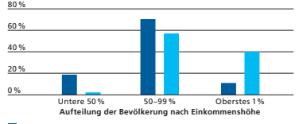
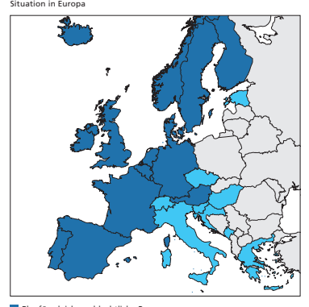

Im Detail Volksinitiative «Löhne entlasten, Kapital gerecht besteuern»

| Argumente Initiativkomitee        | 16   |
|-----------------------------------|------|
| Argumente Bundesrat und Parlament | 18   |
| Abstimmungstext                   | 20   |

| Einkommensund Vermögens - verteilung                                                                                                                                                                                                                                                                                                                                                                                                                                                                                                                                                                                                                                                                                                                                                                                                                                                                                                                                                                                                                                                                                  | In der Schweiz sind die Einkommen vor Abzug der Steuern   |
|----------------------------------------------------------------------------------------------------------------------------------------------------------------------------------------------------------------------------------------------------------------------------------------------------------------------------------------------------------------------------------------------------------------------------------------------------------------------------------------------------------------------------------------------------------------------------------------------------------------------------------------------------------------------------------------------------------------------------------------------------------------------------------------------------------------------------------------------------------------------------------------------------------------------------------------------------------------------------------------------------------------------------------------------------------------------------------|-----------------------------------------------------------|
| und Erhalt von Sozialleistungen (z.B. Renten oder Sozialhilfe)  gleichmässiger verteilt als in den meisten anderen OECD-Län dern. Auf das einkommensstärkste Prozent der Bevölkerung  entfallen gut 10% des gesamten Einkommens. Es gibt Anzei chen, dass die Einkommensungleichheit vor Abzug der Steuern  und Erhalt von Sozialleistungen in der Schweiz in den letzten  zwei Jahrzehnten leicht zugenommen hat. Der Anteil des  Kapitaleinkommens am gesamten Einkommen blieb in diesem  Zeitraum konstant. Betrachtet man die Verteilung der ver fügbaren Einkommen, also diejenigen Einkommen, die der  Bevölkerung nach Abzug der Steuern und Erhalt von Sozial leistungen tatsächlich zur Verfügung stehen, dann liegt die  Schweiz etwa im Mittelfeld der OECD-Länder. Bei den Vermö gen ist in der Schweiz der Anteil des reichsten Prozents der  Bevölkerung am Gesamtvermögen in den letzten zwei Jahr zehnten gestiegen. Um die Ungleichheiten innerhalb der  Bevölkerung zu reduzieren, erfolgt eine Umverteilung über  Steuern und Sozialleistungen. - - - - - - 1 |                                                           |
| Umverteilung  über Steuern                                                                                                                                                                                                                                                                                                                                                                                                                                                                                                                                                                                                                                                                                                                                                                                                                                                                                                                                                                                                                                                       | Bei den Einkommens- und Vermögenssteuern zahlen ein       |
| kommensstarke Personen prozentual mehr als einkommens schwache. Dadurch tragen diese Steuern zur Umverteilung bei.  So verdient zum Beispiel das einkommensstärkste Prozent der  Bevölkerung gut 10% des Gesamteinkommens, bezahlt aber  rund 40% der direkten Bundessteuer.  -  - 2                                                                                                                                                                                                                                                                                                                                                                                                                                                                                                                                                                                                                                                                                                                                                                                             |                                                           |

| 1                                                                                                                                                                                                                                                                                                                                                                                                                                                                                                                                                                                                                                                                                                                                                                                                     | Internationaler Vergleich der Einkommen: OECD 2017 (                                                                                                                                                                   | oecd.org >   |
|-------------------------------------------------------------------------------------------------------------------------------------------------------------------------------------------------------------------------------------------------------------------------------------------------------------------------------------------------------------------------------------------------------------------------------------------------------------------------------------------------------------------------------------------------------------------------------------------------------------------------------------------------------------------------------------------------------------------------------------------------------------------------------------------------------|------------------------------------------------------------------------------------------------------------------------------------------------------------------------------------------------------------------------|--------------|
| Topics > Social and Welfare Issues > Income Distribution and Poverty Database); Einkommensverteilung: Bundesamt für Statistik (BFS),  Haushaltsbudgeterhebung 1998–2018 ( bfs.admin.ch > Statistiken  fnden > Wirtschaftliche und soziale Situation der Bevölkerung >  Soziale Situation, Wohlbefnden und Armut > Ungleichheit der Ein -  kommensverteilung ); Vermögensverteilung: Eidgenössische Steuer verwaltung (ESTV), Gesamtschweizerische Vermögensstatistik der  natürlichen Personen 1997–2017 ( -   estv.admin.ch > Steuer politik  Steuerstatistiken Publikationen > Steuerstatistiken > Fachinforma - tionen > Steuer statistiken ); Anteil des Kapitaleinkommens: BFS  ( bfs.admin.ch > Statistiken fnden > Volkswirtschaft > Volkswirt - schaftliche Gesamtrechnung > Kontensequenz ). |                                                                                                                                                                                                                        |              |
| 2                                                                                                                                                                                                                                                                                                                                                                                                                                                                                                                                                                                                                                                                                                                                                                                                     | ESTV, Statistik Direkte Bundessteuer, Natürliche Personen 2017  ( estv.admin.ch > Steuerpolitik Steuerstatistiken Publikationen >  Steuerstatistiken > Fachinformationen > Steuerstatistiken > Direkte  Bundessteuer). |              |

Verteilung von Einkommen und Steuern Anteil am Gesamteinkommen und Anteil an der direkten Bundessteuer Anteil am Gesamteinkommen

Anteil an der direkten Bundessteuer Quelle: Statistik Direkte Bundessteuer der Eidgenössischen Steuerverwaltung Den Grossteil der Einkommenssteuer erheben die Kantone und Gemeinden: Auch dort bezahlen einkommensstarke Per sonen prozentual mehr Steuern. Bei den kantonalen Ein kommenssteuern ist der Anteil, der vom einkommensstärksten Prozent bezahlt wird, geringer als bei der Bundessteuer.

- 
- 
Umverteilung über Sozialleistungen Die Umverteilung von Einkommen erfolgt in der Schweiz vor allem über Sozialleistungen. Den grössten Teil der Sozial leistungen bilden die Altersvorsorge, die Gesundheitskosten sowie die Invaliden- und die Arbeitslosenversicherung. Insge samt betrugen die Ausgaben für Sozialleistungen im Jahr 2018 etwa 177 Milliarden Franken. Das entspricht, ähnlich wie in anderen westeuropäischen Ländern, rund einem Viertel der gesamten Wirtschaftsleistung. Dieser Anteil ist seit den 1990erJahren gestiegen und hat der zunehmenden wirtschaftlichen Ungleichheit in den letzten Jahrzehnten entgegengewirkt. Die Sozialleistungen einschliesslich der Altersvorsorge führen bei spielsweise dazu, dass weniger Leute unter der Armutsschwelle 
-
-
- 
sind: Der Anteil der einkommensarmen Bevölkerung sinkt da durch von über 30% auf unter 10%. Bezogen auf das verfüg bare Einkommen hat die Ungleichheit nicht zugenommen.

- 
 -
3

| nicht defniert. Unter Kapitaleinkommen kann man zum  Beispiel Zinsen, Einkünfte aus Vermietung, Dividenden und  Gewinne aus dem Verkauf von Wertpapieren oder Grund stücken verstehen. Auch bei Selbstständigerwerbenden kann  ein Teil des Einkommens als Kapitaleinkommen angesehen  werden. -   |
|----------------------------------------------------------------------------------------------------------------------------------------------------------------------------------------------------------------------------------------------------------------------------------------------------|

Geltende Einkommens besteuerung
- 
Heute müssen in der Schweiz im Grundsatz sämtliche Arten von Einkünften in vollem Umfang versteuert werden: Arbeitseinkommen (Löhne), Renten und Kapitaleinkommen. Bei der Besteuerung der Kapitaleinkommen gelten einige abweichende Bestimmungen:
- Dividenden werden nicht in vollem Umfang als Einkommen besteuert, wenn man zu mindestens 10% am Unterneh men beteiligt ist. Dividenden sind Gewinne, die Unternehmen an ihre Eigentümerinnen und Eigentümer (z.B. 

Aktionärinnen und Aktionäre) ausschütten. Grund für diese Teilbesteuerung ist, dass Gewinne bereits mit der Gewinnsteuer belastet werden. Wenn keine Beteiligung von mindestens 10% vorliegt, werden Dividenden in vollem Umfang besteuert. 

-
3 Zahlen zur sozialen Sicherheit: BFS, Gesamtrechnung der Sozialen Sicherheit 2018 ( bfs.admin.ch > Statistiken fnden > Soziale Sicherheit > Gesamtrechnung der Sozialen Sicherheit [GRSS]); Anteil der einkommensarmen Bevölkerung: BFS, Erhebung über die Einkommen und Lebensbedingungen (SILC) 2019 ( bfs.admin.ch > 
Statistiken fnden > Wirtschaftliche und soziale Situation der Bevölkerung > Soziale Situation, Wohlbefnden und Armut > Armut und materielle Entbehrung); Einkommensverteilung: BFS, Haushalts budgeterhebung 1998–2018 (
-
 bfs.admin.ch > Statistiken fnden > 
Wirtschaftliche und soziale Situation der Bevölkerung > Soziale Situation, Wohlbefnden und Armut > Ungleichheit der Einkommens verteilung
-
).

| Begriff   Kapitaleinkommen   |
|------------------------------|

- Private Grundstückgewinne werden nur auf kantonaler Ebene besteuert. Grundstückgewinne entstehen, wenn man zum Beispiel ein Haus oder ein Stück Land mit Gewinn verkauft.

- Andere private Kapitalgewinne sind steuerfrei. Solche entstehen, wenn man zum Beispiel Aktien mit Gewinn verkauft.

Weitere Steuern auf dem Kapital Kapital wird nicht nur als Kapitaleinkommen, sondern auch in anderer Form besteuert: - Die Kantone und Gemeinden erheben eine Steuer auf das Vermögen von Privatpersonen und auf das Kapital von Unternehmen. 

- Bund, Kantone und Gemeinden besteuern Gewinne. - Unternehmen bezahlen eine Umsatzabgabe beim Handel mit Wertpapieren. 

- In den meisten Kantonen wird mit der Handänderungs steuer die Eigentumsübertragung von Grundstücken besteuert. 

-
Betrachtet man die gesamte Besteuerung von Kapital, befndet sich die Schweiz im Vergleich mit den EU-Mitglied staaten über dem Durchschnitt.

-
4 4 Bericht des Bundesrates in Erfüllung des Postulats 17.3045 Schwaab vom 1. März 2017, S. 17 ( parlament.ch > Ratsbetrieb > Suche Curia Vista > 17.3045); Europäische Kommission, Implizite Steuer sätze 2007–2019 (
-
 ec.europa.eu/taxation_customs > Besteuerung >
Ökonomische Steueranalyse > Steuerdaten > Implizite Steuersätze).

Initiative zielt auf Kapitaleinkommen Den Initiantinnen und Initianten gehen die bestehende Besteuerung von Kapital und die Umverteilung zu wenig weit. Sie fordern eine höhere Besteuerung hoher Kapitaleinkom men. Kapitaleinkommen sollen bei der Steuerberechnung ab einem bestimmten Betrag anderthalbfach gezählt werden, das heisst um 50% stärker gewichtet werden als andere Einkom mensarten. Ab diesem Betrag wird jeder Franken Kapitalein kommen wie Fr. 1.50 gezählt. Die Höhe dieses Betrags wäre bei Annahme der Initiative durch das Parlament zu bestimmen. Die höhere Besteuerung würde sowohl auf Bundes- als auch auf Kantonsebene gelten.

-
-
-
Steuerbares Einkommen heute und bei Annahme der Volksinitiative Die Tabelle zeigt eine mögliche Umsetzung der Initiative an einem ver einfachten Beispiel, bei dem als Grenze für die höhere Besteuerung von Kapitaleinkommen von 100 000 Franken ausgegangen wird.

-
5

| steuerbar bei  Annahme der  Volksinitiative                          |                 |                                              |
|----------------------------------------------------------------------|-----------------|----------------------------------------------|
| Arbeitseinkommen (z.B. Lohn)                                         | 150000          | 150000                                       |
| 150000                                                               | steuerbar heute |                                              |
| Kapitaleinkommen (z.B. Zinsen  oder Einkünfte aus Vermietung) 150000 | 150000          | 175000 100000 × 100% + 50000 × 150% = 175000 |

Bei Annahme der Volksinitiative würde in diesem Beispiel das Kapitalein kommen bis 100000 Franken in der tatsächlichen Höhe versteuert (100%); der darüber liegende Betrag von 50000 Franken würde neu anderthalb fach gezählt werden (150%). Die Besteuerung des Arbeitseinkommens wäre von der Initiative nicht berührt und würde unverändert bleiben.

-
-

14 Erste Vorlage: «Löhne entlasten, Kapital gerecht besteuern»

| Steuersätze                                                                                                                                                                                                                                                                                                                                                                                                                                                                                                                                                                                                                                                                                                                                                    | Für die Berechnung der Steuern ist neben dem steuer baren   |
|----------------------------------------------------------------------------------------------------------------------------------------------------------------------------------------------------------------------------------------------------------------------------------------------------------------------------------------------------------------------------------------------------------------------------------------------------------------------------------------------------------------------------------------------------------------------------------------------------------------------------------------------------------------------------------------------------------------------------------------------------------------|-------------------------------------------------------------|
| Einkommen auch der Steuersatz massgebend. Zu den Steuer sätzen macht die Initiative keine Vorgaben. Ihre Bestimmung  liegt somit weiterhin in der Kompetenz von Bund und Kanto nen. Bei unveränderten Steuersätzen zahlen Personen für Kapi taleinkommen ab einem bestimmten Betrag mehr Steuern. - - -                                                                                                                                                                                                                                                                                                                                                                                                                                                        |                                                             |
| Umverteilung  des Mehrertrags                                                                                                                                                                                                                                                                                                                                                                                                                                                                                                                                                                                                                                                                                                                                  | Der Mehrertrag, der durch die höhere Besteuerung der        |
| Kapitaleinkommen erzielt wird, soll gemäss Initiative für eine  Steuerermässigung für Personen mit tiefen oder mittleren  Arbeitseinkommen verwendet werden oder für Leistungen  zugunsten der sozialen Wohlfahrt.                                                                                                                                                                                                                                                                                                                                                                                                                                                                                                                                             |                                                             |
| Umsetzung offen                                                                                                                                                                                                                                                                                                                                                                                                                                                                                                                                                                                                                                                                                                                                                | Die Umsetzung der Initiative ist offen. Über die konkrete   |
| Ausgestaltung der Initiative würde bei einer Annahme das  Parlament entscheiden. Es müsste unter anderem festlegen,  welche Einkünfte unter den Begriff des Kapitaleinkommens  fallen, ab welchem Betrag die höhere Besteuerung greift und  wie die Umverteilung des dadurch erzielten Mehrertrags  ausgestaltet wird.                                                                                                                                                                                                                                                                                                                                                                                                                                         |                                                             |
| Auswirkungen                                                                                                                                                                                                                                                                                                                                                                                                                                                                                                                                                                                                                                                                                                                                                   | Aufgrund der höheren Besteuerung von Kapitaleinkom          |
| men könnte es zu Verhaltensanpassungen kommen. Personen  mit hohen Kapitaleinkommen könnten zum Beispiel ihren  Wohnsitz verlegen. Im Weiteren könnte sich das Sparverhalten  ändern, weil das Einkommen, das mit dem angesparten Kapital  erzielt wird, stärker besteuert wird. Das Ausmass solcher Ver haltensanpassungen kann nicht abgeschätzt werden, auch weil  unklar ist, wie die Initiative umgesetzt würde. Daher lässt sich  auch der Mehrertrag aus der höheren Besteuerung von Kapi taleinkommen nicht beziffern. Da Kapitaleinkommen sehr  steuerempfndlich ist, dürften die von den Initiantinnen und  Initianten erhofften Mehreinnahmen kaum eintreffen. Der  damit bezweckte Umverteilungseffekt dürfte damit nicht  erreicht werden. - -  - |                                                             |

15

## Argumente Initiativkomitee

Der Kassierer im Laden, die selbstständige Grafkerin oder die Maurerin - sie alle arbeiten, um ihr Einkommen zu er zielen. Es gibt aber auch einige wenige Menschen, die nicht selbst für ihr Einkommen arbeiten müssen, sondern ihr Geld für sich arbeiten lassen. Dies geschieht durch Zinsen, Aktiengewinne oder Dividenden - kurz Kapitaleinkommen. Vermögende werden deshalb immer reicher, während die restlichen 99% der Bevölkerung unter steigenden Mieten und Krankenkassenprämien leiden.

-
Vermögens ungleichheit nimmt zu
-
Die Vermögensungleichheit nimmt seit Jahren immer weiter zu. Bereits 2016 besass das reichste Prozent der Bevölke rung 42,3% aller Vermögen.

-

 Vermögensanteil des reichsten 1 %

 Vermögensanteil der übrigen 99 %
Quelle: Vermögensstatistik der natürlichen Personen der Eidgenössischen Steuerverwaltung Der Grund dafür sind Dividenden und Aktiengewinne, welche den Reichsten immer mehr Geld in die Taschen spülen. Dieses Geld fehlt bei den Löhnen, die seit Jahren stagnieren, während die Mieten und Krankenkassenprämien steigen. Mit der Coronapandemie hat sich die Situation weiter verschärft. Die Vermögen der 300 Reichsten sind auf ein Rekordhoch von 707 Milliarden angewachsen, gleichzeitig stehen unzählige Menschen vor wirtschaftlich unsicheren Zeiten.

| Kaufkraft stärken                                                                                                                                                                                                                                                                                                                                                                                                              | Die steigende Ungleichheit schadet auch der Wirtschaft.   |
|--------------------------------------------------------------------------------------------------------------------------------------------------------------------------------------------------------------------------------------------------------------------------------------------------------------------------------------------------------------------------------------------------------------------------------|-----------------------------------------------------------|
| Ein grosser Teil der Vermögen der Reichsten wird für Spekula tionen an den Finanzmärkten verwendet und fiesst nicht in  die Realwirtschaft. Kommt das Geld hingegen den arbeitenden  Menschen zugute, wird es dem Wirtschaftskreislauf zurück geführt und die Kaufkraft steigt. Davon proftieren auch die  kleinen Betriebe, die während der Pandemie massiv gelitten  haben. - -                                              |                                                           |
| Weniger Privilegien  für Superreiche                                                                                                                                                                                                                                                                                                                                                                                           | Heute sind Kapitaleinkommen auf diverse Arten privi       |
| legiert. So müssen Grossaktionärinnen und Grossaktionäre  beispielsweise nur auf 70% ihres Kapitaleinkommens Steuern  zahlen - während alle anderen ihr gesamtes Einkommen  versteuern. Unser Wohlstand wird aber von den Menschen  geschaffen, die jeden Tag in Büros, auf Baustellen und im  Haushalt arbeiten. Heute bereichert sich das reichste 1% auf  Kosten von uns allen und wird dazu noch steuerlich bevorteilt.  - |                                                           |
| Mehr Geld  für die 99%                                                                                                                                                                                                                                                                                                                                                                                                         | Mit der 99%-Initiative sorgen wir für eine gerechtere     |
| Besteuerung von Grossaktionärinnen und Grossaktionären und  entlasten 99% der Bevölkerung. Mit den Einnahmen können  die Steuern für Menschen mit tiefen und mittleren Einkommen  gesenkt und der Service public gestärkt werden, z. . durch  Prämienverbilligungen oder mehr Geld für Kitas. Die 99%-  Initiative ist der erste Schritt zu echter Steuergerechtigkeit!   B                                                    |                                                           |

Empfehlung des Initiativkomitees Darum empfehlt das Initiativkomitee:
Ja 99prozent.ch 99prozent-ja.ch Der Text auf dieser Doppelseite stammt vom Initiativkomitee. Es ist für den Inhalt und die Wortwahl verantwortlich.

Argumente

# Bundesrat Und Parlament

| Da die Einkommen in der Schweiz im internationalen Ver - gleich gleichmässig verteilt sind, ist der Bedarf an Umver - teilung geringer. Zudem erfolgt bereits eine Umverteilung  über Steuern und Sozialleistungen. Die Initiative gefährdet  die Standortattraktivität der Schweiz und schwächt den  Anreiz zu sparen. Gerade in Krisenzeiten braucht es Er sparnisse. Der Aufbau von Kapital ist wichtig für Arbeits plätze und Wohlstand und soll nicht durch höhere Steuern  behindert werden. Bundesrat und Parlament lehnen die  Volksinitiative insbesondere aus folgenden Gründen ab: - -   |                                                           |
|-----------------------------------------------------------------------------------------------------------------------------------------------------------------------------------------------------------------------------------------------------------------------------------------------------------------------------------------------------------------------------------------------------------------------------------------------------------------------------------------------------------------------------------------------------------------------------------------------------|-----------------------------------------------------------|
| Kein Handlungs - bedarf                                                                                                                                                                                                                                                                                                                                                                                                                                                                                                                                                                             | In der Schweiz sind die Einkommen gleichmässiger verteilt |
| als in den meisten anderen OECD-Ländern. Zudem erfolgt  bereits eine bedeutende Umverteilung über Steuern und  Sozialleistungen: Die Ausgaben für Sozialleistungen betragen  gut ein Viertel der gesamten Wirtschaftsleistung. Im Weiteren  blieb der Anteil des Kapitaleinkommens am gesamten Einkom men seit Mitte der 1990er-Jahre konstant. Darum besteht kein  Handlungsbedarf. -                                                                                                                                                                                                              |                                                           |
| Initiative schafft  Ungerechtigkeiten                                                                                                                                                                                                                                                                                                                                                                                                                                                                                                                                                               | Die Initiative schafft Ungerechtigkeiten, indem sie für   |
| Kapitaleinkommen eine höhere Besteuerung fordert als für  Arbeitseinkommen. Kapitaleinkommen wird nicht ohne  Leistung erzielt. Auch Kapital muss erarbeitet werden, indem  man Einkommen erzielt und dieses auf die Seite legt.                                                                                                                                                                                                                                                                                                                                                                    |                                                           |
| Initiative gefährdet  Arbeitsplätze                                                                                                                                                                                                                                                                                                                                                                                                                                                                                                                                                                 | Eine höhere Besteuerung von Kapitaleinkommen würde        |
| den Anreiz, Ersparnisse zu bilden und damit Kapital aufzu bauen, reduzieren. Kapital wird benötigt, damit neue Unter nehmen (z.B. Start-ups) gegründet werden und bestehende  Unternehmen neue Investitionen tätigen können (z.B. in den  Ausbau von Produktionskapazitäten oder in neue Technolo gien). Der Aufbau von Kapital schafft somit Arbeitsplätze und  steigert die Produktivität. Dies durch höhere Steuern zu  behindern, ist schädlich für die Arbeitsplätze und den Wohl stand in der Schweiz. - - - -                                                                                |                                                           |

| Initiative schwächt  den Standort  Schweiz                                                                                                                                                                                                                                                                                                                                                                                                                                              | Gerade für Personen mit hohen Kapitaleinkommen           |
|-----------------------------------------------------------------------------------------------------------------------------------------------------------------------------------------------------------------------------------------------------------------------------------------------------------------------------------------------------------------------------------------------------------------------------------------------------------------------------------------|----------------------------------------------------------|
| spielen Steuern bei der Wohnortwahl eine wesentliche Rolle.  Die Initiative schwächt die Standortattraktivität der Schweiz.  Im internationalen Vergleich ist die Steuerbelastung auf  Kapital in der Schweiz bereits heute recht hoch. Grund dafür  sind die Vermögenssteuer und die hohe Besteuerung von  Dividenden, vor allem wenn keine Beteiligung von mindestens  10% vorliegt.                                                                                                  |                                                          |
| Auswirkungen  sind offen                                                                                                                                                                                                                                                                                                                                                                                                                                                                | Der Initiativtext lässt zu vieles offen: ab welcher Höhe |
| Kapitaleinkommen stärker besteuert würden, welche Einkom mensbestandteile betroffen wären und wie der Mehrertrag  umverteilt würde. Ausserdem ist Kapitaleinkommen sehr  steuerempfndlich. Die von den Initiantinnen und Initianten  erhofften Mehreinnahmen dürften kaum eintreffen. Damit  wird auch der bezweckte Umverteilungseffekt unterhöhlt.  Je nach Ausgestaltung könnte die höhere Besteuerung von  Kapital deutlich mehr Personen betreffen, als die Initiative  vorgibt. - |                                                          |
| Empfehlung  von Bundesrat  und Parlament                                                                                                                                                                                                                                                                                                                                                                                                                                                | Aus all diesen Gründen empfehlen Bundesrat und           |
| Parlament, die Volksinitiative «Löhne entlasten, Kapital  gerecht besteuern» abzulehnen.                                                                                                                                                                                                                                                                                                                                                                                                |                                                          |

## Nein

 admin.ch/besteuerung-kapital Im Detail Ehe für alle

| Argumente Referendumskomitees     | 26   |
|-----------------------------------|------|
| Argumente Bundesrat und Parlament | 28   |
| Abstimmungstext                   | 30   |

Aktuelle Rechtslage In der Schweiz können gleichgeschlechtliche Paare ihre Beziehung mit einer eingetragenen Partnerschaft anerkennen lassen. Pro Jahr tun dies etwa 700 Paare. Die eingetragene Partnerschaft ist der Ehe ähnlich, aber nicht in jeder Hinsicht gleichgestellt. Rechtliche Unterschiede zur Ehe bestehen vor allem bei der Einbürgerung, im Bereich der Fortpfanzungs medizin und bei der Adoption.

-

| Eingetragene    | Ehe                                                               |                                           |
|-----------------|-------------------------------------------------------------------|-------------------------------------------|
| Partnerschaft   |                                                                   |                                           |
| Adoption        | Nur Adoption der Kinder  der Partnerin oder des  Partners erlaubt | Ehepaar kann gemeinsam  Kinder adoptieren |
| Fortpfanzungs - | Kein Zugang zur                                                   | Zugang zur Samenspende für                |
| medizin         | Fortpfanzungsmedizin                                              | verheiratete Frauenpaare                  |
| Einbürgerung    | Ordentliche Einbürgerung                                          | Erleichterte Einbürgerung                 |

Verschiedene Familienformen Es gibt heute viele verschiedene Formen des familiären Zusammenlebens. Eine dieser Formen ist das gleichgeschlecht liche Paar mit oder ohne Kinder. Für manche dieser Paare wäre es nicht nur aus rechtlicher Sicht, sondern auch symbolisch wichtig, zivil heiraten zu können. Denn die eingetragene Partnerschaft wird nicht von allen als der Ehe gleichwertig empfunden. In zahlreichen anderen Ländern können gleich geschlechtliche Paare heiraten.

-
-

Wo gleichgeschlechtliche Paare heute heiraten können 

 eingetragene Partnerschaft (in unterschiedlicher Ausprägung)
 Ehe für gleichgeschlechtliche Paare weder Ehe noch eingetragene Partnerschaft für gleichgeschlechtliche Paare Quellen: Ehe - offzielle Website der Europäischen Union ( europa.eu/youreurope > Rat und Hilfe für EU-Bürger und ihre Familien > Familie > Paare > Ehe); Rainbow Europe Index 2020 ( ilga-europe.org > resources > Rainbow Europe > Rainbow Europe 2020)
Ausländische Ehepartnerinnen und Ehepartner können sich erleichtert einbürgern lassen. Dieses Recht gilt mit der Öffnung der Ehe auch für die ausländische Ehefrau einer Schweizerin und den ausländischen Ehemann eines Schweizers. 

Einbürgerung

| Adoption                                                                                                                                                                                                                                                                                                                                                                                                                                                                                                                                           | Wer in einer eingetragenen Partnerschaft lebt, darf      |
|----------------------------------------------------------------------------------------------------------------------------------------------------------------------------------------------------------------------------------------------------------------------------------------------------------------------------------------------------------------------------------------------------------------------------------------------------------------------------------------------------------------------------------------------------|----------------------------------------------------------|
| bereits heute das Kind des Partners oder der Partnerin adop tieren. Neu soll ein gleichgeschlechtliches Ehepaar auch  gemeinsam ein Kind adoptieren können. -                                                                                                                                                                                                                                                                                                                                                                                      |                                                          |
| Fortpfanzungs - medizin                                                                                                                                                                                                                                                                                                                                                                                                                                                                                                                            | Die Schweiz erlaubt die Samenspende einzig verheirate                                                          |
| ten Paaren. Deshalb weichen heute manche Frauenpaare ins  Ausland aus. Mit der Öffnung der Ehe wird die gesetzlich  geregelte Samenspende in der Schweiz auch verheirateten  Frauenpaaren erlaubt. Bei dieser Samenspende ist vorgeschrie ben, dass der Spender in das Samenspenderregister eingetra gen wird. Das verfassungsmässige Recht des Kindes, zu erfah ren, wer sein biologischer Vater ist, ist damit gewährleistet.  Anonyme Samenspenden bleiben verboten; dasselbe gilt auch  für die Eizellenspende und die Leihmutterschaft. - - - |                                                          |
| Keine Verfassungs - änderung                                                                                                                                                                                                                                                                                                                                                                                                                                                                                                                       | Bundesrat und Parlament sind der Auffassung, dass für    |
| die Öffnung der Ehe für gleichgeschlechtliche Paare die  Verfassung nicht geändert werden muss. Die Bundesverfas sung defniert die Ehe nicht als Verbindung zwischen Frau und  Mann. Das Parlament hat zudem entschieden, dass auch für  den Zugang zur Samenspende für verheiratete Frauenpaare  eine Gesetzesrevision genügt. -                                                                                                                                                                                                                  |                                                          |
| Umwandlung  in Ehe                                                                                                                                                                                                                                                                                                                                                                                                                                                                                                                                 | Nach der Öffnung der Ehe für gleichgeschlechtliche Paare |
| können keine neuen eingetragenen Partnerschaften mehr  geschlossen werden. Paare, die bereits in einer eingetragenen  Partnerschaft leben, können diese weiterführen oder durch  eine gemeinsame Erklärung beim Zivilstandsamt in eine Ehe  umwandeln.                                                                                                                                                                                                                                                                                             |                                                          |

Argumente

## Referendumskomitees

| Die «Ehe für alle» inklusive Samenspende für lesbische  Paare führt zu gesetzlich vorgesehener Vaterlosigkeit und  Identitätsproblemen für die betroffenen Kinder. Ehe und  Familie sind eng miteinander verknüpft, da Kinder auf  natürliche Weise nur aus einer Verbindung von Mann und  Frau entstehen. Drei verschiedene Komitees mit Parlamen tariern aus CVP/Die Mitte, EDU, EVP und SVP haben des halb das Referendum ergriffen. - -     |                                                       |
|-------------------------------------------------------------------------------------------------------------------------------------------------------------------------------------------------------------------------------------------------------------------------------------------------------------------------------------------------------------------------------------------------------------------------------------------------|-------------------------------------------------------|
| Lebensgemein - schaft von  Mann und Frau                                                                                                                                                                                                                                                                                                                                                                                                        | Bundesgericht und Bundesrat haben das Recht auf Ehe   |
| stets als eine auf Dauer angelegte Lebensgemeinschaft von  Frau und Mann interpretiert (Art. 14 der Bundesverfassung).  Nur die Verbindung von Mann und Frau hat aus sich heraus die  Fähigkeit zur Weitergabe des Lebens, weshalb sie als zentraler  Eckpfeiler von Gesellschaft und Staat zu schützen ist. Die «Ehe  für alle» mit einer blossen Gesetzesänderung einzuführen, ist  klar verfassungswidrig.                                   |                                                       |
| Keine   Diskriminierung                                                                                                                                                                                                                                                                                                                                                                                                                         | Das «Privileg» der Ehe zwischen Mann und Frau gründet |
| u. a. auf biologischen Fakten. Das ist keine Diskriminierung.  Das Gleichheitsgebot besagt, dass Gleiches gleich und Unglei ches ungleich zu behandeln ist. Die Ehe neu zu defnieren,  wäre zudem unverhältnismässig: Im Jahr 2020 wurde in der  Schweiz 35160-mal geheiratet, aber nur 651-mal eine eingetra gene Partnerschaft eingegangen. - -                                                                                               |                                                       |
| Verfassungs -widrige  SamenspendeAusweitung                                                                                                                                                                                                                                                                                                                                                                                                                                                 | Das vorliegende Gesetz erlaubt darüber hinaus - ent   |
| gegen der ursprünglichen Absicht des Bundesrates - die Samen spende für lesbische Paare. Damit verstösst die «Ehe für alle»  gegen Artikel 119 der Bundesverfassung. Dieser erlaubt näm lich die medizinisch unterstützte Fortpfanzung auch hetero sexuellen Paaren nur bei Unfruchtbarkeit oder der Gefahr einer schweren Krankheit. Lesbische Paare als unfruchtbar einzu stufen, widerspricht dabei allen gültigen Defnitionen. - -   -  - - |                                                       |

| Kindeswohl bleibt  auf der Strecke                                                                                                                                                                                                                                                                                                                                                                                                                                                                                                        | Die Samenspende wird vom medizinischen Ausnahmefall   |
|-------------------------------------------------------------------------------------------------------------------------------------------------------------------------------------------------------------------------------------------------------------------------------------------------------------------------------------------------------------------------------------------------------------------------------------------------------------------------------------------------------------------------------------------|-------------------------------------------------------|
| zum gesetzlichen Regelfall - ohne Rücksicht auf die Konse quenzen für die Kinder. Das Recht, seine beiden biologischen  Eltern zu kennen und von ihnen betreut zu werden, bleibt den  Kindern bis zum 18. Lebensjahr grundsätzlich verwehrt. Dabei  ist die Verwurzelung in der Ursprungsfamilie für die kindliche  Identitätsbildung zentral. Die Samenspende soll darum die  Ausnahme bleiben. Kinder brauchen Vorbilder von beiden  Geschlechtern - die Samenspende für lesbische Paare verwehrt  ihnen jedoch per Gesetz den Vater. - |                                                       |
| Leihmutterschaft  als Nächstes?                                                                                                                                                                                                                                                                                                                                                                                                                                                                                                           | Indem «Unfruchtbarkeit» in der Gesetzesvorlage verfas |
| sungswidrig in «unerfüllten Kinderwunsch» umgedeutet wird,  können sich künftig auch weitere Gruppen (Alleinstehende,  schwule Paare) auf ihren unerfüllten Kinderwunsch berufen.  Bald dürften Forderungen nach der Eizellenspende und der  ethisch fragwürdigen Leihmutterschaft folgen. -                                                                                                                                                                                                                                              |                                                       |
| Empfehlung der  Referendums - komitees                                                                                                                                                                                                                                                                                                                                                                                                                                                                                                    | Darum empfehlen die Referendumskomitees: Nein         |

 ehefueralle-nein.ch nein-zur-samenspende-für-gleichgeschlechtliche-paare.ch mariage-homosexuel.ch Der Text auf dieser Doppelseite stammt von den Referendumskomitees. Sie sind für den Inhalt und die Wortwahl verantwortlich.

## Argumente

# Bundesrat Und Parlament

| Paare gleichen Geschlechts sollen dieselben Rechte haben  wie Paare verschiedenen Geschlechts. Auch sie sollen  heiraten können. Die Öffnung der Ehe führt ausserdem zu  einer rechtlichen Gleichbehandlung bei der Einbürgerung,  der Adoption und der Fortpfanzungsmedizin. Für die Ehe  zwischen Frau und Mann ändert sich nichts. Bundesrat  und Parlament befürworten die Vorlage insbesondere aus  den folgenden Gründen:                                                                                      |                                                         |
|----------------------------------------------------------------------------------------------------------------------------------------------------------------------------------------------------------------------------------------------------------------------------------------------------------------------------------------------------------------------------------------------------------------------------------------------------------------------------------------------------------------------|---------------------------------------------------------|
| Individuelle  Freiheiten                                                                                                                                                                                                                                                                                                                                                                                                                                                                                             | Der Staat soll den Menschen nicht vorschreiben, wie sie |
| ihr Privat- und Familienleben zu gestalten haben. Ob und wie  ein Paar seine Partnerschaft rechtlich regeln will, soll ihm  freigestellt werden. Bereits heute bilden gleichgeschlechtliche  Paare mit oder ohne Kinder Lebensgemeinschaften. Hingegen  können sie heute nicht heiraten, sondern lediglich eine  eingetragene Partnerschaft eingehen. Diese ist der Ehe nicht in  allen Bereichen gleichgestellt. Die Öffnung der Ehe beseitigt  diese Ungleichbehandlung. Niemandem entsteht dadurch ein  Nachteil. |                                                         |
| Kindeswohl bleibt  gewahrt                                                                                                                                                                                                                                                                                                                                                                                                                                                                                           | In der Schweiz wachsen bereits heute Kinder in Familien |
| gleichgeschlechtlicher Paare auf. Diese Konstellation wirkt sich  nicht nachteilig auf ihre Entwicklung aus, wie Studien zeigen.1 Welche Zuwendung und Fürsorge Eltern ihren Kindern zukom - men lassen, ist keine Frage der Familienform oder des Ge - schlechts. Deshalb ist es richtig, dass auch gleichgeschlechtliche  Ehepaare Kinder gemeinsam adoptieren dürfen und dass auch  verheiratete Frauenpaare Zugang zur Samenspende erhalten.                                                                     |                                                         |

1 Nationale Ethikkommission im Bereich der Humanmedizin, Stellung nahme Nr. 32/2019 «Samenspende», Bern, 12. Dezember 2019, S. 20 (
- 
 nek-cne.admin.ch > Publikationen > Stellungnahmen).

| Recht auf Kenntnis  der Abstammung                                                                                                                                                                                                                                                                                                                                                                                                                       | Die Verfassung hält fest, dass jede Person Anrecht auf   |
|----------------------------------------------------------------------------------------------------------------------------------------------------------------------------------------------------------------------------------------------------------------------------------------------------------------------------------------------------------------------------------------------------------------------------------------------------------|----------------------------------------------------------|
| Kenntnis ihrer Abstammung hat. Weil das Gesetz die Samen spende in der Schweiz nur für verheiratete Paare zulässt,  entscheiden sich heute manche Frauenpaare für eine Samen spende im Ausland. Dort ist nicht immer gewährleistet, dass  das Kind erfahren kann, wer sein biologischer Vater ist. Mit  der Öffnung der Ehe und dem Zugang zur streng regulierten  Samenspende in der Schweiz bleibt das Recht auf Kenntnis der  Abstammung gewahrt. - - |                                                          |
| Strikt geregelte  Fortpfanzungs - medizin                                                                                                                                                                                                                                                                                                                                                                                                                | Die Vorlage sieht keine weiteren Anpassungen in der      |
| Fortpfanzungsmedizin vor. Die anonyme Samenspende, die  Eizellenspende und die Leihmutterschaft bleiben für alle Paare  verboten. So haben alle Ehepaare, auch gleichgeschlechtliche,  im Bereich der Fortpfanzungsmedizin gleiche Rechte.                                                                                                                                                                                                               |                                                          |
| Verfassung erlaubt  Ehe für alle                                                                                                                                                                                                                                                                                                                                                                                                                         | Für Bundesrat und Parlament gibt es keinen Grund, warum  |
| gleichgeschlechtliche Paare nicht heiraten dürfen sollen. Für  die Öffnung der Ehe braucht es keine Verfassungsänderung.  Die Verfassung defniert die Ehe nicht als Verbindung zwischen  Frau und Mann.                                                                                                                                                                                                                                                  |                                                          |
| Empfehlung  von Bundesrat  und Parlament                                                                                                                                                                                                                                                                                                                                                                                                                 | Aus all diesen Gründen empfehlen Bundesrat und Parla     |
| ment, die Änderung des Schweizerischen Zivilgesetzbuches  (Ehe für alle) anzunehmen.                                                                                                                                                                                                                                                                                                                                                                     | -                                                        |

Ja admin.ch/ehe-fuer-alle