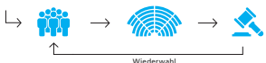

# Im Detail Pflegeinitiative

| Ausgangslage                                                                                                                                                                                                                                                                                                                                                                                                                                                                                                                                                                                 | Die Pfege ist ein wichtiger Pfeiler der medizinischen Ver   |
|----------------------------------------------------------------------------------------------------------------------------------------------------------------------------------------------------------------------------------------------------------------------------------------------------------------------------------------------------------------------------------------------------------------------------------------------------------------------------------------------------------------------------------------------------------------------------------------------|-------------------------------------------------------------|
| sorgung, und der Bedarf steigt laufend. Weil es immer mehr  ältere Menschen gibt, werden in den nächsten Jahren auch  Krankheiten wie Krebs, Diabetes oder Herz-Kreislauf-Erkran kungen zunehmen. Damit die Qualität der Pfege erhalten  bleibt, müssen mehr Pfegende ausgebildet werden. -  -                                                                                                                                                                                                                                                                                               |                                                             |
| Initiative                                                                                                                                                                                                                                                                                                                                                                                                                                                                                                                                                                                   | Die Initiative verlangt, dass Bund und Kantone die Pfege    |
| als wichtigen Bestandteil der Gesundheitsversorgung anerken nen und fördern. Der Zugang zu einer Pfege von hoher Quali tät soll für alle Menschen garantiert sein. Bund und Kantone  sollen sicherstellen, dass genügend diplomierte Pfegefachper sonen zur Verfügung stehen. Zudem sollen die in der Pfege  tätigen Personen entsprechend ihrer Ausbildung und ihren  Kompetenzen arbeiten können, damit die Pfegequalität nicht  leidet. Im Detail verlangt die Initiative Regelungen bei den  Arbeitsbedingungen, der Abgeltung, der berufichen Entwick lung und der Abrechnung. - -  - - |                                                             |

Arbeitsbedingungen Die Initiative verlangt vom Bund, die Arbeitsbedingungen in den Spitälern, Heimen und Spitexorganisationen verbindlich zu regeln. Er müsste zum Beispiel Vorgaben machen zur Höhe der Löhne oder für eine bessere Vereinbarkeit von Familie und Beruf sorgen, etwa durch Vorschriften in Bezug auf die Dienst pläne. Damit würde der Bund in die Zuständigkeiten der Kan
- 
- 

| Argumente Initiativkomitee        | 14   |
|-----------------------------------|------|
| Argumente Bundesrat und Parlament | 16   |
| Abstimmungstext                   | 18   |

| tone, Betriebe und Sozialpartner (Arbeitgeber- und Arbeitneh merverbände) eingreifen. Diese regeln heute die Arbeitsbedin gungen und die Löhne gemeinsam. - -                                                                                                                                                            |                                                          |
|--------------------------------------------------------------------------------------------------------------------------------------------------------------------------------------------------------------------------------------------------------------------------------------------------------------------------|----------------------------------------------------------|
| Abgeltung                                                                                                                                                                                                                                                                                                                | Der Bund müsste auch eine angemessene Abgeltung der      |
| Pfegeleistungen sicherstellen. Würden diese mit einem  höheren Tarif abgegolten, könnten die Betriebe nach Ansicht  der Initiantinnen und Initianten etwa die Arbeit auf mehr  Pfegefachkräfte verteilen. Dies würde den Beruf attraktiver  machen und die Pfege verbessern.                                             |                                                          |
| Berufiche   Entwicklung                                                                                                                                                                                                                                                                                                  | Die Initiative verlangt, dass der Bund weitere Bestimmun |
| gen zur berufichen Entwicklung erlässt, die den Beruf aufwer ten und Pfegenden zusätzliche Perspektiven eröffnen. So sollen die in der Pfege tätigen Personen länger im Beruf bleiben. - -                                                                                                                               |                                                          |
| Direkte Abrechnung  von Leistungen                                                                                                                                                                                                                                                                                       | Zudem verlangt die Initiative, dass Pfegefachpersonen    |
| künftig gewisse Leistungen direkt mit der obligatorischen  Krankenpfegeversicherung oder anderen Sozialversicherungen  abrechnen können. Heute können sie grundsätzlich nur die  Leistungen abrechnen, die von einer Ärztin oder einem Arzt  angeordnet worden sind.                                                     |                                                          |
| Bisherige   Massnahmen                                                                                                                                                                                                                                                                                                   | Der Bund und die Kantone haben in den vergangenen        |
| Jahren zahlreiche Massnahmen zur Stärkung des Pfegeberufs  ergriffen. Diese setzen bei der Berufsausübung und bei der  Ausbildung an.                                                                                                                                                                                    |                                                          |
| Grössere Autonomie                                                                                                                                                                                                                                                                                                       | Seit Anfang 2020 können Pfegefachpersonen autonomer      |
| arbeiten. Nach einer ersten ärztlichen Anordnung können sie  den Pfegebedarf selber ermitteln und gewisse Leistungen  ohne weitere Zustimmung einer Ärztin oder eines Arztes  erbringen. Beispiele sind die Grundpfege oder gewisse  Beratungen.                                                                         |                                                          |
| Masterplan Bildung  Pfegeberufe                                                                                                                                                                                                                                                                                          | Mit dem von Bund und Kantonen mitgetragenen Master       |
| plan Bildung Pfegeberufe wurden verschiedene Massnahmen  umgesetzt. Diese haben dazu beigetragen, dass in den letzten  Jahren die Anzahl der Abschlüsse deutlich erhöht werden  konnte: in der berufichen Grundbildung, auf Diplomstufe und  auch bei Nachdiplomstudiengängen wie etwa in der Intensiv krankenpfege. - - |                                                          |

Stärkung Berufsbild Viele Pfegende steigen im Laufe ihres Berufslebens aus dem Beruf aus. Sie wechseln die Branche oder geben die Erwerbstätigkeit auf. Der Bund hat Massnahmen ergriffen, um das Berufsbild der Pfegenden zu stärken, damit sie länger im Beruf verbleiben oder wieder einsteigen. So wurden ein Wiedereinstiegsprogramm, Programme für die bessere Zusam menarbeit zwischen den Berufsgruppen im Gesundheitswesen und eine Imagekampagne für die Langzeitpfege gestartet. Der Bund hat zudem Massnahmen ergriffen, um die Verein barkeit von Beruf und Familie zu verbessern und pfegende Angehörige zu entlasten.

-
-

## Indirekter Gegenvorschlag

Auch Bundesrat und Parlament wollen den Pfegeberuf weiter stär ken. Ihnen geht die Volksinitiative jedoch zu weit, insbesondere bei den Arbeitsbedingungen und der Abgeltung. Das Parlament hat deshalb einen indirekten Gegenvorschlag
-
1 verabschiedet, der die wichtigsten Forderungen der Initiative aufnimmt und eine raschere Umsetzung ermöglicht. Um die Ausbildung zu fördern, stellen Bund und Kantone für die nächsten acht Jahre rund eine Milliarde Fran ken zur Verfügung. Im Rahmen dieser Ausbildungsoffensive sind folgende Massnahmen vorgesehen:
-
- Studierende, die eine Pfegeausbildung an einer Fachhochschule oder höheren Fachschule absolvieren, sollen bei Bedarf fnanziell unterstützt werden. 

- Spitäler, Pfegeheime und Spitexorganisationen erhalten für ihre Arbeit in der praktischen Ausbildung diplomierter Pfegefach kräfte Unterstützungsbeiträge. 

-
- Fachhochschulen und höhere Fachschulen erhalten Zuschüsse, wenn sie die Zahl der Ausbildungsplätze erhöhen. 

Auch der indirekte Gegenvorschlag ermöglicht es, dass Pfegefach personen gewisse Leistungen direkt zulasten der obligatorischen Krankenpfegeversicherung abrechnen können. Ein Kontrollmecha nismus soll verhindern, dass es zu einer Zunahme an Leistungen und damit zu höheren Gesundheitskosten kommt, die zu einem An stieg der Krankenkassenprämien zulasten der Bevölkerung führen würden. Das Parlament hat den Gegenvorschlag mit deutlicher Mehrheit angenommen. Er tritt in Kraft, wenn die Initiative abge lehnt wird und er nicht erfolgreich mit einem Referendum bekämpft wird.

-
-
- 
- 
1 Bundesgesetz vom 19. März 2021 über die Förderung der Ausbildung im Bereich der Pfege ( parlament.ch > Ratsbetrieb > Alle Schluss abstimmungstexte > Frühjahrssession 2021
- 
)
Vergleich Initiative und indirekter Gegenvorschlag Bei Annahme der Initiative müssen Bundesrat und Parlament einen Gesetzestext ausarbeiten, der die Initiative umsetzt. Der Gegenvorschlag umfasst bereits konkrete Bestimmungen zur Umsetzung.

| umfasst bereits konkrete Bestimmungen zur Umsetzung. Pflegeinitiative Indirekter Gegenvorschlag Genügend  diplomierte  Pflegefach - kräfte Konkrete Umsetzung offen Bis zu 1 Mrd. Franken  für Ausbildungsoffensive Arbeits - Bund sorgt für anforde bedingungen  rungsgerechte Arbeits bedingungen - - Keine neue Regelung: Arbeitsbedingungen und  Löhne bleiben primär in  Zuständigkeit der Kantone,  Betriebe und Sozialpartner Konkrete Umsetzung offen Abgeltung Bund sorgt für eine ange messene Abgeltung der  Pfegeleistungen - Keine neue Regelung: Bundesrat und Parlament  halten Abgeltung der  Pfegeleistungen für ange - messen Konkrete Umsetzung offen Berufliche  Bund sorgt für Möglich Entwicklung keiten der berufichen  Entwicklung - Keine neue Regelung:  Bildungsakteure bleiben  zuständig für Entwicklung  der Berufsbilder Konkrete Umsetzung offen Direkte  Abrechnung  zulasten  Krankenkasse Konkrete Umsetzung offen -  Kontrollmechanismus,  damit Kosten nicht   steigen  Zulassungsbeschränkung:  Steigen Kosten über durchschnittlich, können  Kantone Zahl der Pfege fachpersonen oder  Pfegeorganisationen  beschränken, die direkt  abrechnen -  - -   |
|------------------------------------------------------------------------------------------------------------------------------------------------------------------------------------------------------------------------------------------------------------------------------------------------------------------------------------------------------------------------------------------------------------------------------------------------------------------------------------------------------------------------------------------------------------------------------------------------------------------------------------------------------------------------------------------------------------------------------------------------------------------------------------------------------------------------------------------------------------------------------------------------------------------------------------------------------------------------------------------------------------------------------------------------------------------------------------------------------------------------------------------------------------------------------------------------|

Argumente

## Initiativkomitee

| Der Pflegenotstand ist längst Realität. Zu wenig Pflegende  werden ausgebildet, zu viele verlassen den Beruf erschöpft  nach wenigen Jahren. Nur dank einer zunehmenden An zahl Pflegender aus dem Ausland kann die Versorgung  aufrechterhalten werden. Der indirekte Gegenvorschlag  des Parlaments ist ungenügend. Er fokussiert auf die Aus bildung. Es fehlen Massnahmen, damit Pflegende länger im  Beruf bleiben. Ein Ja zur Pflegeinitiative stellt sicher, dass  auch in Zukunft alle eine gute Pflege erhalten. - -                                                                |                                                      |
|----------------------------------------------------------------------------------------------------------------------------------------------------------------------------------------------------------------------------------------------------------------------------------------------------------------------------------------------------------------------------------------------------------------------------------------------------------------------------------------------------------------------------------------------------------------------------------------------|------------------------------------------------------|
| Pflegenotstand  beseitigen                                                                                                                                                                                                                                                                                                                                                                                                                                                                                                                                                                   | In der Schweiz leiden immer mehr Menschen an chroni  |
| schen Krankheiten. Der Pfegebedarf der Bevölkerung steigt,  darum braucht es mehr Pfegepersonal. Die Schweiz bildet  kaum die Hälfte des benötigten diplomierten Pfegefachperso nals selbst aus. Derzeit sind mehr als 10 00 Pfegestellen  unbesetzt. In keinem anderen Beruf gibt es mehr offene  Stellen. Über 40 Prozent der Pfegenden steigen nach wenigen  Jahren wieder aus dem Beruf aus. - -  0                                                                                                                                                                                      |                                                      |
| Berufsausstiege  verhindern                                                                                                                                                                                                                                                                                                                                                                                                                                                                                                                                                                  | Neben einer massiven Ausbildungsoffensive müssen die |
| Arbeitsbedingungen der Pfegenden verbessert und ihre  Kompetenzen anerkannt werden, damit sie länger im Beruf  bleiben. Wichtig für die Berufszufriedenheit sind die Zahl der  Pfegenden pro Schicht, die frühzeitige Bekanntgabe von Ein satzplänen, Weiterentwicklungsmöglichkeiten und der Lohn.  Nur dank Pfegenden aus dem Ausland kann die Gesundheits versorgung in der Schweiz aufrechterhalten werden. Die  Rekrutierung ausländischer Fachpersonen schwächt die  Gesundheitsversorgung in deren Heimatländern. Die Schweiz  muss selber mehr eigenes Pfegepersonal ausbilden. -  - |                                                      |

| Pflegequalität  sichern                                                                                                                                                                                                                                                                                                                                                                                                                                                                                                                                                            | Um die Sicherheit der Patientinnen und Patienten und   |
|------------------------------------------------------------------------------------------------------------------------------------------------------------------------------------------------------------------------------------------------------------------------------------------------------------------------------------------------------------------------------------------------------------------------------------------------------------------------------------------------------------------------------------------------------------------------------------|--------------------------------------------------------|
| eine gute Pfegequalität zu garantieren, braucht es jederzeit  genügend und korrekt eingesetztes Pfegepersonal auf allen  Abteilungen. Die Spitäler, Kliniken, Heime und der ambulante  Bereich brauchen dafür die nötigen fnanziellen Mittel. Die  Stärkung der Pfege lohnt sich. Viel Leid kann verhindert  werden. Genügend diplomiertes Pfegefachpersonal verringert  das Komplikations- und Sterberisiko der Patientinnen und  Patienten. Unnötige Kosten durch lange und erneute Spitalauf enthalte werden vermieden; dieser Zusammenhang ist wissen schaftlich bewiesen. - - |                                                        |
| Gegenvorschlag  ist ungenügend                                                                                                                                                                                                                                                                                                                                                                                                                                                                                                                                                     | Der vom Parlament erarbeitete indirekte Gegenvorschlag |
| konzentriert sich auf Investitionen in die Ausbildung. Frühzei tige Berufsausstiege können dadurch nicht verhindert werden.  Es fehlen Massnahmen, welche die Pfegequalität sichern und  die Arbeitsbedingungen verbessern. Die Investitionen des  Parlaments in die Ausbildung verpuffen.  -                                                                                                                                                                                                                                                                                      |                                                        |
| Empfehlung des  Initiativkomitees                                                                                                                                                                                                                                                                                                                                                                                                                                                                                                                                                  | Darum empfehlt das Initiativkomitee: Ja                |

 pfegeinitiative.ch Der Text auf dieser Doppelseite stammt vom Initiativkomitee. Es ist für den Inhalt und die Wortwahl verantwortlich.

Argumente

# Bundesrat Und Parlament

| Die Arbeit der Pflegenden ist für die Bevölkerung von gros ser Bedeutung. Für Bundesrat und Parlament geht die  Initiative jedoch zu weit, unter anderem weil sie will, dass  der Bund die Arbeitsbedingungen regelt. Um die Pflege  rasch zu stärken, haben Bundesrat und Parlament einen in direkten Gegenvorschlag ausgearbeitet. Dieser sieht rund  eine Milliarde Franken für eine Ausbildungsoffensive vor,  und Pflegefachpersonen sollen mehr Kompetenzen beim  Abrechnen erhalten. Bundesrat und Parlament lehnen die  Initiative insbesondere aus folgenden Gründen ab: -  -   |                                                          |
|------------------------------------------------------------------------------------------------------------------------------------------------------------------------------------------------------------------------------------------------------------------------------------------------------------------------------------------------------------------------------------------------------------------------------------------------------------------------------------------------------------------------------------------------------------------------------------------|----------------------------------------------------------|
| Keine Regelung  der Löhne  durch den Bund                                                                                                                                                                                                                                                                                                                                                                                                                                                                                                                                                | Gute Arbeitsbedingungen und faire Löhne sind wichtig,    |
| damit der Pfegeberuf attraktiv ist und die in der Pfege tätigen  Personen möglichst lange im Beruf verbleiben. Dafür sollen  weiterhin Spitäler, Heime und Spitexorganisationen sowie die  Kantone und die Sozialpartner gemeinsam sorgen. Sie kennen  die Verhältnisse vor Ort am besten. Löhne und Arbeitsbedin - gungen sollen nicht durch den Bund geregelt werden.                                                                                                                                                                                                                  |                                                          |
| Keine Sonder stellung eines  Berufs -                                                                                                                                                                                                                                                                                                                                                                                                                                                                                                                                                    | Die Pfege ist ein wichtiger Teil der medizinischen Grund |
| versorgung, die bereits in der Verfassung verankert ist. Bundes rat und Parlament wollen die Pfege nicht noch gesondert er wähnen. Damit würde eine Berufsgruppe eine Sonderstellung  in der Verfassung erhalten. - -  -                                                                                                                                                                                                                                                                                                                                                                 |                                                          |
| Direkte Abrechnung  nur mit Kosten - kontrolle                                                                                                                                                                                                                                                                                                                                                                                                                                                                                                                                           | Der Gegenvorschlag nimmt mit der direkten Abrechnung     |
| ein Anliegen der Initiative auf, sieht aber einen Kontrollmecha nismus vor. Der Bundesrat unternimmt seit einigen Jahren  grosse Anstrengungen, um den Anstieg der Gesundheitskosten  zu bremsen. Die Kosten sollen nur in dem Umfang steigen, wie  sie medizinisch begründbar sind. Bei einer direkten Abrech nung ohne Kontrollmechanismus besteht die Gefahr, dass  die Gesundheitskosten und damit die Krankenkassenprämien  steigen. - -                                                                                                                                            |                                                          |

| Eine Milliarde  Franken für  Ausbildungs - offensive                                                                                                                                                                                                                                                                                                                                                                                                                                       | Die grösste Herausforderung ist der Mangel an Pfege   |
|--------------------------------------------------------------------------------------------------------------------------------------------------------------------------------------------------------------------------------------------------------------------------------------------------------------------------------------------------------------------------------------------------------------------------------------------------------------------------------------------|-------------------------------------------------------|
| fachkräften. Bundesrat und Parlament haben deshalb in ihrem  Gegenvorschlag eine Ausbildungsoffensive beschlossen, für  die rasch rund eine Milliarde Franken zur Verfügung steht.  Damit könnten die dringend benötigten Ausbildungsplätze für  Pfegefach personen geschaffen und diese in Aus- und Weiter bildung fnanziell unterstützt werden. - -                                                                                                                                      |                                                       |
| Gegenvorschlag  stärkt die Pflege  rasch                                                                                                                                                                                                                                                                                                                                                                                                                                                   | Bundesrat und Parlament möchten die Pfege rasch und   |
| wirkungsvoll stärken. In ihrem indirekten Gegenvorschlag  nehmen sie die Forderungen der Initiative weitgehend auf.  Der Gegenvorschlag enthält konkrete Massnahmen, die vom  Parlament bereits verabschiedet sind und rasch umgesetzt  werden können. Bei Annahme der Initiative fällt dieser Gegen - vorschlag dahin. Bundesrat und Parlament müssten ein neues  Gesetz ausarbeiten und durch den parlamentarischen Prozess  bringen, was zu einer deutlichen Verzögerung führen könnte. |                                                       |
| Empfehlung  von Bundesrat  und Parlament                                                                                                                                                                                                                                                                                                                                                                                                                                                   | Aus all diesen Gründen empfehlen Bundesrat und        |
| Parlament, die Pfegeinitiative abzulehnen.                                                                                                                                                                                                                                                                                                                                                                                                                                                 |                                                       |

Nein admin.ch/pfegeinitiative

# Im Detail Justiz-Initiative

| Argumente Initiativkomitee        | 24   |
|-----------------------------------|------|
| Argumente Bundesrat und Parlament | 26   |
| Abstimmungstext                   | 28   |

| Ausgangslage                                                                                                                                                                                                                                                                                                                                                                                                                                                                                                                                                                                                                                                                                                                                                                                                                                                    | Heute wählt die Vereinigte Bundesversammlung (das            |
|-----------------------------------------------------------------------------------------------------------------------------------------------------------------------------------------------------------------------------------------------------------------------------------------------------------------------------------------------------------------------------------------------------------------------------------------------------------------------------------------------------------------------------------------------------------------------------------------------------------------------------------------------------------------------------------------------------------------------------------------------------------------------------------------------------------------------------------------------------------------|--------------------------------------------------------------|
| Parlament) die Bundesrichterinnen und Bundesrichter. Die  Gerichtskommission des Parlaments schreibt die freien Richter stellen aus und prüft die Bewerbungen. Danach schlägt sie  dem Parlament fachlich und persönlich geeignete Personen zur  Wahl vor. Sie achtet dabei freiwillig darauf, dass die Amts sprachen und die verschiedenen politischen Kräfte am Bundes gericht möglichst angemessen vertreten sind. Sie kann weitere  Aspekte wie das Geschlecht und die regionale Herkunft  berücksichtigen. Das Parlament wählt die Richterinnen und  Richter für eine sechsjährige Amtsdauer; alle sechs Jahre fnden  Gesamterneuerungswahlen statt. Die amtierenden Richterin nen und Richter werden in der Regel wiedergewählt. Seit 1874  verwehrte das Parlament lediglich zwei Richtern eine weitere  Amtsperiode - beiden aus Altersgründen. - - - - |                                                              |
| Einführung eines  Losverfahrens                                                                                                                                                                                                                                                                                                                                                                                                                                                                                                                                                                                                                                                                                                                                                                                                                                 | Die Justiz-Initiative verlangt, dass anstelle des Parlaments |
| neu das Los die Bundesrichterinnen und Bundesrichter be stimmt. Das Losverfahren muss dabei so ausgestaltet sein, dass  die Amtssprachen am Bundesgericht wie heute angemessen  vertreten sind. Wie das Verfahren darüber hinaus umgesetzt  wird, überlässt die Initiative dem Gesetzgeber. -                                                                                                                                                                                                                                                                                                                                                                                                                                                                                                                                                                   |                                                              |
| Zulassung zum  Losverfahren                                                                                                                                                                                                                                                                                                                                                                                                                                                                                                                                                                                                                                                                                                                                                                                                                                     | Wer am Losverfahren teilnehmen darf, würde eine unab         |
| hängige Fachkommission entscheiden. Sie dürfte ausschliesslich  Personen zum Losentscheid zulassen, die fachlich und persön lich für das Richteramt geeignet sind. Was konkret unter per sönlicher und fachlicher Eignung zu verstehen ist, könnte der  Gesetzgeber festlegen. -  - -                                                                                                                                                                                                                                                                                                                                                                                                                                                                                                                                                                           |                                                              |

Ernennung der Fachkommission Gemäss Initiative ernennt der Bundesrat die Mitglieder der Fachkommission für eine einmalige Amtsdauer von zwölf Jahren. Die Mitglieder müssten in ihrer Tätigkeit von Behörden und politischen Organisationen unabhängig sein. Wie sich die Fachkommission zusammensetzt, gibt die Initiative nicht vor.

Amtsdauer und Amtsenthebung Einmal per Los bestimmt, könnten Bundesrichterinnen und Bundesrichter ihr Amt bis fünf Jahre über das ordentliche Rentenalter hinaus ausüben. Anders als heute müssten sie sich keiner Wiederwahl stellen. Das Parlament könnte die Richterin nen und Richter auf Antrag des Bundesrates nur in zwei Fällen abberufen: Wenn sie ihre Amtspfichten schwer verletzt haben oder wenn sie die Fähigkeit, das Amt auszuüben, auf Dauer verloren haben - zum Beispiel aus gesundheitlichen Gründen.

-
Bundesrichterwahlen Heute: Parlamentarische 

 Gerichtskommission emp fehlt Kandidatinnen und Kandidaten 
-
Bundesversammlung wählt Bundesrichte rinnen und -richter
- 

| Amtsdauer:  6 Jahre   |
|-----------------------|

Wiederwahl
Bei Annahme der Initiative:
Los bestimmt 

 Bundesrichte rinnen und -richter
- 
Unabhängige Fach kommission entscheidet, wer zum Losverfahren zugelassen wird
- 

Amtsenthebung

möglich

| Amtsdauer:  Pensionsalter  + 5 Jahre   |
|----------------------------------------|

## Mandatssteuer

Heute zahlen Richterinnen und Richter - ebenso wie die Mitglieder von Regie rungen oder Parlamenten - auf Bundesebene und in den Kantonen in aller Regel einen Teil ihres Gehalts an ihre Partei (sogenannte Mandatssteuer). Diese Zahlung ist nicht gesetzlich vorgeschrieben. Die Mandatssteuer ist entstanden, weil die Schweiz im Gegensatz zu anderen Ländern keine staatliche Parteienfnan zierung kennt. Die Mandatssteuer kommt im Initiativtext nicht vor. Trotzdem versprechen sich die Initiantinnen und Initianten eine faktische Abschaffung der Mandatssteuer für Bundesrichterinnen und Bundesrichter, weil diese aufgrund des Losverfahrens unab hängiger von den Parteien wären. Das Parlament diskutiert losge löst vom Wahlverfahren und von der Initiative über die Abschaf fung der Mandatssteuer.

-
-
-
-

## Argumente

# Initiativkomitee

Die Schweiz ignoriert die Gewaltentrennung zwischen Politik und Justiz als Grundsatz für einen Rechtsstaat.

Bundesgericht: unter Druck der Parteien Im heutigen System bestimmen allein die Parteien, wer ein Amt am höchsten Gericht bekommt. Eine Richterin oder ein Richter muss einer Partei angehören und dieser jährlich eine Mandatssteuer bezahlen, damit sie oder er das Amt bekommt, obwohl schon im Bundesbrief von 1291 steht: «Wir haben einhellig gelobt, dass wir in den Tälern keinen Richter anerken nen, der das Amt irgendwie um Geld oder Geldeswert erwor ben hat.»
-
-
Nur rund 5 Prozent der Bevölkerung gehören einer Partei an. Bestqualifzierte parteilose Bewerberinnen und Bewerber haben keine Chance, Richterin oder Richter am höchsten Gericht zu werden. Fachliche Kompetenz ist im besten Fall zweitrangig. 

Um im Amt bleiben zu können, müssen sich Bundesrichte rinnen und Bundesrichter alle sechs Jahre einer Wiederwahl stellen. Mit dieser Drohung sichern sich Parteien und Behörden ihren Einfuss auf die Justiz. 

-
Das heutige System erschwert oder verhindert unabhän gige Urteile. Rechtsuchende, die das System kennen, können kein Vertrauen in die Justiz haben. Auch immer mehr politische Entscheide werden nicht in den Parlamenten gefällt, sondern durch das höchste Gericht. Dieses entscheidet als verlängerter Arm der Behörden und Parteien - unter Umgehung der Volksrechte.

-
Die Justiz-Initiative will Gerechtigkeit
- Jede Person kann sich, ohne Parteimitglied zu sein, um ein Richteramt am höchsten Gericht bewerben. Parteien dürfen keine Ämter mehr verkaufen und Richterinnen und Richter dürfen keine mehr kaufen.

- Eine unabhängige Fachkommission prüft die Bewerbun gen auf fachliche und persönliche Eignung.

-
- Unter den Kandidierenden, welche die Prüfung durch die unabhängige Fachkommission bestehen, entscheidet das Los.

- Dieses qualifzierte Losverfahren ermöglicht allen Kandi dierenden ohne Gesichtsverlust die mehrmalige Teilnah me bei künftigen Richterbestimmungen.

-
-
- Durch die Berücksichtigung der Landessprachen wird die kulturelle Vielfalt der Schweiz gewahrt.

- Eine Wiederwahl der Richterinnen und Richter fällt weg. 

Die Richterinnen und Richter können bis max. fünf Jahre über das übliche Pensionsalter hinaus im Amt bleiben.

- Wer die Amtspfichten schwer verletzt, kann des Richter amtes enthoben werden.

-
Wollen Sie unab hängige Richterin nen und Richter?

-
-
Dann setzen Sie sich ein für Gerechtigkeit. 

Bekämpfen Sie die Verfechtungen zwischen Politik, Justiz und Behörden.

Empfehlung des Initiativkomitees Darum empfehlt das Initiativkomitee:
Ja justiz-initiative.ch Argumente

# Bundesrat Und Parlament

| Das heutige System der Bundesrichterwahl durch das Par lament ist bewährt, demokratisch und transparent. Die  Justiz-Initiative will dieses System durch ein Losverfahren  ersetzen, bei dem der Zufall entscheidet. Bundesrat und  Parlament lehnen die Vorlage insbesondere aus folgenden  Gründen ab: -                                                                                                                                                                                                                                                                                                                                                                                            |                                                       |
|-------------------------------------------------------------------------------------------------------------------------------------------------------------------------------------------------------------------------------------------------------------------------------------------------------------------------------------------------------------------------------------------------------------------------------------------------------------------------------------------------------------------------------------------------------------------------------------------------------------------------------------------------------------------------------------------------------|-------------------------------------------------------|
| Demokratische  Wahl statt   Losglück                                                                                                                                                                                                                                                                                                                                                                                                                                                                                                                                                                                                                                                                  | Das heutige System hat sich bewährt. Heute wählt das  |
| Parlament die Bundesrichterinnen und Bundesrichter. Die Wahl  ist öffentlich. Das Parlament trägt als Wahlorgan die politische  Verantwortung. Das Bundesgericht ist dadurch demokratisch  legitimiert. Das Losverfahren schwächt die demokratische  Legitimation des Bundesgerichts: An die Stelle regelmässiger  Wahlen durch das Parlament tritt eine einmalige Losziehung.  Der Zufall macht dabei nicht zwingend die geeignetsten Per sonen zu Richterinnen und Richtern, sondern jene, die am  meisten Glück haben. Die Richterwahl mittels Los ist unserem  Rechtssystem fremd und widerspricht der politischen Tradition  der Schweiz. Kein einziger Kanton lost seine Justizbehörden  aus. - |                                                       |
| Ausgewogene  Vertretung  in Gefahr                                                                                                                                                                                                                                                                                                                                                                                                                                                                                                                                                                                                                                                                    | Heute nimmt das Parlament bei der Wahl traditionsge - |
| mäss Rücksicht auf die Wählerstärke der politischen Parteien  (Parteienproporz). Damit ist gewährleistet, dass die verschiede nen gesellschaftlichen Strömungen und politischen Grundhal tungen am Bundesgericht ausgewogen vertreten sind. Das  stärkt die Akzeptanz der Rechtsprechung in der Bevölkerung.  Im heutigen Wahlverfahren kann das Parlament zudem wei tere Kriterien wie das Geschlecht, das Alter oder die Herkunft  beachten. All dies kann ein Losverfahren nicht oder nicht im  gleichen Umfang sicherstellen. Es besteht im Gegenteil das  Risiko, dass gewisse Parteien, Werthaltungen, Landesteile oder  ein Geschlecht für lange Zeit am Bundesgericht stark überoder untervertreten sind. - - -                                                                                                                                                                                                                                                                                                                                                                                                                                                                                                                                                                                                                                                                                                       |                                                       |

| Parteizugehörig keit schafft  Transparenz -                                                                                                                                                                                                                                                                                                                                                              | Jede Richterin und jeder Richter hat einen persönlichen,   |
|----------------------------------------------------------------------------------------------------------------------------------------------------------------------------------------------------------------------------------------------------------------------------------------------------------------------------------------------------------------------------------------------------------|------------------------------------------------------------|
| kulturellen und sozialen Erfahrungshintergrund. Dieser schlägt  sich in politischen Grundhaltungen nieder, unabhängig davon,  ob man einer Partei angehört oder nicht. Eine Parteizugehö - rigkeit macht diese Grundhaltungen transparent.                                                                                                                                                               |                                                            |
| Bundesgericht ist  heute unabhängig                                                                                                                                                                                                                                                                                                                                                                      | Gemäss Initiativkomitee urteilen Richterinnen und Richter  |
| in Abhängigkeit von den Parteien, weil sie befürchten müssen,  nicht wiedergewählt zu werden. Dies entspricht nicht der  Realität. Die Praxis zeigt, dass Bundesrichterinnen und Bundes richter unabhängig urteilen. Diese Unabhängigkeit ist von der  Verfassung geschützt. Das Parlament hat zudem noch nie eine  Bundesrichterin oder einen Bundesrichter wegen eines Urteils  nicht wiedergewählt. - |                                                            |

Empfehlung von Bundesrat und Parlament Aus all diesen Gründen empfehlen Bundesrat und Parla ment, die Justiz-Initiative abzulehnen.

-

Nein

 admin.ch/justiz-initiative Im Detail 

# Änderung Vom 19. März 2021 Des Covid-19-Gesetzes

Ausgangslage Nach Ausbruch der Coronapandemie im Frühjahr 2020 musste der Bundesrat rasch reagieren. Er ergriff weitreichende Massnahmen, um die Pandemie einzudämmen und ihre gesund heitlichen, wirtschaftlichen und gesellschaftlichen Auswirkun gen abzufedern. Anfangs musste er zum Teil Notrecht erlassen, weil sich das Virus rasant ausbreitete und rasche Entscheide vonnöten waren. Diese Möglichkeit gibt ihm die Bundesverfas sung. Ab dem 25. September 2020 konnte er sich auf das vom Parlament beschlossene und sofort in Kraft gesetzte Covid-19- Gesetz stützen. Die Pandemie blieb unberechenbar, weshalb das Parlament das Gesetz in jeder Session an die Entwicklung anpasste: am 18. Dezember 2020, am 19. März 2021 und am 18. Juni 2021.

-
-
-
1 Zweite Abstimmung zu diesem Gesetz Über das Covid-19-Gesetz wurde bereits einmal abge stimmt. Gegen die Fassung vom 25. September 2020 war das Referendum zustande gekommen. In der Abstimmung vom 13. Juni 2021 nahmen die Stimmberechtigten das Gesetz mit 60 Prozent an. Auch gegen die Änderungen vom 19. März 2021 wurde ein Referendum ergriffen, weshalb über diese Anpas sungen abgestimmt wird.

-
-
1 Stand bei Redaktionsschluss der «Erläuterungen des Bundesrates» 
(25. August 2021)

| Argumente Referendumskomitees     | 34   |
|-----------------------------------|------|
| Argumente Bundesrat und Parlament | 36   |
| Abstimmungstext                   | 38   |

Mehr finanzielle Hilfe

| Im Verlauf der Pandemie zeigte sich, dass es mehr fnan                                                                                                                                                                                                                                                                                                                                                                                                                                                                                                                                                                                                                                                                                                                                                                                                                                                                                                                                                                                                                                                                                                                                                                                                                                                                                                                                                                                                                                                                                                            |
|-------------------------------------------------------------------------------------------------------------------------------------------------------------------------------------------------------------------------------------------------------------------------------------------------------------------------------------------------------------------------------------------------------------------------------------------------------------------------------------------------------------------------------------------------------------------------------------------------------------------------------------------------------------------------------------------------------------------------------------------------------------------------------------------------------------------------------------------------------------------------------------------------------------------------------------------------------------------------------------------------------------------------------------------------------------------------------------------------------------------------------------------------------------------------------------------------------------------------------------------------------------------------------------------------------------------------------------------------------------------------------------------------------------------------------------------------------------------------------------------------------------------------------------------------------------------|
| zielle Hilfen braucht. Die Änderungen des Covid-19-Gesetzes  berücksichtigen dies. Konkret stimmen wir über folgende  fnanzielle Massnahmen ab: -  - Ausweitung der Härtefallhilfe auf zusätzliche Unterneh men, die wegen der Pandemie vorübergehend schliessen  mussten oder hohe Umsatzeinbussen erlitten - - Ausweitung des Erwerbsersatzes für Selbstständigerwer bende; Anspruch auf Corona-Erwerbsersatz hat neu, wer  einen Umsatzrückgang von 30 statt wie vorher 40 Prozent  hat - - Ausweitung der Kurzarbeitsentschädigung, um Kündi - gungen zu verhindern und Arbeitsplätze zu retten - zusätzliche Taggelder der Arbeitslosenversicherung für  arbeitslose Personen - Entschädigungen für Publikumsanlässe von überkantona ler Bedeutung, die wegen Corona nicht stattfnden  konnten oder können - - weniger strenge Bedingungen für Finanzhilfen an  Profsportclubs - Ausweitung der Finanzhilfen für Institutionen der  familienergänzenden Kinderbetreuung, die wegen  Corona schliessen mussten; unterstützt werden neu auch  Institutionen der öffentlichen Hand - Ausweitung der Finanzhilfe für Kultur und Kulturschaf - fende auf freischaffende Künstlerinnen und Künstler - Ausgleich von Werbeverlusten der privaten Radio- und  Fernsehstationen bis zu einem bestimmten Betrag Nebst den Bestimmungen zu den fnanziellen Massnah men nahm das Parlament am 19. März 2021 auch folgende  Punkte in das Gesetz auf, um mit der Entwicklung der Pande mie Schritt zu halten: - - Das Contact-Tracing ist im Epidemiengesetz geregelt und |

Weitere Anpassungen an die Entwicklung Contact-TracingSystem Das Contact-Tracing ist im Epidemiengesetz geregelt und liegt schon heute in der Zuständigkeit der Kantone. Mit einer Ergänzung des Covid-19-Gesetzes erhielt der Bund die Aufgabe, in Zusammenarbeit mit den Kantonen ein funktionierendes, schweizweites Contact-Tracing-System sicherzustellen, das den Datenschutz gewährleistet. Der Bund kann die Kantone dazu verpfichten, die Rückverfolgung von Infektionen zu verbessern.

Dafür entschädigt er die Kantone für ihren Aufwand.

| Covid-Zertifkat                                                                                                                                                                                                                                                                                                                                                                                                                                                                                                                                                                                                                                                                                                                                                                                                                                                                                                                                             | Das Parlament hat die gesetzliche Grundlage für ein inter   |
|-------------------------------------------------------------------------------------------------------------------------------------------------------------------------------------------------------------------------------------------------------------------------------------------------------------------------------------------------------------------------------------------------------------------------------------------------------------------------------------------------------------------------------------------------------------------------------------------------------------------------------------------------------------------------------------------------------------------------------------------------------------------------------------------------------------------------------------------------------------------------------------------------------------------------------------------------------------|-------------------------------------------------------------|
| national anerkanntes Covid-Zertifkat geschaffen. Das Zerti f kat ist freiwillig und steht allen offen. Es erlaubt es, eine  Covid-19-Impfung, eine durchgemachte Erkrankung oder ein  negatives Testergebnis einheitlich und fälschungssicher zu  dokumentieren. Andere Länder, wie auch die EU, haben eben falls einen solchen Nachweis geschaffen und setzen ihn im  Alltag teilweise breiter ein als die Schweiz. Das Zertifkat  erleichtert deshalb nicht nur Reisen ins Ausland, sondern auch  den Aufenthalt vor Ort. Im Inland wird mit dem Zertifkat das  epidemiologische Risiko bestimmter Veranstaltungen redu ziert, sodass diese nicht verboten werden müssen. Sollte sich  die Lage wieder stark verschlechtern, könnte der Einsatz des  Zertifkats auch dazu beitragen, Schliessungen wie im Frühling  2020 oder im ersten Halbjahr 2021 zu verhindern. Bis im  Sommer 2021 wurden rund 7,5 Millionen Zertifkate ausge stellt. -  - -  - - 2 |                                                             |
| Befreiung von  Quarantäne                                                                                                                                                                                                                                                                                                                                                                                                                                                                                                                                                                                                                                                                                                                                                                                                                                                                                                                                   | Mit den Anpassungen vom März 2021 gibt es auch              |
| Erleichterungen für geimpfte und genesene Personen. Sie  müssen nach einem Kontakt mit einer positiv getesteten  Person nicht mehr in Quarantäne.                                                                                                                                                                                                                                                                                                                                                                                                                                                                                                                                                                                                                                                                                                                                                                                                           |                                                             |
| Förderung von Tests                                                                                                                                                                                                                                                                                                                                                                                                                                                                                                                                                                                                                                                                                                                                                                                                                                                                                                                                         | Die Anpassungen des Covid-19-Gesetzes vom März 2021         |
| präzisieren die Finanzierung der Covid-Tests durch den Bund.  Er soll Covid-Tests fördern und die ungedeckten Kosten tragen.                                                                                                                                                                                                                                                                                                                                                                                                                                                                                                                                                                                                                                                                                                                                                                                                                                |                                                             |
| Wichtige   medizinische Güter                                                                                                                                                                                                                                                                                                                                                                                                                                                                                                                                                                                                                                                                                                                                                                                                                                                                                                                               | Das Gesetz erlaubt es dem Bundesrat, wichtige medizini      |
| sche Güter nicht nur zu beschaffen, sondern auch herstellen zu  lassen. Auf dieser Grundlage hat er das Bundesamt für Gesund heit und Innosuisse beauftragt, ein bis Ende 2022 befristetes  Programm zur Förderung der Entwicklung und Herstellung von  Covid-19-Arzneimitteln umzusetzen. - -                                                                                                                                                                                                                                                                                                                                                                                                                                                                                                                                                                                                                                                              |                                                             |

2 Stand bei Redaktionsschluss der «Erläuterungen des Bundesrates» 
( covid19.admin.ch > Übersicht)

| Politische Rechte                                                                                                                                                                                                                                                                                                                                                                                                                                                                                                                                                                                                                                                                     | Das Parlament hat beschlossen, dass Unterschriften neu   |
|---------------------------------------------------------------------------------------------------------------------------------------------------------------------------------------------------------------------------------------------------------------------------------------------------------------------------------------------------------------------------------------------------------------------------------------------------------------------------------------------------------------------------------------------------------------------------------------------------------------------------------------------------------------------------------------|----------------------------------------------------------|
| nicht nur für Referenden, sondern auch für Volksinitiativen  vorübergehend ohne Bescheinigung der Gemeinde eingereicht  werden können. Dieser Schritt erfolgte, um die demokrati schen Grundrechte zu wahren, weil das Sammeln von Unter schriften in der aktuellen Lage erschwert ist. - -                                                                                                                                                                                                                                                                                                                                                                                           |                                                          |
| Vorgaben für den  Bundesrat                                                                                                                                                                                                                                                                                                                                                                                                                                                                                                                                                                                                                                                           | Die Änderung vom 19. März 2021 führte zusätzliche        |
| Vorgaben für den Bundesrat ein. Er muss die Kantonsregierun gen in seine Krisenpolitik noch stärker einbeziehen. Zudem  muss er die Einschränkung des wirtschaftlichen und gesell schaftlichen Lebens so gering wie möglich halten. Bund und  Kantone müssen deshalb die Möglichkeiten von Tests, Impfun gen und des Contact-Tracings ausschöpfen. - - -                                                                                                                                                                                                                                                                                                                              |                                                          |
| Was geschieht bei  einem Nein?                                                                                                                                                                                                                                                                                                                                                                                                                                                                                                                                                                                                                                                        | Die Abstimmung von Ende November 2021 bezieht sich nur   |
| auf die Änderungen des Covid-19-Gesetzes vom 19. März 2021.  Die restlichen Bestimmungen des Gesetzes bleiben unabhängig  vom Ausgang der Abstimmung in Kraft. Werden diese Ände rungen von der Stimmbevölkerung abgelehnt, treten sie ein  Jahr später ausser Kraft, also am 19. März 2022. - 3  Dies beträfe  zum Beispiel die zusätzlichen Taggelder für arbeitslose Perso nen, die Ausweitung der Kurzarbeitsentschädigung oder die  Entschädigung von Veranstaltern. Es könnten keine Covid-Zer tifkate mehr ausgestellt werden, auch nicht für Auslandsreisen  und -aufenthalte. Zudem wären die Programme zur Förderung  wichtiger medizinischer Güter nicht mehr möglich. - - |                                                          |
| Vom Covid-19-  Gesetz unabhängi -ge Massnahmen                                                                                                                                                                                                                                                                                                                                                                                                                                                                                                                                                                                                                                        | Um die Pandemie zu bekämpfen, stützt sich der Bundes     |
| rat in erster Linie auf das Epidemiengesetz. Dieses ermöglicht  Massnahmen wie die Maskentragpficht im öffentlichen Ver kehr, die Schliessung gewisser Einrichtungen oder das Verbot  von Veranstaltungen. Diese Massnahmen könnten auch bei  einem Nein zur Änderung des Covid-19-Gesetzes weitergeführt  oder wieder eingeführt werden. - -                                                                                                                                                                                                                                                                                                                                         |                                                          |

Argumente

## Referendumskomitees

| Wir sagen Nein zu dieser unnötigen und extremen Gesetzes revision. Um uns vor Covid oder anderen Krankheiten zu  schützen, genügen die bestehenden Gesetze. Es braucht  keine weiteren extremen Verschärfungen durch eine er neute Gesetzesrevision, denn diese führt zu einer Spaltung  der Schweiz und zu einer massiven Überwachung von uns  allen. Warum? - -                                                                                                                                                                                         |                                                      |
|-----------------------------------------------------------------------------------------------------------------------------------------------------------------------------------------------------------------------------------------------------------------------------------------------------------------------------------------------------------------------------------------------------------------------------------------------------------------------------------------------------------------------------------------------------------|------------------------------------------------------|
| Indirekter Impf - zwang für alle                                                                                                                                                                                                                                                                                                                                                                                                                                                                                                                          | Die unnötige Gesetzesrevision führt dazu, dass die   |
| strengen Quarantänevorschriften ausschliesslich für Menschen  gelten, die sich nicht impfen lassen wollen oder können.  Gleichzeitig sollen Einschränkungen für Geimpfte aufgehoben  werden - dies, obwohl sie nach wie vor ansteckend sein  können. Das ist pure Diskriminierung, die sich aus medizini scher Sicht nicht begründen lässt. Das ist unschweizerisch.  Menschen verlieren ihre Stelle, weil sie sich nicht impfen lassen  wollen. Das führt zu einem indirekten Impfzwang für alle und  setzt ein gefährliches Beispiel für die Zukunft. - |                                                      |
| Spaltung  der Schweiz                                                                                                                                                                                                                                                                                                                                                                                                                                                                                                                                     | Zu den extremen Verschärfungen zählt auch die Einfüh |
| rung eines Covid-Zertifkats, ohne das gesunde Menschen nicht  mehr vollständig am gesellschaftlichen und wirtschaftlichen  Leben teilnehmen können. Kein Fussballmatch, keine Open Airs  usw. für alle, die keinen unnützen staatlichen Gesundheitspass  haben. Das ist ungerecht, führt zu einer Spaltung der Gesell schaft und gefährdet den sozialen Frieden. - -                                                                                                                                                                                      |                                                      |
| Elektronische  Massen -überwachung                                                                                                                                                                                                                                                                                                                                                                                                                                                                                                                        | Das Gesetz fordert, dass der Bund «ein umfassendes,  |
| wirksames und digitales Contact-Tracing» schweizweit sicher stellt. Der Bundesrat muss also laut dem Gesetz diese komplet te digitale Überwachung aller Bürgerinnen und Bürger einfüh ren. Damit halten chinesische Zustände Einzug in der Schweiz. - - -                                                                                                                                                                                                                                                                                                 |                                                      |

| Machtausweitung  des Bunderates                                                                                                                                                                                                                                                                                                               | Neu heisst es im Gesetz: «Der Bundesrat legt die Kriterien   |
|-----------------------------------------------------------------------------------------------------------------------------------------------------------------------------------------------------------------------------------------------------------------------------------------------------------------------------------------------|--------------------------------------------------------------|
| und Richtwerte für Einschränkungen und Erleichterungen des  wirtschaftlichen und gesellschaftlichen Lebens fest.» Der  Bundesrat erhält damit die Kontrolle über das gesamte Leben  der Bürger.                                                                                                                                               |                                                              |
| Lassen Sie sich  nicht täuschen!                                                                                                                                                                                                                                                                                                              | Die bestehenden Gesetze genügen, um uns vor Pande            |
| mien zu schützen. Und: Auch ohne die unnötige und extreme  Revision können wir ins Ausland reisen. Lassen Sie sich also  nicht täuschen! Sorgen Sie dafür, dass unsere Schweiz weiter hin ein Land bleibt, in dem alle die gleichen Rechte haben und  niemand überwacht wird. Sagen Sie deshalb Nein zur Revision  des Covid-19-Gesetzes! - - |                                                              |
| Empfehlung der                                                                                                                                                                                                                                                                                                                                | Darum empfehlen die Referendumskomitees:                     |

Empfehlung der Referendums komitees
-

| Nein   |
|--------|

 covidgesetz-nein.ch Der Text auf dieser Doppelseite stammt von den Referendumskomitees. Sie sind für den Inhalt und die Wortwahl verantwortlich.

Argumente

## Bundesrat Und Parlament

| Das Covid-19-Gesetz ermöglicht es, die von der Pandemie  besonders betroffenen Menschen und Unternehmen zu  unterstützen. Die Gesetzesänderungen vom 19. März 2021  braucht es, weil die Entwicklung der Pandemie mehr finan zielle Hilfe nötig machte. Das Covid-Zertifikat erleichtert  das Reisen erheblich und vermindert das Risiko bei Ver anstaltungen. Bundesrat und Parlament befürworten die  Änderungen insbesondere aus den folgenden Gründen: - -   |                                                         |
|------------------------------------------------------------------------------------------------------------------------------------------------------------------------------------------------------------------------------------------------------------------------------------------------------------------------------------------------------------------------------------------------------------------------------------------------------------------|---------------------------------------------------------|
| Covid-Zertifikat  vermeidet Verbote  und Schliessungen                                                                                                                                                                                                                                                                                                                                                                                                           | Mit dem Covid-Zertifkat können Auslandsreisen und -auf  |
| enthalte erleichtert und Veranstaltungen ermöglicht werden.  Das Zertifkat ist sicher und freiwillig und steht allen offen:  Wer nicht geimpft oder genesen ist, kann sich testen lassen.  Von einer Impfpficht kann keine Rede sein. Ohne Zertifkat  würde das Reisen stark erschwert. Je nach Entwicklung der  Pandemie müssten ohne Zertifkat Grossveranstaltungen mit  Publikum verboten und allenfalls sogar erneute Schliessungen  geprüft werden. -       |                                                         |
| Contact-Tracing  weiterentwickeln                                                                                                                                                                                                                                                                                                                                                                                                                                | Das Contact-Tracing ist zentral, um eine Pandemie zu be |
| wältigen. Es erlaubt, Infektionsketten rasch zu unterbrechen.  Das Gesetz ermöglicht es, dass der Bund die Kantone fnanziell  unterstützt und das Contact-Tracing laufend weiterentwickelt  und stärker digitalisiert. Der strenge Datenschutz bleibt  gewahrt. -                                                                                                                                                                                                |                                                         |
| Demokratische  Mitbestimmung  gewährleistet                                                                                                                                                                                                                                                                                                                                                                                                                      | Das Covid-19-Gesetz ist im ordentlichen demokratischen  |
| Verfahren entstanden - das gilt auch für die Änderungen  vom 19. März 2021. Das vom Parlament beschlossene Gesetz  setzt dem Bundesrat klare Leitplanken, ermöglicht die ge meinsame Krisenbewältigung und sichert die demokratische  Mitbestimmung. -                                                                                                                                                                                                           |                                                         |

| Dringende Hilfe  für Menschen  und Unternehmen                                                                                                                                                                                                                                                                                               | Viele Unternehmen, Selbstständigerwerbende, Kultur      |
|----------------------------------------------------------------------------------------------------------------------------------------------------------------------------------------------------------------------------------------------------------------------------------------------------------------------------------------------|---------------------------------------------------------|
| schaffende, Sportclubs oder Kitas erlitten wegen der Pandemie  starke Umsatzrückgänge, oder sie mussten vorübergehend  schliessen. Dank der Ausweitung der fnanziellen Hilfsprogram me von Bund und Kantonen kommen sie besser durch die  Krise. Für die weitere Krisenbekämpfung braucht es die vor gesehene gesetzliche Grundlage. - - -   |                                                         |
| Planungssicherheit  für Unternehmen                                                                                                                                                                                                                                                                                                          | Unternehmen können weiter mit einer zusätzlichen Unter  |
| stützung für Kurzarbeit rechnen. Veranstalter können Anlässe  organisieren im Wissen, dass ihre Verluste bei pandemiebeding ter Absage zum Teil gedeckt sind. Dank der Änderung des  Covid-19-Gesetzes vom 19. März können Betriebe längerfristig  planen. Ein Nein hätte für sie und ihre Angestellten grosse  Unsicherheit zur Folge. -  - |                                                         |
| Gefährdung der  Krisenbewältigung                                                                                                                                                                                                                                                                                                            | Die Pandemie bleibt unberechenbar. Bundesrat, Parlament |
| und Kantone haben bewiesen, dass sie die Einschränkungen  so gering wie möglich halten und Eigenverantwortung hoch  gewichten. Ein Nein zu den Änderungen des Gesetzes würde  die bewährte Krisenbewältigung gefährden.                                                                                                                      |                                                         |
| Empfehlung  von Bundesrat  und Parlament                                                                                                                                                                                                                                                                                                     | Aus all diesen Gründen empfehlen Bundesrat und Parla    |
| ment, die Änderung vom 19. März 2021 des Covid-19-Gesetzes  anzunehmen. -                                                                                                                                                                                                                                                                    |                                                         |

## Ja

 admin.ch/aenderung-covid-19-gesetz