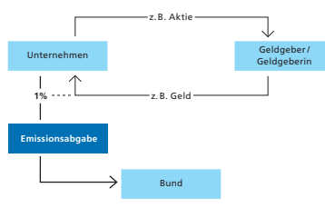
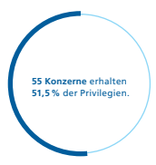
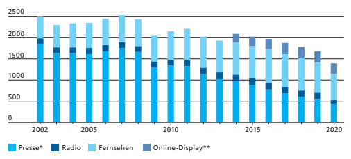
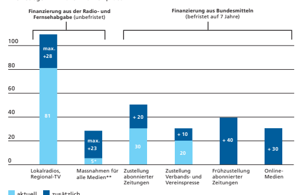

Im Detail Volksinitiative «Ja zum Tierund Menschenversuchsverbot - 
Ja zu Forschungswegen mit Impulsen für Sicherheit und Fortschritt»

| Argumente Initiativkomitee        | 18   |
|-----------------------------------|------|
| Argumente Bundesrat und Parlament | 20   |
| Abstimmungstext                   | 22   |

| Ausgangslage Tierversuche   |
|-----------------------------|

Tierversuche dienen unter anderem dazu, Krankheiten zu erforschen, die Wirksamkeit und Sicherheit von Medikamenten zu überprüfen oder die Vorgänge im Körper besser zu verste hen. Die Schweiz hat eines der weltweit strengsten Gesetze für Tierversuche.

-
1 Ein Tierversuch darf nur durchgeführt werden, wenn er mehrere gesetzliche Anforderungen erfüllt. Dazu ge hören unter anderem:
- 
- Der Versuch darf nur stattfnden, wenn gleichwertige Erkenntnisse anders nicht gewonnen werden können. 

- Die Belastung der Tiere muss so gering wie möglich sein. - Der mögliche Nutzen für die Gesellschaft muss gewichtig sein. 

- Es dürfen nicht mehr Tiere als notwendig eingesetzt werden. Die Forschung am Menschen ist detailliert geregelt, um Würde, Persönlichkeit und Gesundheit des Menschen zu schüt zen. Sie ist nur dann erlaubt, wenn sie mehrere Bedingungen erfüllt. Dazu gehören unter anderem:
- 
- Interesse, Gesundheit und Wohlergehen des einzelnen Menschen müssen Vorrang haben gegenüber den Interes sen der Wissenschaft und der Gesellschaft.

- 
- Forschung mit Personen ist nur erlaubt, wenn gleichwer tige Erkenntnisse anders nicht gewonnen werden können.

-
- Die beteiligten Personen müssen gut informiert und ein verstanden sein. 

- 
- Die Forschung muss von einer kantonalen Ethikkommis sion vorgängig geprüft und bewilligt werden. 

-
Zusätzliche Bedingungen gelten für die Forschung mit urteilsunfähigen Personen. Dazu zählen unter anderem Kleinkinder.

Forschung am Menschen

## 1 Animal Protection Index ( Api.Worldanimalprotection.Org)

| Prüfung von  Gesuchen für  Tierversuche                                                                                                                                                                                                                                                                                                                                                                                                                                                                                                                                    | Jedes Gesuch für die Durchführung eines Tierversuchs      |
|----------------------------------------------------------------------------------------------------------------------------------------------------------------------------------------------------------------------------------------------------------------------------------------------------------------------------------------------------------------------------------------------------------------------------------------------------------------------------------------------------------------------------------------------------------------------------|-----------------------------------------------------------|
| wird von einer kantonalen Tierversuchskommission geprüft. In  diesen Kommissionen sind auch Tierschutzorganisationen  vertreten. Die Kommissionen prüfen insbesondere, ob der  mögliche Nutzen für die Gesellschaft die Belastung der Tiere  rechtfertigt. So werden Tierversuche für Kosmetikprodukte in  der Schweiz grundsätzlich nicht bewilligt, da sie keine gewich tigen neuen Erkenntnisse bringen und die Belastung der Tiere  daher nicht gerechtfertigt wäre. -                                                                                                 |                                                           |
| Nutzen der   Forschung                                                                                                                                                                                                                                                                                                                                                                                                                                                                                                                                                     | Tierversuche haben grosse Fortschritte für die Gesundheit |
| von Menschen und Tieren ermöglicht, zum Beispiel durch die  Entwicklung von Antibiotika. Tierversuche erlauben es, eine  Substanz an komplexen lebenden Organismen zu prüfen. Das selbe gilt für die Forschung am Menschen. Wenn immer möglich werden Tierversuche oder Forschung mit Personen ersetzt,  etwa durch Computersimulationen oder die Forschung an bio logischem Material, das beispielsweise bei Operationen anfällt. -  -                                                                                                                                    |                                                           |
| Entwicklung  der Anzahl   Tierversuche                                                                                                                                                                                                                                                                                                                                                                                                                                                                                                                                     | In den letzten 40 Jahren hat der Einsatz von Versuchs     |
| tieren stark abgenommen - von knapp 2 Millionen Anfang der  1980er-Jahre auf rund 560000 im Jahr 2020. - 2  Die grosse  Mehrheit der Versuchstiere sind Ratten und Mäuse. Für rund  235000 Tiere (40 Prozent) waren die Versuche nicht schmerz haft: Den Tieren wurden keine Schäden zugefügt, und sie  wurden nicht in Angst versetzt. Zu diesen unbelastenden  Versuchen gehörten beispielsweise Beobachtungs- und  Verhaltensstudien. Rund 20 00 Tiere (3,5 Prozent) waren  dagegen einer schweren Belastung ausgesetzt, etwa durch die  Verpfanzung eines Tumors. -  0 |                                                           |

2 Bericht Tierversuchsstatistik 2020 ( blv.admin.ch > Tiere > 
Tierversuche > Bericht Tierversuchsstatistik 2020)

| Forderungen der  Initiative Verbot von Tier- und  Menschenversuchen                                                                                                                                                                                                                                                                                                                                                                                                                                                         | Die Volksinitiative fordert ein totales Verbot von Tier   |
|-----------------------------------------------------------------------------------------------------------------------------------------------------------------------------------------------------------------------------------------------------------------------------------------------------------------------------------------------------------------------------------------------------------------------------------------------------------------------------------------------------------------------------|-----------------------------------------------------------|
| versuchen in der Schweiz. Davon wäre beispielsweise die Ent wicklung neuer Medikamente, Therapien und Chemikalien  betroffen. Aber auch in der wissenschaftlichen Lehre und  Grundlagenforschung wären Tierversuche verboten. Ebenso  verboten wären sogenannte Menschenversuche. Der Initiativ text lässt offen, ob damit jegliche Forschung am Menschen  gemeint ist. Diese umfasst nicht nur Forschung in Medizin und  Biologie, sondern beispielsweise auch in der Psychologie oder  in den Sportwissenschaften. - -  - |                                                           |
| Importverbot                                                                                                                                                                                                                                                                                                                                                                                                                                                                                                                | Die Initiative will auch den Import von neuen Produkten   |
| und Produktbestandteilen verbieten, die mit Tierversuchen  entwickelt wurden. Davon wären zum Beispiel Medikamente  und einzelne Wirkstoffe von Medikamenten betroffen.  Bestehende Produkte dürften nur noch importiert werden,  wenn für die Herstellung keine Tierversuche mehr durchge - führt werden.                                                                                                                                                                                                                  |                                                           |
| Förderung  tierversuchsfreier  Forschung                                                                                                                                                                                                                                                                                                                                                                                                                                                                                    | Die Initiative fordert weiter, dass die tierversuchsfreie |
| Forschung mindestens dieselbe staatliche Unterstützung erhält  wie heute die Forschung mit Tierversuchen.                                                                                                                                                                                                                                                                                                                                                                                                                   |                                                           |
| Erstanwendungen  erlaubt                                                                                                                                                                                                                                                                                                                                                                                                                                                                                                    | Die Initiative erlaubt unter bestimmten Bedingungen,      |
| neue Substanzen bei Mensch und Tier einzusetzen: Die Anwen dung muss im überwiegenden Interesse der betroffenen  Menschen und Tiere liegen, erfolgversprechend sein sowie  kontrolliert und vorsichtig vollzogen werden. Die Initiantinnen  und Initianten bezeichnen dies als Erstanwendung. Wie sich  Erstanwendungen von Versuchen unterscheiden, lässt die  Initiative offen. -                                                                                                                                         |                                                           |

| Folgen der  Initiative Auswirkungen auf  Versorgung                                                                                                                                                                                                                                                                                                                                                                                                                                                                                                                                                                                                                                                                                                                                                           | Neue Medikamente, die im Ausland mithilfe von Tierver   |
|---------------------------------------------------------------------------------------------------------------------------------------------------------------------------------------------------------------------------------------------------------------------------------------------------------------------------------------------------------------------------------------------------------------------------------------------------------------------------------------------------------------------------------------------------------------------------------------------------------------------------------------------------------------------------------------------------------------------------------------------------------------------------------------------------------------|---------------------------------------------------------|
| suchen entwickelt werden, dürften nicht mehr importiert  werden - auch dann nicht, wenn sie wirksamer wären oder  weniger Nebenwirkungen hätten als bereits zugelassene Medi kamente. Bereits zugelassene Medikamente, die erneut an  Tieren getestet werden, dürften ebenfalls nicht mehr impor tiert werden. Dazu gehören zum Beispiel Grippeimpfstoffe, die  jährlich an die Veränderungen des Grippevirus angepasst  werden. Die Menschen könnten solche Medikamente nur noch  auf eigene Kosten im Ausland kaufen oder sich dort behandeln  lassen. Auch die Versorgung mit weiteren Produkten wäre  eingeschränkt, weil auch diese Produkte zum Teil mit Tierver suchen entwickelt werden, so etwa Medizinprodukte wie  Herzschrittmacher oder Chemikalien wie gewisse Pfanzen schutzmittel. - -  - - - |                                                         |
| Auswirkungen  auf Forschung  und Wirtschaft                                                                                                                                                                                                                                                                                                                                                                                                                                                                                                                                                                                                                                                                                                                                                                   | Die Initiative hätte schwerwiegende Auswirkungen für    |
| Universitäten, Spitäler, die Pharmaindustrie, Unternehmen in  der Medizintechnik oder Unternehmen, die mit Chemikalien  arbeiten. Sie könnten nicht mehr wie bisher forschen, und die  Entwicklung von Medikamenten und anderen medizinischen  Produkten wäre stark eingeschränkt, weil dafür Tierversuche  in vielen Fällen unumgänglich sind. Das könnte dazu führen,  dass Unternehmen ihre Forschung und Entwicklung und damit  Arbeitsplätze ins Ausland verlagern.                                                                                                                                                                                                                                                                                                                                      |                                                         |
| Konfikt mit   internationalen  Abkommen                                                                                                                                                                                                                                                                                                                                                                                                                                                                                                                                                                                                                                                                                                                                                                       | Ein allgemeines Importverbot für Produkte, für deren    |
| Entwicklung Tierversuche durchgeführt werden, wäre mit den  Verpfichtungen der Schweiz aus den WTO-Abkommen sowie  den Freihandelsabkommen mit der EU und anderen Staaten  kaum vereinbar.                                                                                                                                                                                                                                                                                                                                                                                                                                                                                                                                                                                                                    |                                                         |

17

| Initiativkomitee                                                                                                                                                                                           |                                                        |
|------------------------------------------------------------------------------------------------------------------------------------------------------------------------------------------------------------|--------------------------------------------------------|
| Argumente                                                                                                                                                                                                  | Es war und ist unentschuldbar, wenn nichtzustimmungsfä - hige Tiere und ebensolche Patienten für Experimente miss - braucht werden. Unzählige Metastudien beweisen, dass  weder ein Tier noch ein Mensch verlässliche Vorher sagen  für ein anderes Lebewesen liefern kann. Die Initiative för dert und fordert sichere Erstanwendungen und ethisch  faire, fundierte Vorbereitungen. Die heutigen Forschenden  sind intelligent genug, um ihre Erkenntnisse auch mit tierund menschenleidfreien Ansätzen zu erreichen. -                                                        |
| Irrtum                                                                                                                                                                                                     | Von 100 Wirkstoffen versagen 95 im Menschenversuch,    |
| trotz scheinbar erfolgversprechender Ergebnisse im Tierver such. Auch nach Zulassung gibt es Tragödien: Die EU schätzte  die Todesfälle durch Nebenwirkungen im 2008 auf 197000  (Brüssel, MEMO/08/782). - |                                                        |
| Stagnation  trotz 3R                                                                                                                                                                                       | Die Zahl der Tierversuche stagniert seit 25 Jahren mit |
| über 500000 Tieropfern, obwohl das 3R-Prinzip (ersetzen -  reduzieren-verfeinern) seit mehr als 60 Jahren bekannt ist.                                                                                     |                                                        |
| Falsche Ansätze                                                                                                                                                                                            | Tier- und Menschenversuche mögen marketingtechnisch    |
| und juristisch lohnend sein, für die Gesundheit sind sie irre führend. Menschenversuche liefern vage Durchschnittswerte.  Dem Individuum bieten sie keine Gewähr. -                                        |                                                        |
| Einzigartigkeit  von Lebewesen                                                                                                                                                                             | Dass wir «individuelle Medizin» brauchen, wurde er -   |
| kannt, Umsetzungen sind jedoch rar. Viele sinnvolle Ansätze,  wie z. B. «Human-on-a-chip», sind auf erfolgreichem Weg.                                                                                     |                                                        |
| Vorteile statt  Verluste                                                                                                                                                                                   | Alte Produkte bleiben. Neue werden strengere Qualitäts |
| anforderungen erfüllen müssen. Innovative Unternehmen,  welche z. B. Diagnosehilfen entwickeln, werden von der wach senden Nachfrage proftieren. - -                                                       |                                                        |
| Weitere Chancen                                                                                                                                                                                            | Die Initiative ermöglicht einen Quantensprung in For   |
| schung, Medizin, im Schweizer Gesundheits-Tourismus und in  menschlicher Reife. Allfällige schlechte internationale Verträge  sind nachzubessern. -                                                        |                                                        |

| Antworten an  den Bundesrat                                                                                                                                                                                                                                                                                                                                                                                                                                                                                                                                             | Forschung am Menschen wird nicht verboten. Der patien    |
|-------------------------------------------------------------------------------------------------------------------------------------------------------------------------------------------------------------------------------------------------------------------------------------------------------------------------------------------------------------------------------------------------------------------------------------------------------------------------------------------------------------------------------------------------------------------------|----------------------------------------------------------|
| tenorientierte Mix an Ansätzen ist entscheidend, nicht das  Bereiten von Qual. Z. B. liefern Operationsabfälle vielfältige  Biomaterialien, an welchen geforscht werden kann. Der Schutz  von Tier und Mensch reicht heute nicht aus. Tiere erleiden  Eingriffe in die Freiheit, die Entfaltung sowie in die emotionale  und körperliche Integrität. Desgleichen sind nichtzustimungs fähige oder schlecht informierte Menschen ungenügend  geschützt: Niemand kann vor einem Versuch vorhersagen,  welcher Patient welche Belastungen und Schäden erleiden  wird. -  - |                                                          |
| Vordenker                                                                                                                                                                                                                                                                                                                                                                                                                                                                                                                                                               | «Es gibt eigentlich nur zwei Gründe, für Tierversuche zu |
| sein: Entweder man verdient daran, oder man weiss zu wenig  darüber.» Unfallchirurg Dr. med. Werner Hartinger (1925–2000)                                                                                                                                                                                                                                                                                                                                                                                                                                               |                                                          |
| Empfehlung des                                                                                                                                                                                                                                                                                                                                                                                                                                                                                                                                                          | Darum empfehlt das Initiativkomitee:                     |

Empfehlung des Initiativkomitees

| Ja   |
|------|

 tierversuchsverbot.ch tierversuchsverbot.ch/doks/
Der Text auf dieser Doppelseite stammt vom Initiativkomitee. Es ist für den Inhalt und die Wortwahl verantwortlich.

Argumente Bundesrat und Parlament

| Der Bundesrat ist bereits heute bestrebt, Tierversuche  wenn immer möglich zu vermeiden. Die Initiative mit ihrem  absoluten Verbot von Tierversuchen geht aber zu weit  und hätte schwerwiegende Auswirkungen. Die Schweiz  wäre vom medizinischen Fortschritt abgeschnitten. Für die  Behandlung von Mensch und Tier stünden die neuesten  Medikamente nicht mehr zur Verfügung. Die medizini sche Forschung und die Entwicklung von medizinischen  Produkten würden zudem stark eingeschränkt und der  Wirtschaftsstandort würde geschwächt. Bundesrat und  Parlament lehnen die Vorlage insbesondere aus folgenden  Gründen ab: -   |                                                        |
|-----------------------------------------------------------------------------------------------------------------------------------------------------------------------------------------------------------------------------------------------------------------------------------------------------------------------------------------------------------------------------------------------------------------------------------------------------------------------------------------------------------------------------------------------------------------------------------------------------------------------------------------|--------------------------------------------------------|
| Schwerwiegende  Folgen für  die Gesundheit                                                                                                                                                                                                                                                                                                                                                                                                                                                                                                                                                                                              | Medikamente werden an Tier und Mensch getestet, bevor  |
| sie auf den Markt kommen. Bei Annahme der Initiative könnten  sehr viele Medikamente weder in der Schweiz hergestellt noch  aus dem Ausland importiert werden. Das Land wäre vom welt weiten medizinischen Fortschritt abgeschnitten, mit schwerwie genden Folgen für die Gesundheit von Menschen und Tieren.  Die Initiative würde zu einer Zweiklassenmedizin führen. Die  neuesten Medikamente und Behandlungen würden nur noch  jenen zur Verfügung stehen, die es sich leisten könnten, dafür  ins Ausland zu reisen. - -                                                                                                          |                                                        |
| Tierversuche  sind notwendig                                                                                                                                                                                                                                                                                                                                                                                                                                                                                                                                                                                                            | Heute gibt es etwa in der Krebs- und Demenzforschung   |
| oder in der Chirurgie oft keine Alternative zum Versuch am  lebenden Organismus. Tierversuche sind nach wie vor notwen dig - nicht zuletzt, um den menschlichen Körper besser zu  verstehen und wirksame und sichere Medikamente für Men schen und Tiere zu entwickeln. - -                                                                                                                                                                                                                                                                                                                                                             |                                                        |
| Bund fördert  Alternativen  zu Tierversuchen                                                                                                                                                                                                                                                                                                                                                                                                                                                                                                                                                                                            | Die Förderung von tierversuchsfreier Forschung ist dem |
| Bundesrat ein wichtiges Anliegen. So hat er zum Beispiel im  Jahr 2021 ein nationales Forschungsprojekt mit 20 Millionen  Franken lanciert und die Beiträge für ein nationales Kompe tenzzentrum stark erhöht. Dessen Ziel ist es, Tierversuche  zu ersetzen oder zu reduzieren sowie die Belastung der Tiere  zu verringern. -                                                                                                                                                                                                                                                                                                         |                                                        |

| Negative Folgen  für Wirtschaft  und Forschung                                                                                                                                                                                                                                                                                                                 | Die medizinische Forschung und die Entwicklung von      |
|----------------------------------------------------------------------------------------------------------------------------------------------------------------------------------------------------------------------------------------------------------------------------------------------------------------------------------------------------------------|---------------------------------------------------------|
| Medikamenten und Therapien sind für die Schweiz von grosser  Bedeutung. Wären Tierversuche in der Schweiz verboten, wür den viele Forschungsprogramme ins Ausland verlegt, Firmen  abwandern und Arbeitsplätze verloren gehen. -                                                                                                                               |                                                         |
| Strenges Gesetz                                                                                                                                                                                                                                                                                                                                                | Die Schweiz hat eine der weltweit strengsten Regelungen |
| für Tierversuche und für die Forschung am Menschen. Diese  Regelung bietet Mensch und Tier den höchstmöglichen Schutz  und erlaubt gleichzeitig wichtige Forschung zum Nutzen von  Mensch und Tier. Die Initiative dagegen geht zu weit. Deshalb  lehnen auch Tierschutzorganisationen sie ab. Im Parlament hat  die Initiative keine einzige Stimme erhalten. |                                                         |
| Empfehlung  von Bundesrat  und Parlament                                                                                                                                                                                                                                                                                                                       | Aus all diesen Gründen empfehlen Bundesrat und Parla    |
| ment, die Volksinitiative «Ja zum Tier- und Menschenversuchs verbot - Ja zu Forschungswegen mit Impulsen für Sicherheit  und Fortschritt» abzulehnen. -  -                                                                                                                                                                                                     |                                                         |

Nein

 admin.ch/tierversuchsverbot Im Detail Volksinitiative «Ja zum Schutz der Kinder und Jugendlichen vor Tabakwerbung (Kinder und Jugendliche ohne Tabak werbung)»
-

| Argumente Initiativkomitee        | 30   |
|-----------------------------------|------|
| Argumente Bundesrat und Parlament | 32   |
| Abstimmungstext                   | 34   |

| Ausgangslage                                                                                                                                                                                                                                                                                                                                                                                                                                                                                               | Werbung für Tabakprodukte ist in der Schweiz unter Ein   |
|------------------------------------------------------------------------------------------------------------------------------------------------------------------------------------------------------------------------------------------------------------------------------------------------------------------------------------------------------------------------------------------------------------------------------------------------------------------------------------------------------------|----------------------------------------------------------|
| schränkungen erlaubt. Verboten ist Werbung, die sich gezielt  an Minderjährige richtet, insbesondere an Veranstaltungen  oder in Publikationen für Jugendliche. Es ist auch nicht erlaubt,  Minderjährigen Werbegeschenke zu machen oder Zigaretten  gratis zu verteilen. Eine Mehrheit der Kantone hat weiterge hende Verbote erlassen, etwa für Tabakwerbung auf Plakaten  und im Kino sowie für das Sponsoring von Veranstaltungen. -  - 1   In Radio und Fernsehen ist Tabakwerbung generell verboten. |                                                          |
| Initiative fordert  Verbot von  Tabakwerbung                                                                                                                                                                                                                                                                                                                                                                                                                                                               | Die Initiantinnen und Initianten möchten jede Art von    |
| Werbung verbieten, die Kinder und Jugendliche erreicht. Damit würde auch Werbung verboten, die sich zwar hauptsächlich  an Erwachsene richtet, aber auch für Kinder und Jugendliche  zugänglich ist. Es wäre nur noch Werbung zulässig, die auf  Erwachsene abzielt und Minderjährige nicht erreicht, etwa  Werbemails, Prospekte und gezielte Werbung im Internet oder  in den sozialen Medien.                                                                                                           |                                                          |
| Initiative fordert  Förderung  der Gesundheit                                                                                                                                                                                                                                                                                                                                                                                                                                                              | Die Initiative fordert zudem, dass Bund und Kantone      |
| die Gesundheit von Kindern und Jugendlichen fördern müssen.  Wie genau dies geschehen soll, lässt die Initiative offen. Sie  schränkt die Forderung auch nicht auf die Tabakprävention ein.                                                                                                                                                                                                                                                                                                                |                                                          |
| Zahl und Alter  der Raucherinnen  und Raucher                                                                                                                                                                                                                                                                                                                                                                                                                                                              | Jede vierte Person in der Schweiz raucht; das sind rund  |
| 2 Millionen Menschen. Dieser Anteil ist in den letzten zehn  Jahren in etwa gleich hoch geblieben. Er ist auch unter Jugend lichen ähnlich hoch; rund 100000 Jugendliche zwischen 15  und 19 Jahren rauchen. Etwa die Hälfte der heutigen Rau cherinnen und Raucher haben vor dem 18. Altersjahr täglich  geraucht. - - 2                                                                                                                                                                                  |                                                          |

| 1   | 17 Kantone verbieten Plakatwerbung (AR, BE, BL, BS, FR, GE, GR,  OW, SG, SO, TG, TI, UR, VD, VS, ZG, ZH) und 6 von ihnen Werbung im  Kino (GE, OW, SG, SO, VS, ZH). In 2 Kantonen (SO, VS) sind Tabak werbung und -sponsoring auf öffentlichem Grund, auf privatem  Grund, der von öffentlichem Grund aus einsehbar ist, sowie im Kino und bei Kultur- und Sportveranstaltungen verboten. -   |
|-----|-----------------------------------------------------------------------------------------------------------------------------------------------------------------------------------------------------------------------------------------------------------------------------------------------------------------------------------------------------------------------------------------------|
| 2   | Schweizerische Gesundheitsbefragung, 2017, Tabakkonsum in  der Schweiz, Bundesamt für Statistik ( bfs.admin.ch > Statistiken  fnden > Gesundheit > Gesundheitsdeterminanten > Tabak)                                                                                                                                                                                                          |

| Auswirkungen  der Tabakwerbung                                                                                                                                                                                                                                                                                                                                                                                                                                                        | Die Forschung hat die Auswirkungen von Tabakwerbung     |
|---------------------------------------------------------------------------------------------------------------------------------------------------------------------------------------------------------------------------------------------------------------------------------------------------------------------------------------------------------------------------------------------------------------------------------------------------------------------------------------|---------------------------------------------------------|
| untersucht. Dabei hat sich gezeigt, dass mit der Werbung die  Wahrscheinlichkeit steigt, dass Jugendliche mit dem Rauchen  anfangen.3                                                                                                                                                                                                                                                                                                                                                 |                                                         |
| Folgen des  Rauchens                                                                                                                                                                                                                                                                                                                                                                                                                                                                  | Rauchen kann eine Reihe von Krankheiten wie Krebs oder  |
| Herzinfarkt verursachen. Pro Jahr sterben rund 9500 Menschen in der Schweiz vorzeitig an den Folgen des Rauchens. Die Kosten des Rauchens für die öffentliche Gesundheit und die Wirt schaft belaufen sich laut verschiedenen Studien auf rund 4 bis  5 Milliarden Franken pro Jahr; davon sind 3 Milliarden direkte  Behandlungskosten und rund 1 bis 2 Milliarden indirekte Kosten für die Wirtschaft, etwa wenn Raucherinnen und Raucher  erkranken und nicht arbeiten können. - 4 |                                                         |
| Folgen der   Initiative für die  Werbebranche                                                                                                                                                                                                                                                                                                                                                                                                                                         | Die Initiative würde die Möglichkeiten für die Tabakwer |
| bung stark reduzieren. 2020 wurden für Werbung für Tabak produkte inklusive E-Zigaretten 9,7 Millionen Franken aus ge geben, dies vorwiegend für Werbung in Zeitschriften und  Zeitungen sowie für Plakate; das entspricht 0,2 Prozent der  gesamten Werbe ausgaben in der Schweiz. Für die Tabakwer bung am Verkaufsort sowie im Internet und in den sozialen  Medien liegen keine Zahlen vor. - - -  - 5                                                                            |                                                         |

| 3                                                                                                                                                                                                                              | Werbeeinschränkungen für Tabakprodukte (                                                                                                                                                                                                                                                                                                                                                                                                                                               | bag.admin.ch >             |
|--------------------------------------------------------------------------------------------------------------------------------------------------------------------------------------------------------------------------------|----------------------------------------------------------------------------------------------------------------------------------------------------------------------------------------------------------------------------------------------------------------------------------------------------------------------------------------------------------------------------------------------------------------------------------------------------------------------------------------|----------------------------|
| Strategie & Politik > Politische Aufträge & Aktionspläne > Politische  Aufträge zur Tabakprävention > Tabakpolitik der Schweiz >  Werbeeinschränkungen für Tabakprodukte)                                                      |                                                                                                                                                                                                                                                                                                                                                                                                                                                                                        |                            |
| 4                                                                                                                                                                                                                              | Mattli, R. et al. (2019). Die Krankheitslast des Tabakkonsums in der  Schweiz: Schätzung für 2015 und Prognose bis 2050. Zürcher  Hochschule für Angewandte Wissenschaften (ZHAW), Winterthur  ( obsan.admin.ch > Indikatoren > Indikatoren MonAM > Tabak >  Tabakbedingte Mortalität) / Fischer, B. et al. (2020): Volkswirt - schaftliche Kosten von Sucht. Polynomics, Olten (  obsan.admin.ch  > Indikatoren > Indikatoren MonAM > Sucht > Volkswirtschaftliche  Kosten von Sucht) |                            |
| 5                                                                                                                                                                                                                              | Werbeausgaben für Tabakprodukte (                                                                                                                                                                                                                                                                                                                                                                                                                                                      | bag.admin.ch > Strategie & |
| Politik > Politische Aufträge & Aktionspläne > Politische Aufträge  zur Tabakprävention > Tabakpolitik der Schweiz > Werbeeinschrän kungen für Tabakprodukte > Dokumente > Faktenblatt: Werbe ausgaben für Tabakprodukte - - ) |                                                                                                                                                                                                                                                                                                                                                                                                                                                                                        |                            |

Tabakprävention in der Schweiz Bund und Kantone verfolgen seit über 20 Jahren eine aktive Tabakpräventionspolitik. Dazu gehören nationale Präventionsprogramme oder Projekte, die durch den Tabak präventionsfonds gefördert werden. Daneben wurden vom Parlament gesetzliche Massnahmen beschlossen, wie Tabak steuern auf Zigaretten oder das Rauchverbot in Innenräumen.

-
-
Internationaler Vergleich Die Schweiz schränkt Tabakwerbung viel weniger stark ein als die allermeisten Länder in Europa. So sind zum Beispiel in allen EU-Mitgliedstaaten die Tabakwerbung in der Presse und das Sponsoring von Veranstaltungen mit grenzüberschrei tender Wirkung verboten. Alle europäischen Länder mit Ausnahme von Deutschland und Bulgarien kennen darüber hinaus ein nationales Verbot von Tabakwerbung im öffentli chen Raum.

-
-
6

| Tabakproduktegesetz als indirekter Gegenvorschlag Das Parlament hat im Oktober 2021 ein neues Tabakproduktegesetz  verabschiedet und stellt es der Volksinitiative als indirekten Gegen vorschlag gegenüber. Dieses Gesetz regelt unter anderem die  Zusammensetzung, die Verpackung, die Werbung, den Verkauf und  die Kontrolle von Tabakprodukten und elektronischen Zigaretten.  Im Bereich des Jugendschutzes sind folgende Massnahmen vorge sehen: - - - Tabakprodukte und elektronische Zigaretten dürfen nicht an  unter 18-Jährige verkauft werden. Wer das Verbot missachtet,  kann mit einer Busse bestraft werden.  - Tabakwerbung auf Plakaten, in Kinos, auf Sportplätzen, in und  an öffentlichen Gebäuden sowie in und an öffentlichen Ver - kehrsmitteln ist verboten.  - Tabakwerbung, die sich an Minderjährige richtet, ist verboten. - Das Sponsoring von Veranstaltungen für Jugendliche oder von  Veranstaltungen mit internationalem Charakter ist verboten.  Das neue Tabakproduktegesetz untersteht dem Referendum. Wenn  dieses nicht ergriffen wird oder nicht erfolgreich ist, kann das Ge setz unabhängig vom Ausgang der Abstimmung über die Volksiniti ative in Kraft treten. Bei Annahme der Initiative müsste das Gesetz  nachträglich angepasst werden. - -   |
|--------------------------------------------------------------------------------------------------------------------------------------------------------------------------------------------------------------------------------------------------------------------------------------------------------------------------------------------------------------------------------------------------------------------------------------------------------------------------------------------------------------------------------------------------------------------------------------------------------------------------------------------------------------------------------------------------------------------------------------------------------------------------------------------------------------------------------------------------------------------------------------------------------------------------------------------------------------------------------------------------------------------------------------------------------------------------------------------------------------------------------------------------------------------------------------------------------------------------------------------------------------------------------------------------|

6 Europäische Gesetzgebungen zum Umgang mit Tabak 
( bag.admin.ch > Strategie & Politik > Politische Aufträge & Aktionspläne > Politische Aufträge zur Tabakprävention > Tabakpolitik der Schweiz > Werbeeinschränkungen für Tabak produkte > Dokumente > Faktenblatt: Europäische Gesetzgebungen zum Umgang mit Tabak - 2020
-
)
Einschränkung der Tabakwerbung Der indirekte Gegenvorschlag (das neue Tabakproduktegesetz) umfasst bereits konkrete Bestimmungen. Bei Annahme der Initiative müssen Bundesrat und Parlament das Tabakprodukte gesetz nachträglich anpassen; die genaue Umsetzung ist noch offen.

- 

| gesetz nachträglich anpassen; die genaue Umsetzung ist noch offen. Werbeeinschränkungen  Aktuelle Regelung Indirekter Gegen -                                               | Volksinitiative «Kinder           |                                |                                                |
|-----------------------------------------------------------------------------------------------------------------------------------------------------------------------------|-----------------------------------|--------------------------------|------------------------------------------------|
| (wichtigste Bereiche)                                                                                                                                                       | vorschlag (Tabak -                | und Jugendliche ohne           |                                                |
| produktegesetz)                                                                                                                                                             | Tabakwerbung»                     |                                |                                                |
| - Werbung in Radio  und Fernsehen (TV)* - Werbung, die sich an  Minderjährige richtet                                                                                       | verboten                          | verboten                       | verboten                                       |
| - Abgabe von Gratis -                                                                                                                                                       | an Minderjährige                  | verboten                       | verboten, wenn                                 |
| mustern                                                                                                                                                                     | verboten                          | Minderjährige  erreicht werden |                                                |
| - Plakatwerbung** - Werbespots im Kino** - Werbung in und an  öffentlichen Verkehrs -  mitteln                                                                              | erlaubt                           | verboten                       | verboten, wenn  Minderjährige  erreicht werden |
| - Werbung in und an  öffentlichen Gebäuden, auf Sportplätzen  und an Sportveran -  staltungen - Sponsoring von  Anlässen mit inter -  nationalem Charakter - Sponsoring von | erlaubt                           | erlaubt, ausser wenn           | verboten, wenn Anlass                          |
| nationalen Anlässen**                                                                                                                                                       | Anlass auf Minder -               | Minderjährige erreicht         |                                                |
| jährige abzielt                                                                                                                                                             |                                   |                                |                                                |
| - Inserate (Presse)                                                                                                                                                         | erlaubt                           | erlaubt                        | verboten, wenn                                 |
| - Werbung im Internet                                                                                                                                                       | Minderjährige erreicht  werden    |                                |                                                |
| - Werbung an                                                                                                                                                                | erlaubt                           | erlaubt                        | verboten, wenn sie                             |
| Verkaufsstellen (Kiosk)                                                                                                                                                     | für Minderjährige  zugänglich ist |                                |                                                |
| - Mailings und Abgabe  von Flyern an  Erwachsene                                                                                                                            | erlaubt                           | erlaubt                        | erlaubt                                        |
| * Im Bundesgesetz über Radio und Fernsehen (RTVG) geregelt und nicht Gegenstand der Initiative                                                                              |                                   |                                |                                                |

* Im Bundesgesetz über Radio und Fernsehen (RTVG) geregelt und nicht Gegenstand der Initiative und des indirekten Gegenvorschlags.

** 17 Kantone verbieten Plakatwerbung (AR, BE, BL, BS, FR, GE, GR, OW, SG, SO, TG, TI, UR, VD, VS, ZG, ZH) und 6 von ihnen Werbung im Kino (GE, OW, SG, SO, VS, ZH). In 2 Kantonen (SO und VS) sind Tabakwerbung und -sponsoring auf öffentlichem Grund, auf privatem Grund, der von öffentlichem Grund aus einsehbar ist, sowie im Kino und bei Kultur- und Sportveranstaltungen verboten.

## Argumente Initiativkomitee

| Die Initiative will unsere Kinder vor Tabak schützen: Tabak werbung soll Minderjährige - und nur diese - nicht mehr  erreichen. Die wichtigen Gesundheitsorganisationen sowie  Jugend- und Sportdachverbände mussten die Volksinitia tive «Kinder ohne Tabak» lancieren, weil nur so wirksamer  Jugendschutz umgesetzt werden kann. Denn das neue  Tabakproduktegesetz lässt weiterhin Werbung zu, die Kin der und Jugendliche erreicht und sie so in den schädlichen  Nikotin- und Tabakkonsum führt. - - - Die Mehrheit der Menschen, die rauchen, beginnt vor  dem 18. Lebensjahr damit. Ein früher Rauchbeginn erhöht die  Wahrscheinlichkeit für eine langfristige Abhängigkeit, Krank heit und Tod. Entscheidend ist deshalb, dass Jugendliche  überhaupt nicht erst mit dem Rauchen beginnen. -   |                                                           |
|----------------------------------------------------------------------------------------------------------------------------------------------------------------------------------------------------------------------------------------------------------------------------------------------------------------------------------------------------------------------------------------------------------------------------------------------------------------------------------------------------------------------------------------------------------------------------------------------------------------------------------------------------------------------------------------------------------------------------------------------------------------------------------------------------------|-----------------------------------------------------------|
| Werbung macht  Kinder zu   Rauchenden                                                                                                                                                                                                                                                                                                                                                                                                                                                                                                                                                                                                                                                                                                                                                                    | Tabakwerbung hat nachweislich auf Minderjährige grossen   |
| Einfuss. Zahlreiche Studien belegen diese Wirkung. Kinder  brauchen besonderen Schutz, um ihre Gesundheitskompetenz  entwickeln zu können. Nur so können sie als Erwachsene  die persönliche Verantwortung für ihre Gesundheit überneh men. Minderjährige dürfen keine Tabakprodukte kaufen -  dem entsprechend dürfen diese auch nicht beworben werden.  Doch Tabakwerbung ist heute bevorzugt dort, wo sie Kinder  und Jugendliche gut erreicht. -                                                                                                                                                                                                                                                                                                                                                     |                                                           |
| Massive Kosten  für alle                                                                                                                                                                                                                                                                                                                                                                                                                                                                                                                                                                                                                                                                                                                                                                                 | Tabakkonsum ist nachweislich das grösste Risiko für viele |
| chronische, nicht übertragbare Krankheiten wie Krebs-, Atem weg- oder Herz-Kreislauf-Erkrankungen - und vermeidbar!  Grosses Leid für Betroffene und ihre Angehörigen sowie  9500 Todesfälle pro Jahr sind zu beklagen. Die Gesellschaft,  die Prämienzahlenden und die Volkswirtschaft werden enorm  belastet: Medizinische Behandlungen und Arbeitsausfälle  kosten uns jedes Jahr mindestens 5 Milliarden Franken. -                                                                                                                                                                                                                                                                                                                                                                                  |                                                           |

Die Initiative als richtige Antwort

| Die Parlamentsmehrheit will keinen wirkungsvollen Jugend   |
|------------------------------------------------------------|
| schutz im Tabakproduktegesetz. Werbung in Gratiszeitungen,  im Internet und damit in allen sozialen Medien sowie an Festi vals ist weiterhin erlaubt - also dort, wo Jugendliche unterwegs sind. Einzig auf Plakaten und im Kino sollen Tabakprodukte  nicht mehr beworben werden dürfen. Dies ist schon jetzt viel fach kantonal verboten. So werden die Interessen der Tabakund Werbeindustrie über das Wohl unserer Kinder und Jugend lichen gestellt. Dabei zeigen Erfahrungen aus anderen Ländern  eindrücklich, dass durch Werbeeinschränkungen der Tabakund Nikotinkonsum insbesondere bei Jugendlichen deutlich  gesenkt werden kann. -  -  -  -  Hinter der Initiative stehen die Ärzteschaft, Apothekerund Drogistenverbände, Krebsliga, Lungenliga und viele mehr.                                                            |

Empfehlung des Initiativkomitees

| Gegenvorschlag  ist Alibiübung   |
|----------------------------------|

Darum empfehlt das Initiativkomitee:
Ja kinderohnetabak.ch Der Text auf dieser Doppelseite stammt vom Initiativkomitee. Es ist für den Inhalt und die Wortwahl verantwortlich.

Argumente 

# Bundesrat Und Parlament

| Bundesrat und Parlament möchten die Jugendlichen vor  den schädlichen Auswirkungen des Tabakkonsums besser  schützen. Sie sind deshalb für Einschränkungen der  Tabak werbung. Die Initiative mit ihrem weitreichenden  Werbe verbot geht aber zu weit. Das Parlament hat einen  indirekten Gegenvorschlag ausgearbeitet, der die Werbe möglichkeiten einschränkt und den Jugendschutz ver stärkt. Bundesrat und Parlament lehnen die Volksinitiative  insbesondere aus folgenden Gründen ab: - -   |                                                          |
|-----------------------------------------------------------------------------------------------------------------------------------------------------------------------------------------------------------------------------------------------------------------------------------------------------------------------------------------------------------------------------------------------------------------------------------------------------------------------------------------------------|----------------------------------------------------------|
| Weitreichendes  Werbeverbot geht  zu weit                                                                                                                                                                                                                                                                                                                                                                                                                                                           | Die Initiative hätte zur Folge, dass Tabakwerbung nur    |
| noch in jenen wenigen Bereichen zulässig ist, zu denen  Jugendliche keinen Zugang haben. Ein solch weitreichendes  Werbeverbot geht Bundesrat und Parlament zu weit; es stellt  einen zu starken Eingriff in die Wirtschaftsfreiheit dar. Das von  der Initiative geforderte generelle Sponsoringverbot könnte  zudem für gewisse Kultur- und Sportveranstaltungen zu  Einbussen bei den Einnahmen führen.                                                                                          |                                                          |
| Gegenvorschlag  verstärkt   Jugendschutz                                                                                                                                                                                                                                                                                                                                                                                                                                                            | Der indirekte Gegenvorschlag enthält schweizweit         |
| gültige Werbeeinschränkungen, die den Jugendschutz verstär ken. Dazu zählt das Verbot von Tabakwerbung auf Plakaten, in  Kinos oder an Sportveranstaltungen. Die Kantone können  weiterhin strengere Werbeeinschränkungen erlassen. Bereits  geltende strengere Regeln bleiben in Kraft. -                                                                                                                                                                                                          |                                                          |
| Anliegen der  Wirtschaft   berücksichtigt                                                                                                                                                                                                                                                                                                                                                                                                                                                           | Der indirekte Gegenvorschlag berücksichtigt gleichzeitig |
| die Anliegen der Wirtschaft. Er erlaubt weiterhin gewisse  Werbeformen, zum Beispiel die Werbung in Kiosken, Inserate  in der Presse, ausser wenn sie sich an Minderjährige richten,  sowie das Sponsoring von nationalen Veranstaltungen.                                                                                                                                                                                                                                                          |                                                          |

| Verkaufsverbot  schützt Minder - jährige                                                                                                                                                                                                                                                                                                                                                                                                        | Mit dem neuen, schweizweit gültigen Verkaufsverbot     |
|-------------------------------------------------------------------------------------------------------------------------------------------------------------------------------------------------------------------------------------------------------------------------------------------------------------------------------------------------------------------------------------------------------------------------------------------------|--------------------------------------------------------|
| von Tabakprodukten an unter 18-Jährige stellt der indirekte  Gegen vorschlag zudem sicher, dass Minderjährige keinen  Zugang zu Zigaretten erhalten. Bei Missachtung des Verbots  droht eine hohe Busse. Bisher ist die Altersgrenze in der  Schweiz nicht einheitlich geregelt: In zwei Kantonen besteht  diesbezüglich keine Vorschrift, fünfzehn Kantone haben die  Altersgrenze bei 18 Jahren festgesetzt, die übrigen neun bei  16 Jahren. |                                                        |
| Kinder und  Jugendliche  besser schützen                                                                                                                                                                                                                                                                                                                                                                                                        | Kinder und Jugendliche sind besonders leicht beeinfuss |
| bar und empfänglich für Werbebotschaften. Rund die Hälfte  der Erwachsenen, die regelmässig rauchen, haben damit  begonnen, als sie noch nicht 18 Jahre alt waren. Bundesrat und  Parlament wollen die Minderjährigen deshalb mit dem indirek ten Gegenvorschlag besser vor Werbung für Tabakprodukte  und damit vor den schädlichen Auswirkungen des Rauchens  schützen. - -                                                                   |                                                        |
| Empfehlung  von Bundesrat  und Parlament                                                                                                                                                                                                                                                                                                                                                                                                        | Aus all diesen Gründen empfehlen Bundesrat und Parla   |
| ment, die Volksinitiative Kinder und Jugendliche ohne Tabak werbung abzulehnen. - -                                                                                                                                                                                                                                                                                                                                                             |                                                        |

## Nein

 admin.ch/tabakwerbeverbot Im Detail Änderung des Bundesgesetzes über die Stempelabgaben

| Argumente Referendumskomitee      | 40   |
|-----------------------------------|------|
| Argumente Bundesrat und Parlament | 42   |
| Abstimmungstext                   | 44   |

| Heutige Regelung                                                                                                                                                                                                                                                                                                                                                                                                                                                                                                                                                                                                                                                                                                                                                                                                                                                                                                                                                                                           | Die Emissionsabgabe ist im Bundesgesetz über die Stempel -   |
|------------------------------------------------------------------------------------------------------------------------------------------------------------------------------------------------------------------------------------------------------------------------------------------------------------------------------------------------------------------------------------------------------------------------------------------------------------------------------------------------------------------------------------------------------------------------------------------------------------------------------------------------------------------------------------------------------------------------------------------------------------------------------------------------------------------------------------------------------------------------------------------------------------------------------------------------------------------------------------------------------------|--------------------------------------------------------------|
| abgaben geregelt. Sie fällt an, wenn Unternehmen 1  Eigen kapital aufnehmen. Gibt ein Unternehmen zum Beispiel Aktien  heraus, so besteuert der Bund den Wert dieser Aktien mit der  Emissionsabgabe. Diese Abgabe muss bezahlt werden, wenn  ein Unternehmen neu gegründet wird oder wenn ein beste hendes Unternehmen sein Eigenkapital erhöht. Sie beträgt ein  Prozent des aufgenommenen Kapitals. Nimmt ein Unterneh men hingegen Fremdkapital auf, zum Beispiel einen Kredit,  so muss es keine Emissionsabgabe bezahlen. -  - - Die Emissionsabgabe ist eine von drei Stempelabgaben Neben der Emissionsabgabe erhebt der Bund noch zwei weitere  Stempelabgaben. Die Umsatzabgabe wird auf dem Handel mit  Wertschriften erhoben und die Versicherungsabgabe auf Prämi en für bestimmte Versicherungen. Bei der Volksabstimmung vom  13. Februar 2022 geht es einzig um die Abschaffung der Emissions abgabe; die Umsatz- und die Versicherungsabgabe sind nicht Teil  der Abstimmungsvorlage. - - |                                                              |
| Freibetrag                                                                                                                                                                                                                                                                                                                                                                                                                                                                                                                                                                                                                                                                                                                                                                                                                                                                                                                                                                                                 | Es gilt ein Freibetrag von einer Million Franken. Über       |
| steigt das aufgenommene Eigenkapital diesen Wert, wird  die Abgabe fällig: Gibt ein Unternehmen zum Beispiel Aktien  im Wert von 1,5 Millionen Franken heraus, so muss es auf  500000 Franken die Emissionsabgabe bezahlen. Der Bund  erhält davon ein Prozent, also 5000 Franken, an Steuern. -                                                                                                                                                                                                                                                                                                                                                                                                                                                                                                                                                                                                                                                                                                           |                                                              |
| Ausnahmen                                                                                                                                                                                                                                                                                                                                                                                                                                                                                                                                                                                                                                                                                                                                                                                                                                                                                                                                                                                                  | Bei der Besteuerung gibt es Ausnahmen. So sind gemein        |
| nützige Unternehmen, zum Beispiel Wohnbaugenossenschaf ten, die günstige Wohnungen anbieten, von der Abgabe  befreit. Auch Transportunternehmen bezahlen keine Emis sionsabgabe, sofern sie das Eigenkapital von der öffentlichen  Hand erhalten. Unter bestimmten Bedingungen gibt es auch  bei Sanierungen Abgabebefreiungen oder Erleichterungen. - - - 1 Der Begriff «Unternehmen» bezeichnet hier Aktiengesellschaften,  Kommanditaktiengesellschaften, Gesellschaften mit beschränkter  Haftung und Genossenschaften. Die Emissionsabgabe wird fällig,  wenn Beteiligungsrechte herausgegeben werden, z. B. Aktien,  Stammeinlagen von Gesellschaften mit beschränkter Haftung,  Genossenschaftsanteile, Genuss- und Partizipationsscheine von  Gesellschaften oder Genossenschaften.                                                                                                                                                                                                                |                                                              |

Emissionsabgabe Die Abgabe fällt an, wenn Unternehmen Eigenkapital aufnehmen. Die Emissionsabgabe beträgt 1% des aufgenommenen Eigenkapitals. Es gilt ein Freibetrag von einer Million Franken.

Entwicklung der Einnahmen Die Einnahmen aus der Emissionsabgabe schwanken stark; es gibt weder einen Trend nach oben noch einen nach unten. In den letzten zwanzig Jahren lag der Tiefstwert bei 120 Millio nen Franken (im Jahr 2005), der Höchstwert bei 407 Millionen Franken (im Jahr 2017). Im Durchschnitt dieser zwanzig Jahre beliefen sich die Einnahmen auf knapp 250 Millionen Franken.

-
2 International kaum verbreitet Die Emissionsabgabe ist international kaum verbreitet. 

Neben der Schweiz und Liechtenstein erheben in Europa nur noch Griechenland und Spanien eine vergleichbare Steuer.

| Was würde sich  ändern? Auswirkungen auf  Unternehmen                                                                                                                                                                                                                                                                                                                                                                 | Bundesrat und Parlament wollen die Emissionsabgabe   |
|-----------------------------------------------------------------------------------------------------------------------------------------------------------------------------------------------------------------------------------------------------------------------------------------------------------------------------------------------------------------------------------------------------------------------|------------------------------------------------------|
| abschaffen. Unternehmen, die zum Beispiel Aktien heraus geben, müssten somit auf dem aufgenommenen Eigenkapital  keine Steuer mehr bezahlen. Das entlastet die Unternehmen:  Sie haben weniger Kosten und können so mehr Gelder inves tieren. - -                                                                                                                                                                     |                                                      |
| Wie viele Unter nehmen wären  betroffen? -                                                                                                                                                                                                                                                                                                                                                                            | Unternehmen, die Eigenkapital aufnehmen, müssten     |
| keine Emissionsabgaben mehr entrichten. Im Jahr 2020 haben  rund 2300 Unternehmen die Emissionsabgabe bezahlt. Einige  Unternehmen nahmen in diesem Jahr mehrmals Eigenkapital  auf, weshalb es über 2500 Transaktionen gab. Dabei generier ten 2,2 Prozent der Transaktionen 51,5 Prozent der Steuerein nahmen. Die restlichen 97,8 Prozent der Transaktionen gene rierten 48,5 Prozent der Steuereinnahmen. - - - 3 |                                                      |
| Junge,  wachstumsstarke  Unternehmen                                                                                                                                                                                                                                                                                                                                                                                  | Junge Unternehmen, die stark wachsen, können ihre    |
| Investitionen nicht aus einbehaltenen Gewinnen fnanzieren.  Sie benötigen dafür neues Eigenkapital. Diese Unternehmen  würden von der Abschaffung der Emissionsabgabe proftieren,  sofern sie mehr als eine Million Franken an Eigenkapital auf nehmen. Die Finanzierung des weiteren Wachstums würde  dadurch günstiger. -                                                                                           |                                                      |
| Finanzielle Aus -wirkungen auf die  öffentliche Hand                                                                                                                                                                                                                                                                                                                                                                  | Die Mindereinnahmen der öffentlichen Hand werden     |
| aufgrund der Einnahmen in den letzten zwanzig Jahren auf  rund 250 Millionen Franken jährlich geschätzt. Betroffen  ist einzig der Bund. Für die Kantone und Gemeinden ändert  sich nichts.                                                                                                                                                                                                                           |                                                      |

3 Antwort des Bundesrates vom 11.8.2021 auf die Interpellation 21.3922 «Abschaffung der Stempelsteuer, insbesondere der Emissionsabgabe. Ausmass, Wirkung, Proftierende» 
( parlament.ch > Ratsbetrieb > Suche Curia Vista > 21.3922)

## Argumente

# Referendumskomitee

Von der teilweisen Abschaffung der Stempelsteuern profi tieren grösstenteils international tätige Grosskonzerne, Banken und Versicherungen. Die Bürgerinnen und Bürger haben nichts davon, im Gegenteil: Sie müssten das Loch in der Kasse stopfen - mit höheren Steuern oder mit dem Abbau von staatlichen Leistungen. Kurz: Es profitieren die Falschen, bezahlen müssen es einmal mehr Privatpersonen. Das ist nicht akzeptabel. Darum NEIN zu diesem Stempel steuer-Bschiss.

-
-
Keine zusätzlichen Investitionen Es wird behauptet, dass eine teilweise Abschaffung der Stempelsteuer Investitionen befördern würde. Doch im Jahr 2020 hätten bei dieser Abschaffung gerade einmal 55 Gross konzerne über 50 % der neuen Privilegien erhalten. Die für unsere Wirtschaft wichtigen KMU haben davon nichts.

-
Wer würde profitieren?

Quelle: Berechnung basierend auf Daten der Eidgenössischen Steuerverwaltung, Werte aus dem Jahr 2020 Finanzbranche ist schon bevorzugt Grosskonzerne, speziell aus der Finanzbranche, werden im Vergleich zu KMU oder Start-ups bereits heute stark bevor zugt: So sind Finanzdienstleistungen grundsätzlich von der Mehrwertsteuer befreit. Die Stempelsteuer ist somit ein kleiner Ausgleich für die generelle Unterbesteuerung des Finanz sektors. Fällt sie auch noch weg, zahlen Finanzkonzerne im Vergleich zu KMU bald gar keine Steuern mehr.

- 
-

| Die Rechnung  zahlt das Volk                                                                                                                                                                                                                                                                                       | Der Stempelsteuer-Bschiss kostet jährlich rund 250 Millio -   |
|--------------------------------------------------------------------------------------------------------------------------------------------------------------------------------------------------------------------------------------------------------------------------------------------------------------------|---------------------------------------------------------------|
| nen Franken. Wenn Steuereinnahmen fehlen, gibt es nur zwei  Möglichkeiten: Entweder jemand anderes stopft das Loch in  der Kasse - nämlich Privatpersonen über höhere Einkommens oder Mehrwertsteuern. Oder es werden Leistungen gestrichen,  zum Beispiel bei Prämienverbilligungen oder bei der Bildung. -       |                                                               |
| Total geht es um  2,2 Milliarden                                                                                                                                                                                                                                                                                   | Die teilweise Abschaffung der Stempelsteuer ist nur ein       |
| Teil der unehrlichen Verschleierungstaktik der Konzernlobby.  Weitere Privilegien für Grosskonzerne sind bereits in der Pipe -  line. Jährliche Kosten: über 2 Milliarden Franken. Auch diese  Kosten müssten die Bürgerinnen und Bürger schultern. Die  unüberlegte Abschaffung der Stempelsteuer ist abzulehnen. |                                                               |
| Empfehlung des  Referendums - komitees                                                                                                                                                                                                                                                                             | Darum empfehlt das Referendumskomitee: Nein                   |

 stempelsteuer-bschiss.ch Der Text auf dieser Doppelseite stammt vom Referendumskomitee. Es ist für den Inhalt und die Wortwahl verantwortlich.

Argumente 

## Bundesrat Und Parlament

| Die Emissionsabgabe belastet innovative Personen, die ein  Unternehmen gründen oder erweitern. Die Abschaffung  dieser Abgabe wirkt sich positiv auf die gesamte Wirtschaft und die Standortattraktivität aus. Sie generiert Wachs tum und schafft Arbeitsplätze. Bundesrat und Parlament  befürworten die Vorlage insbesondere aus den folgenden  Gründen: -                                                                                               |                                                           |
|-------------------------------------------------------------------------------------------------------------------------------------------------------------------------------------------------------------------------------------------------------------------------------------------------------------------------------------------------------------------------------------------------------------------------------------------------------------|-----------------------------------------------------------|
| Arbeitsplätze  schaffen und  sichern                                                                                                                                                                                                                                                                                                                                                                                                                        | Die Emissionsabgabe verteuert die Investitionen. Sie      |
| schwächt dadurch die Wirtschaft und die Standortattraktivität  der Schweiz. Die Abschaffung dieser Steuer stärkt das Wirt schaftswachstum; sie generiert Einkommen, sichert und schafft  Arbeitsplätze. Die Mindereinnahmen sind für den Bund ver kraftbar und dürften mit der Zeit durch die Wachstumsimpulse  aufgewogen werden. - -                                                                                                                      |                                                           |
| Belastung  zu Unzeiten  vermeiden                                                                                                                                                                                                                                                                                                                                                                                                                           | Die Emissionsabgabe belastet die Wirtschaft ausgerechnet  |
| in Krisen am stärksten. In einer Rezession muss ein Teil der  Unternehmen neues Eigenkapital aufnehmen, um zu überleben. In der Schweiz waren die Einnahmen aus der Emissionsabgabe  in der Dotcom-Krise 2001 und in der Finanzkrise 2008/2009  besonders hoch. Die Unternehmen mussten gerade dann  besonders viel Emissionsabgabe bezahlen, als dies wirtschaft lich schwierig war. Mit der Abschaffung der Abgabe fällt diese  schädliche Wirkung weg. - |                                                           |
| Risiko von   Verschuldung  senken                                                                                                                                                                                                                                                                                                                                                                                                                           | Mit Eigenkapital (z. B. mit Aktien) fnanzierte Investitio |
| nen werden durch die Emissionsabgabe verteuert. Bei Fremd fnanzierung (z. B. mit Krediten) gibt es hingegen keine solche  Abgabe. Unternehmen haben deshalb einen Anreiz, sich über  Kredite zu fnanzieren. Dadurch verschulden sie sich stärker.  Hohe Schulden bergen aber Risiken für die Volkswirtschaft.  Diese werden mit der Abschaffung der Abgabe entschärft. - -                                                                                  |                                                           |

| Junge Unter nehmen nicht  benachteiligen -                                                                                                                                                                                                                                                                                                  | Unternehmen, die bereits seit Längerem erfolgreich wirt   |
|---------------------------------------------------------------------------------------------------------------------------------------------------------------------------------------------------------------------------------------------------------------------------------------------------------------------------------------------|-----------------------------------------------------------|
| schaften, können ihre Investitionen durch einbehaltene Gewinne  fnanzieren. Jüngere Unternehmen hingegen erwirtschaften  meist noch zu wenig Gewinn, um die nötigen Investitionen  fnanzieren zu können. Weil sie auf neues Eigenkapital ange wiesen sind, haben sie einen Nachteil. Dieser fällt mit der  Abschaffung der Abgabe weg. -  - |                                                           |
| Emissionsabgabe  ist ungerecht                                                                                                                                                                                                                                                                                                              | Die Abgabe belastet Unternehmen unabhängig davon,         |
| ob sich deren Investitionen als rentabel erweisen oder nicht.  Anders als die Einkommenssteuer beachtet sie zudem die  wirtschaftliche Leistungsfähigkeit der Geldgeberinnen und  Geldgeber nicht. Das ist ungerecht.                                                                                                                       |                                                           |
| Neue inter -  nationale Regeln  ausgleichen                                                                                                                                                                                                                                                                                                 | Die OECD könnte nächstens beschliessen, eine internatio   |
| nal gültige Mindeststeuer für Unternehmen einzuführen. Dann  würde die Schweiz den Standortvorteil tiefer Gewinnsteuern  verlieren. Die Abschaffung der Emissionsabgabe könnte diesem  Verlust etwas entgegenwirken. -                                                                                                                      |                                                           |
| Empfehlung  von Bundesrat  und Parlament                                                                                                                                                                                                                                                                                                    | Aus all diesen Gründen empfehlen Bundesrat und Parla      |
| ment, die Änderung des Bundesgesetzes über die Stempel abgaben anzunehmen.                                                                                                                                                                                                                                                                  | -                                                         |
| -                                                                                                                                                                                                                                                                                                                                           |                                                           |

Ja admin.ch/stempelabgaben Im Detail Bundesgesetz über ein Massnahmenpaket zugunsten der Medien

| Argumente Referendumskomitee      | 52   |
|-----------------------------------|------|
| Argumente Bundesrat und Parlament | 54   |
| Abstimmungstext                   | 56   |

Ausgangslage Die Schweizer Medien sind unter Druck. Immer mehr Werbegelder fiessen zu den grossen internationalen Internet plattformen ab. Seit 2003 sind über 70 Zeitungen verschwun den.

-
-
1 Das schwächt die Berichterstattung über das Geschehen vor Ort. Damit die Bevölkerung weiss, was in ihrer Region und in der Schweiz geschieht, braucht es Zeitungen, Lokalradios, Regionalfernsehen und Online-Medien, die darüber berichten. Darum wollen Bundesrat und Parlament die lokalen und regio nalen Medien stärken.

- 

Werbeeinnahmen der Schweizer Medien Beträge in Millionen Franken
* Tages-, regionale Wochen- und Sonntagspresse, exkl. Publikums-, Finanz-, Wirtschafts-, Spezial- und Fachpresse ** Die Stiftung Werbestatistik erhebt erst seit 2014 eigene Zahlen zu den Online-Nettowerbeumsätzen.

Quelle: Darstellung auf Basis der Daten der Stiftung Werbestatistik Schweiz 2003–2021 Zustellung von Zeitungen Der Bund vergünstigt schon heute die Zustellung von abonnierten Zeitungen, indem er einen Teil der Transport kosten übernimmt. So werden die Verlage entlastet und können mehr Geld in die redaktionelle Arbeit investieren. Davon proftieren zum Beispiel die Thurgauer Zeitung, die 
-

| Berner Zeitung, La Liberté, Le Temps, La Regione, Il Corriere  del Ticino und La Quotidiana. Diese Vergünstigung wird nun  ausgedehnt. Künftig können auch aufagenstärkere Zeitungen  unterstützt werden.2  Für die Zustellvergünstigung stehen neu  jährlich 50 statt 30 Millionen Franken zur Verfügung.                                                                                                                        |                                                           |
|-----------------------------------------------------------------------------------------------------------------------------------------------------------------------------------------------------------------------------------------------------------------------------------------------------------------------------------------------------------------------------------------------------------------------------------|-----------------------------------------------------------|
| Früh- und Sonn - tagszustellung                                                                                                                                                                                                                                                                                                                                                                                                   | Wer eine Zeitung abonniert hat, liest diese gerne früh am |
| Morgen. Deshalb wird neu auch die Frühzustellung von abon nierten Zeitungen verbilligt. Davon können Zeitungen unter  der Woche proftieren und auch am Sonntag. -  3  Insgesamt sind  für diesen Zweck jährlich 40 Millionen Franken vorgesehen.                                                                                                                                                                                  |                                                           |
| Vereins- und  Verbands - zeitschriften                                                                                                                                                                                                                                                                                                                                                                                            | Viele Vereine, Verbände und Parteien informieren ihre     |
| Mitglieder, Gönnerinnen und Spender mit eigenen Publi ka tionen. Die Zustellung von rund 950 solcher Publikationen  wird bereits heute verbilligt. Beispiele sind die BauernZeitung,  Agri, die Gewerbezeitung, Magazine der Berghilfe, des TCS  und WWF sowie Publikationen von Kirchen, Hilfswerken und  Sport- und Kulturvereinen. Neu wird diese Vergünstigung von  20 Millionen auf 30 Millionen Franken jährlich erhöht.  - |                                                           |
| Online-Medien                                                                                                                                                                                                                                                                                                                                                                                                                     | Immer mehr Menschen lesen ihre Zeitung auf dem Tablet     |
| oder dem Mobiltelefon oder informieren sich über Medien, die  nur im Internet gelesen werden können. Die Vorlage trägt die ser Entwicklung Rechnung und unterstützt daher auch OnlineMedien, die über das Geschehen in der Schweiz berichten. Mit  einer Summe von 30 Millionen Franken pro Jahr will das Parla ment sicherstellen, dass die Bevölkerung sich im Internet in allen Landesteilen und in allen Landessprachen über die hiesigen po litischen, wirtschaftlichen und gesellschaftlichen Themen infor mieren kann. Gefördert werden keine Gratis angebote, sondern  Medien, die von ihrer Leserschaft mitfnanziert werden. -  -  -  -                                                                                                                                                                                                                                                                                                                                                                                                                                   |                                                           |

2 Zu den aufagenstärkeren Zeitungen gehören z. B. 24 Heures, Luzerner Zeitung, Neue Zürcher Zeitung, Blick, Tages-Anzeiger (Quelle: WEMF AG für Werbemedienforschung).

3 Zu den Zeitungen, die am Sonntag erscheinen, gehören z. B. Sonn tagsZeitung, Sonntags-Blick, Le Matin Dimanche, NZZ am Sonntag.

- 
Kleine und mittlere Medien Die Vorlage sieht vor, dass kleine und mittlere Zeitungen und Online-Medien stärker proftieren. Damit wird die Bericht erstattung in den kleineren Städten und ländlichen Regionen gestärkt.

-
Lokalradios und Regionalfernsehen Private Lokalradios und das Regionalfernsehen berichten täglich über Politik, Wirtschaft, Kultur, Gesellschaft und Sport vor Ort. Für diesen Service public werden sie seit Mitte der 90er-Jahre entschädigt. Mit dem Massnahmenpaket kann die Unterstützung um maximal 28 Millionen Franken jährlich erhöht werden.

Lokalradios, die Gelder aus der Radio- und Fernsehabgabe erhalten Regionale TV-Stationen, die Gelder aus der Radio- und Fernsehabgabe erhalten Massnahmen für alle Medien Die Vorlage enthält verschiedene Massnahmen, von denen allgemein die Medien proftieren. Dazu zählt insbesondere die Unterstützung von Nachrichtenagenturen. Diese stellen für die anderen Medien Informationen aus der ganzen Schweiz zusammen. Mit der Vorlage wird zudem die Aus- und Weiter bildung von Journalistinnen und Journalisten gestärkt. Insge samt sind zusätzlich maximal 23 Millionen Franken vorgesehen.

-
-

 aktuell zusätzlich
Unterstützung zugunsten der Medien Alle Beträge in Millionen Franken pro Jahr
* 4 Mio. aus der Abgabe + 1 Mio. aus Bundesmitteln ** Aus- und Weiterbildung, Selbstregulierung der Branche, Nachrichtenagenturen, digitale Infrastrukturen Quelle: Bundesamt für Kommunikation BAKOM

| Finanzierung  und Befristung                                                                                                                                                                                                                                                                                                             | Das Massnahmenpaket wird aus den Einnahmen der             |
|------------------------------------------------------------------------------------------------------------------------------------------------------------------------------------------------------------------------------------------------------------------------------------------------------------------------------------------|------------------------------------------------------------|
| bestehenden Radio- und Fernsehabgabe und über den Bundes haushalt fnanziert. Es braucht keine neuen Abgaben (siehe  Grafk). - 4  Die Vergünstigungen bei der Zeitungszustellung und die Mittel für die Online-Medien sind befristet und fallen nach  sieben Jahren weg.                                                                  |                                                            |
| Unabhängigkeit  der Medien                                                                                                                                                                                                                                                                                                               | Die Kriterien für die Förderung sind so ausgestaltet, dass |
| die Behörden keinen Einfuss auf die Inhalte von Artikeln oder  Sendungen nehmen können. Zu den Bedingungen gehört  beispielsweise, dass die Medien über eine breite Palette von  Themen berichten und klar zwischen redaktionellem Teil und  Werbung trennen. Die Medienschaffenden können weiterhin  unabhängig und kritisch berichten. |                                                            |
| Was passiert  bei einem Nein?                                                                                                                                                                                                                                                                                                            | Bei einem Nein erhalten die Schweizer Medien keine         |
| zusätzliche Unterstützung. Damit steigt das Risiko, dass  weitere Zeitungen verschwinden und dass Lokalradios und das  Regionalfernsehen geschwächt werden.                                                                                                                                                                              |                                                            |

4 Mit der Einführung des neuen Abgabesystems per 1.1.2019 wurde die Radio- und Fernsehabgabe auf 365 Franken pro Haushalt und Jahr gesenkt. Auf den 1.1.2021 konnte sie weiter reduziert werden, auf 335 Franken. Vor allem wegen der steigenden Anzahl der Haus halte fallen die Einnahmen höher aus als ursprünglich angenommen, sodass die Abgabe nicht erhöht werden muss zur Finanzierung der neuen Massnahmen.

- 
Argumente Referendumskomitee

| Die Staatsfinanzierung privater Medien ist unnötig und  schädlich. Sie verschleudert Steuergeld, gefährdet die  Demokratie und verzerrt den Markt. Die Profiteure sind gut  situierte Verlage und reiche Konzerne wie die Tages-Anzei ger-Gruppe, Ringier, CH Media oder Hersant Média. Ihr Griff  ins Portemonnaie der Steuerzahler muss verhindert werden.  Die unverschämten Milliardensubventionen machen die  Medien von der Politik abhängig. Damit verlieren sie ihre  Glaubwürdigkeit und Funktion als vierte Macht im Staat. -                                                         |                                                        |
|-------------------------------------------------------------------------------------------------------------------------------------------------------------------------------------------------------------------------------------------------------------------------------------------------------------------------------------------------------------------------------------------------------------------------------------------------------------------------------------------------------------------------------------------------------------------------------------------------|--------------------------------------------------------|
| Kein Steuergeld  für reiche Verlage                                                                                                                                                                                                                                                                                                                                                                                                                                                                                                                                                             | Die Verlage brauchen keine Subventionen. Selbst im     |
| Coronajahr 2020 haben die grossen vier Medienkonzerne fast  300 Mio. Franken verdient. Sie würden von den neuen Subven tionen am meisten proftieren. Auch den kleinen Verlagen  geht es gut. Heute schon werden die privaten Medienhäuser  für ihre Radio- und TV-Stationen pro Jahr mit 81 Mio. Franken  subventioniert. Mit der reduzierten Mehrwertsteuer sparen sie  nochmals ca. 130 Mio. Zusammen mit den geplanten Subven tionen von 178 Mio. kosten die privaten Medien die Steuer zahler rund 400 Millionen Franken im Jahr - in den nächsten  sieben Jahren gegen 3 Milliarden! - - - |                                                        |
| Staat will Medien  kontrollieren                                                                                                                                                                                                                                                                                                                                                                                                                                                                                                                                                                | Eine lebendige Demokratie braucht unabhängige Medien.  |
| Als vierte Macht im Staat müssen sie Politik und Verwaltung  kritisch über die Schulter schauen. Das Mediensubventions - Gesetz kehrt dies um: Nicht mehr die Medien kontrollieren den  Staat, sondern der Staat will die Medien kontrollieren. Das ist  Gift für unsere Demokratie.                                                                                                                                                                                                                                                                                                            |                                                        |
| Diskriminierend  und unsozial                                                                                                                                                                                                                                                                                                                                                                                                                                                                                                                                                                   | Die Eidgenössische Wettbewerbskommission beurteilt das |
| «Massnahmenpaket zugunsten der Medien» als «wettbewerbs verzerrend» und «ineffzient». Zudem werden Gratis-Medien  in Print und Online willkürlich nicht subventioniert. Damit  zementiert der Staat die schädlichen Medien-Monopole und  verhindert innovative neue Medien. Zugleich schliesst er weite  Bevölkerungsteile von der politischen Meinungsbildung aus.  Betroffen sind Normalverdienende und die Jungen, die sich  kein teures Medien-Abonnement leisten können. Das neue  Gesetz ist diskriminierend und unsozial. -                                                              |                                                        |

| Verfassungswidrig                                                                                                                                                                                                            | Die Wettbewerbskommission empfehlt nicht umsonst,      |
|------------------------------------------------------------------------------------------------------------------------------------------------------------------------------------------------------------------------------|--------------------------------------------------------|
| die Subventionen «vollumfänglich zu streichen», da sie auch  «verfassungswidrig» sind. Art. 93 der Bundesverfassung  erlaubt nur die Förderung von Radio und TV. Die neuen  direkten Subventionen sind ein Verfassungsbruch. |                                                        |
| Nein zu gekauften  Medien                                                                                                                                                                                                    | Die direkte Demokratie der Schweiz ist auf unabhängige |
| Medien angewiesen. Jedoch: Wenn der Staat die Medien  füttert, werden sie zu Staatsmedien. Der Volksmund weiss:  «Wes Brot ich ess', des Lied ich sing.» Unsere Meinungsfreiheit  darf nicht verkauft werden!                |                                                        |
| Empfehlung des  Referendums - komitees                                                                                                                                                                                       | Darum empfehlt das Referendumskomitee: Nein            |

 medien-massnahmenpaket-nein.ch Der Text auf dieser Doppelseite stammt vom Referendumskomitee. Es ist für den Inhalt und die Wortwahl verantwortlich.

Argumente Bundesrat und Parlament

| Unsere Bevölkerung informiert sich via Medien über das  Geschehen in der Schweiz und in ihrer Region. Das ist wich tig für den gesellschaftlichen Zusammenhalt und davon  lebt unsere direkte Demokratie. Viele Medien sind finanzi ell aber in einer schwierigen Situation. Ohne Unterstützung  drohen weitere Zeitungen zu verschwinden, Lokalradios  und Regionalfernsehen sowie Schweizer Online-Medien  kommen immer stärker unter Druck. Bundesrat und Par lament befürworten die Vorlage insbesondere aus den  folgenden Gründen: - - -   |                                                        |
|--------------------------------------------------------------------------------------------------------------------------------------------------------------------------------------------------------------------------------------------------------------------------------------------------------------------------------------------------------------------------------------------------------------------------------------------------------------------------------------------------------------------------------------------------|--------------------------------------------------------|
| Regionale Medien  werden gestärkt                                                                                                                                                                                                                                                                                                                                                                                                                                                                                                                | Zeitungen, private Radio- und Fernsehstationen und     |
| Online-Medien schaffen eine Verbundenheit mit der Region.  Die Vorlage sorgt dafür, dass auch in Zukunft alle Landesteile  und Sprachregionen von den Medien abgedeckt werden. Die  Bevölkerung in der ganzen Schweiz proftiert so von einer  vielfältigen Berichterstattung.                                                                                                                                                                                                                                                                    |                                                        |
| Kleinere Medien  werden unterstützt                                                                                                                                                                                                                                                                                                                                                                                                                                                                                                              | Insbesondere kleine und mittlere Medien berichten darü |
| ber, was in den Gemeinden und Regionen läuft. Sie decken   Politik, Wirtschaft, Kultur, Gesellschaft und Sport ab. Für die  Bevölkerung, viele Vereine und unseren Zusammenhalt ist dies  wichtig. Deshalb werden kleine und mittlere Zeitungen und  Online-Medien mit der Vorlage besonders unterstützt. -                                                                                                                                                                                                                                      |                                                        |
| Zeitungssterben  wird verhindert                                                                                                                                                                                                                                                                                                                                                                                                                                                                                                                 | Ohne die Vorlage drohen weitere Tages- und Wochen      |
| zeitungen ersatzlos zu verschwinden. Lokalradios geraten  unter Druck. Darunter leidet das gesellschaftliche Zusammen leben in den Regionen. Deshalb braucht es die Vorlage. - -                                                                                                                                                                                                                                                                                                                                                                 |                                                        |
| Ganze Bevölkerung  profitiert                                                                                                                                                                                                                                                                                                                                                                                                                                                                                                                    | Die Bevölkerung informiert sich unterschiedlich. Die   |
| Vorlage berücksichtigt dies: Es proftiert, wer Zeitung liest,  aber auch wer sich im Internet informiert, Radio hört oder  fernsieht. Die Vorlage stärkt also das Angebot für die ganze  Bevölkerung.                                                                                                                                                                                                                                                                                                                                            |                                                        |

| Direkte Demokratie  wird geschützt                                                                                                                                                                                                                                                                               | Unsere direkte Demokratie braucht die Medien. Diese   |
|------------------------------------------------------------------------------------------------------------------------------------------------------------------------------------------------------------------------------------------------------------------------------------------------------------------|-------------------------------------------------------|
| liefern Fakten und schauen den politischen und gesellschaftli - chen Akteuren auf die Finger. Wenn es in einer Region keine  Zeitung oder kein Radio mehr gibt, fehlen der Bevölkerung  wichtige Informationen und diese Kontrolle wird geschwächt.  Die Vorlage verhindert dies - und stärkt unsere Demokratie. |                                                       |
| Unabhängigkeit  wird gewahrt                                                                                                                                                                                                                                                                                     | Die Vorlage führt die bewährte Medienpolitik weiter.  |
| Zeitungen, private Radio- und Fernsehstationen und Online - Medien können wie bisher über alles berichten. Die Behörden  können keinen Einfuss auf den Inhalt von Artikeln und Sen dungen nehmen. Die Unabhängigkeit der Medien wird  gewahrt. Sie ist weiterhin von der Bundesverfassung garan tiert.  -  -     |                                                       |
| Medien statt  Internet - plattformen                                                                                                                                                                                                                                                                             | Grosse internationale Internetplattformen haben immer |
| mehr Einfuss auf die Meinungsbildung. Sie berichten aber nicht  darüber, was in den Regionen passiert. Und sie müssen sich nicht  an journalistische Standards halten. Umso wichtiger sind die  lokalen und regionalen Medien. Mit der Vorlage werden sie  gestärkt.                                             |                                                       |
| Empfehlung  von Bundesrat  und Parlament                                                                                                                                                                                                                                                                         | Aus all diesen Gründen empfehlen Bundesrat und Parla  |
| ment, das Bundesgesetz vom 18. Juni 2021 über ein Massnah menpaket zugunsten der Medien anzunehmen. - -                                                                                                                                                                                                          |                                                       |

## Ja

 admin.ch/medien-massnahmen