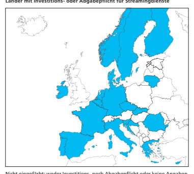
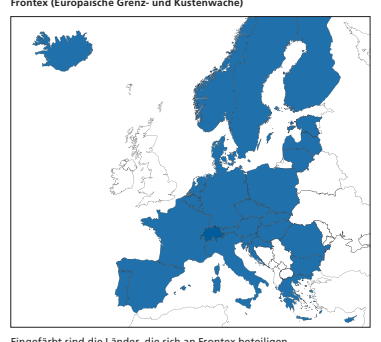

# Im Detail Änderung Des Filmgesetzes

| Argumente Referendumskomitee      | 16   |
|-----------------------------------|------|
| Argumente Bundesrat und Parlament | 18   |
| Abstimmungstext                   | 20   |

| Film als Kulturgut                                                                                                                                                                                                                                                                                                                                                                                                                                                                                                                                                                                                                                                                                                                                                                                                                                                                                                                                                                                                                                                                                                                                 | Einheimische Filme prägen ein Land und dessen Gesell   |
|----------------------------------------------------------------------------------------------------------------------------------------------------------------------------------------------------------------------------------------------------------------------------------------------------------------------------------------------------------------------------------------------------------------------------------------------------------------------------------------------------------------------------------------------------------------------------------------------------------------------------------------------------------------------------------------------------------------------------------------------------------------------------------------------------------------------------------------------------------------------------------------------------------------------------------------------------------------------------------------------------------------------------------------------------------------------------------------------------------------------------------------------------|--------------------------------------------------------|
| schaft stark. Wie in den meisten europäischen Ländern wird  das Filmschaffen deshalb auch in der Schweiz staatlich geför dert. Die Verfassung erlaubt dies dem Bund ausdrücklich.  Die Unterstützung ist in der Schweiz besonders wichtig, weil  die sprachregionalen Filmmärkte sehr klein sind. Die Film industrie kann daher nicht aus eigener Kraft bestehen. Neben  der Filmförderung durch Bund und Regionen leisten auch die  SRG und die anderen Schweizer Fernsehsender einen Beitrag  zur einheimischen Filmproduktion. Seit 2007 müssen die pri vaten Fernsehsender 4 Prozent ihres Umsatzes in das hiesige  Filmschaffen investieren. - - - -  1                                                                                                                                                                                                                                                                                                                                                                                                                                                                                       |                                                        |
| Wandel des  Filmkonsums                                                                                                                                                                                                                                                                                                                                                                                                                                                                                                                                                                                                                                                                                                                                                                                                                                                                                                                                                                                                                                                                                                                            | Filme werden heute immer öfter über digitale Streaming |
| dienste konsumiert. Für Filme aus einem kleinen, mehrspra chigen Land wie der Schweiz ist es schwierig, Zugang zum  internationalen Markt zu finden und auf internationalen  Streamingplattformen präsent zu sein. Anders ist die Lage in  vielen europäischen Ländern: Weil die Streamingdienste dort  bereits heute in das lokale Filmschaffen investieren müssen,  nehmen sie vermehrt dort produzierte Filme in ihr Angebot  auf. In der Schweiz besteht für die oft global tätigen Unter nehmen bislang keine Verpflichtung, in das hiesige Film schaffen  zu investieren. - - - Was sind Streamingdienste? Streamingdienste bieten im Internet Filme und Serien an, die man  auf dem Computer, dem Fernseher oder einem mobilen Gerät zu  einem selbst gewählten Zeitpunkt anschauen kann. Die Konsumen tinnen und Konsumenten bezahlen dafür einzeln oder schliessen  ein Abonnement ab. Der Markt wird von einigen meist internati onalen Anbietern dominiert, in der Schweiz vor allem von Netflix,  Disney+ und Blue. Der Umsatz der Streamingdienste beträgt in der  Schweiz schätzungsweise über 300 Millionen Franken pro Jahr. - - 2 |                                                        |

1 Kleine Fernsehsender sind ausgenommen. Die Investitionspflicht gilt nur für Sender, die sprachregional oder national tätig sind, selber Filme zeigen und einen Betriebsaufwand von mindestens 1 Million Franken haben.

2 Schätzung des Bundesamts für Kultur

| Erweiterung der  Investitionspflicht                                                                                                                                                                                                                                                                                                                                                                                                                                                                                                                                                                                                                                                           | Bundesrat und Parlament wollen, dass künftig neben den   |
|------------------------------------------------------------------------------------------------------------------------------------------------------------------------------------------------------------------------------------------------------------------------------------------------------------------------------------------------------------------------------------------------------------------------------------------------------------------------------------------------------------------------------------------------------------------------------------------------------------------------------------------------------------------------------------------------|----------------------------------------------------------|
| Fernsehsendern auch die inländischen und ausländischen  Streamingdienste 4 Prozent ihres hierzulande erzielten Umsat zes in das Schweizer Filmschaffen investieren müssen. Mit der  vorliegenden Gesetzesänderung sollen diese Dienste den  Schweizer Fernsehsendern gleichgestellt werden. Zudem soll  die Investitionspflicht neu auch für ausländische Fernsehsender  gelten, die Werbeblöcke gezielt für das Schweizer Publikum  senden (Werbefenster) und damit auf dem hiesigen Werbe markt Geld verdienen. Schätzungen zufolge würden durch die  Erweiterung der Investitionspflicht jährlich 18 Millionen  Franken zusätzlich in das Schweizer Filmschaffen fliessen. - - 3            |                                                          |
| Investition oder  Ersatzabgabe                                                                                                                                                                                                                                                                                                                                                                                                                                                                                                                                                                                                                                                                 | Die Anbieter entscheiden selber, in welche Filme oder    |
| Serien in der Schweiz sie investieren und in welcher Form sie  das tun: Sie können etwa bestehende Filme einkaufen, sich  an einer Produktion beteiligen oder einen Film oder eine Serie  nach einer eigenen Idee in Auftrag geben. Die Filme können  als Schweizer Filme produziert oder mit anderen Ländern  koproduziert werden. Die Anbieter können in Spielfilme, Doku mentarfilme, Animationsfilme oder Serien investieren. Sie  müssen alle vier Jahre nachweisen, dass sie die verlangte Inves tition getätigt haben. Falls sie nicht oder zu wenig investiert  haben, müssen sie für die Differenz eine Ersatzabgabe entrich ten, die der Schweizer Filmförderung zugutekommt. - -  - |                                                          |

Internationales Umfeld Ein Grossteil der umliegenden Länder kennt eine Investiti ons- oder eine Abgabepflicht für Streamingdienste. So ver pflichten Frankreich und Italien die Streamingdienste, bis zu 26 Prozent beziehungsweise 20 Prozent des Umsatzes ins euro päische Filmschaffen zu investieren. Deutschland kennt keine Investitionspflicht, sondern ausschliesslich eine Abgabe von 2,5 Prozent des Umsatzes. In Österreich gibt es weder eine Investitions- noch eine Abgabepflicht.

-
-
- 
4

Quelle: Europäische Audiovisuelle Informationsstelle; Stand Februar 2019 ( obs.coe.int)
Nicht eingefärbt: weder Investitions- noch Abgabepflicht oder keine Angaben.

Quote für euro päische Filme
-
Fernsehsender in der Schweiz und in Europa sind seit 1993 verpflichtet, zu mindestens 50 Prozent Inhalte zu senden, die in Europa produziert wurden.5 Mit dem geänderten Filmgesetz sollen Streaminganbieter neu auf eine Quote von 30 Prozent verpflichtet werden. Damit soll die Vielfalt des Angebots gewähr leistet werden. Für Schweizer Filme sieht das Gesetz keine Quote vor.

- 
Die beiden wichtigsten Änderungen des Filmgesetzes Investitionspflicht

Streamingdienste Schweizer Filmschaffen 30 %
des Angebots von Streamingdiensten muss aus europäischen Filmen und Serien bestehen.

Quote für europäische Inhalte

 5 Kleine Fernsehsender sind ausgenommen. Die Quote gilt nur für Sender, die sprachregional oder national tätig sind.

15

## Argumente Referendumskomitee

| Das neue Filmgesetz zwingt Schweizer sowie ausländische  Streamingdienste wie oneplus, Netflix oder Disney+, min destens 30 Prozent europäische Filme anzubieten. Diese  Filme müssen keine Qualitätsvorgaben erfüllen und die  Vorgabe gilt unabhängig der Nachfrage von uns Konsumie renden. Beliebte Produktionen aus Asien, Lateinamerika  etc. werden deshalb aus den Filmkatalogen entfernt. Das  ist unfair! Zudem werden mit dem neuen Filmgesetz die  Abogebühren für Streamingdienste sicherlich steigen. Des halb lehnen wir das Filmgesetz ab. - - -   |                                                    |
|--------------------------------------------------------------------------------------------------------------------------------------------------------------------------------------------------------------------------------------------------------------------------------------------------------------------------------------------------------------------------------------------------------------------------------------------------------------------------------------------------------------------------------------------------------------------|----------------------------------------------------|
| Nein zur 30-Pro zent-Quote für   europäische Filme -                                                                                                                                                                                                                                                                                                                                                                                                                                                                                                               | Schweizer und ausländische Streamingdienste müssen |
| mit dem neuen Filmgesetz mindestens 30 Prozent ihres Film katalogs mit europäischen Filmen füllen und diese Filme  besonders kennzeichnen. Diese europäischen Filme müssen  keinerlei Qualitätsvorgaben erfüllen. Damit fällt die Freiheit  von uns Medienkonsumierenden, zu schauen, was uns gefällt,  ohne Not einer sinnlosen Quote zum Opfer. -                                                                                                                                                                                                                |                                                    |
| Vielfalt des  Filmangebots  leidet                                                                                                                                                                                                                                                                                                                                                                                                                                                                                                                                 | Das neue Filmgesetz bevorteilt einzig europäische  |
| Produktionen. Beliebte Filmangebote aus aller Welt (Afrika,  Asien, Amerika etc.) haben das Nachsehen; sie erhalten  aufgrund der Europa-Quote weniger Platz in den Filmkatalo gen. Das schadet der Vielfalt. Die europäische Filmkultur ist  anderen Filmkulturen nicht überlegen! Es ist ungerecht, das  Filmangebot an eine bestimmte Herkunft zu knüpfen. Das ist  ein Schlag ins Gesicht von uns Konsumierenden, die freiwillig  für Dienste bezahlen, in der Erwartung, das zu sehen, was uns  gefällt. -                                                    |                                                    |

| Nein zur neuen  Filmsteuer                                                                                                                                                                                                                                                                                                                                                                                                                                                                                                                                                                                                                                                   | Schweizer Filmschaffende werden bereits heute mit weit   |
|------------------------------------------------------------------------------------------------------------------------------------------------------------------------------------------------------------------------------------------------------------------------------------------------------------------------------------------------------------------------------------------------------------------------------------------------------------------------------------------------------------------------------------------------------------------------------------------------------------------------------------------------------------------------------|----------------------------------------------------------|
| über 100 Millionen Franken pro Jahr subventioniert. Das ist  recht so, und daran ändert sich nichts. Trotzdem sollen private  Unternehmen neu mindestens 4 Prozent ihres Schweizer  Umsatzes in das hiesige Filmschaffen investieren. Diese  Investitionspflicht kommt einer Sondersteuer gleich; es sind  Mittel, die den betroffenen Akteuren entzogen und umverteilt  werden. So hohe Verpflichtungen kennt kaum ein anderes  europäisches Land. Wir sind überzeugt: Über kurz oder lang  führt die Investitionspflicht dazu, dass wir Konsumierende  tiefer ins Portemonnaie greifen müssen. Denn wegen der  Sondersteuer werden die Abogebühren mit Sicherheit steigen! |                                                          |
| Nein zum   gefährlichen  Präzedenzfall                                                                                                                                                                                                                                                                                                                                                                                                                                                                                                                                                                                                                                       | Mit dem neuen Filmgesetz werden private Unternehmen      |
| gezwungen, eine bestimmte Branche mit ihren Bruttoeinnah men zu subventionieren. Das ist ein krasser Eingriff in die  Wirtschaftsfreiheit. Es droht zudem die grosse Gefahr, dass  künftig auch andere Akteure (z. B. Spotify, Apple Music)  gezwungen werden, mindestens 30 Prozent europäische  Inhalte anzubieten. Deshalb gehört das neue Filmgesetz als  gefährlicher Präzedenzfall abgelehnt. -                                                                                                                                                                                                                                                                        |                                                          |
| Empfehlung des  Referendums - komitees                                                                                                                                                                                                                                                                                                                                                                                                                                                                                                                                                                                                                                       | Darum empfiehlt das Referendumskomitee: Nein             |

 filmquote-nein.ch Der Text auf dieser Doppelseite stammt vom Referendumskomitee. Es ist für den Inhalt und die Wortwahl verantwortlich.

Argumente 

# Bundesrat Und Parlament

| Die Änderung des Filmgesetzes schliesst eine Lücke, die  durch den digitalen Wandel entstanden ist, und beseitigt  die Ungleichbehandlung von Fernsehsendern und Strea mingdiensten. Durch die Ausweitung der Investitions pflicht auf inländische und ausländische Streamingdienste  wird die Produktion von Schweizer Filmen gefördert und  die kulturelle Vielfalt des Angebots gestärkt. Bundesrat  und Parlament befürworten die Vorlage insbesondere aus  folgenden Gründen: - -   |                                                        |
|------------------------------------------------------------------------------------------------------------------------------------------------------------------------------------------------------------------------------------------------------------------------------------------------------------------------------------------------------------------------------------------------------------------------------------------------------------------------------------------|--------------------------------------------------------|
| Schliessen  einer Lücke                                                                                                                                                                                                                                                                                                                                                                                                                                                                  | Streamingdienste erzielen in der Schweiz pro Jahr über |
| 300 Millionen Franken Umsatz. Anders als Schweizer Fernseh sender sind sie nicht verpflichtet, einen Beitrag zum hiesigen  Filmschaffen zu leisten. Diese Lücke, die der digitale Wandel  aufgetan hat, wird mit der Gesetzesänderung geschlossen. -                                                                                                                                                                                                                                     |                                                        |
| Gleichbehandlung                                                                                                                                                                                                                                                                                                                                                                                                                                                                         | Das Gesetz sorgt für die Gleichbehandlung von Fernseh  |
| sendern und Streamingdiensten sowie von inländischen und  ausländischen Anbietern. Auch ausländische Fernsehsender mit  Schweizer Werbefenster sollen künftig einen Beitrag zuguns ten der Angebotsvielfalt leisten. - -                                                                                                                                                                                                                                                                 |                                                        |
| Stärkung  des Produktions - standortes                                                                                                                                                                                                                                                                                                                                                                                                                                                   | Mit dem Gesetz verteidigt die Schweiz ihre Interessen, |
| wie es andere Länder auch tun. Die Investitionspflicht sorgt  dafür, dass zumindest ein kleiner Teil der hier erzielten Umsät ze in der Schweiz bleibt. Damit werden Arbeitsplätze geschaf fen und Aufträge für das lokale Gewerbe generiert. Zudem  trägt die neue Regelung dazu bei, dass innovativere Filme und  Serien entwickelt und auf internationalen Plattformen ange boten werden. Wenn Schweizer Geschichten erzählt werden,  profitiert auch der Tourismus. - - -            |                                                        |

| Massvolle Quote                                                                                                                                                                                                                                                                                                                                                                                                                                               | Heute müssen Fernsehsender zu mindestens 50 Prozent      |
|---------------------------------------------------------------------------------------------------------------------------------------------------------------------------------------------------------------------------------------------------------------------------------------------------------------------------------------------------------------------------------------------------------------------------------------------------------------|----------------------------------------------------------|
| europäische Filme und Serien zeigen. Mit dem Gesetz wird  eine solche Vorgabe auch für Streamingdienste eingeführt. Sie  ist massvoll und mit 30 Prozent tiefer als für die Fernsehsender.  Weil in der EU diese Quote bereits gilt und ein vielfältiges  Angebot auch im Interesse der Streamingdienste ist, erfüllen  die Anbieter die Vorgabe schon heute. Für die Konsumentin nen und Konsumenten in der Schweiz ändert sich folglich  nichts. -          |                                                          |
| Bewährte Inves - titionspflicht                                                                                                                                                                                                                                                                                                                                                                                                                               | Dass sich die Investitionspflicht auf die Preise für das |
| Streaming auswirken wird, ist unwahrscheinlich. Selbst in  Ländern mit sehr hohen Ansätzen kann kein Zusammenhang  zwischen Regulierung und Preisen festgestellt werden. Auch  die Anbieter profitieren von den Investitionen: Sie erhalten  interessante Filme und Serien. Das zeigt auch die Erfahrung mit  der Investitionspflicht für die einheimischen Fernsehsender.  Diese haben die Investitionen jeweils getätigt und kaum  Ersatzabgaben geleistet. |                                                          |
| Empfehlung  von Bundesrat                                                                                                                                                                                                                                                                                                                                                                                                                                     | Aus all diesen Gründen empfehlen Bundesrat und           |
| Parlament, die Änderung des Filmgesetzes anzunehmen.                                                                                                                                                                                                                                                                                                                                                                                                          |                                                          |

Empfehlung von Bundesrat und Parlament Ja admin.ch/filmgesetz Im Detail Änderung des Transplantations gesetzes (indirekter Gegen vorschlag zur Volksinitiative «Organspende fördern - Leben retten»)
-
-

| Argumente Referendumskomitee      | 32   |
|-----------------------------------|------|
| Argumente Bundesrat und Parlament | 34   |
| Abstimmungstext                   | 36   |

| Ausgangslage   |
|----------------|

Eine Organspende kann die Gesundheit und die Lebens qualität von Menschen, die auf ein neues Organ angewiesen sind, entscheidend verbessern. Viele von ihnen können über haupt nur dank eines gespendeten Organs weiterleben. In den vergangenen fünf Jahren haben in der Schweiz jährlich im Schnitt rund 450 Menschen eines oder mehrere Organe einer verstorbenen Person erhalten.

-
-
1 Der Bedarf ist allerdings deutlich grösser: Ende 2021 befanden sich in der Schweiz 1434 Menschen auf der Warteliste.2 Je nach Organ beträgt die Wartezeit mehrere Monate, manchmal sogar Jahre.

Tiefe Spendezahlen trotz Fortschritten Um die Zahl der Organspenden zu erhöhen, hat der Bundesrat 2013 den Aktionsplan «Mehr Organe für Transplan tationen» lanciert. In Zusammenarbeit mit den Kantonen wurde etwa die Ausbildung der Fachpersonen optimiert, wurden schweizweit einheitliche Richtlinien und Checklisten eingeführt und wurde die Information verstärkt. Damit konnte die Zahl der gespendeten Organe schrittweise erhöht werden. Im Vergleich zu anderen westeuropäischen Ländern ist sie jedoch nach wie vor tief.

-
3 Umfragen zeigen aber, dass eine Mehrheit der Schweizer Bevölkerung die Organspende grund sätzlich befürwortet.

-
4 Bundesrat und Parlament wollen deshalb die Organspende anders regeln.

1 Hinzu kommen jährlich rund 100 Organe, die von lebenden Personen gespendet wurden. Die Lebendspenden sind von der Änderung des Transplantationsgesetzes nicht betroffen. ( bag.admin.ch/
zahlen-tx-organe)
2 Davon war die Hälfte in einem gesundheitlichen Zustand, der eine Transplantation zuliess. ( bag.admin.ch/zahlen-tx-organe)
3 Newsletter Transplant, International figures on donation and transplantation 2020, European Directorate for the Quality of Medicines & HealthCare (EDQM) ( edqm.eu > Transfusion & Transplantation > Transplantation > Reports and Publications)
4 Gesundheitsbefragungen (SGB) des Bundesamts für Statistik 
( bag.admin.ch > Zahlen & Statistiken > Transplantationsmedizin > 
Einstellung der Bevölkerung)

| Heute gilt die  Zustimmungs - lösung                                                                                                                                                                                                                                                                                                                                                                                                                         | Heute gilt in der Schweiz die Zustimmungslösung. Das   |
|--------------------------------------------------------------------------------------------------------------------------------------------------------------------------------------------------------------------------------------------------------------------------------------------------------------------------------------------------------------------------------------------------------------------------------------------------------------|--------------------------------------------------------|
| heisst: Die Spende von Organen, Gewebe oder Zellen kommt  nur in Frage, wenn eine Zustimmung dazu vorliegt. Häufig ist  der Wille der betroffenen Person nicht bekannt. Liegt keine  Äusserung vor, müssen die Angehörigen im Sinne der betroffe nen Person entscheiden. In dieser Situation lehnen die Angehörigen in einer Mehrheit der Fälle eine Organspende ab. Weil  die Angehörigen einbezogen werden, spricht man auch von  der «erweiterten Zustimmungslösung». -                                                                                                                                                                                                                                                                                                                                                                                                                                                              |                                                        |
| Einführung  der Widerspruchs - lösung                                                                                                                                                                                                                                                                                                                                                                                                                        | Mit der Änderung des Transplantationsgesetzes soll die |
| Widerspruchslösung eingeführt werden. Damit gilt: Wer seine  Organe nicht spenden möchte, muss dies zu Lebzeiten festhalten. Liegt kein dokumentierter Wille vor, wird davon ausge gangen, dass die Person mit der Organspende grundsätzlich  einverstanden ist.  -                                                                                                                                                                                                                                                                                                                                                                                                                                                              |                                                        |
| Angehörige  werden weiterhin  einbezogen                                                                                                                                                                                                                                                                                                                                                                                                                     | Die Angehörigen werden aber auch künftig einbezogen,   |
| falls jemand seinen Willen zu Lebzeiten nicht festgehalten  hat («erweiterte Widerspruchslösung»). Sie werden gefragt, ob  ihnen der Wille der Person bekannt ist, etwa aus Gesprächen.  Sie können eine Organentnahme ablehnen, wenn sie wissen  oder vermuten, dass die betroffene Person sich dagegen ent schieden hätte. Hat die Person ihren Willen nicht festgehalten  und sind keine Angehörigen erreichbar, dürfen keine Organe  entnommen werden. - |                                                        |
| Organspende  von Kindern  und Jugendlichen  geregelt                                                                                                                                                                                                                                                                                                                                                                                                         | Personen ab 16 Jahren können ihren Willen zur Spende   |
| wie bis anhin selbstständig festhalten. Bei unter 16-jährigen  Personen entscheiden weiterhin die Eltern. Sie haben bei ihrem  Entscheid jedoch die Meinung des Kindes zu berücksichtigen.                                                                                                                                                                                                                                                                   |                                                        |
| Bund schafft  neues Register                                                                                                                                                                                                                                                                                                                                                                                                                                 | Um den Willen einfach, sicher und datenschutzkonform   |
| festzuhalten, wird der Bund ein neues Register schaffen. Darin  kann sich jede Person eintragen, wenn sie eine Organspende  nach dem Tod ablehnt. Es ist aber auch möglich, die Zustim mung festzuhalten oder die Zustimmung auf bestimmte Organe einzuschränken. Eine Person kann ihren Eintrag jederzeit  ändern. -                                                                                                                                        |                                                        |

| Regelmässige  Information  der Bevölkerung                                                                                                                                                                                                                                                                                                                                                                                                                                                                                                                                                                                                                                                                                        | Die Bevölkerung muss über den Wechsel zur Widerspruchs   |
|-----------------------------------------------------------------------------------------------------------------------------------------------------------------------------------------------------------------------------------------------------------------------------------------------------------------------------------------------------------------------------------------------------------------------------------------------------------------------------------------------------------------------------------------------------------------------------------------------------------------------------------------------------------------------------------------------------------------------------------|----------------------------------------------------------|
| lösung informiert sein. Deshalb schreibt das Gesetz eine umfas sende und regelmässige Information über die neue Regelung  vor. Die Information muss alle Bevölkerungsgruppen erreichen  und so aufbereitet sein, dass sie auch für Menschen mit Behin derungen zugänglich und verständlich ist. -  -  -                                                                                                                                                                                                                                                                                                                                                                                                                           |                                                          |
| Voraussetzungen  für eine Spende  bleiben gleich                                                                                                                                                                                                                                                                                                                                                                                                                                                                                                                                                                                                                                                                                  | Die medizinischen Voraussetzungen für eine Spende        |
| bleiben gleich wie heute: - Es können nur Personen ihre Organe spenden, die im  Spital auf der Intensivstation sterben. - Der Tod muss von zwei Ärztinnen oder Ärzten eindeutig  festgestellt worden sein. - Vor einer Organspende werden vorbereitende medizini - sche Massnahmen durchgeführt.                                                                                                                                                                                                                                                                                                                                                                                                                                  |                                                          |
| Weitverbreitete  Widerspruchs -lösung                                                                                                                                                                                                                                                                                                                                                                                                                                                                                                                                                                                                                                                                                             | In den meisten europäischen Ländern gilt die Wider       |
| spruchslösung, zum Teil mit, zum Teil ohne Einbezug der  Angehörigen. Beispiele sind Österreich, Italien, Frankreich oder  Spanien. In diesen Ländern ist der Anteil der Personen, die  nach dem Tod ihre Organe spenden, im Schnitt höher als in  Ländern mit der Zustimmungslösung. - 5  Länder mit einer  Zustimmungslösung wie die Schweiz, Deutschland, Irland oder  Litauen weisen deutlich tiefere Spenderaten auf. Neben dem  Modell der Willensäusserung können auch andere Faktoren die  Zahl der Organspenden erhöhen, etwa die Ressourcen in den  Spitälern und die Ausbildung des Fachpersonals. Deshalb gibt  es auch unter den Ländern, in denen die Widerspruchslösung  gilt, solche mit einer tiefen Spenderate. |                                                          |

5 Faktenblatt des Bundesamts für Gesundheit BAG «Organspende raten im europäischen Vergleich» ( 
-
bag.admin.ch/widerspruchs loesung
-
)

Was passiert bei einem Nein?

Die Änderung des Transplantationsgesetzes ist ein indirek ter Gegenvorschlag von Bundesrat und Parlament zur Volks initiative «Organspende fördern - Leben retten». Diese verlangt ebenfalls die Einführung der Widerspruchslösung, regelt aber die Rolle der Angehörigen nicht. Sie wurde vom Initiativkomitee unter der Bedingung zurückgezogen, dass der Gegenvorschlag in Kraft tritt. Gegen diesen ist das Referendum zustande ge kommen. Deshalb wird nun über die Änderung des Transplan tationsgesetzes abgestimmt. Wird es angenommen, so setzt es der Bundesrat in Kraft und die Volksinitiative ist definitiv zurückgezogen. Wird das geänderte Transplantationsgesetz hingegen abgelehnt, so gelangt die Volksinitiative «Organ spende fördern - Leben retten» zur Abstimmung, es sei denn, das Initiativkomitee zieht sie endgültig zurück.

- 
-
- 
-
-
Argumente 

## Referendumskomitee

| Beim neuen Gesetz kann jede Person, die nicht schriftlich  widersprochen hat, zum Organspender werden. Es gibt  aber immer Personen, die nicht wussten, dass sie hätten  widersprechen müssen. Damit wird hingenommen, dass  die Mediziner Menschen gegen ihren Willen Organe ent - nehmen. Dies verletzt das in der Verfassung garantierte  Recht auf Selbstbestimmung und körperliche Unversehrt heit. Einem Menschen dürfen keine Organe entnommen  werden, wenn dieser nicht ausdrücklich zugestimmt hat. -   |                                                          |
|-------------------------------------------------------------------------------------------------------------------------------------------------------------------------------------------------------------------------------------------------------------------------------------------------------------------------------------------------------------------------------------------------------------------------------------------------------------------------------------------------------------------|----------------------------------------------------------|
| Widerspricht  der Verfassung                                                                                                                                                                                                                                                                                                                                                                                                                                                                                      | Die Bundesverfassung garantiert jedem Menschen das       |
| Recht auf körperliche Unversehrtheit und auf Selbstbestim mung. Dieser Schutz gilt besonders in höchst verletzlichen  Situationen wie dem Sterbeprozess. Mit dem neuen Gesetz  hingegen müsste man dieses Recht speziell einfordern. Hat dies  jemand nicht getan, können Organe entnommen werden. Das  ist verfassungswidrig. -                                                                                                                                                                                  |                                                          |
| Automatische  Zustimmung  ist unethisch                                                                                                                                                                                                                                                                                                                                                                                                                                                                           | Zu jedem medizinischen Eingriff - sei er noch so klein - |
| braucht es eine umfassende Aufklärung und eine Einwilligung.  Dass es zur Organentnahme dieses Ja nicht mehr brauchen soll,  ist unethisch.                                                                                                                                                                                                                                                                                                                                                                       |                                                          |
| Zusätzlicher Druck  auf Angehörige                                                                                                                                                                                                                                                                                                                                                                                                                                                                                | Die Angehörigen können gegen die Organentnahme           |
| Widerspruch einlegen. Aber nur, wenn sie glaubhaft belegen,  dass die verstorbene Person mutmasslich die Organentnahme  abgelehnt hätte. Damit würden Angehörige unzulässigem  Druck ausgesetzt. Man würde ihnen eine Ablehnung als un -  solidarisches Verhalten anlasten.                                                                                                                                                                                                                                       |                                                          |

| Ausbeutung  des Menschen                                                                                                                                                                                                                                                                                                                                                                                                                                                                                                                                      | Auch müssten alle Personen in der Schweiz informiert   |
|---------------------------------------------------------------------------------------------------------------------------------------------------------------------------------------------------------------------------------------------------------------------------------------------------------------------------------------------------------------------------------------------------------------------------------------------------------------------------------------------------------------------------------------------------------------|--------------------------------------------------------|
| werden, dass sie ihren Widerspruch äussern oder schriftlich  hinterlegen müssen, wenn sie ihre Organe nicht spenden wollen. Ein solches Ziel ist völlig unrealistisch. Es gibt Menschen, die  die Landessprachen nicht sprechen, die das Gelesene nicht  verstehen oder die nicht lesen können. Mit dem neuen Gesetz  könnten solchen Personen gegen ihren Willen Organe entnom men werden. Auch wollen sich viele nicht sofort mit ihrem  Sterben befassen und dürften deshalb vorsorglich Nein eintra gen. Das neue Gesetz könnte kontraproduktiv sein. - - |                                                        |
| Korrekte  Aufklärung  nicht möglich                                                                                                                                                                                                                                                                                                                                                                                                                                                                                                                           | Personen, die keinen Widerspruch einlegen, müssten     |
| vorher über die Modalitäten der Organentnahme umfassend  informiert sein. Sie müssten das Hirntodkonzept kennen. Sie  müssten wissen, dass Organe nicht kalten Leichen entnommen  werden oder dass Spezialisten sie schon auf der Intensivstation  als noch nicht Hirntote für eine Organentnahme vorbereiten  könnten. Dass alle Menschen diese Information als notwendige  Voraussetzung erhalten und auch verstehen, ist unrealistisch.  Organe würden entnommen, ohne dass die Betroffenen  gewusst haben, wozu sie Ja sagten.                            |                                                        |
| Empfehlung des  Referendums - komitees                                                                                                                                                                                                                                                                                                                                                                                                                                                                                                                        | Darum empfiehlt das Referendumskomitee: Nein           |

 organspende-nur-mit-zustimmung.ch Der Text auf dieser Doppelseite stammt vom Referendumskomitee. Es ist für den Inhalt und die Wortwahl verantwortlich.

Argumente 

# Bundesrat Und Parlament

| In der Schweiz warten viele Menschen auf das Organ einer  Spenderin oder eines Spenders. Ein neues Organ kann die  Lebensqualität entscheidend erhöhen oder Leben retten.  Es ist darum wichtig, dass die Organe all jener, die sie nach  dem Tod spenden können und möchten, auch wirklich trans plantiert werden. Der Wechsel zur Widerspruchs lösung  kann dazu beitragen, die Zahl der Organspenden zu erhö hen. Zudem entlastet das neue Vorgehen die Angehörigen  in einer schwierigen Situation. Bundesrat und Parlament  befürworten die Vorlage insbesondere aus folgenden  Gründen: - -   |                                                        |
|-----------------------------------------------------------------------------------------------------------------------------------------------------------------------------------------------------------------------------------------------------------------------------------------------------------------------------------------------------------------------------------------------------------------------------------------------------------------------------------------------------------------------------------------------------------------------------------------------------|--------------------------------------------------------|
| Potenzial für  mehr Spenden  vorhanden                                                                                                                                                                                                                                                                                                                                                                                                                                                                                                                                                              | Die Spendenzahlen sind in der Schweiz verhältnismässig |
| tief, obwohl die Mehrheit der Bevölkerung grundsätzlich für  die Organspende ist. Bundesrat und Parlament wollen mit der  Einführung der Widerspruchslösung dieses Potenzial besser  nutzen und die Chancen jener Menschen verbessern, die auf  ein Organ warten.                                                                                                                                                                                                                                                                                                                                   |                                                        |
| Ethische Fragen  berücksichtigt                                                                                                                                                                                                                                                                                                                                                                                                                                                                                                                                                                     | Die Entscheidung über eine Organspende ist sehr persön |
| lich und die Einführung der Widerspruchslösung ist mit ethi schen Fragen verbunden. Bundesrat und Parlament haben  diese abgewogen und berücksichtigt. So werden die Angehöri gen auch künftig aktiv angefragt, wenn die betroffene Person  ihren Willen zu Lebzeiten nicht festgehalten hat. Sie haben  das Recht, eine Organspende abzulehnen, wenn sie wissen  oder vermuten, dass die betroffene Person sich dagegen ent schieden hätte. Hat die betroffene Person ihren Willen nicht  festgehalten und sind keine Angehörigen erreichbar, dürfen  keine Organe entnommen werden. - -  - -      |                                                        |
| Angehörige  werden entlastet                                                                                                                                                                                                                                                                                                                                                                                                                                                                                                                                                                        | Das neue Vorgehen führt zu mehr Klarheit: Liegt kein   |
| dokumentierter Wille vor, kann grundsätzlich davon ausgegan gen werden, dass die betroffene Person über die Wider spruchslösung informiert wurde und mit der Organspende  einverstanden war. Damit werden die Angehörigen in einer  schwierigen Situation entlastet. - -                                                                                                                                                                                                                                                                                                                            |                                                        |

| Lösung hat sich im  Ausland bewährt                                                                                                                                                                                                                                                                                                 | Erfahrungen aus dem Ausland zeigen, dass die Wider   |
|-------------------------------------------------------------------------------------------------------------------------------------------------------------------------------------------------------------------------------------------------------------------------------------------------------------------------------------|------------------------------------------------------|
| spruchslösung dazu beitragen kann, die Zahl der Organspenden zu erhöhen. In der Mehrheit der westeuropäischen Länder gilt  die Widerspruchslösung. Die Spenderaten sind dort tendenziell  höher als in der Schweiz. -                                                                                                               |                                                      |
| Lebensqualität  erhöhen,  Leben retten                                                                                                                                                                                                                                                                                              | Eine Organspende kann die Lebenszeit verlängern oder |
| Leben retten. Es ist deshalb wichtig, dass möglichst alle Organe  transplantiert werden, die für eine Transplantation in Frage  kommen. Der Wechsel zur Widerspruchslösung ist für Bundes rat und Parlament ein wichtiger Schritt, um die Gesundheit der  Menschen zu verbessern, die auf ein gespendetes Organ  angewiesen sind. - |                                                      |

| Empfehlung  von Bundesrat  und Parlament   |
|--------------------------------------------|

## Ja

| Aus all diesen Gründen empfehlen Bundesrat und       |
|------------------------------------------------------|
| Parlament, die Änderung des Transplantationsgesetzes |

 admin.ch/transplantationsgesetz Im Detail Übernahme der EU-Verordnung über die Europäische Grenz- und Küstenwache (Weiterentwicklung des Schengen-Besitzstands)

| Argumente Referendumskomitee      | 48   |
|-----------------------------------|------|
| Argumente Bundesrat und Parlament | 50   |
| Abstimmungstext                   | 52   |

Ausgangslage Die Schweiz ist seit 2008 beim Schengen-Verbund dabei 
(siehe Kasten «Die Schweiz und Schengen/Dublin»). Zum SchengenRaum gehören die meisten EU-Länder sowie Norwegen, Island, die Schweiz und Liechtenstein. Grundsätzlich besteht innerhalb des Schengen-Raums Reisefreiheit; es gibt keine systematischen Grenzkontrollen. Deshalb arbeiten die Schengen-Staaten bei der Sicherheit verstärkt zusammen, namentlich die Justiz- und Polizei behörden. Für den Schutz der Schengen-Aussengrenzen sind alle Staaten gemeinsam verantwortlich. Die Europäische Agentur für die Grenz- und Küstenwache (Frontex) unterstützt die Staaten dabei operativ, auch bei der Kontrolle der Migration. Die Schweiz beteiligt sich seit 2011 an Frontex. Die Migrationskrise 2015 hat gezeigt, dass die finanziellen und personellen Mittel von Frontex nicht ausreichen. Die EU hat deshalb beschlossen, Frontex weiter auszubauen. Sie setzt die Reform bereits seit Ende 2019 um. Mit der Vorlage von Bundesrat und Parlament übernimmt die Schweiz ihren Anteil am Ausbau von Frontex.

- 

Quelle: Frontex; Stand Januar 2022 ( frontex.europa.eu)
Eingefärbt sind die Länder, die sich an Frontex beteiligen.

44 Dritte Vorlage: Europäische Grenz- und Küstenwache

| Kontrolle der  Aussengrenzen                                                                                                                                                                                                                                                                                                                                                                                                                                                                                                                                         | Die Kontrolle ihrer Aussengrenzen ist Sache der einzelnen   |
|----------------------------------------------------------------------------------------------------------------------------------------------------------------------------------------------------------------------------------------------------------------------------------------------------------------------------------------------------------------------------------------------------------------------------------------------------------------------------------------------------------------------------------------------------------------------|-------------------------------------------------------------|
| Schengen-Staaten; ihre Souveränität ist gewahrt. Frontex  unterstützt die Staaten dabei, zum Beispiel bei der Bekämp fung der grenzüberschreitenden Kriminalität und der unkon trollierten Migration sowie bei der Rückkehr ausreisepflichtiger Personen. Die Agentur stellt den Staaten dafür bei Bedarf  Fachleute oder Ausrüstung wie Schiffe oder Flugzeuge zur  Verfügung. Zudem erarbeitet sie Lageanalysen und stellt diese  den Schengen-Staaten zur Verfügung. - -                                                                                          |                                                             |
| Schutz der   Grundrechte                                                                                                                                                                                                                                                                                                                                                                                                                                                                                                                                             | Frontex muss die Grundrechte achten. Dafür wurden 2011      |
| das Amt der oder des Grundrechtsbeauftragten geschaffen und das Konsultationsforum für Grundrechte eingesetzt. Seit 2021  unterstützen auch zwei Schweizer Expertinnen den Grund rechtsbeauftragten. Das Konsultationsforum besteht unter  anderem aus internationalen Organisationen und Nicht-Regie rungsorganisationen und berät Frontex in Grundrechtsfragen.  Beschwerden können bei Frontex oder den Schengen-Staaten  eingereicht werden. Alle Meldungen über allfällige Verletzun gen von Grundrechten werden vom Grundrechtsbeauftragten  untersucht. - - - |                                                             |
| Die Rolle der  Schweiz Personelle  und finanzielle  Beteiligung                                                                                                                                                                                                                                                                                                                                                                                                                                                                                                      | Die Schweiz beteiligt sich seit über zehn Jahren personell  |
| und finanziell an Frontex-Einsätzen an den Schengen-Aussen grenzen. Bund und Kantone stellen Frontex Personal zur  Verfügung - bei Bedarf uniformiert und bewaffnet. Im Schnitt  hat die Schweiz bis 2021 jährlich gut sechs Vollzeitstellen bei  gesteuert. Finanziell unterstützt sie Frontex anteilsmässig, wie  es im Abkommen zu Schengen vereinbart wurde und auch  für andere Bereiche der Schengen-Zusammenarbeit gilt. Der  jährliche Beitrag ist schrittweise angestiegen; 2021 zahlte die  Schweiz 24 Millionen Franken. - -                              |                                                             |
| Grenzkontrolle  und Sicherheit                                                                                                                                                                                                                                                                                                                                                                                                                                                                                                                                       | Die von der Schweiz zur Verfügung gestellten Expertin       |
| nen und Experten unterstützen die Schengen-Staaten unter  anderem als Dokumentenspezialisten und Hundeführerinnen  oder sie befragen ankommende Migrantinnen und Migranten.  So prüfen sie zum Beispiel, ob ein Verdacht auf Menschen schmuggel, grenzüberschreitende Kriminalität oder Terroris mus besteht. - - -                                                                                                                                                                                                                                                  |                                                             |

| Rückkehr                                                                                                                                                                                                                                                                                                                                                                                                                                                                                                                                                                                    | Die Schweiz beteiligt sich an den von Frontex koordinier   |
|---------------------------------------------------------------------------------------------------------------------------------------------------------------------------------------------------------------------------------------------------------------------------------------------------------------------------------------------------------------------------------------------------------------------------------------------------------------------------------------------------------------------------------------------------------------------------------------------|------------------------------------------------------------|
| ten und finanzierten EU-Sammelflügen für die Rückkehr  ausreisepflichtiger Personen. So kann sie Ressourcen und  Flugkosten einsparen. Seit 2018 unterstützt sie auch andere  Schengen-Staaten bei der Identifikation von ausreisepflichti gen Personen und der Beschaffung von Reisepapieren sowie  bei Rückführungen. Diese Massnahmen tragen dazu bei, dass  Personen, die den Schengen-Raum verlassen müssen, nicht von  einem Schengen-Staat in den nächsten weiterreisen. Die Asyl und Wegweisungsentscheide werden von den einzelnen  Staaten getroffen und nicht von Frontex. - - - |                                                            |
| Mitentscheidung im  Verwaltungsrat                                                                                                                                                                                                                                                                                                                                                                                                                                                                                                                                                          | Die Schweiz als Schengen-Staat ist im Verwaltungsrat von   |
| Frontex vertreten und entscheidet bei Themen mit, die sie  direkt betreffen, zum Beispiel bei Fragen zum Personal oder  zur Ausrüstung. Im Verwaltungsrat setzt sich die Schweiz auch  dafür ein, dass die Grundrechte eingehalten werden.                                                                                                                                                                                                                                                                                                                                                  |                                                            |
| Was ändert sich  mit dem Ausbau  von Frontex? Personelle  Aus wirkungen                                                                                                                                                                                                                                                                                                                                                                                                                                                                                                                     | Bis 2027 sollen Frontex für die Kontrolle der Schengen                                                            |
| Aussengrenzen und im Bereich Rückkehr bis zu 10000 Personen als Reserve zur Verfügung stehen. Es handelt sich dabei um  3000 Frontex-Angestellte und 7000 Fachkräfte, die durch die  Schengen-Staaten bereitgestellt werden. Auf diese Reserve  wird nur dann zurückgegriffen, wenn sie gebraucht wird. Mit  der Reform wird sich auch die Schweiz personell stärker betei ligen. Der Umfang des Personaleinsatzes der Schweiz wird sich  voraussichtlich bis 2027 schrittweise erhöhen; abhängig vom  Bedarf werden es dann bis zu rund 40 Vollzeitstellen sein.  -  1                     |                                                            |

1 Botschaft des Bundesrates vom 26. August 2020 zur Übernahme und Umsetzung der Verordnung (EU) 2019/1896 über die Europäi sche Grenz- und Küstenwache und zur Aufhebung der Verordnun gen (EU) Nr. 1052/2013 und (EU) 2016/1624 (Weiterentwicklung des Schengen-Besitzstands) und zu einer Änderung des Asylgesetzes; BBl 2020 7105 Ziff. 7.6 ( 
-
-
admin.ch > Bundesrecht > Bundesblatt > 
Ausgaben Bundesblatt).

| Finanzielle  Auswirkungen                                                                                                                                                                                                                | Parallel zum Ausbau von Frontex steigen die Beitragszah   |
|------------------------------------------------------------------------------------------------------------------------------------------------------------------------------------------------------------------------------------------|-----------------------------------------------------------|
| lungen der Schweiz bis 2027 schrittweise an. Von 24 Millionen  Franken im Jahr 2021 steigt der Beitrag bis 2027 auf schät zungsweise 61 Millionen Franken. - - 2                                                                         |                                                           |
| Stärkung  Grundrechts schutz                                                                                                                                                                                                             | Mit der Reform erhält die oder der Grundrechtsbeauf       |
| tragte von Frontex neu 40 Grundrechtsbeobachterinnen  und -beobachter. Diese beaufsichtigen die Aktivitäten vor Ort,  um allfällige Grundrechtsverstösse festzustellen. Bei Ver letzungen der Grundrechte leiten sie Massnahmen ein. - - |                                                           |
| Was geschieht  bei einem Nein?                                                                                                                                                                                                           | Lehnt die Schweiz die Reform ab, endet ihre Zusammen      |
| arbeit mit den Schengen- und Dublin-Staaten automatisch - es  sei denn, die EU-Staaten und die EU-Kommission kommen der  Schweiz entgegen. Das Ende dieser Zusammenarbeit hätte  schwerwiegende Folgen für die Sicherheit, das Asylwesen, den  Grenzverkehr, den Tourismus und für die gesamte Wirtschaft.  Polizei und Zoll hätten keinen Zugriff mehr auf Informationsoder Fahndungssysteme von Schengen und Dublin. Die  Schweiz müsste Asylgesuche, die von einem europäischen Land  bereits abgelehnt wurden, wieder prüfen. Die Schweizer  Landesgrenze würde zur Schengen-Aussengrenze mit systema tischen Grenzkontrollen. Reisende aus Ländern ausserhalb von  Europa müssten zusätzlich zum Schengen-Visum ein Visum für  die Schweiz beantragen, was sie von einem Besuch der Schweiz  abhalten könnte. Laut einem Bericht des Bundesrates würde  der Ausschluss der Schweiz aus dem Schengen- und Dublin-Ver bund die Schweizer Volkswirtschaft jährlich Milliarden Franken  kosten - - - 3.                                                                                                                                                                                                                                          |                                                           |

2 Berechnungen des Bundesamts für Zoll und Grenzsicherheit BAZG. 

Der jährliche Beitrag der Schweiz entspricht rund 4,5 % des Frontex-Budgets.

3 Die volkswirtschaftlichen und finanziellen Auswirkungen der Schengen-Assoziierung der Schweiz, Bericht des Bundesrates vom 21. Februar 2018 in Erfüllung des Postulats 15.3896 ( parlament.ch
> 15.3896 > Bericht in Erfüllung des parlamentarischen Vorstosses).

## Die Schweiz Und Schengen/Dublin

Die Schweiz arbeitet seit 2008 im Bereich der Sicherheit und des Asylwesens eng mit den europäischen Staaten zusammen. Die rechtliche Basis dafür bilden die Abkommen für eine Teilnahme an der Zusammenarbeit von Schengen und Dublin. Diese Abkommen handelte die Schweiz im Rahmen der bilateralen Verhandlungen II mit der EU aus. Die Schweizer Stimmbevölkerung sagte dazu im Juni 2005 Ja. Sie stimmte damit auch zu, Weiterentwicklungen des gemeinsamen Rechts jeweils ins Schweizer Recht zu übernehmen. Eine solche Übernahme erfolgt allerdings nicht automatisch. Bun desrat und Parlament können darüber befinden - und wenn das Referendum ergriffen wird, auch das Volk. Ein Referendum gegen eine solche Umsetzung wurde bisher zweimal ergriffen. Es ging um die Einführung des biometrischen Passes und um die Anpas sung des Waffenrechts. Die Bevölkerung stimmte beiden Vorlagen zu, womit sie die Zusammenarbeit im Rahmen von Schengen und Dublin als Ganzes bestätigte. Falls die Schweiz eine solche Weiterentwicklung in ihrem Recht nicht übernimmt oder umsetzt, treten die Abkommen zu Schengen und Dublin automatisch ausser Kraft - es sei denn, der Gemischte Ausschuss beschliesst innerhalb von 90 Tagen etwas anderes.

-
-
4 In diesem Ausschuss sind die Schweiz, die EU-Kommission und alle Mitgliedstaaten der EU vertreten. Der Ent scheid, die Zusammenarbeit fortzusetzen, müsste einstimmig sein.

-
4 Geregelt in Art. 7 des Abkommens vom 26. Oktober 2004 zwischen der Schweizerischen Eidgenossenschaft, der Europäischen Union und der Europäischen Gemeinschaft über die Assoziierung dieses Staates bei der Umsetzung, Anwendung und Entwicklung des Schengen-Besitzstands; SR 0.362.31 ( admin.ch > Bundesrecht > Systematische Rechtssammlung).

Argumente 

## Referendumskomitee

| Gewalt, Elend und Tod sind an den Aussengrenzen Europas  Alltag geworden. Flüchtende werden entrechtet, geprügelt  und abgeschoben. Als europäische Grenz- und Küsten - wache ist Frontex mitverantwortlich. Die Vorwürfe gegen  Frontex wiegen schwer: Intransparenz, Wegschauen und  Beteiligung bei Menschenrechtsverletzungen. Trotzdem ist  geplant, Frontex massiv auszubauen - auch mit Geld aus  der Schweiz. Das Parlament will den jährlichen Beitrag ver vielfachen. Dagegen wurde das Referendum ergriffen. -   |                                                         |
|-----------------------------------------------------------------------------------------------------------------------------------------------------------------------------------------------------------------------------------------------------------------------------------------------------------------------------------------------------------------------------------------------------------------------------------------------------------------------------------------------------------------------------|---------------------------------------------------------|
| Die Schweiz  finanziert                                                                                                                                                                                                                                                                                                                                                                                                                                                                                                     | Frontex, die Grenzschutzagentur des Schengen-Raums,     |
| wird für die Abschottung Europas von der Schweiz mitfinan ziert. Der Schweizer Beitrag an Frontex würde vervielfacht und  bis 2027 auf 61 Millionen Franken pro Jahr steigen. Zudem  würde sich das Schweizer Grenzwachtkorps vermehrt an  bewaffneten Frontex-Einsätzen im Ausland beteiligen. Als  Nicht-EU-Staat hat die Schweiz bei der Ausgestaltung von Fron tex eingeschränktes Stimmrecht, bezahlt aber einen überpro portionalen Anteil des Frontex-Budgets. - - -                                                 |                                                         |
| Milliarden für  Abschottung                                                                                                                                                                                                                                                                                                                                                                                                                                                                                                 | Frontex ist mitverantwortlich für die gewaltvolle Migra |
| tionspolitik an den EU-Aussengrenzen. Neu koordiniert  Frontex auch länderübergreifend Zwangsausschaffungen und  führt selbst solche durch. Für ihre Aufgaben soll Frontex bis  2027 über ein stehendes Heer von 10 00 Grenzwächterinnen  und Grenzwächtern sowie eigene Waffen, Drohnen, Schiffe  und Flugzeuge verfügen. Das Frontex-Budget steigt bis 2027  auf 1,2 Milliarden Franken pro Jahr an. -  0                                                                                                                 |                                                         |
| Zehntausende  leiden und sterben                                                                                                                                                                                                                                                                                                                                                                                                                                                                                            | Im Einsatzgebiet von Frontex, den EU-Aussengrenzen,     |
| zeigen sich die Folgen der Abschottung. Menschen ertrinken,  erfrieren oder erliegen Verletzungen und Krankheiten. Sie  werden blockiert, erleben Gewalt und ihnen werden Grund - rechte verwehrt.                                                                                                                                                                                                                                                                                                                          |                                                         |

| Menschenrechts - verletzungen                                                                                                                                                                                                                                                                                                                                                                 | Recherchen bestätigen, was Flüchtende seit Jahren sagen:   |
|-----------------------------------------------------------------------------------------------------------------------------------------------------------------------------------------------------------------------------------------------------------------------------------------------------------------------------------------------------------------------------------------------|------------------------------------------------------------|
| Frontex ist Komplizin bei Menschenrechtsverletzungen und  illegalen «Pushbacks». Aufnahmen belegen, dass Frontex  anwesend ist, wenn nationale Küstenwachen die Motoren  von Booten zerstören und Flüchtende im Meer zurücklassen.  Zudem kooperiert Frontex systematisch mit der sogenannten  libyschen Küstenwache, die massenhaft Boote abfängt und  gewaltsam zurück nach Libyen schafft. |                                                            |
| Gewolltes   Sterbenlassen                                                                                                                                                                                                                                                                                                                                                                     | Die Schweiz ist Gaststaat der Genfer Flüchtlingskonven     |
| tion. Wer es ernst meint mit Schutz für Flüchtende, muss den  Frontex-Ausbau stoppen. Wenn im dicht überwachten Mittel meer Zehntausende ertrinken, dann ist es kein Unglück,  sondern Mord. - -                                                                                                                                                                                              |                                                            |
| Empfehlung des  Referendums - komitees                                                                                                                                                                                                                                                                                                                                                        | Darum empfiehlt das Referendumskomitee: Nein               |

 frontex-referendum.ch Der Text auf dieser Doppelseite stammt vom Referendumskomitee. Es ist für den Inhalt und die Wortwahl verantwortlich.

Argumente 

## Bundesrat Und Parlament

| Nur dank systematischer Kontrollen an den Aussengrenzen  ist die Reisefreiheit im Schengen-Raum möglich. Mit Fron tex werden diese Kontrollen verbessert und die Sicherheit  erhöht - auch für die Schweiz. Mit ihrer Beteiligung an  Frontex gestaltet die Schweiz die Kontrollen mit, unter stützt die exponierten Schengen-Staaten und setzt sich  für die Grundrechte ein. Ein Nein wäre mit weitreichenden  negativen Folgen und hohen Kosten für die Schweiz ver bunden. Bundesrat und Parlament befürworten die Vorlage  insbesondere aus folgenden Gründen: - - -   |                                                        |
|-----------------------------------------------------------------------------------------------------------------------------------------------------------------------------------------------------------------------------------------------------------------------------------------------------------------------------------------------------------------------------------------------------------------------------------------------------------------------------------------------------------------------------------------------------------------------------|--------------------------------------------------------|
| Schweiz im Herzen  Europas besser  schützen                                                                                                                                                                                                                                                                                                                                                                                                                                                                                                                                 | Die Schweiz liegt im Herzen des Schengen-Raums auf den |
| wichtigsten Transitrouten Europas. Deshalb ist unsere Sicher heit auch von der Lage an den Schengen-Aussengrenzen  abhängig. Eine wirksame Kontrolle dieser Grenzen ist eine  Investition in den Schutz der Schweiz. -                                                                                                                                                                                                                                                                                                                                                      |                                                        |
| Mitreden und  unterstützen  statt zusehen                                                                                                                                                                                                                                                                                                                                                                                                                                                                                                                                   | Es liegt in unserem Interesse, bei den Kontrollen der  |
| Aussengrenzen und der Bewältigung der Migrationsbewegun gen mitzuwirken. Nur wenn die Schweiz mitmacht, kann sie  mitreden und die Entscheidungen sowie die strategische  Ausrichtung von Frontex mitgestalten. Frontex würde auch bei  einem Nein weiterbestehen und an den Aussengrenzen im  Einsatz sein - ohne Mitgestaltung der Schweiz. -                                                                                                                                                                                                                             |                                                        |
| Einsatz für   Grundrechte                                                                                                                                                                                                                                                                                                                                                                                                                                                                                                                                                   | Die Schweiz ist für eine Nulltoleranzpolitik gegenüber |
| illegalen Zurückweisungen von Asylsuchenden (sogenannte  Pushbacks). Mit der Reform wird auch der Schutz der Grund rechte erhöht, unter anderem durch mehr Personal und die  Stärkung des Grundrechtsbeauftragten. Die Schweiz will auch  deshalb die Reform mittragen und sich dabei aktiv für den  Schutz der Menschenrechte engagieren. -                                                                                                                                                                                                                                |                                                        |

| Wirksamere  Rückkehr                                                                                                                                                                                                                                                                                                                                                                                                                                                                                                      | Bei der Rückkehr von ausreisepflichtigen Personen ist die   |
|---------------------------------------------------------------------------------------------------------------------------------------------------------------------------------------------------------------------------------------------------------------------------------------------------------------------------------------------------------------------------------------------------------------------------------------------------------------------------------------------------------------------------|-------------------------------------------------------------|
| Zusammenarbeit der Schengen-Staaten zentral. Wer sich nicht  im Schengen-Raum aufhalten darf, muss ihn wieder verlassen.  Frontex unterstützt die Schengen-Staaten neu stärker bei der  Rückkehr. Davon profitiert die Schweiz. Sie trifft aber weiter - hin alle Asyl- und Wegweisungsentscheide selbst.                                                                                                                                                                                                                 |                                                             |
| Weitreichende  Folgen  eines Neins                                                                                                                                                                                                                                                                                                                                                                                                                                                                                        | Bei einem Nein droht der Schweiz der Verlust der Mit        |
| gliedschaft im Schengen/Dublin-Verbund. Dies hätte weitrei chende negative Folgen für die Schweiz. Sie würde einen für  ihre Sicherheit zentralen Pfeiler verlieren. Personen aus der  Schweiz müssten an der Grenze zu den Schengen-Staaten kon trolliert werden; somit würde die Reisefreiheit beschränkt.  Die Schweiz müsste mehr Asylgesuche prüfen. Nicht nur der  Tourismus würde leiden; die ganze Volkswirtschaft hätte hohe  Kosten zu tragen. Zudem würden die Beziehungen zur EU  zusätzlich belastet. - -  - |                                                             |
| Empfehlung  von Bundesrat  und Parlament                                                                                                                                                                                                                                                                                                                                                                                                                                                                                  | Aus all diesen Gründen empfehlen Bundesrat und Parla        |
| ment, den Bundesbeschluss über die Genehmigung und die  Umsetzung des Notenaustausches zwischen der Schweiz und  der EU betreffend die Übernahme der EU-Verordnung über die  Europäische Grenz- und Küstenwache anzunehmen. -                                                                                                                                                                                                                                                                                             |                                                             |

 admin.ch/frontex