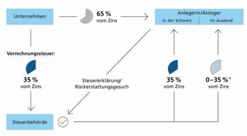

Im Detail **Volksinitiative «Keine Massentierhaltung in der Schweiz**
(Massentierhaltungsinitiative)»

| Argumente Initiativkomitee        | 18   |
|-----------------------------------|------|
| Argumente Bundesrat und Parlament | 20   |
| Abstimmungstext                   | 22   |

| Ausgangslage Tierschutzgesetz                                                                                                                                                                                                                                                                                                                                                                                                                                                                                                                                                                                                | Die Schweiz hat eine der weltweit strengsten und detail   |
|------------------------------------------------------------------------------------------------------------------------------------------------------------------------------------------------------------------------------------------------------------------------------------------------------------------------------------------------------------------------------------------------------------------------------------------------------------------------------------------------------------------------------------------------------------------------------------------------------------------------------|---|
| liertesten Regelungen zum Schutz der Tiere. Würde und Wohlergehen sind gesetzlich geschützt. Niemand darf einem Tier  ungerechtfertigt Schmerzen, Leiden oder Schäden zufügen, es  in Angst versetzen oder in anderer Weise seine Würde missachten. Das Misshandeln, Vernachlässigen oder unnötige Überanstrengen von Tieren ist verboten und kann streng bestraft  werden.                                                                                                                                                                                                                                                                                                                                                                                                                                                                                                                                                                                                                              |   |
| Tierwohl in der  Landwirtschaft                                                                                                                                                                                                                                                                                                                                                                                                                                                                                                                                                                                              | Der Schutz des Tieres muss in der Landwirtschaft gewähr   |
| leistet sein, unabhängig davon, wie viele Tiere an einem Ort  gehalten werden. Die Verfassung schreibt zudem vor, dass  Landwirtinnen und Landwirte zusätzlich unterstützt werden,  wenn sie besonders naturnah, umwelt- und tierfreundlich  produzieren. So fördert der Bund seit über 25 Jahren eine  besonders tierfreundliche Stallhaltung und den regelmässigen  Auslauf ins Freie. 2020 lebten 62 Prozent der Nutztiere in einem  besonders tierfreundlichen Stall, zehn Jahre früher waren es  knapp 46 Prozent. 78 Prozent der Nutztiere konnten regelmässig  nach draussen, zehn Jahre vorher waren es 72 Prozent.1 |   |
| Maximale Anzahl  Tiere pro Betrieb                                                                                                                                                                                                                                                                                                                                                                                                                                                                                                                                                                                           | Das Recht regelt für die Schweine- und die Geflügelhal   |
| tung sowie die Kälbermast, wie viele Tiere maximal auf einem  Betrieb gehalten werden dürfen (siehe Tabelle). Diese Bestimmungen dienen jedoch in erster Linie dem Schutz der Umwelt.  Beim Tierschutz steht das einzelne Tier im Fokus, das unabhängig von der Grösse eines Betriebes geschützt werden muss.                                                                                                                                                                                                                                                                                                                                                                                                                                                                                                                                                                                                                              |   |

1 Je nach Tiergattung gibt es Unterschiede: 2020 hatten 85 Prozent der Rinder, 51 Prozent der Schweine und 44 Prozent des Nutzgeflügels regelmässig Auslauf. 60 Prozent der Rinder, 68 Prozent der Schweine und 94 Prozent des Nutzgeflügels lebten in einem besonders tierfreundlichen Stall. Die Anteile werden nicht pro Tier, sondern pro Grossvieheinheit berechnet. Siehe: Agrarbericht 2021
( agrarbericht.ch > Politik > Direktzahlungen > Produktionssystembeiträge)
Forderungen der Initiative Verbot von Massentierhaltung Das Initiativkomitee fordert eine Verfassungsbestimmung zum Schutz der Würde von Tieren in der Landwirtschaft. Massentierhaltung soll verboten werden. In der Initiative ist sie definiert als «industrielle Tierhaltung zur möglichst effizienten Gewinnung tierischer Erzeugnisse, bei der das Tierwohl systematisch verletzt wird».

| Für ältere bzw. schwerer Tiere gelten heute z. T. tiefere Höchstbestände.   |                      |       |
|-----------------------------------------------------------------------------|----------------------|-------|
| Heutige                                                                     | Bei Annahme der      |       |
| Bestimmungen                                                                | Initiative           |       |
| Pro Betrieb:                                                                |                      |       |
| Masthühner                                                                  | 27 000               | 2 000 |
| (maximal 200 pro Stall)                                                     |                      |       |
| Legehennen                                                                  | 18 000               | 4000  |
| (maximal 200 pro Stall)                                                     |                      |       |
| Mastschweine                                                                | 1500                 | 1500  |
| Mastkälber                                                                  | 300                  | 300   |
| Pro Hektare:                                                                | 2,5 Düngergrossvieh- |       |
| 3 Düngergrossvieh-                                                          |                      |       |
| einheiten                                                                   | einheiten            |       |
| Gesamter Tier-                                                              |                      |       |
| bestand*                                                                    |                      |       |

* Wenn Betriebe Hofdünger (Gülle und Mist) an andere Betriebe abgeben, kann der gesamte Tierbestand pro Hektare düngbare Fläche auch höher sein. Als Düngergrossvieheinheit (DGVE) gilt eine Kuh mit einem Gewicht von 600 kg und einer Milchleistung von 6000 kg pro Jahr. Die DGVE-Werte der anderen Nutztiere berechnen sich anhand der Menge Nährstoff, die sie ausscheiden. Beispielsweise entsprechen etwa 100 Legehennen einer DGVE.

Quelle: Gewässerschutzgesetz (Z. fedlex.ch > 814.20), Verordnung über Höchstbestände in der Fleischund Eierproduktion (12 fedlex.ch > 916.344) und Bio-Suisse-Richtlinien 2018 (12 mti.bio-suisse.ch)

| Mindestanforderungen für Tierhaltung                                                   | Bei Annahme der Initiative ist der Bund verpflichtet,   |
|---------------------------------------------------|---------------------------------------------------------|
| strengere Mindestanforderungen für eine tierfreundliche  Unterbringung und Pflege, den Zugang ins Freie, die Schlachtung und die maximale Gruppengrösse je Stall festzulegen. Als  Mindeststandard sollen dabei die Bio-Suisse-Richtlinien von  20182  gelten.                                                   |                                                         |
| Bio-Standards gelten  auch für Importe            | Die strengeren Bio-Vorgaben für die Tierhaltung sollen  |
| auch für Importprodukte gelten. Lebensmittel tierischer Herkunft, die diesen nicht entsprechen, dürften nicht mehr importiert werden. Davon betroffen wären nicht nur Produkte wie  Fleisch, Eier, Milch oder Käse, sondern auch Lebensmittel wie  Eierteigwaren, Backwaren oder Schokolade, die Zutaten tierischer Herkunft enthalten. Der Bund müsste für die Importe ein  Kontrollsystem aufbauen. Die Kontrolle wäre sehr aufwendig.  Heute stammen beispielsweise über 40 Prozent des Geflügelfleisches und der Eier aus dem Ausland.3                                                   |                                                         |
| Übergangsfristen  bis 25 Jahre                    | Das Parlament hätte drei Jahre Zeit, um die geforderten |
| Bestimmungen zu erlassen. Den Betrieben könnten Übergangsfristen bis 25 Jahre gewährt werden, etwa für bauliche  Massnahmen.                                                   |                                                         |
| Folgen der  Initiative Auswirkungen  für Betriebe | Die Initiative hätte grosse Auswirkungen auf die land                                                         |
| wirtschaftlichen Betriebe. Rund 3300 Betriebe müssten den  Tierbestand reduzieren oder die Betriebsflächen vergrössern.  Die Kosten der Tierhaltung würden steigen; viele Betriebe  müssten grosse Investitionen tätigen. Berechnungen, die vom  Bund in Auftrag gegeben wurden, gehen von jährlichen Mehrkosten von insgesamt 0,4 bis 1,1 Milliarden Franken aus.4                                                   |                                                         |

| 2                        | Bio-Suisse-Richtlinien von 2018 (   | mti.bio-suisse.ch > Bio Suisse             |
|--------------------------|-------------------------------------|--------------------------------------------|
| Richtlinien 2018)        |                                     |                                            |
| 3                        | Agrarbericht 2021 (                 | agrarbericht.ch > Markt > Marktentwicklung |
| > Selbstversorgungsgrad) |                                     |                                            |
| 4                        | Regulierungsfolgenabschätzung Massentierhaltungsinitiative und  direkter Gegenentwurf, Schlussbericht vom 27. April 2021, von  Quirin Oberpriller, Anna Vettori, Jürg Heldenstab und Thomas von  Stokar (INFRAS) ( blv.admin.ch > Das BLV > Rechts- und Vollzugsgrundlagen > Abstimmungen > Massentierhaltungsinitiative)                                     |                                            |

| Auswirkungen für  Konsumentinnen  und Konsumenten   | Die Initiative hätte auch Auswirkungen auf die Konsu                                                           |
|-----------------------------------------------------|-----------------------------------------------------------|
| mentinnen und Konsumenten. Lebensmittel wie Fleisch, Eier,  Milch oder Käse wären nur noch aus Tierhaltungen mit BioStandard erhältlich, ebenso Lebensmittel mit Zutaten tierischer  Herkunft. Dadurch wäre die Wahlfreiheit eingeschränkt.  Lebensmittel tierischer Herkunft wie auch solche mit Zutaten  tierischer Herkunft dürften wegen der höheren Anforderungen teurer werden.                                                     |                                                           |
| Auswirkungen auf  die Umwelt                        | Die Initiative könnte zu einer Reduktion der Tierbestände |
| und zu mehr Importen tierischer Herkunft führen. Dies würde  die Ammoniak-Emissionen in der Schweiz, aber nicht weltweit  reduzieren. Ammoniak ist ein Luftschadstoff, der aus den  Exkrementen von Tieren in die Atmosphäre gelangt und sensible Ökosysteme schädigt. Ebenfalls reduziert würden in der  Schweiz die Emissionen der Klimagase Methan und Lachgas.  Um die Produktion aufrechtzuerhalten, müssten die Betriebe  neue Ställe bauen; das würde mehr landwirtschaftliche Nutzfläche verbrauchen.                                                     |                                                           |
| Auswirkungen  auf internationale  Abkommen          | Ein Importverbot für Produkte, die in der Tierhaltung     |
| nicht dem Bio-Standard entsprechen, würde internationale  Handelsabkommen verletzen, unter anderem mit der EU.  Solche Importregelungen könnten zudem bei der Welthandelsorganisation sowie mit Staaten, mit denen die Schweiz Freihandelsabkommen abgeschlossen hat, zu Konflikten führen.  Das könnte auch Auswirkungen auf die Schweizer Exporte  haben.                                                     |                                                           |

17

| Argumente                                                                                                                                                       | Initiativkomitee Das Tierschutzgesetz wird oft als vorbildlich bezeichnet. Die  Realität für Tiere in der Massentierhaltung sieht anders aus:  Trotz ihrer Leidensfähigkeit werden sie nicht als Lebewesen,  sondern als Ware betrachtet. In Hallen werden die Tiere  zu Tausenden zusammengepfercht. Nur die wenigsten stehen  jemals auf einer Weide. Deshalb fordert die Initiative eine  tierfreundliche Unterbringung und Pflege, regelmässigen  Auslauf ins Freie, reduzierte Gruppengrössen und eine  schonende Schlachtung.   |
|-----------------------------------------------------------------------------------------------------------------------------------------------------------------|---------------------------------------------------------------------------------------------------------------------------------------------------------------------------------------------------------------------------------------------------------------------------------------------------------------------------------------------------------------------------------------------------------------------------------------------------------------------------------------------------------------------------------------|
| Worum geht es?                                                                                                                                                  | In den letzten 20 Jahren ist der Bestand der Tiere in der                                                                                                                                                                                                                                                                                                                                                                                                                                                                             |
| Schweizer Landwirtschaft um beinahe die Hälfte gestiegen.  Über 80 Millionen Tiere wurden 2021 gemästet und getötet.  Pro Betrieb werden bis zu 27 000 Hühner, 1500 Schweine oder  300 Rinder gehalten. Grundbedürfnisse nach Platz, Bewegung  und Beschäftigung werden in der Massentierhaltung systematisch missachtet.                                                                                                                                                                 |                                                                                                                                                                                                                                                                                                                                                                                                                                                                                                                                       |
| Traditionelle  Bauernhöfe  stärken                                                                                                                              | Laut Bundesrat wären nur rund 5 Prozent der Betriebe                                                                                                                                                                                                                                                                                                                                                                                                                                                                                  |
| von der Initiative betroffen - nämlich die industriellen Grossbetriebe, die die traditionellen Bauernhöfe zunehmend  verdrängen. Betriebe, die bereits heute das Tierwohl in der  Produktion über rein wirtschaftliche Interessen stellen,  werden durch die Initiative gestärkt.                                                                                                                                                                 |                                                                                                                                                                                                                                                                                                                                                                                                                                                                                                                                       |
| Schweizer Markt  schützen                                                                                                                                       | Schweizer Bauernfamilien dürfen gegenüber dem Aus                                                                                                                                                                                                                                                                                                                                                                                                                                                                                                                                       |
| land nicht benachteiligt werden. Deshalb braucht es Importregeln, die den neuen Schweizer Standards Rechnung tragen.  Solche Vorschriften sind auch mit internationalen Handelsverträgen umsetzbar. Wird die Einfuhr minderwertiger Billigware verhindert, stärken wir damit unsere heimische  Landwirtschaft.                                                                                                                                                                 |                                                                                                                                                                                                                                                                                                                                                                                                                                                                                                                                       |
| Gesundheitsrisiken  eindämmen                                                                                                                                   | Die industrielle Tierproduktion führt zu höheren Krank                                                                                                                                                                                                                                                                                                                                                                                                                                                                                                                                       |
| heitsrisiken und einem gesteigerten Antibiotikaeinsatz. Mit  dem Ausstieg aus der Massentierhaltung können wir zudem  das Risiko künftiger Pandemien eindämmen. |                                                                                                                                                                                                                                                                                                                                                                                                                                                                                                                                       |

| Schweizer  Weideland nutzen                                                                                                                                                                                                                                                                                                                    | Die Schweiz importiert 1,4 Millionen Tonnen Futtermittel   |
|------------------------------------------------------------------------------------------------------------------------------------------------------------------------------------------------------------------------------------------------------------------------------------------------------------------------------------------------|------------------------------------------------------------|
| pro Jahr und verwendet einen Grossteil des Ackerlandes für die  Produktion von Tierfutter. Dadurch können viel mehr Tiere  gehalten werden, als auf unseren Wiesen möglich wäre. Indem  wir Tieren konsequent Zugang auf eine Weide gewähren,  werden wir unserem Bild einer nachhaltigen, tierfreundlichen  Schweizer Landwirtschaft gerecht. |                                                            |
| Ein Ja für Tier,  Mensch und  Umwelt                                                                                                                                                                                                                                                                                                           | Das Verfassungsprinzip der Tierwürde muss endlich auch     |
| in der Landwirtschaft respektiert werden. Die Übergangsfrist  von 25 Jahren gibt allen betroffenen Betrieben genug Zeit für  eine Neuausrichtung hin zu einer tierfreundlichen Produktion.  Mit dem Ja zur Initiative sichern wir eine Landwirtschaft, die  das Wohl von Tier, Mensch und Umwelt ins Zentrum rückt.                            |                                                            |
| Empfehlung des  Initiativkomitees                                                                                                                                                                                                                                                                                                              | Darum empfiehlt das Initiativkomitee: Ja                   |

massentierhaltung.ch Der Text auf dieser Doppelseite stammt vom Initiativkomitee. Es ist für den Inhalt und die Wortwahl verantwortlich.

# Argumente Bundesrat Und Parlament

| Das Tierwohl ist dem Bundesrat und dem Parlament wichtig.  Würde und Wohlergehen der Tiere sind in der Schweiz gesetzlich geschützt und immer mehr Nutztiere werden besonders  tierfreundlich gehalten. Mit der generellen Verpflichtung zu  Bio-Standards in der Tierhaltung geht die Initiative zu weit.  Sie würde viele Lebensmittel erheblich verteuern. Ein Importverbot für tierische Produkte, die den geforderten Standard  nicht erfüllen, wäre nur mit sehr grossem Aufwand durchzusetzen. Bundesrat und Parlament empfehlen, die Vorlage  insbesondere aus folgenden Gründen abzulehnen:                                                                                                                                                                                         |                                                            |
|-----------------------------------------------------------------------------------------------------------------------------------------------------------------------------------------|------------------------------------------------------------|
| Tierwohl ist  bereits gesetzlich  geschützt                                                                                                                                             | Tierhaltung, die das Tierwohl verletzt, ist in der Schweiz |
| verboten. Bundesrat und Parlament halten die Initiative deshalb für unnötig. Würde und Wohlergehen jedes einzelnen  Tieres sind gesetzlich bereits geschützt, unabhängig davon,  wie viele Tiere zusammen gehalten werden. Entscheidend ist  das Wohlergehen jedes einzelnen Tieres und nicht die Anzahl  Tiere pro Betrieb.                                                                                                                                                                                         |                                                            |
| Bund fördert  tierfreundliche  Haltung                                                                                                                                                  | Immer mehr Rinder, Schweine und Hühner leben in be                                                            |
| sonders tierfreundlichen Ställen und können regelmässig nach  draussen. Landwirtinnen und Landwirte, die das Tierwohl  besonders achten, werden vom Bund dafür zusätzlich  unterstützt. |                                                            |
| Höhere Preise für  viele Lebensmittel                                                                                                                                                   | Die Preise für Lebensmittel wie Fleisch, Milch, Käse oder  |
| Eier würden wegen der höheren Anforderungen in der Tierhaltung steigen. Dasselbe gilt für Lebensmittel mit Zutaten  tierischer Herkunft. Dies würde insbesondere Konsumentinnen  und Konsumenten mit geringem Einkommen treffen. Wegen  der höheren Preise in der Schweiz würde wahrscheinlich vermehrt im Ausland eingekauft; der Einkaufstourismus nähme  zu. Auch die Betriebe, die in der Schweiz tierische Produkte  verarbeiten, müssten dafür höhere Preise bezahlen.                                                                                                                                                                                         |                                                            |

| Kleineres Angebot,  eingeschränkte  Wahlfreiheit                                                                                                                                                             | Die Konsumentinnen und Konsumenten wären in ihrer          |
|--------------------------------------------------------------------------------------------------------------------------------------------------------------------------------------------------------------|------------------------------------------------------------|
| Wahlfreiheit stark eingeschränkt, da nur noch Produkte  tierischer Herkunft erhältlich wären, die bei der Tierhaltung  den Bio-Standard erfüllen. Gewisse Produkte könnten ganz  aus dem Regal verschwinden. |                                                            |
| Aufwendige und  teure Kontrolle  der Importe                                                                                                                                                                 | Die höheren Standards für importierte Lebensmittel         |
| umzusetzen, wäre äusserst schwierig und teuer, insbesondere  bei Lebensmitteln mit Zutaten tierischer Herkunft wie Eierteigwaren, Milchschokolade oder Backwaren. In den Herkunftsländern müssten neue Kontrollsysteme aufgebaut werden.                                                                                                                                                                                                              |                                                            |
| Importverbot  verletzt internationale Abkommen                                                                                                                                                                                                              | Die Initiative verlangt, dass die Schweizer Standards auch |
| für den Import gelten. Diese Vorgaben würden internationale  Handelsabkommen verletzen. Wenn die Schweiz einseitig  Handelshemmnisse schafft, gefährdet sie die Vorteile dieser  Abkommen, etwa den vereinfachten Zugang zu internationalen Märkten.                                                                                                                                                                                                              |                                                            |
| Empfehlung von  Bundesrat und  Parlament                                                                                                                                                                     | Aus all diesen Gründen empfehlen Bundesrat und             |
| Parlament, die Volksinitiative «Keine Massentierhaltung in  der Schweiz (Massentierhaltungsinitiative)» abzulehnen.                                                                                          |                                                            |

## Nein

admin.ch/massentierhaltungsinitiative Im Detail **Zusatzfinanzierung der AHV**
durch eine Erhöhung der Mehrwertsteuer und Änderung des Bundesgesetzes über die Alters- und Hinterlassenenversicherung (AHV 21)

| Debatte Parlament                 | 30   |
|-----------------------------------|------|
| Argumente Referendumskomitee      | 32   |
| Argumente Bundesrat und Parlament | 34   |
| Abstimmungstexte                  | 36   |

| Zwei Vorlagen - eine Reform Über die zwei Vorlagen zur AHV wird separat abgestimmt. Sie  bilden aber eine einzige Reform (AHV 21) und sind miteinander  verknüpft. Wird eine der beiden Vorlagen abgelehnt, scheitert die  ganze Reform. Mit dem Bundesbeschluss wird die Verfassung  geändert, weshalb zwingend darüber abgestimmt werden muss.  Für diese Verfassungsänderung braucht es eine Mehrheit von Volk  und Ständen. Über das Bundesgesetz mit den Leistungsanpassungen  stimmen wir ab, weil dagegen das Referendum ergriffen wurde; die  Gegnerinnen und Gegner der Vorlage sind insbesondere gegen  die Erhöhung des Frauenrentenalters. Für die Annahme des Bundesgesetzes braucht es allein das Volksmehr.                                          |                                                          |
|------------------------------------------|----------------------------------------------------------|
| Ausgangslage                             | 2,6 Millionen Rentnerinnen und Rentner erhalten eine     |
| AHV-Rente.1  Für die meisten stellt sie einen wesentlichen Teil  ihres Einkommens dar. Die Renten sind aber nicht mehr gesichert, weil die Ausgaben der AHV stärker steigen als ihre Einnahmen. Erstens erreichen geburtenstarke Jahrgänge das Pensionsalter; die Zahl der Pensionierten, die AHV beziehen, nimmt  schneller zu als die Zahl der Erwerbstätigen, die in die AHV  einzahlen. Zweitens müssen mit der steigenden Lebenserwartung die Renten immer länger ausbezahlt werden. So werden in  ein paar Jahren die Einnahmen nicht mehr ausreichen, um alle  AHV-Renten zu decken. In den nächsten zehn Jahren hat die AHV  einen Finanzierungsbedarf von rund 18,5 Milliarden Franken2.                                          |                                                          |
| Keine umfassende  Reform seit  25 Jahren | In den letzten 25 Jahren sind alle Versuche gescheitert, |
| die AHV zu reformieren und ihre finanziellen Probleme auf  längere Sicht zu beseitigen. Die letzte umfassende Reform  stammt aus dem Jahr 1997. Danach wurden mehrere Vorlagen  entweder bereits vom Parlament oder dann in einer Volksabstimmung abgelehnt. Angenommen wurde nur die Vorlage  zur Steuerreform und AHV-Finanzierung (STAF) im Mai 2019.  Mit ihr wurden die Lohnbeiträge für die AHV und der Beitrag  des Bundes an die AHV angehoben. Die STAF-Vorlage hat  bewirkt, dass die AHV seit 2020 pro Jahr rund 2 Milliarden  Franken zusätzlich erhält. Für eine längerfristige Stabilisierung  der AHV-Finanzen reicht das aber nicht aus. 1 AHV-Statistik 2021», Bundesamt für Sozialversicherungen BSV  ( bsv.admin.ch > Sozialversicherungen > AHV > Statistik) 2 «Die Finanzen der AHV ohne und mit AHV 21», BSV, eigene  Berechnungen ( bsv.admin.ch/ahv21)                                          |                                                          |

Einheitliches AHV-Alter 65 für Frau und Mann Mit der Reform AHV 21 wird für Mann und Frau ein einheitliches AHV-Alter von 65 Jahren eingeführt. Dieses bildet die Bezugsgrösse für die flexible Pensionierung und wird deshalb neu als Referenzalter bezeichnet: Wer mit 65 die Rente bezieht, erhält diese ohne Abzüge oder Zuschläge ausbezahlt. Das neue Referenzalter 65 gilt auch für die berufliche Vorsorge (Pensionskasse).

Schrittweise Erhöhung des Referenzalters der Frauen Das Referenzalter der Frauen wird in vier Schritten von 64 auf 65 Jahre erhöht. Tritt die Reform wie geplant im Jahr 2024 in Kraft, steigt das Referenzalter der Frauen erstmals am 1. Januar 2025 um drei Monate. Als erste betroffen sind die Frauen des Jahrgangs 1961. Beim zweiten Schritt sind es die Frauen des Jahrgangs 1962; für sie beträgt das Referenzalter 64 Jahre und sechs Monate, für Jahrgang 1963 anschliessend 64 Jahre und neun Monate und ab Jahrgang 1964 schliesslich 65 Jahre. Ab Anfang 2028 gilt für alle das Referenzalter 65.

2

Schrittweise Erhöhung des Referenzalters für die Frauen Annahme: Inkrafttreten der Reform Anfang 2024, Erhöhung ab 2025 Ausgleichsmassnahmen federn höheres AHV-Alter ab Die Erhöhung des AHV-Alters kann für Frauen, die kurz vor der Pensionierung stehen, einen Einschnitt in die Lebensplanung bedeuten. Darum wird die Erhöhung mit zwei Ausgleichsmassnahmen abgefedert. Diese kommen den Frauen der Jahrgänge 1961 bis 1969 zugute, wenn die Reform Anfang 2024 in Kraft tritt.

| Bessere Bedingungen  beim Vorbezug  der Rente   | Die erste Ausgleichsmassnahme kommt denjenigen Frau                                                        |
|-------------------------------------------------|--------------------------------------------------------|
| en zugute, die ihre AHV-Rente vor dem Referenzalter beziehen. Bei einem Vorbezug wird die AHV-Rente gekürzt, weil sie  länger ausbezahlt wird. AHV 21 weicht bei den Frauen mit  Jahrgang 1961 bis 1969 von der normalen Kürzung ab: Ihre  AHV-Renten werden weniger stark gekürzt, und zwar lebenslang. Die Kürzung ist umso geringer, je tiefer das durchschnittliche Einkommen vor der Pensionierung war. Die Frauen dieser  Jahrgänge können die AHV-Rente weiterhin ab 62 Jahren  vorbeziehen. Ab Jahrgang 1970 gilt dann die gleiche Regelung  wie für die Männer: Vorbezug frühestens ab 63 Jahren und  normale Kürzung der AHV-Rente.                                                 |                                                        |
| Rentenzuschlag,  wenn kein Vorbezug             | Die zweite Ausgleichsmassnahme betrifft diejenigen     |
| Frauen der Jahrgänge 1961 bis 1969, die ihre Rente nicht vorbeziehen: Sie erhalten einen Rentenzuschlag. Dieser Zuschlag  ist bei tieferen Einkommen grösser als bei höheren Einkommen; er wird nach Jahrgang abgestuft und beträgt zwischen  12.50 und 160 Franken pro Monat. Auch dieser Zuschlag wird  lebenslang ausgerichtet. Er kann nicht dazu führen, dass ein  allfälliger Anspruch auf Ergänzungsleistungen verloren geht  oder gekürzt wird.                                                 |                                                        |
| Flexible und  schrittweise  Pensionierung       | Wer sich heute frühzeitig pensionieren lässt, kann die |
| AHV-Rente nur entweder ein Jahr oder zwei Jahre im Voraus  beziehen. Zudem muss immer die ganze Rente bezogen werden.  Mit AHV 21 lässt sich die Pensionierung in Zukunft flexibler  gestalten. Die Rente kann im Alter zwischen 63 und 70 Jahren  ab jedem beliebigen Monat bezogen werden3. Neu ist es auch  möglich, nur einen Teil der Rente zu beziehen. So wird ein  schrittweiser Übergang vom Erwerbsleben in den Ruhestand  einfacher. Wie das neue Rentenalter 65 wird auch die Flexibilisierung mit Teilrenten gleichzeitig in der beruflichen Vorsorge  verankert.                                                 |                                                        |

3 Frauen der Jahrgänge 1961 bis 1969 können die Rente bereits ab 62 Jahren vorbeziehen.

| Rente verbessern                                                                                                                                                                                                                                                                                                                                                     | Wer heute nach dem AHV-Alter weiterarbeitet und Bei                                                        |
|----------------------------------------------------------------------------------------------------------------------------------------------------------------------------------------------------------------------------------------------------------------------------------------------------------------------------------------------------------------------|--------------------------------------------------------|
| träge bezahlt, kann damit seine AHV-Rente nicht verbessern.  Neu werden unter bestimmten Bedingungen die zusätzlichen  Beiträge bei der Berechnung der Rente berücksichtigt, wenn  die Maximalrente von 2390 Franken (Ehepaare: 3585 Fr.) noch  nicht erreicht ist. Damit macht es AHV 21 attraktiver, über  das Alter von 65 Jahren hinaus erwerbstätig zu bleiben. |                                                        |
| Einsparungen                                                                                                                                                                                                                                                                                                                                                         | Die Erhöhung des Frauenrentenalters verringert laut    |
| Berechnungen des Bundesamtes für Sozialversicherungen BSV  die Ausgaben der AHV in den nächsten zehn Jahren um rund  9 Milliarden Franken. Die Ausgleichsmassnahmen kosten im  Gegenzug rund 2,8 Milliarden Franken. Weitere Anpassungen  bei den Leistungen, etwa die flexible Pensionierung, erhöhen  den Aufwand der AHV um rund 1,3 Milliarden Franken. Insgesamt entlastet AHV 21 die Rechnung der AHV bis 2032 somit  um rund 4,9 Milliarden Franken.4                                                                                                                                                                                                                                                                                                                                                                      |                                                        |
| Zusätzliche Einnahmen durch höhere  Mehrwertsteuer                                                                                                                                                                                                                                                                                                                                                                      | Diese Einsparungen reichen aber nicht, um die Finanzen |
| der AHV zu stabilisieren und die Renten zu sichern. Darum  enthält AHV 21 auch Mehreinnahmen. Dafür wird die Mehrwertsteuer erhöht: Der Normalsatz steigt von heute 7,7 auf  8,1 Prozent. Weniger stark besteuert werden beispielsweise  Nahrungsmittel, Medikamente, Zeitungen, Zeitschriften und  Bücher. Der dafür geltende reduzierte Mehrwertsteuersatz  steigt von 2,5 auf 2,6 Prozent; der Sondersatz für die Beherbergung steigt im gleichen Mass von 3,7 auf 3,8 Prozent. Ein  Einkauf von 100 Franken kostet somit wegen der AHV-Finanzierung in Zukunft höchstens 40 Rappen mehr. Beim Einkauf  von Lebensmitteln macht der Preisaufschlag für einen Warenkorb von 100 Franken höchstens 10 Rappen aus.                                                                                                                                                                                                                                                                                                                                                                      |                                                        |

4 «Die Finanzen der AHV ohne und mit AHV 21», BSV, eigene Berechnungen ( bsv.admin.ch/ahv21)
12 Milliarden Franken Einnahmen, 5 Milliarden Einsparungen Die Erhöhung der Mehrwertsteuer verschafft der AHV bis 2032 zusätzliche Einnahmen von schätzungsweise 12,4 Milliarden Franken. Zusammen mit den Einsparungen von rund 4,9 Milliarden ergibt das bis im Jahr 2032 eine Entlastung der AHV-Finanzen um etwa 17,3 Milliarden Franken. Laut Berechnungen des BSV bleibt ein Finanzierungsbedarf von rund 1,2 Milliarden Franken, der nach dem Willen des Parlaments in einer nächsten AHV-Reform angegangen werden soll.5 5 Motion 21.3462 «Auftrag für die nächste AHV-Reform»
( parlament.ch > Ratsbetrieb > Curia Vista > Geschäfte > 21.3462)

## Debatte Parlament

| Im Parlament wurde die Reform intensiv diskutiert, insbesondere die Zusatzfinanzierung der AHV sowie die Erhöhung des  Frauenrentenalters auf 65 Jahre und die Ausgleichsmassnahmen. Unbestritten waren die Dringlichkeit sowie die Ziele der  Reform: Die Finanzierung der AHV muss gewährleistet, die  Renten müssen gesichert und die Leistungen erhalten werden.                            |                                                          |
|----------------------------|----------------------------------------------------------|
| Zusatzfinanzierung: Erhöhung der  Mehrwertsteuer                            | Dass die AHV dringend auf zusätzliche finanzielle Mittel |
| angewiesen ist, war im Grundsatz nicht bestritten. Zur Höhe  und zur Form dieser Zusatzfinanzierung gab es jedoch Differenzen. Der Bundesrat hatte dem Parlament beantragt, den  Mehrwertsteuersatz um 0,7 Prozentpunkte zu erhöhen. Im  Parlament wurde dieser Antrag aber nur von einer Minderheit  unterstützt. Die Mehrheit sprach sich für eine Mehrwertsteuererhöhung um 0,4 Prozentpunkte aus. Auch ein Antrag, lediglich 0,3 Prozentpunkte zu bewilligen, fand keine Mehrheit.                            |                                                          |
| Zusatzfinanzierung: Gewinne der  Nationalbank                            | Keine Mehrheit fanden auch Vorschläge, der AHV das       |
| Geld zu geben, das die Schweizerische Nationalbank mit Negativzinsen verdient. Die Befürworter argumentierten, mit den  Negativzinsen werde der Bevölkerung Geld weggenommen.  Der einfachste Weg, dieses Geld zurückzugeben, führe über  die AHV. Für die Gegnerinnen und Gegner wäre das ein unzulässiger Eingriff in die Unabhängigkeit der Nationalbank  gewesen.                            |                                                          |
| Einheitliches  Rentenalter | Kontrovers wurde die Vereinheitlichung des Rentenalters  |
| von Frauen und Männern auf 65 Jahre diskutiert. Eine Minderheit sah darin einen einseitigen Leistungsabbau auf Kosten der  Frauen. Für die Mehrheit der Parlamentsmitglieder war dieser  Schritt hingegen als Beitrag zur Sanierung der AHV-Finanzen  angebracht.                            |                                                          |

Flexibilisierung

| Umstritten war auch der Vorschlag des Bundesrats, dass   |
|----------------------------------------------------------|
| Frauen und Männer die AHV-Rente drei statt nur zwei Jahre  vor dem AHV-Alter beziehen können. So hätten sich die Frauen  weiterhin mit 62 frühzeitig pensionieren lassen können und  die Männer ein Jahr früher als heute. Dieses Anliegen fand  aber keine Mehrheit. Eine grosse Mehrheit des Parlaments war dafür, die Erhöhung des Frauenrentenalters mit Ausgleichsmassnahmen abzufedern. Zum Umfang und zur Dauer dieser Ausgleichsmassnahmen gab es allerdings sehr unterschiedliche Auffassungen.  Nationalrat und Ständerat einigten sich schliesslich darauf, den  ersten neun Jahrgängen, die vom höheren Rentenalter betroffen sind, rund einen Drittel der Einsparungen in Form der  Ausgleichsmassnahmen wieder zurückzugeben.                                                          |

Bundesbeschluss vom 17. Dezember 2021 über die Zusatzfinanzierung der AHV durch eine Erhöhung der Mehrwertsteuer parlament.ch > Ratsbetrieb > Curia Vista >

Geschäfte > 19.050 Abstimmung im Nationalrat 126 Ja 40 Nein 27 Enthaltungen Abstimmung im Ständerat 43 Ja

0 Nein 0 Enthaltungen Ausgleichsmassnahmen

# Argumente Referendumskomitee

Mit AHV 21 wird einseitig auf Kosten der Frauen gespart.

Obwohl Frauen bereits heute um einen Drittel tiefere Altersrenten erhalten. Alleine in den nächsten zehn Jahren sollen ihre Renten um 7 Milliarden gekürzt werden. Und das ist nur der erste Schritt: Rentenalter 67 für alle steht schon auf dem Programm. Um unsere Renten und unsere wichtigste Sozialversicherung zu schützen, braucht es ein Nein zu AHV 21.

Einseitige Rentenkürzung für die Frauen Argumente Referendumskomitee 3 Frauen erhalten heute einen Drittel weniger Rente als Männer. Doch mit AHV 21 werden auf ihre Kosten allein im nächsten Jahrzehnt 7 Milliarden eingespart. Damit verlieren die Frauen in Zukunft ein Jahr AHV - das bedeutet rund 26 000 Franken weniger Einkommen. Ehepaare sind auch betroffen.

Frauen haben bereits 1/3 weniger Rente!

CHF
5000 Quelle: Bericht BSV Rentengefälle zwischen Männern und Frauen in der Schweiz Durchschnittliche monatliche Gesamtrente (umfasst AHV, BVG und 3. Säule)
Bald müssen alle bis 67 arbeiten Bei einem Ja kommt schon 2026 der nächste Abbauschritt, so hat es das Parlament beschlossen. Wird AHV 21 angenommen, ist Rentenalter 67 programmiert. Und zwar für alle - ausser für einige Topverdienende. Nur sie können es sich leisten, sich mit höheren Renten frühpensionieren zu lassen.

| Realität im  Arbeitsmarkt                                                                                                                                                                                                                                                                                                                                             | Ein Jahr vor dem aktuell geltenden Rentenalter ist nur        |
|-----------------------------------------------------------------------------------------------------------------------------------------------------------------------------------------------------------------------------------------------------------------------------------------------------------------------------------------------------------------------|---------------------------------------------------------------|
| noch die Hälfte der Männer und Frauen erwerbstätig. Auf dem  Arbeitsmarkt sind ihre Perspektiven schlecht, weil nur wenige  Arbeitgeber älteren Arbeitssuchenden eine Chance geben. Die  Erhöhung des Rentenalters wird mehr Personen in die Langzeitarbeitslosigkeit oder in die Sozialhilfe treiben.                                                                                                                                                                                                                                                                                                                                                                       |                                                               |
| Mehr bezahlen,  weniger erhalten                                                                                                                                                                                                                                                                                                                                      | Preise und Krankenkassenprämien steigen und setzen die        |
| Kaufkraft unter Druck. Doch mit AHV 21 wird auch die Mehrwertsteuer erhöht. Das heisst: Wir alle bezahlen mehr, während bei der AHV gekürzt wird! In einem Land, in dem Unternehmen rekordhohe Profite schreiben und die Nationalbank  Gewinne anhäuft, gibt es bessere Möglichkeiten, um gute  AHV-Renten für alle zu finanzieren.                                                                                                                                                                                                                                                                                                                                                                       |                                                               |
| AHV solide und  verlässlich                                                                                                                                                                                                                                                                                                                                           | Wer rechnet, stellt fest: Die AHV ist solide und verlässlich. |
| Für 92 % der Arbeitnehmenden lohnt sich eine starke AHV, nur  die 8 % der Topverdienenden bezahlen mehr, als sie erhalten.  Die AHV hat keine Schulden und schreibt schwarze Zahlen.  Die düsteren Prognosen sind dank der positiven wirtschaftlichen  Entwicklung nie eingetroffen. Nur mit einem Nein schützen  wir unsere wichtigste Sozialversicherung vor Abbau. |                                                               |
| Empfehlung des  Referendumskomitees                                                                                                                                                                                                                                                                                                                                                                       | Darum empfiehlt das Referendumskomitee: Nein                  |

ahv21-nein.ch Der Text auf dieser Doppelseite stammt vom Referendumskomitee. Es ist für den Inhalt und die Wortwahl verantwortlich.

Argumente Bundesrat und Parlament

| Eine gesunde AHV ist für die Menschen in der Schweiz von  grösster Bedeutung. Die AHV gerät aber nach 25 Jahren ohne  umfassende Reform finanziell zunehmend in Schieflage. Eine  Reform ist dringend. Mit AHV 21 werden die Finanzen der  AHV für rund zehn Jahre stabilisiert, und die Renten werden  auf dem heutigen Niveau gesichert. Bundesrat und Parlament  befürworten die Vorlage insbesondere aus folgenden  Gründen:   |                                                        |
|------------------------------------------------------------------------------------------------------------------------------------------------------------------------------------------------------------------------------------------------------------------------------------------------------------------------------------------------------------------------------------------------------------------------------------|--------------------------------------------------------|
| Renten werden  gesichert                                                                                                                                                                                                                                                                                                                                                                                                           | Auch künftig sollen sich alle auf sichere AHV-Renten   |
| verlassen können. Die Ausgaben der AHV wachsen aber stärker  als die Einnahmen, und die finanzielle Situation der AHV  verschlechtert sich immer mehr. Mit der Reform werden die  Renten für die nächsten rund zehn Jahre gesichert.                                                                                                                                                                                               |                                                        |
| Kompromiss aus  Mehreinnahmen  und Einsparungen                                                                                                                                                                                                                                                                                                                                                                                    | Die Reform ist ein Kompromiss aus Mehreinnahmen und    |
| Einsparungen. Ohne die zusätzlichen Einnahmen aus der Mehrwertsteuer sind die AHV-Renten in wenigen Jahren nicht mehr  ausreichend finanziert. Neben zusätzlichen Einnahmen braucht  es auch Einsparungen, die durch die Erhöhung des Rentenalters der Frauen möglich sind.                                                                                                                                                                                                                                                                                                                                                                                                                                    |                                                        |
| Angleichung des  AHV-Alters  gerechtfertigt                                                                                                                                                                                                                                                                                                                                                                                        | Die Angleichung des AHV-Alters der Frauen an jenes der |
| Männer ist gerechtfertigt. Die Frauen sind besser ausgebildet  als früher, sind überwiegend berufstätig und leben länger  als die Männer. Mit Ausgleichsmassnahmen wird für Frauen,  die kurz vor der Pensionierung stehen, die Erhöhung des AHVAlters abgefedert.                                                                                                                                                                                                                                                                                                                                                                                                                                    |                                                        |
| Engagement für  Lohngleichheit  weiterführen                                                                                                                                                                                                                                                                                                                                                                                       | Gegen die Angleichung des AHV-Alters führen die Geg                                                        |
| nerinnen und Gegner der Reform die durchschnittlich tieferen  Frauenlöhne ins Feld: Solange diese Ungleichheit bestehe,  dürfe das AHV-Alter der Frauen nicht erhöht werden. Die  Problematik der Lohnungleichheit ist Bundesrat und Parlament  bewusst, und sie setzen sich für deren langfristige Lösung ein.  Der Verzicht auf Reformen bei der AHV trägt nicht zu mehr  Lohngleichheit bei.                                    |                                                        |

| Anreiz für Arbeit  über das AHVAlter hinaus                                                                                                                                                                                                                                            | Mit der Reform können sehr viele Erwerbstätige ihre      |
|--------------------------------------------------------------------------------------------------------------------------------------------------------------------------------------------------------------------------------------------|----------------------------------------------------------|
| AHV-Rente verbessern, wenn sie im AHV-Alter weiterarbeiten.  Wer Beitragslücken hat, kann diese schliessen. Das ist ein  Anreiz zum Weiterarbeiten und hilft nicht nur den Versicherten selber, sondern auch der Wirtschaft, die dringend auf  Fachkräfte angewiesen ist.                                                                                                                                                                                                                                            |                                                          |
| Schrittweise  Pensionierung  wird möglich                                                                                                                                                                                                  | Viele ältere Arbeitnehmerinnen und Arbeitnehmer möch                                                          |
| ten die Erwerbstätigkeit schrittweise reduzieren. AHV 21  kommt dem Bedürfnis entgegen, den Übergang vom Erwerbsleben in den Ruhestand flexibler zu gestalten.                                                                                                                                                                                                                                            |                                                          |
| Im Interesse  künftiger  Generationen                                                                                                                                                                                                      | Die Stabilisierung der AHV-Finanzen ist dringend. In den |
| letzten 25 Jahren ist keine umfassende Reform der AHV mehr  gelungen. Je länger zugewartet wird, desto teurer wird es für  künftige Generationen, die Finanzen der AHV wieder ins  Gleichgewicht zu bringen und die AHV-Renten zu sichern. |                                                          |
| Empfehlung von  Bundesrat und  Parlament                                                                                                                                                                                                   | Aus all diesen Gründen empfehlen Bundesrat und Parla                                                          |
| ment, den Bundesbeschluss über die Zusatzfinanzierung der  AHV durch eine Erhöhung der Mehrwertsteuer und die Änderung des Bundesgesetzes über die Alters- und Hinterlassenenversicherung (AHV 21) anzunehmen.                                                                                                                                                                                                                                            |                                                          |

Ja

 admin.ch/ahv-21 Im Detail Änderung des Bundesgesetzes über die Verrechnungssteuer

| Argumente Referendumskomitee      | 64   |
|-----------------------------------|------|
| Argumente Bundesrat und Parlament | 66   |
| Abstimmungstext                   | 68   |

Die

Verrechnungssteuer Unternehmen sowie Bund, Kantone und Gemeinden nehmen Geld auf, indem sie beispielsweise Obligationen herausgeben. Wer eine Obligation erwirbt und damit Geld ausleiht, erhält als Gegenleistung in der Regel einen Zins. Auf diesem Zins aus inländischen Obligationen erhebt der Bund die Verrechnungssteuer von 35 Prozent. Damit werden die Einkommens- und Vermögenssteuer sichergestellt. Privatpersonen mit Wohnsitz in der Schweiz erhalten die Verrechnungssteuer automatisch zurück, wenn sie den Zins in der Steuererklärung korrekt angeben.

| Schwierige  Rückforderung  der Steuer                                                                                                                                                                                                                                                                                                                                                                               | Die Abwicklung der Verrechnungssteuer ist für die Anle                                                         |
|---------------------------------------------------------------------------------------------------------------------------------------------------------------------------------------------------------------------------------------------------------------------------------------------------------------------------------------------------------------------------------------------------------------------|---------------------------------------------------------|
| gerinnen und Anleger, für die Unternehmen sowie für Bund,  Kantone und Gemeinden mit Aufwand verbunden. Für Privatpersonen, die im Ausland wohnen, sowie für Unternehmen ist  die Rückforderung kompliziert. Sie müssen ein Rückerstattungsgesuch stellen. Wird dieses aus dem Ausland gestellt,  erhalten sie die Verrechnungssteuer darüber hinaus aus rechtlichen Gründen je nach Konstellation nur teilweise oder gar  nicht zurück. Wegen der Verrechnungssteuer sind Schweizer  Obligationen darum insbesondere für Anlegerinnen und Anleger aus dem Ausland unattraktiv.                                                                                                                                                                                                                                                                                                                                                                                                                     |                                                         |
| Umgehung der  Verrechnungssteuer                                                                                                                                                                                                                                                                                                                                                                                                                     | Eine Reihe von Ländern kennt keine vergleichbare Steuer |
| oder die erhobene Steuer ist tiefer. Daher geben viele inländische Unternehmen ihre Obligationen vorwiegend im Ausland  aus. Die Verrechnungssteuer wird so vermieden. Darum kann  nicht sichergestellt werden, dass alle Zinseinnahmen tatsächlich versteuert werden.                                                                                                                                                                                                                                                                                                                                                                                                                     |                                                         |
| Internationale  Konkurrenz                                                                                                                                                                                                                                                                                                                                                                                          | Der Obligationenmarkt ist in der Schweiz wenig entwi                                                         |
| ckelt und tendenziell rückläufig. So war 2020 der Wert der neu  ausgegebenen Obligationen im Vergleich zum Jahr 2010 um  rund 20 Prozent tiefer.1  Die Schweiz kann mit dem Ausland  nicht mithalten: Gemessen an ihrer Wirtschaftskraft geben die  Finanzplätze in Singapur, in Südkorea, in den USA und im  Vereinigten Königreich deutlich mehr Obligationen aus als die  Schweiz. Spitzenreiter ist Luxemburg.2 |                                                         |

| 1   | Berechnung der Eidgenössischen Steuerverwaltung ESTV auf Basis  von Zahlen der Schweizerischen Nationalbank ( snb.ch > Statistiken  > Datenportal der SNB > Tabellenangebot > Finanzmarkt >  Kapitalmarkt > Kapitalmarktbeanspruchung durch CHF-Anleihen)   |
|-----|-------------------------------------------------------------------------------------------------------------------------------------------------------------------------------------------------------------------------------------------------------------|
| 2   | Beirat Zukunft Finanzplatz, Erhebliches Entwicklungspotenzial für  den Schweizer Kapitalmarkt, Internationaler Vergleich und Analyse  der Möglichkeiten zur Verbesserung der Rahmenbedingungen,  April 2018, S. 4 ( efd.admin.ch > Das EFD > Medienmitteilungen >  Berichte > Beirat Zukunft Finanzplatz - Internationaler Vergleich  und Analyse der Möglichkeiten zur Verbesserung der Rahmenbedingungen, 08.06.2018)                                                                                                                                                                                                                                                             |

| Was sieht das  Gesetz vor? Bei Schweizer  Obligationen                                                                                                       | Weil die Verrechnungssteuer auf Obligationen negative     |
|--------------------------------------------------------------------------------------------------------------------------------------------------------------|-----------------------------------------------------------|
| Auswirkungen auf die Schweizer Wirtschaft hat, soll sie abgeschafft werden. Wer neu ausgegebene Schweizer Obligationen  erwirbt oder in Fonds mit Obligationen investiert, soll auf den  Zinsen keine Verrechnungssteuer mehr bezahlen müssen. Bei  bestehenden Obligationen sollen die Zinsen weiterhin mit der  Verrechnungssteuer belastet werden.                                                                                                                                                              |                                                           |
| Bei Bankkonten                                                                                                                                               | Für juristische Personen wie beispielsweise Aktiengesell                                                           |
| schaften und für ausländische Anlegerinnen und Anleger wird  auch die Verrechnungssteuer auf Zinsen auf Bankkonten aufgehoben. Bei diesen können die Buchführungspflicht oder der  automatische Informationsaustausch bereits heute sicherstellen, dass die Zinseinkünfte korrekt versteuert werden. Für  Privatpersonen, die in der Schweiz wohnen, wird die Verrechnungssteuer wie bisher erhoben.                                                                                                                                                              |                                                           |
| Bei der  Umsatzabgabe                                                                                                                                        | Weiter soll die Umsatzabgabe für inländische Obligationen |
| und gewisse andere Wertpapiere3  aufgehoben werden. Die  Umsatzabgabe fällt heute beim Kauf oder Verkauf dieser Wertpapiere an. Sie beträgt 1,5 Promille für inländische Wertpapiere  und 3 Promille für ausländische Wertpapiere. Beim Handel mit  ausländischen Obligationen bleibt die Umsatzabgabe bestehen.  Die beiden anderen Stempelabgaben - die Emissionsabgabe  und die Versicherungsabgabe - sind nicht betroffen.                                                                                                                                                              |                                                           |
| Doppelte Rückerstattungen vermeiden                                                                                                                                                              | Das Parlament hat zudem Massnahmen beschlossen, die       |
| ausschliessen sollen, dass die Verrechnungssteuer auf Dividenden zu Unrecht oder doppelt zurückerstattet wird.4                                                                                                                                                              |                                                           |
| Weitere Änderungen                                                                                                                                           | Weiter werden die Strafbestimmungen des Verrechnungs                                                           |
| steuergesetzes und des Stempelabgabengesetzes modernisiert  und einzelne Verfahrensbestimmungen angepasst sowie  Erleichterungen bei Formmängeln geschaffen. |                                                           |

3 Dies betrifft ausländische Geldmarktfonds mit beschränkter Restlaufzeit und Beteiligungen von mindestens 10 Prozent.

4 Beispielsweise bei Ersatzzahlungen nach einem Aktienverkauf.

Bund erwartet mehr Einnahmen Der Bundesrat rechnet damit, dass viele Unternehmen Geld wieder in der Schweiz aufnehmen, sobald die Massnahmen in Kraft sind. Diese zusätzliche Wertschöpfung führt zu mehr Steuereinnahmen bei Bund, Kantonen und Gemeinden. Im günstigsten Fall könnte sich die Reform deshalb bereits im Jahr des Inkrafttretens selbst finanzieren.5 Schätzbare finanzielle Folgen Die Reform beinhaltet schätzbare und - mangels Daten
- nicht schätzbare Elemente.6 Die schätzbaren Massnahmen führen bei der Umsatzabgabe zu Mindereinnahmen von jährlich rund 25 Millionen Franken, weil inländische Obligationen von der Abgabe befreit werden. Bei der Verrechnungssteuer werden die Mindereinnahmen im Jahr des Inkrafttretens auf einen zweistelligen Millionenbetrag geschätzt.7 Diese Mindereinnahmen fallen fast vollständig beim Bund an. In den Folgejahren nehmen die Mindereinnahmen bei der Verrechnungssteuer zu, weil immer mehr auslaufende Obligationen durch neue, verrechnungssteuerfreie Obligationen abgelöst werden. Bei konstanten wirtschaftlichen Bedingungen und tiefen Zinsen betragen die langfristigen jährlichen Mindereinnahmen der schätzbaren Massnahmen 215 bis 275 Millionen Franken.

Steigt das Zinsniveau weiter an, steigen auch die Mindereinnahmen aus der Reform.

5 Siehe Bericht ESTV vom 15.12.2021: Aktualisierung der finanziellen Auswirkungen, S.3 ( parlament.ch > Suche: 21.024 > Verrechnungssteuergesetz. Stärkung des Fremdkapitalmarkts > Öffentliche Kommissionsunterlagen > Weitere Berichte)
6 Die Schätzung wurde im parlamentarischen Prozess von der ESTV
erstellt und basiert auf dem vorherrschenden Tiefzinsniveau, siehe Bericht ESTV vom 15.12.2021 7 Weil die Verrechnungssteuer bis zu drei Jahre lang zurückgefordert werden kann, ist nach dem Inkrafttreten der Reform noch weiter mit Rückerstattungsansprüchen von mehr als 1 Milliarde Franken zu rechnen. Für diese Forderungen wurden beim Bund Rückstellungen gebildet. Dies bedeutet, dass der Bund nicht an anderer Stelle sparen muss.

Nicht schätzbare finanzielle Folgen Zu den nicht schätzbaren Massnahmen gehören die Abschaffung der Umsatzabgabe auf gewissen weiteren Wertpapieren8 sowie die finanziellen Auswirkungen aufgrund von Verhaltensanpassungen der Privatpersonen. Mit der Massnahme, die doppelte Rückerstattungen ausschliesst, können Verrechnungssteuereinnahmen gesichert werden.

8 Dies betrifft ausländische Geldmarktfonds mit beschränkter Restlaufzeit und Beteiligungen von mindestens 10 Prozent.

# Argumente Argumente Referendumskomitee

Mit der Abschaffung der Verrechnungssteuer erhalten Grosskonzerne neue Sonderrechte. Sie werden begünstigt, wenn sie Geld am Kapitalmarkt aufnehmen. Gleichzeitig fördert die Abschaffung die Steuerkriminalität von Grossanlegern und Oligarchen. Das führt zu Steuerausfällen von jährlich bis zu 800 Millionen Franken. Der Bund schätzt, dass davon mindestens 480 Millionen ins Ausland abfliessen. Einmal mehr müssen die Bürgerinnen und Bürger für diese Kosten aufkommen.

Kein Respekt vor Volksentscheid Anfang Jahr hat sich bei der Stempelsteuer-Abstimmung eine klare Mehrheit gegen neue Sonderrechte für Grosskonzerne ausgesprochen. Eine ähnliche Vorlage kommt nun zur Abstimmung: Rund 200 Konzerne werden bei der Kapitalbeschaffung privilegiert. KMU profitieren nicht. Diese finanzieren sich nicht über Obligationen.

1 Nur Konzerne profitieren

Ausschliesslich 0,03 % aller Unternehmen erhalten neue Sonderrechte 599 600 KMU gehen leer aus, weil sie sich

 nicht via Obligationen finanzieren Anteil Konzerne, die profitieren

 Anteil KMU, die leer ausgehen Normale Sparer werden benachteiligt Während die Verrechnungssteuer für die Stimmberechtigten bestehen bleibt, wird sie für Obligationen-Grossanleger und Oligarchen abgeschafft. Diese Ungleichbehandlung ist unverständlich.

Steuerkriminalität wird gefördert Der Bund schreibt: «Die Verrechnungssteuer bezweckt in erster Linie die Eindämmung der Steuerhinterziehung». Wer die entsprechenden Kapitalerträge korrekt versteuert, erhält die Verrechnungssteuer zurückerstattet. Bei einer Abschaffung entfällt für Grossanleger der Anreiz, bei den Steuern nicht zu betrügen.

Mindestens 480 Millionen gehen ins Ausland Die Auswirkungen der Vorlage werden kleingerechnet.

Bei einem normalen Zinsniveau steigen die Ausfälle gemäss Bund auf jährlich 600 bis 800 Millionen Franken. Die Kosten trägt die Bevölkerung. Es wird behauptet, dass die Vorlage der Schweizer Wirtschaft hilft. Fakt ist: Mindestens 480 Millionen Franken fliessen direkt ins Ausland ab.

1 Wohin geht das Geld?

Quelle: Schätzung der Eidgenössischen Steuerverwaltung, Werte bei normalem Zinsniveau
Empfehlung des Referendumskomitees Darum empfiehlt das Referendumskomitee:
Nein verrechnungssteuer-vorlage-nein.ch Der Text auf dieser Doppelseite stammt vom Referendumskomitee. Es ist für den Inhalt und die Wortwahl verantwortlich.

Argumente Bundesrat und Parlament

| Das Geschäft mit Obligationen wandert seit Jahren ins Ausland ab. Die Reform holt das Geschäft zurück in die Schweiz.  Damit schafft sie Arbeitsplätze und generiert Wertschöpfung.  Schon innert weniger Jahre kann die Schweiz damit Mehreinnahmen erzielen. Bundesrat und Parlament befürworten die  Vorlage insbesondere aus den folgenden Gründen:                                                                                                                                                                                                                                                                                                                                                        |                                                     |
|--------------------------------------------------------------------------------------------------------------------------------------------------------------------------------------------------------------------------------------------------------------------------------------------------------------------------------------------------------|-----------------------------------------------------|
| Mehr Steuereinnahmen und  Arbeitsplätze                                                                                                                                                                                                                                                                                                                                                        | Die Verrechnungssteuer auf Obligationen schadet der |
| Schweiz, weil sie kompliziert und aufwendig ist. Schweizer  Unternehmen weichen darum aus und beschaffen sich Geld im  Ausland. In der Schweiz hat der Wert der neu ausgegebenen  Obligationen seit 2010 um rund 20 Prozent abgenommen.  Arbeitsplätze in der Schweiz sind verschwunden. Die Vorlage  bringt Arbeitsplätze und Steuereinnahmen zurück. |                                                     |
| Positive Impulse  für die Wirtschaft                                                                                                                                                                                                                                                                                                                   | Die Schweiz hat trotz langer Tradition und grossem  |
| Knowhow im Finanzsektor einen wenig entwickelten Obligationenmarkt. Mit der Vorlage wird diese verpasste Chance  endlich ergriffen und die Schweiz gewinnt an Standortattraktivität.                                                                                                                                                                                                                                                                                                                                                        |                                                     |
| Handel mit Wertpapieren steigern                                                                                                                                                                                                                                                                                                                                                        | Auch die Umsatzabgabe ist für den Finanzplatz unattrak                                                     |
| tiv. Die Abschaffung der Umsatzabgabe auf dem Handel mit  inländischen Obligationen kann Vermögen in die Schweiz  zurückbringen.                                                                                                                                                                                                                       |                                                     |
| Dringend und  wichtig                                                                                                                                                                                                                                                                                                                                  | Die OECD-Steuerreform kommt: Rund 140 Staaten haben |
| beschlossen, eine Mindeststeuer für grosse Unternehmen  einzuführen. Diese gefährdet die Wettbewerbsfähigkeit der  Schweiz. Deshalb ist es dringend, in anderen Bereichen Vorteile zu schaffen. So bleibt die Schweiz auch in Zukunft wettbewerbsfähig und attraktiv.                                                                                                                                                                                                                                                                                                                                                        |                                                     |

| Teilabschaffung  mit Augenmass           | Mit der Reform wird die Verrechnungssteuer nur dort   |
|------------------------------------------|-------------------------------------------------------|
| abgeschafft, wo die Steuer unter dem Strich eher schädlich als  nützlich ist. Dies betrifft nur einen kleinen Anteil der Einnahmen. Der Hauptteil der Verrechnungssteuer bleibt mit der  Reform erhalten.                                          |                                                       |
| Administrative  Vereinfachung            | Die Verrechnungssteuer ist kompliziert und aufwendig. |
| Mit der Teilabschaffung vereinfachen sich die administrativen  Abläufe für Unternehmen sowie für Bund, Kantone und Gemeinden. Auch für Anlegerinnen und Anleger reduziert sich  der administrative Aufwand, weil sie nicht mehr das komplizierte Rückerstattungsverfahren durchlaufen müssen. Wohnen  sie im Ausland, werden Schweizer Obligationen zudem steuerlich attraktiver.                                          |                                                       |
| Sinkende  Finanzierungskosten                                          | Fällt die Verrechnungssteuer auf Obligationen weg,    |
| werden diese Obligationen attraktiver. Bund, Kantone und  Gemeinden können darum unter Umständen ihre Obligationen  zu tieferen Zinsen anbieten. Dadurch sinken die Zinsausgaben  des Staates. Steigt das Zinsniveau, dürften diese Einsparungen  dank der Reform beim Staat höher ausfallen. Auch die Unternehmen können sich günstiger finanzieren. Dies schafft ideale  Rahmenbedingungen für einen starken Werkplatz Schweiz.                                          |                                                       |
| Empfehlung von  Bundesrat und  Parlament | Aus all diesen Gründen empfehlen Bundesrat und Parla                                                       |
| ment, die Änderung des Bundesgesetzes über die Verrechnungssteuer anzunehmen.                                          |                                                       |

Ja admin.ch/verrechnungssteuer
