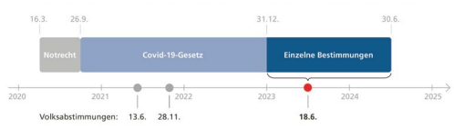

Im Detail

# Umsetzung Des Oecd/G20- Projekts Zur Besteuerung Grosser Unternehmensgruppen

| Ausgangslage          | In der Schweiz sind viele international tätige Unterneh                                                         |
|-----------------------|---------------------------------------------------------|
| mensgruppen angesiedelt. Sie sind ein wichtiger Pfeiler unserer Volkswirtschaft: Jede vierte angestellte Person arbeitet für  eine dieser Unternehmensgruppen.1 Diese schätzen die attraktiven Rahmenbedingungen in der Schweiz und tragen erheblich  zu den Einnahmen von Bund, Kantonen und Gemeinden bei.                       |                                                         |
| Das OECD/ G20-Projekt | Die Organisation für wirtschaftliche Zusammenarbeit und |
| Entwicklung (OECD) und die Gruppe der 20 wichtigsten Industrie- und Schwellenländer (G20) wollen die Regeln zur Besteuerung von grossen Unternehmensgruppen an die Digitalisierung  und Globalisierung der Wirtschaft anpassen. Gemeinsam  haben sie im Oktober 2021 ein entsprechendes Projekt verabschiedet. Die Schweiz hat sich dem Projekt zusammen mit  rund 140 Staaten angeschlossen. Es besteht aus zwei Säulen  (siehe Kasten).                       |                                                         |

| Debatte Parlament                 | 16   |
|-----------------------------------|------|
| Argumente Bundesrat und Parlament | 18   |
| Abstimmungstext                   | 20   |

## Die Zwei Säulen Des Oecd/G20-Projekts2

Besteuerung im Marktstaat (Säule 1): Sie betrifft Unternehmensgruppen mit einem jährlichen Umsatz von mindestens 20 Milliarden Euro und einer Profitabilität von mindestens 10 Prozent. Es geht gemäss Schätzung der OECD um die rund 100 grössten und profitabelsten Unternehmensgruppen der Welt. Sie sollen neu auch dort besteuert werden, wo sie ihre Waren verkaufen oder ihre Dienstleistungen erbringen. Ausgenommen sind regulierte Finanzdienstleistungen und der Rohstoffabbau. Für die Umsetzung braucht es ein internationales Übereinkommen. Damit soll Rechtssicherheit geschaffen und es sollen nationale Alleingänge verhindert werden. Welche Länder das Übereinkommen unterzeichnen werden und wann dies geschieht, ist noch offen. Mindestbesteuerung (Säule 2): Sie betrifft Unternehmensgruppen mit Unternehmen in mehr als einem Land und mit einem Jahresumsatz von mindestens 750 Millionen Euro. Diese Unternehmensgruppen sollen neu in jedem Land mindestens 15 Prozent Steuern auf ihrem Gewinn bezahlen. Der Gewinn wird nach international einheitlichen Regeln ermittelt; diese unterscheiden sich von den bestehenden Regeln der einzelnen Staaten, so auch der Schweiz. Ausgenommen von der Mindestbesteuerung sind Einkünfte aus der internationalen Schifffahrt. Die EU-Mitgliedstaaten haben sich im Dezember 2022 darauf geeinigt, dass sie diesen Teil des OECD/ G20-Projekts umsetzen wollen. Sie haben sich zum Ziel gesetzt, die Mindestbesteuerung ab 2024 einzuführen. Weitere Länder wie Grossbritannien, Kanada oder Japan haben ebenfalls die Einführung ab 2024 angekündigt.

1 Bundesamt für Statistik (BFS), Statistik der Unternehmensgruppen 
(STAGRE), Portrait der Unternehmensgruppen in der Schweiz 2014–2021, Neuenburg, November 2022 ( bfs.admin.ch > Statistiken finden > Industrie, Dienstleistungen > Statistik der Unternehmensgruppen > Publikationen).

2 OECD/G20-Projekt Gewinnverkürzung und Gewinnverlagerung, Erklärung über eine Zwei-Säulen-Lösung für die steuerlichen Herausforderungen der Digitalisierung der Wirtschaft, 8. Oktober 2021 ( oecd.org > Topics > Tax > Base erosion and profit shifting > BEPS Actions > Tax Challenges Arising from Digitalisation > Statement on a Two-Pillar Solution to Address the Tax Challenges Arising from the Digitalisation of the Economy - 8 October 2021).

| Ziele der Vorlage                             | Bundesrat und Parlament wollen mit der vorgeschlage                                                         |
|-----------------------------------------------|---------------------------------------------------------|
| nen Verfassungsänderung ermöglichen, dass die neuen Besteuerungsregeln für grosse Unternehmensgruppen auch in  der Schweiz umgesetzt werden können. Damit wollen sie  stabile Rahmenbedingungen, die Wettbewerbsfähigkeit der  Schweiz sowie Arbeitsplätze und Steuereinnahmen sichern.                                               |                                                         |
| Voraussetzung  für die Umsetzung  der Säule 1 | Die Vorlage schafft die Voraussetzungen dafür, dass die |
| Schweiz die Besteuerung im Marktstaat (Säule 1) einführen  kann. Bundesrat und Parlament haben noch nicht entschieden,  ob die Schweiz sich einem künftigen internationalen Übereinkommen anschliessen und die Besteuerung im Marktstaat  umsetzen soll.                                               |                                                         |
| Umsetzung der  Säule 2                        | Die Mindestbesteuerung (Säule 2) wollen Bundesrat und   |
| Parlament bereits 2024 einführen können. Damit wird sichergestellt, dass die betroffenen Unternehmensgruppen die  zusätzliche Steuer in der Schweiz zahlen. Eine Übergangsbestimmung in der Verfassung gibt dem Bundesrat das Recht, mit  einer Verordnung eine Ergänzungssteuer einzuführen. Die  Bestimmung verpflichtet ihn aber auch, dem Parlament innerhalb von sechs Jahren einen Gesetzesentwurf vorzulegen, um  diese Verordnung abzulösen.                                               |                                                         |
| Ergänzungssteuer Vorgaben für die  Verordnung | Die Übergangsbestimmung für die Umsetzung der Min                                                         |
| destbesteuerung macht dem Bundesrat für die Verordnung  unter anderem folgende Vorgaben: - Um die Differenz zwischen einer tieferen Steuerbelastung  und dem Mindeststeuersatz von 15 % auszugleichen,  erhebt der Bund eine Ergänzungssteuer. - Die Kantone erhalten 75 % der Einnahmen aus der Ergänzungssteuer, der Bund bekommt 25 %. Diese Vorgaben gelten nur für die Verordnung. Bundesrat  und Parlament können die Umsetzung im Gesetz anders ausgestalten.                                               |                                                         |

Nur grosse international tätige Unternehmensgruppen 

unterliegen der Ergänzungssteuer. Laut einer Schätzung der Eidgenössischen Steuerverwaltung (ESTV) sind in der Schweiz wenige Hundert inländische sowie wenige Tausend ausländische Unternehmensgruppen direkt von der OECD/G20-Reform betroffen.3 Die allermeisten Unternehmen in der Schweiz sind von der Reform nicht betroffen und werden wie bisher besteuert.4 3 Botschaft des Bundesrates vom 22. Juni 2022 zum Bundesbeschluss über eine besondere Besteuerung grosser Unternehmensgruppen (Umsetzung des OECD/G20-Projekts zur Besteuerung der digitalen Wirtschaft); BBl 2022 1700 Ziff. 6 ( admin.ch > Bundesrecht > 
Bundesblatt > Ausgaben des Bundesblattes).

4 Gemäss Bundesamt für Statistik (BFS) waren 2020 rund 617 000 Unternehmen in der Schweiz tätig. BFS-Statistik der Unternehmensstruktur 2020 ( bfs.admin.ch > Aktuell > Medienmitteilungen > 
Medienmitteilung vom 25. August 2022 «Die Zahl der Unternehmen und der Beschäftigten ist erstmals seit 2011 zurückgegangen»).

Betroffene Unternehmen

| Alle Kantone  betroffen                                                                                                                                                                                                                                                          | Heute ist es in allen Kantonen möglich, dass Unternehmen  weniger als die von der OECD vorgegebene Mindeststeuer  von 15 % bezahlen. Zum einen gilt in vielen Kantonen eine  tiefere Gewinnsteuerbelastung für alle Unternehmen. Zum  anderen können auch spezifische Steuervergünstigungen,  etwa für Forschung und Entwicklung, zu einer tieferen Besteuerung führen.                                                       |
|----------------------------------------------------------------------------------------------------------------------------------------------------------------------------------------------------------------------------------------------------------------------------------|-------------------------------------------------------|
| Kurzfristige  Einnahmen                                                                                                                                                                                                                                                          | Wie sich die Einführung der Ergänzungssteuer auf die  |
| Einnahmen von Bund, Kantonen und Gemeinden auswirkt, ist  schwer abzuschätzen. Es fehlen teilweise die nötigen Daten,  und bestimmte Reformelemente können nicht beziffert werden. Generell hängen die finanziellen Auswirkungen von der  Gesetzgebung in anderen Ländern ab. Die ESTV schätzt die  Einnahmen aus der Ergänzungssteuer im ersten Jahr auf 1 bis  2,5 Milliarden Franken.5                                                                                                                                                                                                                                                                                  |                                                       |
| Mittel- bis langfristige finanzielle  Entwicklungen                                                                                                                                                                                                                                                                                  | Mittel- bis langfristig könnten die Einnahmen aus der |
| Ergänzungssteuer und weitere Einnahmen des Staates auch  zurückgehen. Grund dafür ist, dass sich Unternehmen anpassen  und beispielsweise weniger investieren, weil die Schweiz durch  die Mindestbesteuerung für grosse Unternehmensgruppen  steuerlich weniger attraktiv wird. |                                                       |
| Kantonsanteil                                                                                                                                                                                                                                                                    | Die Einnahmen aus der Ergänzungssteuer stehen zu 75 % |
| jenen Kantonen zu, in denen die bestehende Steuerbelastung  der betroffenen Unternehmen unter 15 % liegt. Damit können  die Einnahmen gezielt dort eingesetzt werden, wo die zusätzliche Steuerbelastung zu einer Einbusse an Standortattraktivität führt. Die Kantone entscheiden eigenständig über die  Verwendung ihrer Einnahmen; sie müssen aber die Gemeinden  angemessen berücksichtigen.                                                                                                                                                                                                                                                                                  |                                                       |
| Bundesanteil                                                                                                                                                                                                                                                                     | Dem Bund stehen 25 % der Einnahmen zu. Er verwendet   |
| einen Teil der Mittel zur schweizweiten Förderung der Standortattraktivität. Über die konkreten Massnahmen werden  Bundesrat und Parlament entscheiden.                                                                                                                                                                                                                                                                                  |                                                       |

5 Botschaft des Bundesrates vom 22. Juni 2022 zum Bundesbeschluss über eine besondere Besteuerung grosser Unternehmensgruppen (siehe Fussnote 3 auf S. 13).

Nationaler Finanzausgleich Die Einnahmen aus der Ergänzungssteuer werden im 

nationalen Finanzausgleich berücksichtigt: Die Kantone zahlen einen Teil dieser Einnahmen in den nationalen Finanzausgleich ein. Vom Bundesanteil fliesst rund ein Drittel in den nationalen Finanzausgleich. Davon profitieren auch finanziell schwächere Kantone. 

Die Bundesverfassung verlangt, dass alle steuerlich gleichbehandelt werden. Die Umsetzung des OECD/G20-Projekts betrifft aber nur grosse international tätige Unternehmensgruppen. Darum braucht es eine Verfassungsänderung.

| einer Verfassungsänderung   |
|---|

| Was passiert bei  einem Nein?   |
|---------------------------------|

| Ohne die vorgeschlagene Verfassungsänderung kann der   |
|--------------------------------------------------------|
| Bundesrat die Mindestbesteuerung nicht umsetzen. Dann  könnten andere Staaten die Differenz zwischen der tieferen  Steuerbelastung und der Mindestbesteuerung von 15 % einziehen. Die betroffenen Unternehmensgruppen müssten die                                                        |

| Debatte                              | Parlament Das Parlament will die Mindestbesteuerung in der Schweiz  einführen können. Umstritten war die Verteilung der Einnahmen aus der Ergänzungssteuer zwischen Bund und Kantonen  sowie unter den Kantonen. Der gewählte Verteilschlüssel  bewog eine Minderheit dazu, die Vorlage abzulehnen.                                                      |
|--------------------------------------|------------------------------------------------------|
| Handlungsbedarf  unbestritten        | Die Mehrheit der Parlamentarierinnen und Parlamenta                                                      |
| rier ist der Ansicht, dass die Schweiz mit den internationalen  Entwicklungen mitziehen muss, auch wenn dadurch die Wettbewerbsfähigkeit eingeschränkt wird. Ohne Umsetzung der  Mindestbesteuerung würden die Einnahmen im Ausland anfallen und die Schweiz ginge leer aus. Für die Minderheit ist eine  Mindestbesteuerung ein Schritt in die richtige Richtung. Sie  entschärfe den Steuerwettbewerb und trage zu mehr Steuergerechtigkeit bei.                                      |                                                      |
| Verteilung der  Einnahmen            | Die Mehrheit will den Kantonen 75 % der Einnahmen    |
| aus der Ergänzungssteuer zusprechen und dem Bund 25 %. Sie  trägt damit einen Kompromiss mit, den Vertreterinnen und  Vertreter von Bund, Kantonen und Gemeinden ausgehandelt  haben. Die zusätzlichen Einnahmen aus der Ergänzungssteuer  sollen gezielt dort eingesetzt werden können, wo die Steuererhöhung die Standortattraktivität beeinträchtigt. Kantone  mit wenig Einnahmen aus der Ergänzungssteuer erhalten  tendenziell mehr Geld aus dem nationalen Finanzausgleich.  Von einem attraktiven Standort Schweiz profitieren alle.                                      |                                                      |
| Minderheit wollte  mehr für den Bund | Eine Minderheit wollte dem Bund einen höheren Anteil |
| als 25 % der Einnahmen zusprechen und die Einnahmen unter  den Kantonen gleichmässiger verteilen. So wäre der interkantonale Steuerwettbewerb zusätzlich gedämpft worden.  Der Bund hätte seinen höheren Anteil an den Mehreinnahmen  gesamtschweizerisch investieren können, zum Beispiel in  Massnahmen zur Erhöhung der Erwerbsanreize.                                      |                                                      |

Minderheit wollte konkretere Regeln für Kantone Auch die Verteilung der Einnahmen innerhalb der Kantone war umstritten. Die Mehrheit will diese Frage den Kantonen überlassen, verbunden mit der Verpflichtung, die Gemeinden angemessen zu berücksichtigen. Eine Minderheit wollte die Verteilung an die Gemeinden in der Bundesverfassung regeln.

parlament.ch > Ratsbetrieb > Curia Vista > 
Geschäfte > 22.036 Abstimmung im Nationalrat

 127 Ja 59 Nein

Abstimmung im Ständerat

Argumente

# Argumente Bundesrat Und Parlament

| Die Umsetzung der Mindestbesteuerung sichert der Schweiz  stabile Rahmenbedingungen, Steuereinnahmen und Arbeitsplätze. Grosse international tätige Unternehmensgruppen  werden die zusätzliche Steuer in der Schweiz anstatt im Ausland abliefern. Die Kantone profitieren von den Einnahmen  entweder über die Ergänzungssteuer oder durch den  Finanzausgleich.                                                                                                                                                                                                                                                                |                                                         |
|----------------------------------------------------------------------------------------------------------------------------------------------------------------------------------------------------------------------------------------------------------------|---------------------------------------------------------|
| Stabile Rahmenbedingungen sichern                                                                                                                                                                                                                                                                | Die Schweiz sichert mit der Umsetzung des OECD/G20-     |
| Projekts zur Mindestbesteuerung international stabile Rahmenbedingungen für den Wirtschaftsstandort Schweiz und  schützt Unternehmen vor zusätzlichen Steuerverfahren im  Ausland. Da die betroffenen Unternehmensgruppen die Steuer  ohnehin entrichten müssen, wird mit der Ergänzungssteuer  sichergestellt, dass die Steuereinnahmen in der Schweiz  bleiben.                                                                                                                                                                                                                                                                |                                                         |
| Breit abgestützter  Kompromiss                                                                                                                                                                                                                                 | Die Umsetzung der international vereinbarten Mindest                                                         |
| besteuerung wird im Grundsatz von allen Fraktionen im Parlament mitgetragen. Die Verteilung der zusätzlichen Steuereinnahmen zwischen Bund, Kantonen und Gemeinden basiert auf  einem Kompromiss, den Vertreterinnen und Vertreter dieser  Gemeinwesen ausgehandelt haben.                                                                                                                                                                                                                                                                |                                                         |
| Die ganze Schweiz  profitiert                                                                                                                                                                                                                                  | Mit dem gewählten Verteilschlüssel können die zusätz                                                         |
| lichen Einnahmen vor allem dort eingesetzt werden, wo die  zusätzliche Steuerbelastung die Standortattraktivität am  stärksten beeinträchtigt. Vom Erhalt der Standortattraktivität,  der Steuereinnahmen und der Arbeitsplätze profitiert die  ganze Schweiz. |                                                         |
| Ausgleich  zwischen den  Kantonen                                                                                                                                                                                                                              | Über den nationalen Finanzausgleich ist sichergestellt, |
| dass alle Kantone von den Einnahmen aus der Ergänzungssteuer profitieren. Je höher der Kantonsanteil an diesen Einnahmen ist, desto mehr Geld fliesst mit dem Finanzausgleich  den Kantonen zu. Der gewählte Verteilschlüssel kommt so  auch den finanzschwächeren Kantonen zugute.                                                                                                                                                                                                                                                                |                                                         |

| Föderalistische  Umsetzung                                                                                                                                                            | Die Vorlage respektiert den Föderalismus. So vollziehen   |
|---------------------------------------------------------------------------------------------------------------------------------------------------------------------------------------|-----------------------------------------------------------|
| die Kantone die Vorschriften über die Ergänzungssteuer.  Sie sind grundsätzlich frei darin, wie sie ihre Einnahmen verwenden. Sie müssen aber die Gemeinden angemessen  berücksichtigen.                                                                                                                                                                                       |                                                           |
| Rasche Umsetzung                                                                                                                                                                      | Dank der Verfassungsänderung kann der Bundesrat die       |
| Ergänzungssteuer bereits 2024 mit einer Verordnung einführen. Er wird die Verordnung in Kraft setzen, wenn andere  Staaten die Mindestbesteuerung auch einführen. Danach muss  er dem Parlament innert sechs Jahren einen Gesetzesentwurf  unterbreiten.                                                                                                                                                                                       |                                                           |
| Vorteile für  späteres Gesetz                                                                                                                                                         | Der Weg über die Verordnung bringt Vorteile: Wenn das     |
| Parlament später ein Gesetz erlässt, kann es sich auf die Erfahrung mit der Ergänzungssteuer stützen und falls nötig Anpassungen vornehmen.                                                                                                                                                                                       |                                                           |
| Empfehlung von  Bundesrat und  Parlament                                                                                                                                              | Aus all diesen Gründen empfehlen Bundesrat und Parla                                                           |
| ment, den Bundesbeschluss über eine besondere Besteuerung  grosser Unternehmensgruppen (Umsetzung des OECD/G20- Projekts zur Besteuerung grosser Unternehmensgruppen)  anzunehmen. Ja |                                                           |

admin.ch/oecd-mindeststeuer Im Detail **Bundesgesetz über die Ziele** 
im Klimaschutz, die Innovation und die Stärkung der Energiesicherheit (indirekter Gegenvorschlag zur Gletscher-Initiative)

| Argumente Referendumskomitee      | 30   |
|-----------------------------------|------|
| Argumente Bundesrat und Parlament | 32   |
| Abstimmungstexte                  | 34   |

## Ausgangslage

Die Schweiz als Alpenland ist vom Klimawandel besonders stark betroffen. Massnahmen gegen die Klimaerwärmung sind deshalb von grosser Bedeutung. Die Schweiz hat sich 2017 im Übereinkommen von Paris gemeinsam mit 192 weiteren Staaten und der EU verpflichtet, den Ausstoss von Treibhausgasen zu reduzieren. Gegen den Beitritt zum Übereinkommen wurde kein Referendum ergriffen.

Folgen des Klimawandels In der Schweiz sind die Veränderungen besonders spürbar. Seit Messbeginn hat die durchschnittliche Temperatur um 2,5 Grad zugenommen.

Erwärmung in der Schweiz
(Vergleich der durchschnittlichen Temperaturen in den Perioden 1871–1900 und 2013–2022)

Globale Erwärmung
(im selben Zeitraum)

()   Starker Regen Starkniederschläge sind zwischen 1901 ud 2015 um 12 % intensiver und um 30 %
hāufiger geworden.

(2)   Weniger Schnee Unter 800 Metern gibt es heute halb so viele Schneetage wie 1970.

3  Höhere Nullgradgrenze Die Nullgradgrenze ist seit 1961 um 300 bis 400 Meter gestiegen.

4   Schmelzende Gletscher Die Gletscher haben seit 1850 rund 60 % ihres Volumens verloren.

5)   Mehr Hitzetage Heute gibt es je nach Region zwei- bis viermal so viele Hitzetage (Höchsttemperatur von 30°C oder mehr) wie 1960.

Quelle: MeteoSchweiz (Z meteoschweiz.admin.ch > Klima > Klimawandel), globale Erderwärmung
/// cds.climate.copernicus.eu/ll/home > Applications > Global temperature trend monitor)

| Von der Initiative  zum Gegenvorschlag                                                                                                                                                                                                                                                                                                                                                                                                                                                                                                                       | 2019 wurde die Volksinitiative «Für ein gesundes Klima    |
|-----------------------------------------------------------------------------------------------------------------------------------------------------------------------------------------------------------------------------------------------------------------------------------------------------------------------------------------------------------------------------------------------------------------------------------------------------------------------------------------------------------------------|-----------------------------------------------------------|
| (Gletscher-Initiative)» eingereicht. Bundesrat und Parlament  geht die Initiative zu weit, weil sie den Verbrauch fossiler  Energieträger wie Öl und Gas ab 2050 verbietet. Das Parlament  hat deshalb einen indirekten Gegenvorschlag ausgearbeitet.  Nach Ansicht des Parlaments stärkt dieser den Klimaschutz und  trägt zu einer sicheren Energieversorgung bei. Gegen die  Vorlage wurde das Referendum ergriffen, weshalb es zu einer  Volksabstimmung kommt.                                                   |                                                           |
| Ziele der Vorlage                                                                                                                                                                                                                                                                                                                                                                                                                                                                                                     | Der indirekte Gegenvorschlag hält als Ziel fest, dass die |
| Schweiz bis 2050 klimaneutral werden muss. Das heisst: Der  Verbrauch fossiler Energieträger wird nicht verboten, soll aber  so weit wie möglich reduziert werden. Der Ausstoss von Treibhausgasen kann jedoch nicht überall auf null gesenkt werden.  Das betrifft zum Beispiel Kehrichtverbrennungsanlagen oder  die Landwirtschaft. Der noch verbleibende Ausstoss von Treibhausgasen soll daher ausgeglichen werden. Mit der Vorlage  sollen zudem die unvermeidbaren Folgen des Klimawandels für  Mensch, Umwelt und Wirtschaft gelindert werden.                                                                                                                                                                                                                                                                                                                                                                                                                                                                                                                       |                                                           |
| Unterstützung  beim Heizungsersatz                                                                                                                                                                                                                                                                                                                                                                                                                                                                                                                       | In der Schweiz sind Öl- und Gasheizungen für rund einen   |
| Viertel der ausgestossenen Treibhausgase verantwortlich.1  Für  Hauseigentümerinnen und Hauseigentümer sieht die Vorlage  deshalb während 10 Jahren jährlich maximal 200 Millionen  Franken vor, um sie bei der Umstellung auf klimafreundliche  Heizsysteme zu unterstützen. Im Vordergrund stehen dabei  Holzheizungen oder Wärmepumpen. Zudem sollen der Ausbau  von Fernwärmenetzen und die bessere Isolation der Gebäude  gefördert werden. Die Mittel fliessen in die bestehenden  Förderprogramme der Kantone. |                                                           |

1 Treibhausgasemissionen der Gebäude ( bafu.admin.ch > Themen > 
Klima > Daten, Indikatoren und Karten > Daten > Treibhausgasinventar > Gebäude).

| Ersatz von  Elektroheizungen                                                                                                                                                                                                                                                                                                                               | Elektroheizungen machen im Winter rund 10 Prozent des   |
|------------------------------------------------------------------------------------------------------------------------------------------------------------------------------------------------------------------------------------------------------------------------------------------------------------------------------------------------------------|---------------------------------------------------------|
| Stromverbrauchs in der Schweiz aus.2  Das ist fast so viel, wie  das stillgelegte Kernkraftwerk Mühleberg jährlich produziert  hat. Werden Elektroheizungen ersetzt, kann im Winter viel  Strom gespart werden. Deshalb werden Besitzerinnen und  Besitzer von Elektroheizungen finanziell unterstützt, wenn sie  auf eine effizientere Heizung umsteigen. |                                                         |
| Schutz vor Folgen  des Klimawandels                                                                                                                                                                                                                                                                                                                        | An die negativen Folgen des Klimawandels muss sich die  |
| Schweiz heute schon anpassen. Das wird in Zukunft noch  wichtiger. Die Vorlage nimmt Bund und Kantone in die Pflicht.  Sie sollen Massnahmen ergreifen, um Menschen, Umwelt und  Sachwerte vor Hochwasser, Erdrutschen, Hitzewellen oder  Trockenheit zu schützen. Gegen die Hitze in Städten und Dörfern können mehr Bäume und Grünflächen helfen. Massnahmen gegen die Trockenheit nützen insbesondere der Landwirtschaft.                                                                                                                                                                                                                                                                                                                                                            |                                                         |
| Förderung von  Innovationen                                                                                                                                                                                                                                                                                                                                | Neue Technologien sind zentral für den Klimaschutz.     |
| Unternehmen werden deshalb mit der Vorlage dabei unterstützt, in innovative Technologien zur Reduktion von Treibhausgasen zu investieren. Dafür stehen während sechs Jahren  jährlich maximal 200 Millionen Franken zur Verfügung, beispielweise für den Einsatz von klimaschonenden  Produktionsanlagen.                                                                                                                                                                                                                                                                                                                                                            |                                                         |
| Einbezug des  Finanzplatzes                                                                                                                                                                                                                                                                                                                                | Auch der Finanzplatz soll einen Beitrag zum Klimaschutz |
| leisten. Seine Investitionen sind ein wichtiger Hebel, um klimafreundliche Entwicklungen zu fördern. Die Vorlage ermöglicht  es dem Bund, mit Banken, Vermögensverwaltern, Pensionskassen und Versicherungen Vereinbarungen abzuschliessen.  Diese dienen dazu, konkrete Klimaziele und Massnahmen  festzulegen.                                                                                                                                                                                                                                                                                                                                                            |                                                         |

2 Beschleunigung des Ersatzes von Elektroheizungen (2022), Bericht zu Handen des Bundesrats (Bundesamt für Energie) ( bfe.admin.ch > News und Medien > Medienmitteilungen > Medienmitteilung vom 17. Februar 2022 «Versorgungssicherheit: Bundesrat richtet ab dem nächsten Winter eine Wasserkraftreserve ein und plant Reserve-Kraftwerke»).

CO2-Entnahme und -Speicherung Industriebetriebe wie Zementwerke und Kehrichtverbrennungsanlagen sowie die Landwirtschaft können den Ausstoss von Treibhausgasen nicht ganz vermeiden. Deshalb soll CO2 in Industriekaminen und aus der Atmosphäre entnommen werden. Dieses CO2 kann dann dauerhaft und sicher gespeichert werden, beispielsweise im Untergrund. Oder das CO2 wird in Beton eingelagert, der im Bau eingesetzt wird. 

Verwaltung geht voran Die Vorlage sieht vor, dass die Bundesverwaltung bereits 2040 klimaneutral sein muss. Bundesnahe Betriebe wie die Post und die SBB sowie die Kantone streben dies ebenfalls an. 

Keine neuen Abgaben Die Vorlage enthält keine Verbote und keine zusätzlichen 

Steuern oder Abgaben, weder für die Wirtschaft noch für die Bevölkerung. Die Fördermassnahmen sind befristet. Sie werden aus dem allgemeinen Bundeshaushalt finanziert und belaufen sich auf maximal 3,2 Milliarden Franken, verteilt über 10 Jahre.

Demokratische Mitsprache Die Vorlage legt fest, dass die Schweiz bis 2050 klimaneutral wird. Sie enthält Massnahmen, um auf diesem Weg voranzukommen. Weitere Massnahmen, die für die Erreichung des 

Ziels notwendig sind, müssen in separaten Gesetzen geregelt werden. Das erlaubt es, technologische Fortschritte zu berücksichtigen. Gegen solche Gesetze kann jeweils das Referendum ergriffen werden; kommt dieses zustande, hat das Volk das letzte Wort.

Bei einer Ablehnung Die Vorlage ist ein indirekter Gegenvorschlag zur Gletscher-Initiative. Das Initiativkomitee hat die Initiative zugunsten des Gegenvorschlags bedingt zurückgezogen. Das heisst: 
Wenn das Volk die Vorlage annimmt, ist die Initiative vom Tisch. Bei einem Nein zur Vorlage entscheidet das Initiativkomitee, ob die Gletscher-Initiative vors Volk kommt.

## Klimaneutrale Energieversorgung Ist Machbar

Zwei im Auftrag des Bundes erstellte Studien3 kommen zum Schluss, dass es technologisch möglich und bezahlbar ist, die Schweiz bis 2050 klimaneutral mit Energie zu versorgen. Die dafür notwendigen Technologien sind vorhanden oder in Entwicklung. Um Öl und Gas zu ersetzen, wird die Schweiz mehr Strom brauchen. 

Dazu müssen insbesondere erneuerbare Energien wie die Wasserkraft und die Photovoltaik (Solarpanels) ausgebaut werden. 

Gleichzeitig kann mit mehr Effizienz und - wie in der Vorlage vorgesehen - mit dem Ersatz von Elektroheizungen viel Strom gespart werden.

3 Energieperspektiven 2050+. Technischer Bericht (2020), Prognos AG, INFRAS AG, TEP Energy GmbH, Ecoplan AG, im Auftrag des Bundesamtes für Energie; Energieperspektiven 2050+. Volkswirtschaftliche Auswirkungen: Technischer Bericht (2022), Ecoplan AG 
im Auftrag des Bundesamtes für Energie ( bfe.admin.ch > Politik > Energieperspektiven 2050+).

Argumente Referendumskomitee

| Obwohl wir heute schon zu wenig Strom haben, bedeutet  dieses extreme Gesetz ein faktisches Verbot von Heizöl, Gas,  Diesel und Benzin. Das sind 60 Prozent unseres Energieverbrauchs! Heizen und Autofahren wären nur noch elektrisch  möglich. Das heisst massiv mehr Strombedarf und Tausende  Franken Mehrkosten pro Haushalt im Jahr! Die Landschaft  würde mit Solarpanels und Windrädern zugepflastert. Trotzdem wird die Versorgung mit genug bezahlbarem Strom im  Winter nicht reichen. Darum Nein zu diesem teuren  Stromfresser-Gesetz!                                                                                                                                                                         |                                                         |
|-------------------------------------------------------------------------------------------------------------------------------------------------------------------------|---------------------------------------------------------|
| Explodierende  Strompreise                                                                                                                                              | Normalverdiener, Familien, Rentner, Hotels, Restaurants |
| und Gewerbe leiden heute schon unter den hohen Strom- und  Energiepreisen. Der realitätsfremde Umbau der Energieversorgung verursacht gemäss einer Studie Kosten von mindestens  387 Milliarden Franken. Das sind über 1400 Franken zusätzliche  Kosten pro Kopf und Jahr! Eine ETH-Studie rechnet zudem  mit einer Verdreifachung der Energiekosten: Das bedeutet  6600 Franken Mehrkosten pro Person im Jahr! Mit diesem  Gesetz werden Strom und Energie zum Luxus für Reiche. Die  Industrie muss ihre Produktion einschränken oder ins Ausland  verlegen. Die Hauseigentümer müssen massiv investieren, die  Wohnungsmieten steigen!                                                                                                                                                                         |                                                         |
| Ausstieg ohne Plan                                                                                                                                                      | Dieses extreme Gesetz führt zum Verbot der fossilen     |
| Energieträger wie Heizöl, Benzin, Diesel und Gas. Und das  ohne Plan, wie genug bezahlbarer Strom für die elektrischen  Autos, Wärmepumpen etc. produziert werden soll. |                                                         |
| Verschärfter  Strommangel                                                                                                                                               | Wie sollen wir rund 60 Prozent des Schweizer Energie                                                         |
| bedarfs durch Strom ersetzen? Laut Berechnungen braucht es  dafür zusätzlich 17 Pumpspeicherkraftwerke wie bei der Grande Dixence, rund 5000 Windräder plus 70 Millionen Quadratmeter Solaranlagen. Damit verbunden ist eine Verschandelung  von Natur und Landschaft. Weil wir Strom nicht ausreichend  speichern können, ist der Strombedarf im Winter mit Sonnenund Windenergie trotzdem nicht gedeckt. Die aktuelle Krise  zeigt auch: Auf Importe ist kein Verlass.                                                                                                                                                                         |                                                         |

| Versorgungssicherheit gefährdet                         | Der planlose Ausstieg gefährdet unsere Versorgungs                                                     |
|-------------------------|-----------------------------------------------------|
| sicherheit! Wir werden noch mehr abhängig vom Wetter und  von Ressourcen aus dem Ausland. Wer eine sichere Energieversorgung will, setzt deshalb zuerst auf den Ausbau verschiedener Energiequellen (ohne Technologieverbote) und kann dann  den Ausstieg aus den fossilen Energien zuverlässig angehen.                         |                                                     |
| Staatliche  Umerziehung | Der Bundesrat kann im Alleingang extreme Massnahmen |
| verlangen wie teure Haussanierungen, den Ersatz funktionierender Öl- und Gas-Heizungen, das Verbot von Benzin-Autos,  von Flugreisen oder von Fleischkonsum.                         |                                                     |
| Empfehlung  des Referendumskomitees                         | Darum empfiehlt das Referendumskomitee: Nein        |

stromfresser-gesetz-nein.ch Der Text auf dieser Doppelseite stammt vom Referendumskomitee. Es ist für den Inhalt und die Wortwahl verantwortlich.

| Argumente                                                                                                                                                     | Bundesrat und Parlament Die Vorlage verstärkt den Klimaschutz und senkt die Abhängigkeit der Schweiz von Erdgas und Erdöl. Dies geschieht ohne  Verbote und neue Abgaben. Bundesrat und Parlament befürworten die Vorlage insbesondere aus den folgenden Gründen:                                                            |
|---------------------------------------------------------------------------------------------------------------------------------------------------------------|------------------------------------------------------------|
| sind begrenzt                                                                                                                                                 | Erdöl und Erdgas sind nicht unendlich verfügbar und        |
| schaden dem Klima. Für eine langfristig sichere Energieversorgung ist es notwendig und sinnvoll, dass die Schweiz  die Abkehr von den fossilen Energieträgern vorantreibt.                                                                                                                                                               |                                                            |
| Unabhängigkeit  stärken                                                                                                                                       | Die Schweiz hat kein eigenes Erdgas und Erdöl. Sie ist auf |
| Importe angewiesen, auch aus Ländern mit unzuverlässigen  und unberechenbaren Regierungen. Mit der Vorlage wird die  Schweiz von diesen Ländern unabhängiger. |                                                            |
| Bevölkerung und  Wirtschaft  unterstützen                                                                                                                     | Bundesrat und Parlament wollen die Bevölkerung beim        |
| nötigen Umstieg auf klimafreundlichere Heizungen unterstützen. Wer beispielsweise neu eine Holzheizung oder eine Wärmepumpe installiert, wird mit der Vorlage finanziell entlastet.  Unternehmen werden unterstützt, wenn sie in innovative,  klimafreundliche Technologien investieren. Die Vorlage setzt  die richtigen Anreize. Davon profitieren die Bevölkerung sowie  der Wirtschafts- und Innovationsstandort Schweiz.                                                                                                                                                               |                                                            |
| Stromverbrauch  reduzieren                                                                                                                                    | Elektroheizungen verbrauchen sehr viel Strom und sind      |
| ineffizient. Es ist darum wichtig, dass der Bund den Ersatz von  Elektroheizungen durch energiesparende und klimafreundliche  Heizungen finanziell unterstützt. Dieses Geld ist sehr gut investiert. Denn durch diese Massnahme wird der Stromverbrauch im  Winter reduziert, wenn Energie besonders kostbar ist.                                                                                                                                                               |                                                            |
| Keine Verbote und  keine neuen  Abgaben                                                                                                                       | Die Vorlage enthält keine neuen Verbote und führt auch     |
| keine neuen Abgaben oder Steuern ein.                                                                                                                         |                                                            |

Argumente Bundesrat und Parlament **Erdöl und Erdgas** 

sind begrenzt

| Schutz vor Folgen  des Klimawandels                                                                                            | Mit dem Klimawandel nehmen extreme Ereignisse wie     |
|--------------------------------------------------------------------------------------------------------------------------------|-------------------------------------------------------|
| Erdrutsche und Überschwemmungen zu. Die Belastung durch  Hitze und Trockenheit steigt. Ernteausfälle häufen sich. Bund  und Kantone müssen darum vorsorgen, etwa mit einem besseren Schutz vor Hochwasser und mehr Grünflächen in Dörfern  und Städten.                                                                                                                                |                                                       |
| Das Volk hat das  letzte Wort                                                                                                  | Die Vorlage setzt den Rahmen für die Klimapolitik der |
| Schweiz und enthält Massnahmen für deren Umsetzung. Weitere Massnahmen für den Klimaschutz müssen vom Parlament  beschlossen werden. Diese Beschlüsse unterstehen dem Referendum. Das Volk behält das letzte Wort.                                                                                                                                |                                                       |
| Empfehlung von  Bundesrat und  Parlament                                                                                       | Aus all diesen Gründen empfehlen Bundesrat und        |
| Parlament, das Bundesgesetz über die Ziele im Klimaschutz,  die Innovation und die Stärkung der Energiesicherheit  anzunehmen. |                                                       |

Ja

admin.ch/klimagesetz 41 Im Detail Änderung vom 16. Dezember 2022 des Covid-19-Gesetzes

| Argumente Referendumskomitee      | 48   |
|-----------------------------------|------|
| Argumente Bundesrat und Parlament | 50   |
| Abstimmungstext                   | 52   |

Ausgangslage Das Coronavirus zirkuliert weiterhin in der Bevölkerung und bleibt unberechenbar.1 Es kann nicht ausgeschlossen werden, dass eine neue gefährliche Virusvariante auftritt. Die Covid-19-Pandemie hat sich zwar im Laufe des Jahres 2022 stark abgeschwächt, es kann aber nicht verlässlich abgeschätzt werden, wie sich die Situation entwickeln wird. 

Verlängerung 

 Covid-19-Gesetz Als die Covid-Pandemie 2020 die Schweiz erreichte, musste der Bundesrat schnell handeln. Er stützte sich dabei auf das Epidemiengesetz und auf Notrecht. Mit dem Covid-19-Gesetz schuf das Parlament dann eine befristete gesetzliche Grundlage, damit die Pandemie ohne Notrecht weiter bekämpft werden konnte. Das Volk hat seither zwei Mal über das Gesetz abgestimmt und sich beide Male dafür ausgesprochen. Damit im Notfall bestimmte Massnahmen weiterhin rasch zur Verfügung stehen, hat das Parlament im Dezember 2022 einen Teil des Covid-19-Gesetzes bis Mitte 2024 verlängert.

1 Informationen des Bundesamtes für Gesundheit (BAG) zur aktuellen epidemiologischen Situation: covid19.admin.ch

| Rascher Zugang zu  neuen Covid-19- Medikamenten   | Das Gesetz erlaubt dem Bundesrat, weiterhin Medika                                                           |
|---------------------------------------------------|-----------------------------------------------------------|
| mente gegen Covid-19 zu importieren und in Verkehr zu bringen, auch wenn sie in der Schweiz noch nicht zugelassen sind.  Seit September 2020 konnten auf diese Weise mehrere neue  Medikamente gegen Covid-19 zur Verfügung gestellt werden.  Mit diesen Medikamenten konnten Personen behandelt werden, die ein hohes Risiko haben, schwer zu erkranken.                                                   |                                                           |
| Covid-Zertifikat für  den Reiseverkehr            | Das Zertifikat kann als sicherer Nachweis für eine Covid                                                           |
| 19-Impfung, eine durchgemachte Erkrankung oder einen  durchgeführten Test dienen. In vielen Ländern besteht weiterhin die Möglichkeit, für die Einreise wieder ein Covid-Zertifikat  zu verlangen. Das Covid-19-Gesetz erlaubt es, weiterhin Zertifikate auszustellen, die im internationalen Reiseverkehr verwendet werden können. Der erneute Einsatz des Zertifikats  im Inland ist unwahrscheinlich: Er müsste verhältnismässig und  unbedingt erforderlich sein. Dies wäre höchstens dann denkbar, wenn eine neue gefährliche Virusvariante auftaucht,  welche die Gesundheitsversorgung gefährden könnte.                                                   |                                                           |
| Schutz von  Arbeitnehmenden                       | Sollte sich die epidemiologische Lage erheblich ver                                                           |
| schlechtern, könnte der Bund Arbeitgeber dazu verpflichten,  besonders gefährdete Personen stärker zu schützen. Die Arbeitgeber müssten dann diesen Personen die Arbeit von zuhause aus ermöglichen oder ihnen zuhause oder vor Ort eine  gleichwertige Ersatzarbeit zuweisen.                                                   |                                                           |
| Meldung der  Auslastung der  Bettenkapazität      | Bei einem Anstieg der Krankheitsfälle ist es für den Bund |
| wichtig, einen Überblick über die Anzahl und Auslastung der  Spitalbetten in der Schweiz zu haben. Mit dem Covid-19-Gesetz kann der Bund die Kantone verpflichten, die Auslastung  der Bettenkapazitäten zu melden - insbesondere auf den  Intensivstationen. Er kann zudem Hersteller, Vertreiber, Labors  sowie Spitäler und Heime verpflichten, ihren Bestand an Medikamenten, Schutzausrüstungen und wichtigen medizinischen  Gütern zu melden. Damit sollen pandemiebedingte Engpässe  erkannt und Versorgungslücken verhindert werden.                                                   |                                                           |

| Entwicklung von  Covid-19-Medikamenten                                                                                                                                                                                                                                                                                                                                                                    | Der Bund fördert seit Ende 2021 die Entwicklung von   |
|--------------------------------------------------------------------------------------------------------------------------------------------------------------------------------------------------------------------------------------------------------------------------------------------------------------------------------------------------------------------|-------------------------------------------------------|
| Medikamenten gegen die Covid-19-Erkrankung und deren  Langzeitfolgen. Das entsprechende Förderprogramm basiert  auf dem Covid-19-Gesetz. Ohne die rechtliche Grundlage durch  das Covid-19-Gesetz können diese Projekte nicht mehr gefördert werden und müssen unter Umständen vorzeitig abgebrochen werden.                                                                                                                                                                                                                                                                                                                                                                    |                                                       |
| SwissCovid-App  kann reaktiviert  werden                                                                                                                                                                                                                                                                                                                           | Mit dem Contact-Tracing wurden die engen Kontakte von |
| Personen ermittelt, die sich mit dem Coronavirus infiziert  hatten. Die SwissCovid-App unterstützte dies: Sie stellte fest,  ob ein solcher Kontakt bestand, und informierte schnell über  das Ansteckungsrisiko. Die App ist zurzeit eingestellt und kann  im Notfall reaktiviert werden. Installation und Nutzung der  Applikation bleiben weiterhin freiwillig. |                                                       |
| Bund kann Einreise  einschränken                                                                                                                                                                                                                                                                                                                                   | Zur Bekämpfung der Pandemie ermöglicht es das Covid                                                       |
| 19-Gesetz, die Einreise aus bestimmten Staaten oder Regionen  einzuschränken. Aktuell ist kein Staat von diesen Einreisebeschränkungen betroffen.                                                                                                                                                                                                                                                                                                                                                                    |                                                       |
| Einreise für Grenzgängerinnen und  Grenzgänger                                                                                                                                                                                                                                                                                                                                                                    | Die Schweiz hat zu Beginn der Pandemie strenge Einreise                                                       |
| beschränkungen und Grenzkontrollen eingeführt. Sollten  solche Beschränkungen wieder nötig sein, könnten Grenzgängerinnen und Grenzgänger dank dem Covid-19-Gesetz weiterhin ein- und ausreisen. Rund 400 000 Personen pendeln aktuell  über eine Landesgrenze zur Arbeit in die Schweiz. Rund 34 000  von ihnen arbeiten in Spitälern und Heimen, vor allem in den  Grenzkantonen.2                                                                                                                                                                                                                                                                                                                                                                    |                                                       |

| 2   | Im 4. Quartal 2022 arbeiteten ungefähr 381 000 Grenzgängerinnen  und Grenzgänger mit ausländischer Staatsangehörigkeit in der  Schweiz. Dazu kommen etwa 16 000 Grenzgängerinnen und  Grenzgänger mit Schweizer Staatsangehörigkeit; Bundesamt für  Statistik, BFS - Grenzgängerstatistik 2022 ( bfs.admin.ch >  Statistiken finden > Arbeit und Erwerb > Erwerbstätigkeit und  Arbeitszeit > Erwerbsbevölkerung, Erwerbsbeteiligung > Grenzgängerinnen und Grenzgänger > - Tabelle «Grenzgänger/innen nach Wohn- und Arbeitsort  (innerhalb oder ausserhalb der Schweiz), nach Nationalität.» - Tabelle «Ausländische Grenzgänger/innen nach Arbeitskanton,  Wohnsitzstaat, Wirtschaftsabteilung und Geschlecht»).   |
|-----|---|

| Nicht verlängerte  Massnahmen   | Viele Bestimmungen des Covid-19-Gesetzes wurden nicht   |
|---------------------------------|---------------------------------------------------------|
| verlängert und die meisten sind Ende 2022 ausgelaufen. Dazu  gehören unter anderem die Massnahmen zur finanziellen  Unterstützung von Kulturbetrieben, Sportvereinen und Grossveranstaltungen, die Härtefallmassnahmen, die Erwerbsausfallentschädigung, die ausserordentliche Kurzarbeitsentschädigung und die Kostenübernahme von Tests durch den Bund.                                 |                                                         |
| Was geschieht bei  einem Nein?  | Damit die Bestimmungen notfalls sofort angewendet       |
| werden können, wurde die Verlängerung des Gesetzes für  dringlich erklärt und trat per sofort in Kraft. Gegen die Verlängerung wurde das Referendum ergriffen. Wird das Gesetz von  der Stimmbevölkerung abgelehnt, treten sämtliche der verlängerten Bestimmungen Mitte Dezember 2023 ausser Kraft.                                 |                                                         |

47 Argumente Referendumskomitee

| Die Verlängerung des Covid-Gesetzes ist nutzlos und schädlich. Der Bund hat die Pandemie für beendet erklärt und alle  Einschränkungen aufgehoben. Das Gesetz bietet aber die  Möglichkeit, jederzeit wieder ein Zertifikat und weitere diskriminierende Massnahmen einzuführen. Dabei haben wir alle  - ob geimpft oder ungeimpft - genug von Streit und Diskriminierung. Mit einem Nein überwinden wir die Spaltung der  Gesellschaft und kehren endlich wieder zur Normalität zurück.                                      |                                                      |
|--------------------------------------|------------------------------------------------------|
| Nutzloses  Zertifikat                | Das Zertifikat ist nutzlos. Die Stimmbürgerinnen und |
| Stimmbürger wurden bei der letzten Covid-Abstimmung in die  Irre geführt. Bundesrat Alain Berset behauptete am 27. Oktober 2021 in der Tagesschau von SRF: «Mit dem Zertifikat kann  man zeigen, dass man nicht ansteckend ist.» In Wahrheit können Geimpfte das Virus genauso weiterverbreiten wie Ungeimpfte. Es sei klar, «dass wir die Übertragung mit der Impfung  nicht beeinflussen können», räumte Christoph Berger am  23. Januar 2023 im Tages-Anzeiger ein, der Präsident der Eidgenössischen Kommission für Impffragen. Es hat daher keinen  Sinn, die gesetzliche Grundlage für das Zertifikat zu verlängern. Auch für Auslandsreisen hat das Zertifikat keinen Nutzen,  wir haben einen weltweit anerkannten Impfausweis.                                      |                                                      |
| Unnötige  Verlängerung               | Die Verlängerung des Covid-Gesetzes ist unnötig. Der |
| Bund hat alle Einschränkungen beendet. Sie haben sich überdies nicht bewährt und der Bevölkerung nicht den versprochenen Schutz gewährt. Die unverhältnismässigen Massnahmen  haben viel Leid verursacht, bei älteren wie bei jüngeren  Menschen. Besonders junge Frauen und Mädchen leiden unter  psychologischen Folgen.                                      |                                                      |
| Direkte Demokratie  wiederherstellen | Mit dem verlängerten Gesetz verfügt der Bundesrat    |
| weiterhin über eine undemokratische Machtfülle. Während  praktisch überall auf der Welt die Corona-Gesetze abgeschafft  werden, hält die Schweiz daran fest. Damit bleibt das demokratische Gefüge in Schieflage. Es ist höchste Zeit, dass die  direkte Demokratie vollständig wiederhergestellt wird. Der  Ausnahmezustand muss eine Ausnahme bleiben.                                      |                                                      |

| Argumente der  Befürworter  weggefallen   | Gegen die Verlängerung spricht ausserdem, dass die   |
|-------------------------------------------|------------------------------------------------------|
| ausschlaggebenden Argumente der ersten beiden Volksabstimmungen weggefallen sind: Bei der ersten Abstimmung  dominierten die Finanzhilfen, die nun ausgelaufen sind. Bei  der zweiten standen die Unwahrheiten zum Zertifikat und zur  Wirksamkeit der Impfung im Vordergrund. Damit entbehrt  das Gesetz jeder vernünftigen Grundlage.                                           |                                                      |
| Versöhnung der  Gesellschaft              | Mit einem Nein zu diesem nutzlosen und schädlichen   |
| Gesetz leisten Sie somit einen wichtigen Beitrag für die Volksrechte, die direkte Demokratie und die Versöhnung der Gesellschaft. Damit wir alle ein selbstverantwortliches und normales  Leben zurückgewinnen können.                                           |                                                      |
| Empfehlung                                | Darum empfiehlt das Referendumskomitee:              |

Empfehlung des Referendumskomitees Nein massnahmen-nein.ch Der Text auf dieser Doppelseite stammt vom Referendumskomitee. Es ist für den Inhalt und die Wortwahl verantwortlich.

Argumente Bundesrat und Parlament

| Das Covid-19-Gesetz hat die rechtliche Grundlage geschaffen,  um rasch zu handeln und die Pandemie gezielt einzudämmen.  Es hat sich bewährt und ist demokratisch breit abgestützt.  Obwohl die Pandemie sich stark abgeschwächt hat, ist die  Verlängerung der Bestimmungen sinnvoll, damit der Bund im  Notfall auf gewisse Instrumente zurückgreifen kann. Bundesrat und Parlament befürworten die befristete Verlängerung  insbesondere aus folgenden Gründen:                                                                                                                                                                                                                                                                                                                                      |                                                             |
|--------------------------------------------------------------------------------------------------------------------------------------------------------------------------------------------------------------------------------------------------------------------------------------------------------------------------------------|-------------------------------------------------------------|
| Neue Medikamente  für gefährdete  Personen                                                                                                                                                                                                                                                                                           | Für besonders gefährdete Personen können neue Medi          |
| kamente gegen eine Covid-19-Erkrankung lebenswichtig sein.  Dank des Covid-19-Gesetzes konnte der Bund mehrere neue  Medikamente rasch zur Verfügung stellen, bevor das Zulassungsverfahren abgeschlossen war. Wird die Verlängerung  abgelehnt, wäre dies nicht mehr möglich. Von der Regelung  profitieren Personen, die ein erhöhtes Risiko haben, schwer  zu erkranken, etwa Menschen mit einem geschwächten  Immunsystem.                                                                                                                                                                                                                                                                                                                                      |                                                             |
| Covid-Zertifikat für  den Reiseverkehr                                                                                                                                                                                                                                                                                               | Die Schweiz ist international stark vernetzt. Es kann nicht |
| ausgeschlossen werden, dass einige Länder bei der Einreise  wieder ein Covid-Zertifikat verlangen. Es ist deshalb für die  Menschen und die Unternehmen wichtig, im Reiseverkehr  nötigenfalls ein sicheres, international anerkanntes Zertifikat  einsetzen zu können. Ohne Covid-19-Gesetz fehlt dafür die  gesetzliche Grundlage. |                                                             |
| Gesundheitswesen  in Grenzregionen  schützen                                                                                                                                                                                                                                                                                         | Es ist derzeit unwahrscheinlich, dass die Schweiz strenge   |
| Grenzkontrollen einführt. Sollte es dennoch so weit kommen,  wäre der Betrieb in den Spitälern der Grenzregionen gefährdet, weil viele Grenzgängerinnen und Grenzgänger im Gesundheitssystem arbeiten. Das Covid-19-Gesetz ermöglicht es ihnen,  auch im Falle von Grenzschliessungen weiterhin einzureisen.                                                                                                                                                                                                                                                                                                                                      |                                                             |
| Schutz während  der Arbeit                                                                                                                                                                                                                                                                                                           | Wenn sich die epidemiologische Lage verschärft, brau                                                             |
| chen besonders gefährdete Personen einen stärkeren Schutz  während ihrer Arbeit. Dank des Gesetzes kann der Bund  die Arbeitgeber dazu verpflichten, diesen Personen das Arbeiten  im Homeoffice zu ermöglichen. Damit sind sie besser vor  einer Infektion geschützt.                                                               |                                                             |

| Für den Notfall  vorbereitet sein   |
|-------------------------------------|

| werden fast keine Bestimmungen des Gesetzes mehr angewendet. Sie wurden nur verlängert, damit sie bei einer deutlichen  Verschlechterung der Situation rasch zur Verfügung stehen  würden. Ein Nein zu den verlängerten Bestimmungen würde es  dem Bund im Notfall erschweren, rasch und gezielt zu handeln  und besonders gefährdete Personen zu schützen. Aus all diesen Gründen empfehlen Bundesrat und Parlament, die am 16. Dezember 2022 beschlossene Verlängerung   |
|---|

| Empfehlung von  Bundesrat und  Parlament   |
|--------------------------------------------|

Aus all diesen Gründen empfehlen Bundesrat und Parlament, die am 16. Dezember 2022 beschlossene Verlängerung des Covid-19-Gesetzes anzunehmen.

## Ja

admin.ch/verlaengerung-covid-19-gesetz