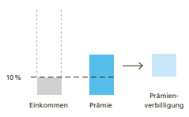
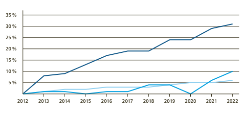

# Im Detail Volksinitiative «Maximal 10 % Des Einkommens Für Die Krankenkassenprämien (Prämien-Entlastungs-Initiative)»

Ausgangslage Wer in der Schweiz krank ist, erhält die nötige medizinische Behandlung. Seit 1996 übernimmt die obligatorische Krankenversicherung die Kosten dafür. Die Krankenversicherung wird über die Krankenkassenprämien und Kostenbeteiligungen (Franchise, Selbstbehalt, Spitalkostenbeitrag) finanziert. Die Kosten der Krankenversicherung sind in den letzten Jahrzehnten stark gestiegen. Um sie zu decken, mussten die Prämien entsprechend erhöht werden. Die Prämien stiegen im Verhältnis deutlich mehr als die Löhne.1 Prämienverbilligung Die Prämien werden pro Person und unabhängig von der Einkommenshöhe bestimmt. Die Kantone sind verpflichtet, die Prämien der Versicherten in bescheidenen wirtschaftlichen Verhältnissen zu verbilligen. Die Kantone erhalten dazu vom Bund einen Beitrag. Der Mittelstand profitiert jedoch nicht oder nur teilweise von dieser Verbilligung und wird darum von den steigenden Prämien zunehmend stark belastet. 

| Obligatorische Krankenversicherung Die obligatorische Krankenpflegeversicherung (OKP) wird auch  als Grundversicherung bezeichnet. Sie ist seit 1996 obligatorisch und  bietet allen Versicherten Zugang zu denselben Leistungen. Sie deckt  Behandlungskosten bei Krankheit, Mutterschaft und in gewissen  Fällen bei Unfall. Die OKP wird weitgehend über Prämien finanziert.  Alle Versicherten bezahlen unabhängig von ihrem Einkommen eine  Prämie. Sie beteiligen sich zudem durch Franchise, Selbstbehalt und  Spitalkostenbeitrag an den Behandlungskosten. Personen in bescheidenen wirtschaftlichen Verhältnissen erhalten eine Prämienverbilligung. Diese wird von Bund und Kanton über Steuergelder finanziert.   |
|---|

| Argumente Initiativkomitee        | 16   |
|-----------------------------------|------|
| Argumente Bundesrat und Parlament | 18   |
| Abstimmungstext                   | 20   |

Die Initiative Die Prämien-Entlastungs-Initiative fordert, dass alle Versicherten höchstens 10 Prozent ihres verfügbaren Einkommens für die Prämien aufwenden müssen und dass sie für den Betrag darüber hinaus eine Prämienverbilligung erhalten. Der Bund müsste diese zu mindestens zwei Dritteln finanzieren, die Kantone müssten den Rest übernehmen. Wie das verfügbare Einkommen definiert wird und welche Prämie massgebend ist, müsste das Parlament bei der Umsetzung der Initiative bestimmen.

1 Prämien-Entlastungs-Initiative Versicherte bezahlen max. 10% ihres verfügbaren Einkommens

Übersteigt die massgebende Prämie 10 Prozent des verfügbaren Einkommens, erhalten Versicherte eine Prämienverbilligung. 

Die Kantone sind für die Gesundheitsversorgung verantwortlich. Sie haben damit einen grossen Einfluss auf die Kosten. 

Sie können zum Beispiel bestimmen, wie viele Spitäler und wie viele Ärztinnen und Ärzte zulasten der obligatorischen Krankenversicherung abrechnen dürfen. Das ist ein Grund, warum die Kosten für die Gesundheitsversorgung von Kanton zu Kanton unterschiedlich sind. Die Höhe der Prämien ist je nach Kanton sehr unterschiedlich, weil die Krankenkassen die Prämien so festlegen müssen, dass die kantonalen Kosten gedeckt werden. 

1 Prämien: Bundesamt für Gesundheit BAG ( bag.admin.ch > Zahlen und Statistiken > Krankenversicherung > Statistik der obligatorischen Krankenversicherung > 2022 > Statistik der obligatorischen Krankenversicherung 2022 > T 03 Prämien&mittl. Prämien je Versicherte_OKP > KV305N_STATKV2022-N); Löhne: Bundesamt für Statistik BFS ( bfs.admin.ch > Statistiken finden > 03 - Arbeit und Erwerb > Löhne, Erwerbseinkommen und Arbeitskosten > Schweizerischer Lohnindex > Weiterführende Informationen > Tabellen > Schweizerischer Lohnindex nach Sektor: Index und Veränderung auf der Basis 1993 = 100.

Kantonale Unterschiede bei den Prämien

| Kantonale Unterschiede bei Prämienverbilligung                        | Die Kantone bestimmen weitgehend selbst, wem sie         |
|------------------------|----------------------------------------------------------|
| die Prämien wie stark verbilligen. Ihre Prämienverbilligungen  können sie abstimmen auf die Steuerbelastung ihrer Bevölkerung und auf ihre Sozialleistungen (etwa die Familienzulagen,  die Ergänzungsleistungen oder die Sozialhilfe). Die Kantone  setzen unterschiedlich viel Geld für ihre Prämienverbilligung  ein. Auch der Betrag, den die Kantone im Durchschnitt pro  Person ausgeben, variiert stark.                        |                                                          |
| Finanzierung  der Prämienverbilligung                        | Im Jahr 2022 hat rund ein Viertel der Bevölkerung in der |
| Schweiz eine Prämienverbilligung erhalten. Das sind 2,3 Millionen  Personen. Der Bund hat für die Prämienverbilligung  2,9 Milliarden Franken ausgegeben, die Kantone 2,5 Milliarden.  Der Bund erhöht seinen Beitrag an die Prämienverbilligung  automatisch, wenn die Kosten der obligatorischen Krankenversicherung und damit die Prämien steigen.2  Die Kantone sind  dazu nicht verpflichtet. Mehrere Kantone haben ihren Beitrag  in den letzten Jahren nur teilweise an die gestiegenen Kosten  angepasst oder ihren Beitrag sogar gesenkt.                        |                                                          |
| Kosten der  Initiative | Bei Annahme der Initiative müssten Bund und Kantone      |
| die Prämien zusätzlich um mehrere Milliarden Franken pro Jahr  verbilligen. Das Bundesamt für Gesundheit BAG hat geschätzt,  dass die Initiative bei Bund und Kantonen zu Mehrausgaben  in der Höhe von 3,5 bis 5 Milliarden Franken führen könnte.3 Der genaue Betrag hängt stark davon ab, wie das Parlament die  Initiative umsetzen würde. Es müsste definieren, wie das verfügbare Einkommen bestimmt wird. Von diesem Einkommen  dürften die Krankenkassenprämien der Versicherten künftig  maximal 10 Prozent ausmachen. Das Parlament müsste auch  definieren, welche Prämie für die Berechnung massgebend  wäre.4 2 Der Bund zahlt den Kantonen einen Beitrag für die Prämienverbilligung. Dieser entspricht 7,5 Prozent der Bruttokosten der obligatorischen Krankenversicherung. Er wird nach der Wohnbevölkerung  (Grenzgängerinnen und -gänger inbegriffen) auf die Kantone  verteilt (Art. 66 des Krankenversicherungsgesetzes; admin.ch >  Bundesrecht > Systematische Rechtssammlung). 3 Die Schätzung bezieht sich auf das Jahr 2020 und beruht auf Daten  für dieses Jahr. Je nach Entwicklung der Gesundheitskosten steigen  die jährlichen Mehrausgaben gemäss Schätzung bis 2030 auf 7 bis  11,7 Milliarden Franken (Botschaft des Bundesrates, BBl 2021 2383,  Ziff. 4.2.1).                        |                                                          |

Auswirkung auf die Versicherten Wie viele Menschen zusätzlich von der Prämienverbilligung profitieren würden, wäre abhängig von der Umsetzung der Initiative. Weil die einkommensschwächsten Versicherten bereits heute eine Verbilligung erhalten, würden sie kaum zusätzlich entlastet. Andere Versicherte, die mehr als 10 Prozent ihres verfügbaren Einkommens für die Prämie ausgeben, würden mit der Initiative entlastet.

## Indirekter Gegenvorschlag

Bundesrat und Parlament lehnen die Initiative ab, sie haben aber einen indirekten Gegenvorschlag auf Gesetzesstufe ausgearbeitet. Heute erhöht der Bund seine Beiträge an die Prämienverbilligung automatisch, wenn die Kosten der obligatorischen Krankenversicherung steigen. Neu müssten dies auch die Kantone tun. Dabei müsste jeder Kanton einen Mindestbeitrag zur Prämienverbilligung leisten. Dieser Beitrag würde sich an den Gesamtkosten der obligatorischen Krankenversicherung in diesem Kanton orientieren. Die Kantone würden wie bisher weitgehend selbst bestimmen, wem sie die Prämien wie stark verbilligen.5 Mit dem Gegenvorschlag müssten die Kantone die Prämien zusätzlich um mindestens 360 Millionen Franken verbilligen. Einige Kantone erfüllen die Anforderung des Gegenvorschlags bereits heute. Für den Bund entstünden durch den Gegenvorschlag keine Mehrkosten; sein Beitrag würde weiterhin nach der bestehenden Regelung jährlich angepasst. Der Gegenvorschlag würde die Kantone zudem verpflichten festzulegen, welchen Anteil am verfügbaren Einkommen der Versicherten die Krankenkassenprämie höchstens ausmachen darf. Sie könnten diesen Anteil unterschiedlich hoch festlegen. Wird die Initiative abgelehnt, so tritt der Gegenvorschlag in Kraft, sofern er nicht erfolgreich mit einem Referendum bekämpft wird.

4 Bei Annahme der Initiative wäre nicht zwingend die Prämie massgebend, die eine Person bezahlt, sondern eine gesamthaft berechnete Prämie. Das könnte zum Beispiel eine Durchschnittsprämie sein. Eine solche berechnet das Bundesamt für Gesundheit BAG 
bereits heute für statistische Zwecke. Dazu schätzt und gewichtet es die Verteilung der Versicherten auf die verschiedenen Prämien.

5 Das Bundesamt für Gesundheit BAG hat geschätzt, dass der Gegenvorschlag die Kantone im Jahr 2020 rund 360 Millionen Franken zusätzlich gekostet hätte ( parlament.ch > Geschäfte > 21.063 > Weiterführende Unterlagen > Medienmitteilung > 
Donnerstag, 24. August 2023 Medienmitteilung SGK-N > Dokumente > Beilagen > Übersicht der Mehrkosten der Prämien-EntlastungsInitiative & der verschiedenen Gegenvorschläge in Millionen Franken gerundet im Basisjahr 2020).

## Argumente Initiativkomitee

| In den letzten zwanzig Jahren haben sich die Prämien mehr  als verdoppelt. Gleichzeitig sind Löhne und Renten kaum  gestiegen. Mit der Prämien-Entlastungs-Initiative werden die  Prämien gedeckelt und dürfen nicht mehr als zehn Prozent des  verfügbaren Einkommens ausmachen. Das schützt nicht nur  Personen mit tiefen Löhnen, sondern auch Familien, RentnerPaare und Personen mit durchschnittlichen Einkommen.  Eine vierköpfige Familie mit einem Haushaltseinkommen von  zusammen 9000 Franken netto spart dank der Initiative  monatlich im Schnitt mehrere Hundert Franken.                                                                                                                                                                                                                                                                                                                                                                                                                                            |                                                         |
|--------------------------------------------------------------------------------------------------------------------------------------------------------------------------------------------------------------------------------------------------------------------------------------------------------------------------------------------------------------------------------------------------------------------------------------------|---------------------------------------------------------|
| Löhne stagnieren,  Prämien  explodieren                                                                                                                                                                                                                                                                                                                                                                                                    | Krankenkassenprämien steigen seit Jahren. Gleichzeitig  |
| sparen die Kantone auf Kosten des Mittelstands. Gemessen  an der Bevölkerung gibt eine deutliche Mehrheit der Kantone  heute selber weniger Geld für Prämienverbilligungen aus als  vor zehn Jahren. Diese Entwicklung verschärft das Problem der  Kopfprämien, denn ein Manager bezahlt gleich viel für die  Grundversicherung wie eine Verkäuferin. Um die Kosten wieder  gerechter zu verteilen, braucht es mehr Prämienverbilligungen. |                                                         |
| Auch für Pensionierte und  Einzelpersonen                                                                                                                                                                                                                                                                                                                                                                                                                                            | Die Krankenkassenprämien sind wie eine Steuer, die alle |
| bezahlen müssen. Doch im Gegensatz zu anderen Steuern sind  die Prämien nicht begrenzt, sondern steigen jedes Jahr. Mit der  Prämien-Entlastungs-Initiative wird eine Deckelung bei zehn  Prozent des verfügbaren Einkommens gefordert. Das kommt  nicht nur Personen mit tiefen Löhnen zugute. Einzelpersonen  mit einem Netto-Einkommen von bis zu rund 5000 Franken  werden von der geforderten Deckelung profitieren.                  |                                                         |
| Politik wird  zum Handeln  gezwungen                                                                                                                                                                                                                                                                                                                                                                                                       | Heute zahlen die Versicherten den Preis dafür, dass die |
| Lobbys der Pharmakonzerne und der Gesundheitsbranche ihre  Interessen durchsetzt. Sie hat bisher verhindert, dass die Politik  die Gesundheitskosten in den Griff bekommt. Das hat höhere  Prämien für uns alle zur Folge. Bei einer Annahme verschiebt  sich der Druck der steigenden Gesundheitskosten weg von den  Prämienzahlenden hin zur Politik. Bund und Kantone haben  neu einen Anreiz, endlich bei den Medikamentenpreisen und  dem teuren Pseudo-Wettbewerb zwischen den Kassen vorwärts zu machen.                                                                                                                                                                                                                                                                                                                                                                                                                                            |                                                         |

Wer profitiert von der Initiative?

Familie mit zwei Kindern Eine vierköpfige Familie mit einem Haushaltseinkommen von zusammen 9000 Franken netto spart monatlich im Schnitt mehrere Hundert Franken. Pensionierte, Einzelperson Pensionierte und Einzelpersonen mit einem Netto-Einkommen bis zu 5000 Franken profitieren von der geforderten Deckelung der Prämien.

Quelle: Berechnungen des Schweizerischen Gewerkschaftsbundes mit Zahlen des Bundesamtes für 

 Gesundheit und des Bundesamtes für Statistik; die Berechnungen basieren auf der Annahme, dass das Parlament und der Bundesrat die Initiative so umsetzen, wie es das Initiativkomitee vorschlägt.

Empfehlung des Initiativkomitees Darum empfiehlt das Initiativkomitee:
Ja bezahlbare-praemien.ch Der Text auf dieser Doppelseite stammt vom Initiativkomitee. Es ist für den Inhalt und die Wortwahl verantwortlich.

# Argumente Bundesrat Und Parlament

| Die Initiative würde zwar einen Teil der Bevölkerung bei den  Prämien entlasten, hätte für den Bund und die Kantone aber  jährliche Mehrkosten in Milliardenhöhe zur Folge. Ausserdem  setzt die Initiative nicht bei den Ursachen an, denn sie wirkt  nicht gegen die stark steigenden Kosten der obligatorischen  Krankenversicherung. Bundesrat und Parlament haben einen  indirekten Gegenvorschlag ausgearbeitet, der die Prämienverbilligung erhöht, wenn auch weniger stark als die Initiative.  Zudem setzt der Gegenvorschlag einen Anreiz, das Kostenwachstum zu bremsen. Bundesrat und Parlament lehnen die  Initiative insbesondere aus folgenden Gründen ab:                                                                                                                                                                                                                                                                      |                                                        |
|----------------------------------------------------------------------------------------------------------------------------------------------------------------------------------------------------------------------------------------------------------------------|--------------------------------------------------------|
| Initiative kostet  zu viel                                                                                                                                                                                                                                           | Die Initiative hätte für Bund und Kantone sehr hohe    |
| Mehrkosten zur Folge. Sie müssten zusätzliche Ausgaben von  mehreren Milliarden Franken pro Jahr finanzieren, etwa mit  Steuererhöhungen oder mit Sparmassnahmen in anderen  Bereichen.                                                                              |                                                        |
| Initiative schafft  neuen Fehlanreiz                                                                                                                                                                                                                                 | Der Bund müsste neu zwei Drittel der Prämienentlastung |
| bezahlen. Damit würde er auch für Kosten aufkommen, die  stark von den Kantonen beeinflusst werden. Denn für die  Gesundheitsversorgung sind weitgehend die Kantone zuständig. Damit schafft die Initiative einen neuen Fehlanreiz: Die  Kantone hätten weniger Druck, ihre Gesundheitsversorgung  effizient und kostenbewusst zu organisieren.                                                                                                                                                                                                                                                                      |                                                        |
| Initiative blendet  Ursachen aus                                                                                                                                                                                                                                     | Die Initiative bekämpft die Ursachen der hohen Prämien |
| nicht. Sie setzt keine Anreize, um den Anstieg der Kosten der  obligatorischen Krankenversicherung zu bremsen und dadurch  die Prämienzahlenden zu entlasten. Insbesondere das Problem  medizinisch unnötiger Leistungen würde mit der Initiative  nicht angegangen. |                                                        |

| Gegenvorschlag  wirkt kostendämpfend   | Bundesrat und Parlament nehmen mit ihrem indirekten   |
|---|-------------------------------------------------------|
| Gegenvorschlag das Anliegen der Initiative auf: Jeder Kanton  müsste einen Mindestbeitrag zur Prämienverbilligung leisten.  Dadurch würden viele Menschen mehr als heute bei den Prämien entlastet. Im Gegensatz zur Initiative setzen Bundesrat  und Parlament auch einen Anreiz zur Kostendämpfung. Denn  der Mindestbeitrag des Kantons an die Prämienverbilligung  wäre jeweils abhängig von den Kosten in diesem Kanton.  Wenn es dem Kanton gelingt, das Kostenwachstum zu bremsen, etwa durch eine effiziente Spitalplanung, würde er auch  bei den Ausgaben für die Prämienverbilligung sparen.   |                                                       |

Empfehlung von Bundesrat und Parlament Aus all diesen Gründen empfehlen Bundesrat und Parlament, die Volksinitiative «Maximal 10 % des Einkommens für die Krankenkassenprämien (Prämien-Entlastungs-Initiative)» abzulehnen.

## Nein

admin.ch/praemien-entlastungs-initiative

# Im Detail Volksinitiative «Für Tiefere Prämien - Kostenbremse Im Gesundheitswesen (Kostenbremse-Initiative)»

Ausgangslage Die Menschen in der Schweiz profitieren von einer guten Gesundheitsversorgung. Alle erhalten die nötigen medizinischen Behandlungen, wenn sie krank sind. Die Kosten dafür übernimmt die obligatorische Krankenversicherung. Seit ihrer Einführung 1996 sind die Kosten stark gestiegen, und mit ihnen die Krankenkassenprämien. Dies belastet grosse Teile der Bevölkerung zunehmend.

## Obligatorische Krankenversicherung

| Obligatorische Krankenversicherung Die obligatorische Krankenpflegeversicherung (OKP) wird auch  als Grundversicherung bezeichnet. Sie ist seit 1996 obligatorisch  und bietet allen Versicherten Zugang zu denselben Leistungen. Sie  deckt Behandlungskosten bei Krankheit, Mutterschaft und in  gewissen Fällen bei Unfall. Die OKP wird weitgehend über Prämien  finanziert. Alle Versicherten bezahlen unabhängig von ihrem  Einkommen eine Prämie. Sie beteiligen sich zudem durch Franchise,  Selbstbehalt und Spitalkostenbeitrag an den Behandlungskosten.  Personen in bescheidenen wirtschaftlichen Verhältnissen erhalten  eine Prämienverbilligung. Diese wird von Bund und Kanton  über Steuergelder finanziert.   |
|----------------------------------------------------------------------------------------------------------------------------------------------------------------------------------------------------------------------------------------------------------------------------------------------------------------------------------------------------------------------------------------------------------------------------------------------------------------------------------------------------------------------------------------------------------------------------------------------------------------------------------------------------------------------------------------------------------------------------------|

| Argumente Initiativkomitee        | 26   |
|-----------------------------------|------|
| Argumente Bundesrat und Parlament | 28   |
| Abstimmungstext                   | 30   |

Entwicklung Kosten obligatorische Krankenversicherung, Gesamtwirtschaft und Nominallöhne Kosten der obligatorischen Krankenversicherung Gesamtwirtschaft Nominallöhne Von 2012 bis 2022 sind die Kosten der obligatorischen Krankenversicherung pro Kopf um rund 31 Prozent gewachsen, die Gesamtwirtschaft um rund 10 Prozent pro Kopf und die Nominallöhne insgesamt um rund 6 Prozent.

Quellen: Bundesamt für Gesundheit (Statistik der obligatorischen Krankenversicherung 2022) und Bundesamt für Statistik (Wachstumsund Produktivitätsstatistik [WPS] und Schweizerischer Lohnindex [SLI] aufgrund der Daten der Sammelstelle für die Statistik der Unfallversicherung [SSUV])
Die Initiative Die Initiative verpflichtet den Bund, in der obligatorischen Krankenversicherung eine Kostenbremse einzuführen: 
Er muss zusammen mit den Kantonen, den Krankenkassen und den Erbringern von medizinischen Leistungen dafür sorgen, dass die Kosten nicht viel stärker steigen, als die durchschnittlichen Löhne und die Gesamtwirtschaft wachsen. 

Rolle der Tarifpartner Zu welchem Preis eine medizinische Leistung abgerechnet werden kann, vereinbaren die Tarifpartner. Das sind zum einen die Verbände der Krankenkassen und zum anderen die Verbände der Leistungserbringer (zum Beispiel Ärztinnen und Ärzte, Spitäler, Apotheken, Laboratorien, Pflegeheime). Die Tarifverträge bedürfen einer behördlichen Genehmigung. Die Initiative fordert die Tarifpartner auf, Massnahmen zur Kostendämpfung zu ergreifen. 

| Kostendämpfende  Massnahmen  zwingend                                                                                                                           | Beträgt das Kostenwachstum zwei Jahre nach Annahme    |
|-----------------------------------------------------------------------------------------------------------------------------------------------------------------|-------------------------------------------------------|
| der Initiative mehr als 20 Prozent des Wachstums der Löhne  und haben die Tarifpartner bis zu diesem Zeitpunkt keine  Massnahmen ergriffen, müssen Bund und Kantone kostendämpfende Massnahmen beschliessen. Die Massnahmen müssen im folgenden Jahr wirken. Wie stark die Kosten längerfristig steigen dürfen, muss das Parlament im Gesetz festlegen.                                                                                                                                                                 |                                                       |
| Gesetz regelt die  Umsetzung                                                                                                                                    | Die genaue Ausgestaltung der Kostenbremse und         |
| der Massnahmen, mit denen Bund und Kantone die Kosten  dämpfen sollen, wird im Initiativtext nicht näher ausgeführt.  Das Parlament muss dies im Gesetz regeln. |                                                       |
| Gründe für den  Kostenanstieg                                                                                                                                   | Der Anstieg der Gesundheitskosten hat mehrere Gründe. |
| Erstens nimmt die Zahl der älteren Menschen zu und damit  auch die Zahl chronisch kranker Personen, die mehr medizinische Behandlungen brauchen. Im Alter fallen deshalb vermehrt  Gesundheitskosten an.1  Bis 2050 dürfte sich die Zahl der Menschen über 80 in der Schweiz mehr als verdoppeln.2  Zweitens  können medizinische und technologische Fortschritte die  Kosten erhöhen, weil es mehr und bessere Therapiemöglichkeiten gibt und diese auch mehr genutzt werden. Drittens  bestehen im Gesundheitswesen Doppelspurigkeiten, Fehlanreize und ineffiziente Strukturen, die dazu führen, dass viele  Behandlungen durchgeführt werden, die medizinisch nicht  begründbar sind. Schätzungen gehen hier von einem Einsparpotenzial von mehreren Milliarden Franken aus.3                                                                                                                                                                 |                                                       |

| 1   | Bundesamt für Gesundheit: Statistik der obligatorischen Krankenpflegeversicherung 2022 (STAT KV 22), T 2.06 Bruttoleistungen  nach Altersklasse und Geschlecht ( bag.admin.ch > Zahlen und  Statistiken > Krankenversicherung: Statistiken > Statistik der  obligatorischen Krankenpflegeversicherung).                                                                                                                                                                                                                                                                           |
|-----|---------------------------------------------------------------------------------------------------------------------------------------------------------------------------------------------------------------------------------------------------------------------------|
| 2   | Bundesamt für Statistik (2020): Szenarien zur Bevölkerungsentwicklung der Schweiz und der Kantone 2020–2050, S.12 ( bfs.admin.ch >  Statistiken finden > Bevölkerung > Zukünftige Entwicklung >  Schweiz-Szenarien > Publikationen).                                                                                                                                                                                                                                                                           |
| 3   | Winterthurer Institut für Gesundheitsökonomie ZHAW und INFRAS  (2019): Effizienzpotenzial bei den KVG-pflichtigen Leistungen  ( bag.admin.ch > Versicherungen > Krankenversicherung >  Laufende Revisionsprojekte > KVG-Änderung: Vorgabe von  Kostenzielen > Dokumente). |

Kostendämpfende Massnahmen des Bundesrats Die Zuständigkeiten im Gesundheitswesen sind zwischen Bund und Kantonen aufgeteilt. Die Kantone sind zum Beispiel für die Zulassung von Ärztinnen und Ärzten oder die Zahl der Spitäler zuständig. Der Bund hat in seinem Zuständigkeitsbereich in den letzten Jahren Massnahmen ergriffen, die die Kosten um mehrere hundert Millionen Franken pro Jahr gesenkt haben. Dazu gehören etwa Preissenkungen bei Medikamenten sowie die Anpassung der Tarife für Laboranalysen oder ambulante medizinische Leistungen. 2018 hat der Bundesrat zudem zwei umfassende Kostendämpfungspakete beschlossen und dem Parlament 16 Massnahmen vorgeschlagen. Einige davon haben Mehrheiten erhalten und sind umgesetzt worden, einige werden derzeit noch im Parlament beraten.

## Indirekter Gegenvorschlag

Bundesrat und Parlament lehnen die Initiative ab. Sie haben aber einen indirekten Gegenvorschlag auf Gesetzesstufe erarbeitet. Dieser sieht vor, dass der Bundesrat festlegen müsste, wie stark die Kosten der obligatorischen Krankenversicherung maximal steigen dürften. Die Akteure im Gesundheitswesen müssten zuvor begründen, weshalb und wie stark die Kosten pro Bereich steigen werden. 

Dies würde zu mehr Transparenz führen. Würden die Kosten stärker steigen als vereinbart, müssten Bundesrat und Kantone Korrekturmassnahmen prüfen. Der Gegenvorschlag tritt in Kraft, wenn die Initiative abgelehnt wird und er nicht erfolgreich mit einem Referendum bekämpft wird.

| Argumente                                                                                                                                                                                                                                                                                                                           | Initiativkomitee Seit Jahren steigen die Krankenkassenprämien. Schuld daran  ist das ungebremste Wachstum der Gesundheitskosten. Deshalb fordert die Initiative eine Kostenbremse im Gesundheitswesen. Sie verpflichtet alle Akteure - wie Kantone, Spitäler,  Ärzte, Krankenkassen oder Pharma –, sich auf Massnahmen  zur Kostensenkung zu einigen, wenn die Gesundheitskosten  im Vergleich zu den Löhnen zu stark steigen. Nur so schaffen  wir es, das Prämienwachstum nachhaltig zu bremsen.                                                   |
|-------------------------------------------------------------------------------------------------------------------------------------------------------------------------------------------------------------------------------------------------------------------------------------------------------------------------------------|---------------------------------------------------|
| Worum geht es?                                                                                                                                                                                                                                                                                                                      | Die Krankenkassenprämien steigen seit Jahren und  |
| reissen ein immer grösseres Loch in unser Portemonnaie. Bis  zu 15 000 Franken: So viel zahlt heute eine vierköpfige Familie  pro Jahr für die Krankenkasse. Die Prämienexplosion ist aber  nur ein Spiegelbild der steigenden Kosten im Gesundheitswesen.  Um das Problem nachhaltig zu lösen, braucht es jetzt die  Kostenbremse. |                                                   |
| Wie funktioniert  die Kostenbremse?                                                                                                                                                                                                                                                                                                 | Die Kostenbremse funktioniert wie die bewährte Schul                                                   |
| denbremse des Bundes. Steigen die Gesundheitskosten jährlich  20% stärker als die Löhne, ergreift der Bund in Zusammenarbeit  mit allen Akteuren Massnahmen zur Kostensenkung. Zwischen  2010 und 2020 sind die Gesundheitskosten in der Grundversicherung um durchschnittlich 3% pro Jahr gestiegen, während  die Löhne sich nur um 0,7% erhöht haben. Die Kosten sind also  400 % stärker gestiegen als die Löhne und betragen heute im  obligatorischen Bereich über 30 Milliarden Franken pro Jahr.                                                                                                                                                                                                                                                                                                                                     |                                                   |
| Was sind die  konkreten  Massnahmen?                                                                                                                                                                                                                                                                                                | Laut eines Expertenberichts des Bundes könnten im |
| obligatorischen Bereich heute bereits 6 Milliarden Franken pro  Jahr ohne Qualitätsverlust eingespart werden. Der Auftrag  wäre klar: Alle Akteure müssen sich auf verbindliche Massnahmen einigen, wenn die Kosten stärker steigen als von der  Initiative vorgegeben. Mit der Initiative wird die dazu nötige  Verfassungsgrundlage geschaffen.                                                                                                                                                                                                                                                                                                                                     |                                                   |

| Disziplinierende  Wirkung                                                                                                                                                                                                                                     | Das heutige System ist voller Fehlanreize. Denn das Ge                                                            |
|---------------------------------------------------------------------------------------------------------------------------------------------------------------------------------------------------------------------------------------------------------------|------------------------------------------------------------|
| sundheitswesen ist der einzige Ort, wo die Akteure selbst den  Preis festlegen und bestimmen, wie viel Leistungen sie in  Rechnung stellen. Die Kostenbremse ist der einzige Weg, um  im Gesundheitswesen ein Kostenbewusstsein durchzusetzen.                |                                                            |
| Drohen  Rationierungen?                                                                                                                                                                                                                                       | Nein. Im Gegenteil: Die Initiative will, dass alle Akteure |
| endlich Verantwortung für die Kostenexplosion übernehmen  und der interne Verteilkampf zulasten der Prämienzahlenden  aufhört. Während Hausärztinnen, Kinderärzte und Pflegende  schon heute die Lasten des Systems tragen, bereichern sich  andere schamlos. |                                                            |
| Droht ein Abbau  von Leistungen?                                                                                                                                                                                                                              | Nein. Wir wollen weiterhin das beste Gesundheitswesen      |
| der Welt. Bei Gesamtkosten von fast 90 Milliarden Franken  pro Jahr muss es möglich sein, der Bevölkerung eine gute,  bezahlbare und für alle zugängliche medizinische Versorgung  zu bieten.                                                                 |                                                            |
| Empfehlung des  Initiativkomitees                                                                                                                                                                                                                             | Darum empfiehlt das Initiativkomitee: Ja                   |

https://kostenbremse-jetzt.ch Der Text auf dieser Doppelseite stammt vom Initiativkomitee. Es ist für den Inhalt und die Wortwahl verantwortlich.

| Argumente                                                                                                                                                                                                                          | Bundesrat und Parlament Die steigenden Krankenkassenprämien belasten Menschen mit  niedrigen und mittleren Einkommen zunehmend. Eine Kostenbremse, wie sie die Initiative fordert, ist aber zu starr. Denn  es gibt nachvollziehbare Gründe, warum die Kosten steigen,  etwa die Alterung der Bevölkerung oder medizinische Fortschritte. Im Gegensatz zur Initiative berücksichtigt der Gegenvorschlag von Bundesrat und Parlament diese Faktoren.  Bundesrat und Parlament lehnen die Initiative insbesondere  aus folgenden Gründen ab:                                                             |
|------------------------------------------------------------------------------------------------------------------------------------------------------------------------------------------------------------------------------------|-------------------------------------------------------------|
| Richtige Diagnose,  falsches Mittel                                                                                                                                                                                                | Die Initiative greift ein wichtiges Problem auf: Die Kosten |
| in der obligatorischen Krankenversicherung steigen zu stark.  Es gibt ineffiziente Strukturen und es werden mehr Behandlungen durchgeführt, als medizinisch nötig wären. Die Initiative ist  aber zu starr: Sie bindet das erlaubte Kostenwachstum einseitig  an die Entwicklung der Löhne und der Wirtschaft. Damit  werden nachvollziehbare Gründe für das Kostenwachstum  ausgeblendet, beispielsweise der medizinische Fortschritt oder  die Alterung der Bevölkerung.                                                                                                                                                                                                                                    |                                                             |
| Es braucht differenzierte Ansätze                                                                                                                                                                                                                                    | In einem so zentralen Bereich wie der Gesundheitsversor                                                             |
| gung ist es wichtig, möglichst differenziert vorzugehen. Je  nach Umsetzung der Initiative droht die Gefahr, dass die Kostenentwicklung zu stark eingeschränkt würde. Es kann sein, dass  dadurch notwendige Behandlungen nicht mehr oder nicht  mehr rasch durchgeführt werden könnten. Die medizinische  Versorgung der Bevölkerung könnte sich verschlechtern.                                                                                                                                                                                                                                    |                                                             |
| Alterung der  Bevölkerung nicht  berücksichtigt                                                                                                                                                                                    | Im Alter fallen vermehrt Gesundheitskosten an, etwa         |
| wegen chronischen Krankheiten wie Krebs oder Diabetes.  In einer Gesellschaft mit immer mehr älteren Menschen steigen  darum die Gesundheitskosten. Dies muss berücksichtigt  werden. Die Initiative lässt das jedoch ausser Acht. |                                                             |
| Medizinischer  Fortschritt nicht  berücksichtigt                                                                                                                                                                                   | Die Medizin hat in den letzten Jahrzehnten enorme           |
| Fortschritte erzielt. Krankheiten, die früher unheilbar waren,  können heute erfolgreich behandelt werden. Auf diese neuen  und oftmals teuren Therapiemöglichkeiten will niemand verzichten. Diesen Fortschritt blendet die Initiative aus.                                                                                                                                                                                                                                    |                                                             |

| Gegenvorschlag  schafft  Transparenz                                                                                      | Bundesrat und Parlament nehmen das Anliegen der   |
|---------------------------------------------------------------------------------------------------------------------------|---------------------------------------------------|
| Initiative mit dem indirekten Gegenvorschlag auf. Dieser  würde die benötigte Transparenz bei den Gesundheitskosten  schaffen: Alle Akteure müssten aufzeigen, welche Anteile  des Kostenwachstums gerechtfertigt sind. Ineffiziente Strukturen sollen so besser erkannt und medizinisch unnötige Leistungen reduziert werden. Gleichzeitig könnten medizinisch nachvollziehbare Gründe für das Kostenwachstum wie die Alterung  der Bevölkerung oder neue Therapiemöglichkeiten berücksichtigt werden.                                                                                                                           |                                                   |
| Empfehlung von  Bundesrat und  Parlament                                                                                  | Aus all diesen Gründen empfehlen Bundesrat und Parla                                                   |
| ment, die Volksinitiative «Für tiefere Prämien - Kostenbremse  im Gesundheitswesen (Kostenbremse-Initiative)» abzulehnen. |                                                   |

## Nein

admin.ch/kostenbremse-initiative Im Detail **Volksinitiative «Für Freiheit und** 
körperliche Unversehrtheit»

| Argumente Initiativkomitee        | 36   |
|-----------------------------------|------|
| Argumente Bundesrat und Parlament | 38   |
| Abstimmungstext                   | 40   |

| Ausgangslage                     | Bundesrat und Kantone ergriffen während der Corona                                                         |
|----------------------------------|---------------------------------------------------------|
| Pandemie teils einschneidende Massnahmen. Ziel war es,  die Ausbreitung des Virus zu bremsen, die Bevölkerung  zu schützen und eine Überlastung der Spitäler zu verhindern.  Die Schweiz setzte früh auf die Beschaffung neuer Impfstoffe.  Die Impfung war ein wesentlicher Teil der Strategie zur  Bewältigung der Pandemie. Ab 2021 konnte sich die Schweizer  Bevölkerung impfen lassen. Rund 70 Prozent nutzten diese  Möglichkeit. In der Folge wurden viele Schutzmassnahmen  wieder aufgehoben. Für Personen, die nicht geimpft oder  genesen waren, blieben vorübergehend gewisse Einschränkungen bestehen.                                  |                                                         |
| Initiativtext                    | Der Initiativtext verwendet den Ausdruck «Impfung»      |
| nicht. Vielmehr verlangt er allgemein, dass für staatliche Eingriffe in die körperliche und geistige Unversehrtheit die Zustimmung der betroffenen Person vorliegen muss. Zudem soll  eine Person, die ihre Zustimmung verweigert, weder bestraft  werden dürfen noch soll sie deswegen soziale oder berufliche  Nachteile haben.                                  |                                                         |
| Körperliche  Unversehrtheit      | Die körperliche und geistige Unversehrtheit ist schon   |
| heute als Grundrecht in der Bundesverfassung festgeschrieben  (Artikel 10, Absatz 2). Dieses Grundrecht schützt den menschlichen Körper gegen jede Einwirkung durch den Staat. Eine  solche Einwirkung ist grundsätzlich nur zulässig, wenn die  betroffene Person zustimmt. Ein Grundrecht gilt jedoch nicht  absolut. Der Staat kann es unter bestimmten Bedingungen  einschränken.                                  |                                                         |
| Einschränkung  eines Grundrechts | Die Hürden für die Einschränkung eines Grundrechts sind |
| hoch. Es muss dafür ein überwiegendes öffentliches Interesse  bestehen, oder die Grundrechte anderer Personen müssen  gefährdet sein. Eine solche Einschränkung braucht stets eine  rechtliche Grundlage und sie muss verhältnismässig sein. Unter  diesen Voraussetzungen kann die Polizei zum Beispiel verdächtige Personen durchsuchen oder festnehmen.                                  |                                                         |

| 34                                                                                                                                                                                                                                                                                                                                                                                                  | Dritte Vorlage: körperliche Unversehrtheit               |
|-----------------------------------------------------------------------------------------------------------------------------------------------------------------------------------------------------------------------------------------------------------------------------------------------------------------------------------------------------------------------------------------------------|----------------------------------------------------------|
| Impfobligatorium                                                                                                                                                                                                                                                                                                                                                                                    | Der Staat muss das Recht auf körperliche und geistige    |
| Unversehrtheit auch beim Impfen respektieren. Eine Impfung  ohne Zustimmung ist ausgeschlossen. Das Epidemiengesetz  sieht für gewisse Ausnahmesituationen aber die Möglichkeit  eines befristeten Impfobligatoriums für bestimmte Personengruppen vor. Dies, wenn die Bevölkerung nicht mit anderen,  milderen Massnahmen geschützt werden kann. So könnte  etwa in sensiblen Bereichen von Spitälern ein Impfobligatorium  für das Personal ausgesprochen werden. Wer eine Impfung  ablehnt, muss unter Umständen in eine andere Abteilung  wechseln. Eine Impfung ohne Zustimmung bleibt ausgeschlossen. Ein behördliches Impfobligatorium wurde auf Bundesebene noch nie ausgesprochen, auch nicht während  der Corona-Pandemie.                                                                                                                                                                                                                                                                                                                                                                                                     |                                                          |
| Einschränkungen  für Ungeimpfte                                                                                                                                                                                                                                                                                                                                                                     | In der letzten Phase der Pandemie gab es gewisse         |
| Einschränkungen für Ungeimpfte: Als die Zahl der an Covid-19  Erkrankten stark anstieg, durften vorübergehend nur noch  Geimpfte und Genesene Restaurants und andere Einrichtungen besuchen. Ziel dieser Massnahmen war es, weitergehende  Einschränkungen für die gesamte Bevölkerung und für die  Betriebe zu vermeiden.                                                                                                                                                                                                                                                                                                                                                                                                     |                                                          |
| Folgen einer  Annahme                                                                                                                                                                                                                                                                                                                                                                               | Der Initiativtext erfasst grundsätzlich alle Tätigkeiten |
| von Bund, Kantonen und Gemeinden, die in irgendeiner Weise  auf den menschlichen Körper einwirken, beispielsweise die  Arbeit der Polizei. Welche Folgen die Annahme der Initiative  auf deren Arbeit hätte, würde von der konkreten Umsetzung  und der Rechtsprechung abhängen. Zuständig dafür wären die  Parlamente, die Gerichte und weitere Behörden auf Bundes-,  Kantons- und Gemeindeebene. |                                                          |

Argumente **Argumente Initiativkomitee**

| Ja, folgende Frage stellt sich uns in dieser Abstimmung: Wollen  wir in Zukunft weiterhin frei über unseren Körper entscheiden  können? Ein Sklave würde dies mit einem überzeugten und  kräftigen Ja beantworten, denn er weiss, wie es ist, ein  Leibeigener zu sein. Der Mensch ist nur frei, wenn er in Eigenverantwortung mit überzeugtem Ja selbst bestimmen kann,  was in den Körper kommt, und nicht die Politik. Vertrauen  Sie nie nur der Politik, denn niemand weiss, wie die Welt in  5 Jahren aussehen wird.                                       |                                                          |
|---------------------------------------|----------------------------------------------------------|
| Ja zur letzten  Bastion der  Freiheit | Weder Politik, Pharmaindustrie noch internationale       |
| Organisationen sollen entscheiden können, ob ein implantierbarer Microchip, Nanopartikel, eine Gen-Manipulation, eine  Impfung oder etwas anderes in unseren Körper kommt, Punkt!  Deshalb Ja zur letzten Bastion der Freiheit!                                       |                                                          |
| Microchip für  Arbeiter               | 2018 legte das Europäische Parlament die Studie «The Use |
| of Chip Implants for Workers» (Der Einsatz von Chip-Implantaten bei Arbeitnehmern) vor, in welcher der Einsatz von ChipImplantaten bei europäischen Arbeitern beschrieben wird und  die auf S. 22 festhält, dass eine Behörde aufgrund des Rechts  nur dann Einfluss nehmen darf, wenn es im Interesse der nationalen öffentlichen Sicherheit oder des wirtschaftlichen  Wohls des Landes, zur Verhütung von Unruhen oder Verbrechen, zum Schutz der Gesundheit oder der Moral erforderlich  ist oder zum Schutz der Rechte und Freiheiten anderer  (Art. 8 Abs. 2 EMRK). Entscheidet hier in Zukunft auch die  WHO? Warum erstellt man überhaupt eine solche Studie?  Kommt die Überwachung?                                       |                                                          |
| Endlich  Rechtssicherheit             | Nicht die Bundesverfassung muss sich nach den Gesetzen   |
| richten, sondern die Gesetze nach der Bundesverfassung.  Das Parlament kann bei einem Ja endlich gesetzlich festlegen,  was eine körperliche Unversehrtheit ist und somit Rechtssicherheit schaffen.                                       |                                                          |

WHO-Pandemievertrag rechtsunwirksam?

| Was ist die Wahrheit und Freiheit?   |
|---|

Bei einem Ja muss sich der Bundesrat entscheiden: Gilt die Bundesverfassung oder ein Vertrag mit einer nicht von uns gewählten Macht wie die World Health Organisation (WHO).

Empfehlung des Initiativkomitees

| Der Bundesrat schreibt im Antrag an das Parlament:                                                                                                                                                                                                                                                                                                                                                                                                                                                                                                                                        |
|-------------------------------------------------------------------------------------------------------------------------------------------------------------------------------------------------------------------------------------------------------------------------------------------------------------------------------------------------------------------------------------------------------------------------------------------------------------------------------------------------------------------------------------------------------------------------------------------|
| «Bereits heute darf in der Schweiz niemand gegen seinen  Willen zu einer Impfung gezwungen werden.» Entspricht dieser  Satz der Wahrheit, wenn man als Ungeimpfter ausgeschlossen  wird? Ist man als Pflegepersonal noch frei, wenn Jürg Grossen,  Parteipräsident der GLP, am 17.7.21 über die Medien verlangt,  dass Ungeimpfte äusserlich sichtbar ein Zeichen tragen  müssen? Entscheiden wir bei diesem hohen psychischen Druck  noch frei oder unter Zwang? Diesen Fragen müssen wir uns  stellen und daraus ergibt sich nur ein «Ja für Freiheit  und körperliche Unversehrtheit»! |

Darum empfiehlt das Initiativkomitee:

| Ja   |
|------|

freiheit-unversehrtheit.ch Der Text auf dieser Doppelseite stammt vom Initiativkomitee. Es ist für den Inhalt und die Wortwahl verantwortlich.

Argumente Bundesrat und Parlament

| Bundesrat und Parlament sind gegen die Initiative, weil das  Kernanliegen, die körperliche Unversehrtheit, bereits als  Grundrecht in der Bundesverfassung verankert ist. Schon  heute darf zum Beispiel niemand ohne Zustimmung geimpft  werden. Zudem ist unklar, welche konkreten Folgen eine  Annahme der Initiative hätte - etwa für die Arbeit von Polizei  und Justiz. Bundesrat und Parlament lehnen die Vorlage  insbesondere aus folgenden Gründen ab:   |                                                           |
|--------------------------------------------------------------------------------------------------------------------------------------------------------------------------------------------------------------------------------------------------------------------------------------------------------------------------------------------------------------------------------------------------------------------------------------------------------------------|-----------------------------------------------------------|
| Grundrecht ist  garantiert                                                                                                                                                                                                                                                                                                                                                                                                                                         | Das Recht auf körperliche und geistige Unversehrtheit ist |
| schon heute als Grundrecht in der Bundesverfassung verankert.  Es schützt den menschlichen Körper vor Einwirkungen durch  den Staat und darf nur aus sehr wichtigen Gründen und unter  in der Verfassung festgelegten Bedingungen eingeschränkt  werden.                                                                                                                                                                                                           |                                                           |
| Impfzwang ist  ausgeschlossen                                                                                                                                                                                                                                                                                                                                                                                                                                      | Die Entwicklung von Impfstoffen ist eine grosse medizini                                                           |
| sche Errungenschaft. Impfungen haben geholfen, übertragbare Krankheiten wie die Pocken auszurotten. Während der  Corona-Pandemie erwies sich die Impfung als wirksames Mittel,  um Menschen vor schweren Erkrankungen zu schützen. Auch  beim Impfen gilt das Recht auf körperliche Unversehrtheit:  Bereits heute darf in der Schweiz niemand ohne Zustimmung  geimpft werden.                                                                                                                                                                                                                                                                                                                                                                                                                                                                    |                                                           |
| Ungleichbehandlung ist die  Ausnahme                                                                                                                                                                                                                                                                                                                                                                                                                                                                    | In Ausnahmesituationen können vorübergehende Ein                                                           |
| schränkungen für ungeimpfte Personen dazu beitragen, das  Gesundheitswesen vor Überlastung zu schützen und strengere  Massnahmen für alle zu verhindern. So beispielsweise während  der Corona-Pandemie: Ungeimpften wurde der Zugang zu  Restaurants und anderen Einrichtungen vorübergehend  verwehrt, um die Betriebe nicht für alle schliessen zu müssen.                                                                                                      |                                                           |

Folgen sind unklar

| dass unklar ist, unter welchen Bedingungen notwendige  Eingriffe durch den Staat in die körperliche Unversehrtheit  eines Menschen noch möglich wären. Diese Unklarheit betrifft  zahlreiche staatliche Aufgaben, wie die Polizeiarbeit, den  Strafvollzug oder das Asylwesen. Je nach Umsetzung und  Rechtsprechung könnte die Erfüllung zentraler Aufgaben  durch Bund, Kantone und Gemeinden erschwert werden.   |
|---------------------------------------------------------------------------------------------------------------------------------------------------------------------------------------------------------------------------------------------------------------------------------------------------------------------------------------------------------------------------------------------------------------------|

Empfehlung von Bundesrat und Parlament

| Aus all diesen Gründen empfehlen Bundesrat und                                            |
|-------------------------------------------------------------------------------------------|
| Parlament, die Volksinitiative «Für Freiheit und körperliche  Unversehrtheit» abzulehnen. |

## Nein

admin.ch/koerperliche-unversehrtheit

# Im Detail Bundesgesetz Über Eine Sichere Stromversorgung Mit Erneuerbaren Energien

| Ausgangslage               | In den kalten Monaten ist unser Land auf Stromimporte   |
|----------------------------|---------------------------------------------------------|
| angewiesen. Importe sind aber nicht immer im gleichen Umfang möglich. Das hat einerseits mit internationalen Konflikten  wie dem Krieg in der Ukraine zu tun. Andererseits brauchen  die europäischen Länder selbst mehr Strom, um fossile Energieträger zu ersetzen. Die Schweiz kann daher nicht darauf  zählen, jederzeit genügend Strom importieren zu können.  Das könnte zu Engpässen bei der Stromversorgung führen.                            |                                                         |
| Mehr Produktion  im Inland | Um die Versorgungssicherheit zu stärken, muss mehr      |
| Strom im Inland produziert werden. Das Parlament hat deshalb  im Herbst 2023 das Bundesgesetz über eine sichere Stromversorgung mit erneuerbaren Energien verabschiedet. Es umfasst  sowohl Förderinstrumente als auch neue Regelungen für  Produktion, Transport, Speicherung und Verbrauch von Strom.  Die Vorlage ermöglicht es, dass Anlagen zur Produktion von  Strom aus erneuerbaren Energien, beispielsweise aus Wasser,  Sonne, Wind und Biomasse, rasch gebaut werden können.                            |                                                         |

| Argumente Referendumskomitee      | 46   |
|-----------------------------------|------|
| Argumente Bundesrat und Parlament | 48   |
| Abstimmungstext                   | 50   |

| Ausbau vor allem  auf Gebäuden                 | Dem Ausbau der Produktion von Strom aus erneuerbaren   |
|------------------------------------------------|--------------------------------------------------------|
| Energien in der Schweiz hat die Stimmbevölkerung bereits 2017  mit der Totalrevision des Energiegesetzes zugestimmt. Die  damals eingeführten Instrumente zur Förderung der erneuerbaren Energien werden mit der Vorlage um fünf Jahre verlängert sowie ergänzt. Das grösste Potenzial für den gesamten  Ausbau liegt bei der Solarenergie auf Gebäuden. Deshalb gibt  es weiterhin finanzielle Beiträge für Solaranlagen auf Dächern  und an Fassaden. Zudem sieht die Vorlage vor, die Mindesttarife  für die Einspeisung von Solarstrom ins Netz schweizweit zu  harmonisieren. Auch können neu lokale Elektrizitätsgemeinschaften gebildet werden, um auf Quartierebene mit selbstproduziertem Solarstrom handeln zu können.                                                |                                                        |
| Natur und  Landschaft                          | Grosse Anlagen beanspruchen Natur und Landschaft,      |
| produzieren aber im Gegenzug Strom. Zwischen diesen Interessen muss ein Ausgleich geschaffen werden. So dürfen in besonders schützenswerten Gebieten, das heisst in Biotopen von  nationaler Bedeutung und in Wasser- und Zugvogelreservaten,  auch künftig keine neuen Stromproduktionsanlagen gebaut  werden. Die Vorlage sieht neu gewisse Ausnahmen vor, beispielsweise für bestimmte Gletschervorfelder.                                                |                                                        |
| Gebiete für Anlagen  von nationalem  Interesse | Windkraft- und Solaranlagen ab einer bestimmten Grösse |
| und Bedeutung gelten als Anlagen von nationalem Interesse.  Die Vorlage sieht vor, dass es für solche Anlagen erleichterte  Planungsbedingungen geben soll, wenn sie in Gebieten  geplant sind, die für die Nutzung von Windkraft und Solarenergie geeignet sind, und nicht in einer geschützten Landschaft von nationaler Bedeutung liegen. Die Kantone legen  diese Gebiete fest. Sie müssen dabei dem Schutz von Landschaft, Gewässern, Wald und Landwirtschaft Rechnung tragen.  Die erleichterten Planungsbedingungen bedeuten nicht,  dass Anlagen in jedem Fall bewilligt werden. Jedes Projekt  muss weiterhin einzeln beurteilt und bewilligt werden.                                                |                                                        |

| 44                             | Vierte Vorlage: Sichere Stromversorgung              |
|--------------------------------|------------------------------------------------------|
| Projekte für  Wasserkraftwerke | Die Vorlage sieht einen Ausbau von Wasserkraftwerken |
| vor, damit im Winter genügend Strom gespeichert werden  kann. Sie enthält eine Liste mit 15 Projekten, die dafür besonders geeignet sind. Dazu gehören Neubauten und Staumauererhöhungen. Vertreterinnen und Vertreter der Umweltorganisationen Pro Natura und WWF, des Schweizerischen  Fischereiverbands, der Kantone und der Strombranche haben  sich an einem runden Tisch im Grundsatz auf diese Projekte  verständigt. Das Parlament hat ein weiteres Wasserkraftprojekt hinzugefügt. Falls diese Anlagen gebaut werden,  müssen in jedem einzelnen Fall zusätzliche Massnahmen zugunsten von Biodiversität und Landschaft umgesetzt werden.                                |                                                      |
| Mitsprache der  Bevölkerung    | Die Vorlage wahrt die demokratischen Mitsprachemög                                                      |
| lichkeiten der Bevölkerung. Beispielsweise bleiben in Gemeinden Abstimmungen über konkrete Projekte weiterhin möglich.  Einzig beim Bau oder Ausbau der im Gesetz genannten  16 Wasserkraftwerke wird die Mitsprachemöglichkeit leicht  eingeschränkt, weil die Nutzungsplanung wegfällt.                                |                                                      |
| Beschwerdemöglichkeit und  Rechtsstaatlichkeit                                | Mit der Aufnahme von Projekten für Wasserkraftwerke  |
| ins Gesetz ist deren Überprüfung durch Gerichte eingeschränkt.  Die Beschwerdemöglichkeiten von Privaten und Verbänden  bleiben aber bestehen. Aufgrund der erleichterten Planungsbedingungen haben Beschwerden im Vergleich zu bisher  jedoch voraussichtlich geringere Aussichten auf Erfolg. Das gilt  auch für Beschwerden gegen die Windkraftanlagen und die  grossen Solarenergieanlagen in geeigneten Gebieten. Bundesrat und Parlament haben sich für diesen Weg entschieden,  weil sie angesichts des steigenden Strombedarfs den Bau von  zusätzlichen Anlagen für unverzichtbar halten.                                |                                                      |
| Energieeffizienz               | Je effizienter Strom verbraucht wird, umso weniger   |
| zusätzliche Anlagen müssen für die Stromproduktion gebaut  werden. Deshalb sieht die Vorlage Massnahmen zur Erhöhung  der Energieeffizienz vor. Beispielsweise werden Stromlieferanten dazu verpflichtet, zur Effizienz beizutragen. Dazu können  sie Haushalte beraten oder Gewerbebetriebe bei der Installation von energieeffizienten Anlagen unterstützen.                                |                                                      |

| Flexibilität  im Stromnetz                                                                                                                                                                                                                                                                                                | Immer mehr Strom wird in kleineren Solaranlagen in     |
|---------------------------------------------------------------------------------------------------------------------------------------------------------------------------------------------------------------------------------------------------------------------------------------------------------------------------|--------------------------------------------------------|
| Quartieren und Dörfern produziert. Die dezentrale Einspeisung  kann die Stromnetze belasten. Die Vorlage enthält deshalb  Massnahmen, um diesen Strom sicher und effizient ins Stromnetz zu integrieren. Dazu gehören beispielsweise dynamische  Stromtarife, die einen Anreiz geben, Strom nicht dann zu  verbrauchen, wenn das Netz bereits stark ausgelastet  ist. Ziel ist, dass die Stromnetze so weniger stark ausgebaut  werden müssen.                                                                                                                                                                                                                                                                                                                           |                                                        |
| Winterreserve                                                                                                                                                                                                                                                                                                             | Schliesslich sieht die Vorlage Energiereserven für den |
| Winter vor. Diese sollen dazu beitragen, dass es zu keinen  Stromengpässen kommt. Im Zentrum steht dabei die Wasserkraftreserve in Speicherseen: Die Betreiber grösserer Wasserkraftwerke werden verpflichtet und dafür entschädigt, für  die kalten Monate in den Speicherseen genügend Wasser  für die Stromproduktion zurückzuhalten.                                                                                                                                                                                                                                                                                                                           |                                                        |
| Energieversorgungssicherheit  durch Innovation                                                                                                                                                                                                                                                                                                                           | Das Ziel der Vorlage ist es, die landesweite Stromversor                                                        |
| gung kurz- und mittelfristig zu stärken. Die Vorlage sieht  deshalb auch neue Vorgaben für die Produktion und die  Speicherung von Strom, den Transport von Strom im Netz und  die effiziente Nutzung des Stroms vor. Denn diese Vorgaben  sollen dafür sorgen, dass innovative Technologien vermehrt  eingesetzt werden. |                                                        |

# Argumente Argumente Referendumskomitee

| Das Gesetz über erneuerbare Energien erleichtert das Roden  von Wäldern, erlaubt die Verschandlung von Landschaften  und die Vernichtung geschützter Biotope. Es schränkt die  Souveränität des Volkes, der Kantone und wenn nicht gar der  Gemeinden ein. Dabei gibt es Alternativen, um die Stromversorgungssicherheit zu garantieren. Anstatt diesen massiven  Angriff auf unsere Natur und unsere Demokratie zuzulassen,  müssen wir zuerst das Potenzial für Solaranlagen auf bestehenden Gebäuden und Infrastrukturen ausschöpfen!                                                                                                                                                                                                         |                                                        |
|---------------------------------------------------------------------------------------------------------------------------------------------------------------------------------------------------------|--------------------------------------------------------|
| Interessenabwägung  ausgeschaltet                                                                                                                                                                                                         | Heute muss für jeden Solar- und Windpark eine Interes                                                        |
| senabwägung vorgenommen werden, insbesondere zwischen  Naturschutz und Energieproduktion. Mit dem neuen Gesetz  erhält die Stromproduktion (z.B. wenn Alpweiden mit Solarpanels überzogen werden sollen) prinzipiell Vorrang vor  praktisch allen anderen Interessen.                                                                                                                                                                                                         |                                                        |
| Zerstörung unserer  Landschaften                                                                                                                                                                        | Das Gesetz ermöglicht es, Infrastrukturen für die Strom                                                        |
| produktion in geschützten Landschaften zu bauen, die im  Bundesinventar für geschützte Landschaften und Naturdenkmäler (BLN) eingetragen sind, ohne dass Schutz- oder Ausgleichsmassnahmen getroffen werden müssen.                                                                                                                                                                                                         |                                                        |
| Solarparks in den  Alpen                                                                                                                                                                                | Gigantische Solarparks können künftig in den Alpen, im |
| Mittelland und im Jura gebaut werden. Das ist ein irreparabler  Schaden für die schönsten Gegenden unseres Landes.                                                                                      |                                                        |
| Waldrodungen  erleichtert                                                                                                                                                                               | Das Gesetz erleichtert das Roden von Wäldern für den   |
| Bau von Windkraftanlagen. Im Kampf gegen den Klimawandel  sind die Wälder jedoch unsere besten Verbündeten, für uns  und für künftige Generationen. Es muss prioritär sein, unsere  Wälder zu erhalten. |                                                        |
| Neue Staumauer  in der Nähe des  Matterhorns                                                                                                                                                            | Naturgebiete werden geflutet: Mit dem neuen Gesetz     |
| werden faktisch 16 neue Wasserkraftanlagen bewilligt,  namentlich der Trift-Stausee (BE) und der Gorner-Stausee (VS).                                                                                   |                                                        |

| Angriff auf die  Demokratie         | Das Gesetz ermächtigt den Bundesrat, die Bewilligungs                                                         |
|-------------------------------------|---------------------------------------------------------|
| verfahren für Anlagen zur Produktion von Strom aus erneuerbaren Energien zu verkürzen - sei es in der Natur oder in  der Nähe von Wohngebieten. Die Souveränität des Volkes,  der Kantone und wenn nicht gar der Gemeinden wird eingeschränkt: Die Möglichkeit, sich auf lokaler Ebene gegen  Projekte zu wehren, könnte verschwinden.                                     |                                                         |
| Auf den Dächern  statt in der Natur | Das Gesetz muss so überarbeitet werden, dass sowohl der |
| Naturschutz als auch die Energiewende und die Energiesicherheit gewährleistet sind. Es gibt Alternativen zur Verschandlung  der Natur. Zuerst müssen wir Energie sparen und das Potenzial  für Solaranlagen auf bestehenden Gebäuden und Infrastrukturen  ausschöpfen! Das Gesetz zerstört Landschaften in Siedlungsnähe und in der unberührten Natur, und es tritt die Volksrechte  mit Füssen. Es muss daher abgelehnt werden!                                     |                                                         |
| Empfehlung  des Referendumskomitees                                     | Darum empfiehlt das Referendumskomitee:  Nein           |

StromGesetzNein.ch Der Text auf dieser Doppelseite stammt vom Referendumskomitee. Es ist für den Inhalt und die Wortwahl verantwortlich.

| Argumente                                                                                                                                                                                                                                                       | Bundesrat und Parlament Die Vorlage schafft die Voraussetzungen, um den Ausbau der  Produktion von Strom aus erneuerbaren Energien im Inland  zügig voranzutreiben. Dies geschieht mit Rücksicht auf Natur  und Landschaft. Der rasche Ausbau ist notwendig, damit sich  die Schweizer Bevölkerung und die Wirtschaft weiterhin auf  eine sichere Stromversorgung verlassen können. Bundesrat  und Parlament unterstützen die Vorlage insbesondere aus  den folgenden Gründen:   |
|-----------------------------------------------------------------------------------------------------------------------------------------------------------------------------------------------------------------------------------------------------------------|----------------------------------------------------------------------------------------------------------------------------------------------------------------------------------------------------------------------------------------------------------------------------------------------------------------------------------------------------------------------------------------------------------------------------------------------------------------------------------|
| Versorgungssicherheit                                                                                                                                                                                                                                                                 | Solaranlangen auf Gebäuden bieten das grösste und am                                                                                                                                                                                                                                                                                                                                                                                                                             |
| schnellsten realisierbare Potenzial zur Stärkung der Versorgungssicherheit. Die Vorlage sorgt dafür, dass dieses Potenzial  genutzt werden kann. Sie erleichtert zudem den raschen  Bau national bedeutender Produktionsanlagen zur Nutzung  von Wasserkraft und von Solar- und Windenergie.                                                                                                                                                                                                                                                                 |                                                                                                                                                                                                                                                                                                                                                                                                                                                                                  |
| Unabhängigkeit                                                                                                                                                                                                                                                  | Der rasche Ausbau der inländischen Stromproduktion                                                                                                                                                                                                                                                                                                                                                                                                                               |
| verringert die Abhängigkeit von Energieimporten und vermindert zusammen mit der Energiereserve auch das Risiko von  kritischen Versorgungslagen. Somit stärkt die Vorlage die  Unabhängigkeit in der Energieversorgung.                                                                                                                                                                                                                                                                 |                                                                                                                                                                                                                                                                                                                                                                                                                                                                                  |
| Schonung  von Natur und  Landschaft                                                                                                                                                                                                                             | Der Ausbau der grossen Anlagen für die Stromproduktion                                                                                                                                                                                                                                                                                                                                                                                                                           |
| erfolgt mit Rücksicht auf Natur und Landschaft. In besonders  schützenswerten Gebieten dürfen grundsätzlich weiterhin  keine neuen Anlagen gebaut werden.                                                                                                       |                                                                                                                                                                                                                                                                                                                                                                                                                                                                                  |
| Fokus auf  geeignete Gebiete                                                                                                                                                                                                                                    | Der Bau von Windkraft- und grossen Solaranlagen, die                                                                                                                                                                                                                                                                                                                                                                                                                             |
| für die Versorgungssicherheit der Schweiz besonders wichtig  sind, soll anders als heute auf ausgewählte Gebiete konzentriert werden, die für die Nutzung von Wind- und Sonnenenergie geeignet sind. Dadurch werden Landschaft und Natur  geschont.                                                                                                                                                                                                                                                                 |                                                                                                                                                                                                                                                                                                                                                                                                                                                                                  |
| Unterstützung  von Umweltorganisationen                                                                                                                                                                                                                                                                 | Bei der Speicherwasserkraft fokussiert die Vorlage                                                                                                                                                                                                                                                                                                                                                                                                                               |
| auf Projekte, auf die sich die grossen Umweltorganisationen  WWF und Pro Natura sowie der Fischereiverband im Grundsatz  verständigt haben. Damit erfolgt der Ausbau gezielt dort,  wo dies auch aus Sicht des Natur- und Landschaftsschutzes  verträglich ist. |                                                                                                                                                                                                                                                                                                                                                                                                                                                                                  |

| Demokratische  Rechte gewahrt                                                                                                                                        | Die erleichterten Planungsbedingungen für wichtige   |
|----------------------------------------------------------------------------------------------------------------------------------------------------------------------|------------------------------------------------------|
| Wind- und Solaranlagen ändern nichts an den demokratischen  Mitsprachemöglichkeiten der Bevölkerung. Abstimmungen zu  konkreten Projekten bleiben weiterhin möglich. |                                                      |
| Anreize ohne  neue Pflichten  und Abgaben                                                                                                                            | Für Solaranlagen auf Dächern und an Fassaden gibt es |
| weiterhin finanzielle Beiträge. Bundesrat und Parlament setzen  damit auf Investitionsanreize statt auf neue Pflichten. Der  Ausbau erfolgt, ohne die Stromkonsumentinnen und -konsumenten mit neuen Abgaben zu belasten.                                                                                                                                                                      |                                                      |
| Umsetzung  langfristiger Ziele                                                                                                                                       | Im Juni 2023 hat die Schweizer Stimmbevölkerung Ja   |
| gesagt zum Klima- und Innovationsgesetz. Dieses hält als Ziel  fest, dass die Schweiz bis 2050 klimaneutral wird. Das Bundesgesetz über eine sichere Stromversorgung mit erneuerbaren  Energien ist eine zentrale Grundlage, um dieses Ziel zu  erreichen.                                                                                                                                                                      |                                                      |
| Empfehlung von  Bundesrat und  Parlament                                                                                                                             | Aus all diesen Gründen empfehlen Bundesrat und Parla                                                      |
| ment, das Bundesgesetz über eine sichere Stromversorgung  mit erneuerbaren Energien anzunehmen.                                                                      |                                                      |

## Ja

admin.ch/sichere-stromversorgung